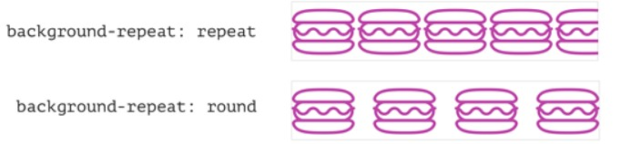

## 1.使用CSS3 transform动画导致页面抖动模糊

**解决方案：**

1. 使用到动画的样式设置如下样式，可解决

   ```css
   -webkit-backface-visibility: hidden;/*（设置进行转换的元素的背面在面对用户时是否可见：隐藏）*/
   /* 如果有3d加上下面句 ，没有可省略*/
   -webkit-transform-style: preserve-3d; /*（设置内嵌的元素在 3D 空间如何呈现：保留 3D ）*/
   ```

2. 在发生transtion的元素上加上 **定位属性** 和**z-index**

**其他方案：**

1. ```css
   -webkit-font-smoothing: subpixel-antialiased;
   -webkit-transform: translateZ(0) scale(1.0, 1.0);
   ```

2. 在transform中加入 **translateZ(0)** 可以去掉抖动，z-index: 1 可以解决字体模糊的问题

3. 把transform值函数(如**translate3d(), scale(), rotate()**等)中的参数设置为**整数**，即尽量把小数的转换成整数;开启gpu渲染,采用perspective: 999px;或者用其他的居中方法，绕过它。

4. ```css
   *, ::after, ::before {
       -webkit-box-sizing: border-box;
       box-sizing: border-box;
   }
   ```

5. 在使用动画属性的元素上（或发生抖动的元素上）添加如下声明：

   ```css
   -webkit-backface-visibility: hidden;
   backface-visibility: hidden;
   ```

   但是有的时候一些完全不相关的元素也跟着抖动闪烁，可以在 body元素 或 抖动的元素上 做如下声明：

   ```css
   body {
   -webkit-transform: translate3d(0, 0, 0) ;
   transform: translate3d(0, 0, 0);
   }
   ```

## 2. 防止背景裁剪

```css
.element {
    background-size: contain;
    background-repeat: round;
}
```

