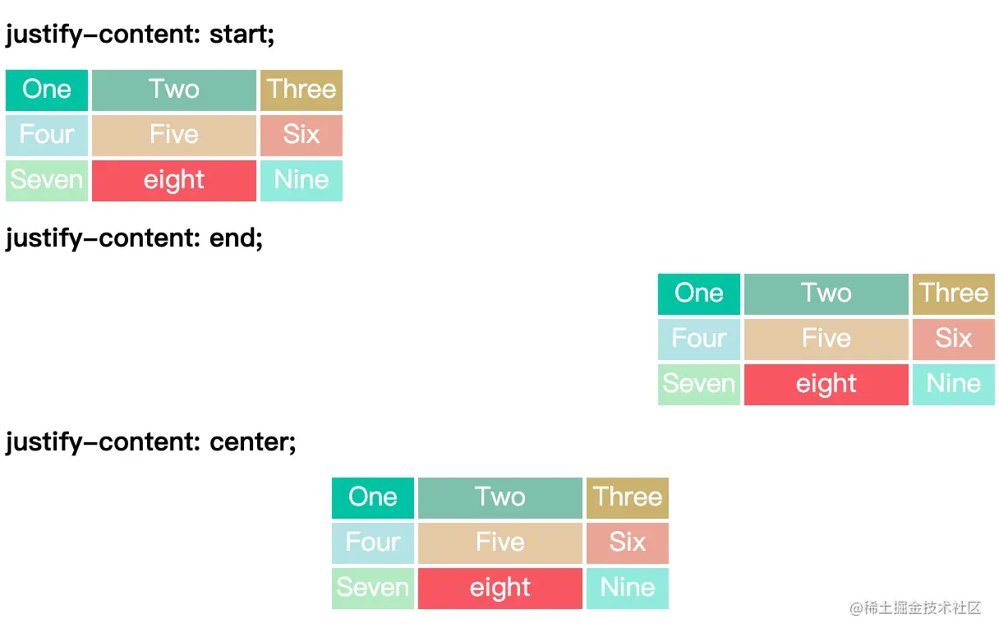
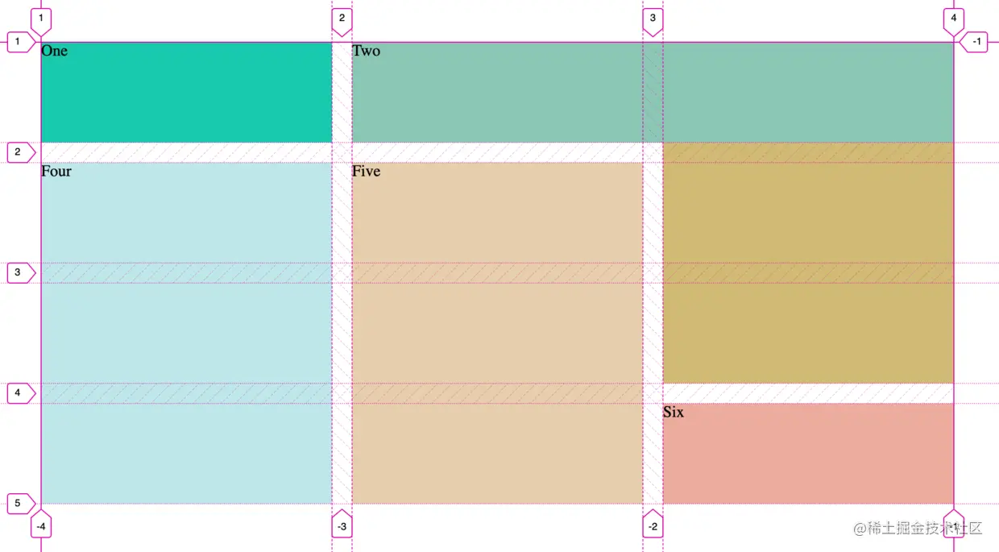

# Grid网格布局

> `flex` 布局和 `Grid` 布局有实质的区别，那就是 **`flex` 布局是一维布局，`Grid` 布局是二维布局**。
>
> `flex` 布局一次只能处理一个维度上的元素布局，一行或者一列。
>
> `Grid` 布局是将容器划分成了“行”和“列”，产生了一个个的网格，我们可以将网格元素放在与这些行和列相关的位置上，从而达到我们布局的目的。

`Grid` 布局属性跟`flex `一样可以分为两大类，一类是**容器属性**，一类是**项目属性**。

```html
<div class="wrapper">
  <div class="one item">One</div>
  <div class="two item">Two</div>
  <div class="three item">Three</div>
  <div class="four item">Four</div>
  <div class="five item">Five</div>
  <div class="six item">Six</div>
</div>
```

## 容器属性

### 1. `display`

> 在元素上声明 `display：grid` 或 `display：inline-grid` 来创建一个网格容器

### 2. `grid-template-columns` 和 `grid-template-rows`

> 这两个属性在 `Grid` 布局中尤为重要，它们的值是有多种多样的，而且它们的设置是比较相似

* `grid-template-columns` 属性设置列宽
* `grid-template-rows` 属性设置行高

```css
.wrapper {
  display: grid;
  grid-gap: 5px;
  /*  声明了三列，宽度分别为 200px 100px 200px */
  grid-template-columns: 200px 100px 200px;
  /*  声明了两行，行高分别为 50px 50px  */
  grid-template-rows: 50px 50px; 
}
```


#### repeat() 函数

> **`repeat() `函数**：可以简化重复的值。该函数接受两个参数，第一个参数是重复的**次数**，第二个参数是所要重复的**值**。

```css
.wrapper {
  display: grid;
  grid-gap: 5px;
  grid-template-columns: 200px 100px 200px;
  /*  声明了两行，行高分别为 50px 50px  */
  grid-template-rows: repeat(2, 50px); 
}
```

#### minmax() 函数

> 给网格元素一个最小和最大的尺寸，`minmax()` 函数产生一个长度范围，表示长度就在这个范围之中都可以应用到网格项目中。

它接受两个参数，分别为最小值和最大值。`grid-template-columns: 1fr 1fr minmax(300px, 2fr)` 的意思是，第三个列宽最少也是要 300px，但是最大不能大于第一第二列宽的两倍。

```css
.wrapper {
  display: grid;
  grid-gap: 5px;
  grid-auto-rows: 50px;
  grid-template-columns: 1fr 1fr minmax(300px, 2fr);
}
```


#### **auto-fill**

> **`auto-fill` 关键字**：表示自动填充，让一行（或者一列）中尽可能的容纳更多的单元格。

`grid-template-columns: repeat(auto-fill, 200px)` 表示列宽是 200 px，但列的数量是不固定的，只要浏览器能够容纳得下，就可以放置元素。


#### `fr`等分

> `Grid` 布局还引入了一个另外的长度单位来帮助我们创建灵活的网格轨道。`fr` 单位代表网格容器中可用空间的一等份。

`grid-template-columns: 200px 1fr 2fr` 表示第一个列宽设置为 200px，后面剩余的宽度分为两部分，宽度分别为剩余宽度的 **1/3** 和 **2/3**。

```css
.wrapper {
  display: grid;
  grid-gap: 5px;
  grid-auto-rows: 50px;
  grid-template-columns: 200px 1fr 2fr;
}
```


#### auto

> 由浏览器决定网格长度。

通过 `auto` 关键字，我们可以轻易实现三列或者两列布局。`grid-template-columns: 100px auto 100px` 表示第一第三列为 100px，中间宽度由浏览器决定。

```css
.wrapper {
  display: grid;
  grid-gap: 5px;
  grid-auto-rows: 50px;
  grid-template-columns: 100px auto 100px;
}
```


### 3. grid-gap 和 grid-row-gap、grid-column-gap

> `grid-row-gap` 属性、`grid-column-gap` 属性分别设置行间距和列间距。
>
> `grid-gap` 属性是两者的简写形式

- `grid-row-gap: 10px` 表示行间距是 10px
- `grid-column-gap: 20px` 表示列间距是 20px
- `grid-gap: 10px 20px` 实现的效果是一样的


### 4. grid-template-areas

> `grid-template-areas` 属性用于定义区域，一个区域由一个或者多个单元格组成

一般这个属性跟网格元素的 `grid-area` 一起使用，我们在这里一起介绍。 `grid-area` 属性指定项目放在哪一个区域

```html
<div class="wrapper">
  <div class="box header">Header</div>
  <div class="box sidebar">Sidebar</div>
  <div class="box content">Content</div>
</div>
```

```css
.sidebar {
  grid-area: sidebar;
}

.content {
  grid-area: content;
}

.header {
  grid-area: header;
}

.wrapper {
  display: grid;
  grid-gap: 10px;
  grid-template-columns: 120px  120px  120px;
  grid-template-areas:
    ". header  header"
    "sidebar content content";
}
```

上面代码表示划分出 6 个单元格，其中值得注意的是 `.` 符号代表空的单元格，也就是没有用到该单元格。类 `.sidebar` `.content` `.header`所在的元素将放在上面 `grid-template-areas` 中定义的 `sidebar` `content` `header` 区域中


### 5. grid-auto-flow

> `grid-auto-flow`  属性控制着自动布局算法怎样运作，精确指定在网格中被自动布局的元素怎样排列。默认的放置顺序是"先行后列"，即先填满第一行，再开始放入第二行，即下图英文数字的顺序 `one`,`two`,`three`...。这个顺序由 `grid-auto-flow` 属性决定，默认值是 `row`。

```html
<div class="wrapper">
  <div class="one item">One</div>
  <div class="two item">Two</div>
  <div class="three item">Three</div>
  <div class="four item">Four</div>
  <div class="five item">Five</div>
  <div class="six item">Six</div>
  <div class="seven item">Seven</div>
  <div class="eight item">eight</div>
  <div class="nine item">Nine</div>
</div>
```

```css
.wrapper {
  display: grid;
  grid-template-columns: 100px 200px 100px;
  grid-auto-flow: row;
  grid-gap: 5px;
  grid-auto-rows: 50px;
}
.six {
  grid-column-start: span 2;
}
```


但这有一个问题，就是第五个项目和第六个项目之间有个空白，这个是由于第六块的长度大于了空白处的长度，被挤到了下一行导致的。在实际应用中，我们可能想让下面长度合适的填满这个空白，这个时候可以设置  `grid-auto-flow: row dense`，表示尽可能填满表格。


可以设置 `grid-auto-flow: column`，表示先列后行

```css
.wrapper {
  display: grid;
  grid-gap: 5px;
	grid-template-rows:  50px 50px;
  grid-auto-columns: 100px;
  grid-auto-flow: column;
}
```


### 6. justify-items 、align-items 和 place-items

* `justify-items` 设置单元格内容的水平位置（左中右）

  值：`start ` | `end` | `center` | `stretch`

* `align-items` 设置单元格的垂直位置（上中下）

  值：`start ` | `end` | `center` | `stretch`

如：`start `对齐单元格的起始边缘


### 7. justify-content 、align-content 和 place-content

- `justify-content` 是整个内容区域在容器里面的水平位置（左中右）

  值：`start` | `end` | `center` | `stretch` | `space-around` | `space-between` | `space-evenly`

- `align-content` 是整个内容区域的垂直位置（上中下）

  值：`start` | `end` | `center` | `stretch` | `space-around` | `space-between` | `space-evenly`

- start - 对齐容器的起始边框
- end - 对齐容器的结束边框
- center - 容器内部居中

- space-around - 每个项目两侧的间隔相等，项目之间的间隔比项目与容器边框的间隔大一倍
- space-between - 项目与项目的间隔相等，项目与容器边框之间没有间隔
- space-evenly - 项目与项目的间隔相等，项目与容器边框之间的间隔也同样相等
- stretch - 项目大小没有指定时，拉伸占据整个网格容器




### 8.grid-auto-columns 、 grid-auto-rows 

**隐式和显式网格**：显式网格包含了你在 `grid-template-columns` 和 `grid-template-rows` 属性中定义的行和列。如果你在网格定义之外又放了一些东西，或者因为内容的数量而需要的更多网格轨道的时候，网格将会在隐式网格中创建行和列

假如有多余的网格（也就是上面提到的隐式网格），那么它的行高和列宽可以根据 `grid-auto-columns` 属性和 `grid-auto-rows` 属性设置。它们的写法和`grid-template-columns` 和 `grid-template-rows` 完全相同。如果不指定这两个属性，浏览器完全根据单元格内容的大小，决定新增网格的列宽和行高

```css
.wrapper {
  display: grid;
  grid-template-columns: 200px 100px;
/*  只设置了两行，但实际的数量会超出两行，超出的行高会以 grid-auto-rows 算 */
  grid-template-rows: 100px 100px;
  grid-gap: 10px 20px;
  grid-auto-rows: 50px;
}
```

`grid-template-columns` 属性和 `grid-template-rows` 属性只是指定了两行两列，但实际有九个元素，就会产生隐式网格。通过 `grid-auto-rows` 可以指定隐式网格的行高为 50px


## 项目属性

### 1. grid-column-start、grid-column-end 和 grid-row-start 、grid-row-end 属性

可以指定网格项目所在的四个边框，分别定位在哪根网格线，从而指定项目的位置

- `grid-column-start` ：**左边框所在的垂直网格线(序号)**
- `grid-column-end` ：**右边框所在的垂直网格线(序号)**
- `grid-row-start` ：**上边框所在的水平网格线(序号)**
- `grid-row-end` ：**下边框所在的水平网格线(序号)**

```html
<div class="wrapper">
  <div class="one item">One</div>
  <div class="two item">Two</div>
  <div class="three item">Three</div>
  <div class="four item">Four</div>
  <div class="five item">Five</div>
  <div class="six item">Six</div>
</div>
```

```css
.wrapper {
  display: grid;
  grid-template-columns: repeat(3, 1fr);
  grid-gap: 20px;
  grid-auto-rows: minmax(100px, auto);
}

.one {
  grid-column-start: 1;
  grid-column-end: 2;
  background: #19CAAD;
}

.two {
  grid-column-start: 2;
  grid-column-end: 4;
  grid-row-start: 1;
  grid-row-end: 2;
  /* 如果有重叠，就使用 z-index */
  z-index: 1;
  background: #8CC7B5;
}

.three {
  grid-column-start: 3;
  grid-column-end: 4;
  grid-row-start: 1;
  grid-row-end: 4;
  background: #D1BA74;
}

.four {
  grid-column-start: 1;
  grid-column-end: 2;
  grid-row-start: 2;
  grid-row-end: 5;
  background: #BEE7E9;
}

.five {
  grid-column-start: 2;
  grid-column-end: 2;
  grid-row-start: 2;
  grid-row-end: 5;
  background: #E6CEAC;
}

.six {
  grid-column: 3;
  grid-row: 4;
  background: #ECAD9E;
}
```

`.two` 所在的网格项目，垂直网格线是从 2 到 4，水平网格线是从 1 到 2。其中它跟 `.three` （垂直网格线是从3 到 4，水平网格线是从 1 到 4） 是有冲突的。可以设置 `z-index` 去决定它们的层级关系



### 2. grid-area

`grid-area` 属性**指定项目放在哪一个区域**，配合容器属性 `grid-template-areas` 使用

### 3.justify-self 、align-self 和 place-self

* `justify-self` 设置单元格内容的水平位置（左中右），跟 `justify-items` 属性的用法完全一致，但只作用于单个项目

  值：`start ` | `end` | `center` | `stretch`

* `align-self` 属性设置单元格内容的垂直位置（上中下），跟`align-items`属性的用法完全一致，但只作用于单个项目

  值：`start ` | `end` | `center` | `stretch`

* `place-self` 是设置 `align-self` 和 `justify-self` 的简写形式

# Grid 实战——实现响应式布局

## fr 实现等分响应式

`fr` 等分单位，可以将容器的可用空间分成想要的多个等分空间。利用这个特性，我们能够轻易实现一个等分响应式。`grid-template-columns: 1fr 1fr 1fr` 表示容器分为三等分

```css
.wrapper {
  margin: 50px;
  display: grid;
  grid-template-columns: 1fr 1fr 1fr;
  grid-gap: 10px 20px;
  grid-auto-rows: 50px;
}
```


## `repeat` +` auto-fit` 固定列宽，改变列数量

固定列宽，并根据容器的宽度来改变列的数量。这个时候，我们可以用到上面提到 `repeat()` 函数以及 `auto-fit` 关键字。`grid-template-columns: repeat(auto-fit, 200px)` 表示固定列宽为 200px，数量是自适应的，只要容纳得下，就会往上排列。

```css
.wrapper {
  margin: 50px;
  display: grid;
  grid-template-columns: repeat(auto-fit, 200px);
  grid-gap: 10px 20px;
  grid-auto-rows: 50px;
}
```


### `repeat`+`auto-fit`+`minmax` 去掉右侧空白

上面看到的效果中，右侧通常会留下空白，这是我们不希望看到的。如果列的宽度也能在某个范围内自适应就好了。`minmax()` 函数就帮助我们做到了这点。将 `grid-template-columns: repeat(auto-fit, 200px)` 改成 `grid-template-columns: repeat(auto-fit, minmax(200px, 1fr))` 表示列宽至少 200px，如果还有空余则一起等分。

```css
.wrapper {
  margin: 50px;
  display: grid;
  grid-template-columns: repeat(auto-fit, minmax(200px, 1fr));
  grid-gap: 10px 20px;
  grid-auto-rows: 50px;
}
```


### `repeat`+`auto-fit`+`minmax`-`span`-`dense` 解决空缺问题

如果要求每个网格元素的长度不相同，则通过 `span` 关键字进行设置网格项目的跨度，`grid-column-start: span 3`，表示这个网格项目跨度为 3。

```html
<div class="wrapper">
  <div class="one item">One</div>
  <div class="two item">Two</div>
  <div class="three item">Three</div>
  <div class="four item item-3">Four</div>
  <div class="five item ">Five</div>
  <div class="six item item-3">Six</div>
  <div class="seven item item">Seven</div>
  <div class="eight item">eight</div>
  <div class="nine item">Nine</div>
</div>
```

```css
.wrapper {
  margin: 50px;
  display: grid;
  grid-template-columns: repeat(auto-fit, minmax(200px, 1fr));
  grid-gap: 10px 20px;
  grid-auto-rows: 50px;
}
.item-3 {
  grid-column-start: span 3;
}
```


不对，怎么右侧又有空白了？原来是有一些长度太长了，放不下，这个时候就到我们的 `dense` 关键字出场了。`grid-auto-flow: row dense` 表示尽可能填充，而不留空白。

```css
.wrapper {
  margin: 50px;
  display: grid;
  grid-template-columns: repeat(auto-fit, minmax(200px, 1fr));
  grid-gap: 10px 20px;
  grid-auto-rows: 50px;
  
  grid-auto-flow: row dense;
}
.item-3 {
  grid-column-start: span 3;
}
```


