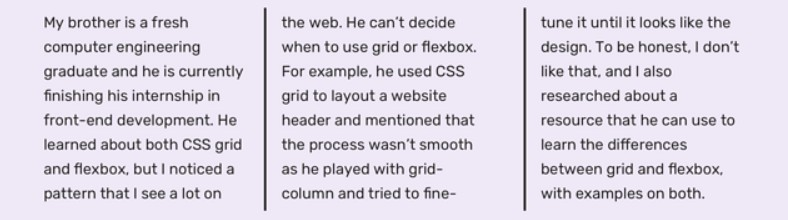

# css常用样式集

## 1.滚动条修改

```css
/*滚动条宽 长,滚动条整体部分，其中的属性有width,height,background,border等。*/
需滚动的元素::-webkit-scrollbar{
    width:0; /* 0为隐藏，有宽度后可设置以下属性*/
}
/*滚动条的滑轨背景颜色,可以用display:none让其不显示，也可以添加背景图片，颜色改变显示效果。*/
需滚动的元素::-webkit-scrollbar-track{
    background-color: #f5f5f5;
    -webkit-box-shadow:inset 0 0 3px rgba(0,0,0,0.1);
    border-radius:5px;
}
/* 滑块颜色 */
需滚动的元素::-webkit-scrollbar-thumb{
    background-color: rgba(0, 0, 0, 0.2);
    border-radius: 5px;
}
/*滚动条两端的按钮。可以用display:none让其不显示，也可以添加背景图片，颜色改变显示效果。*/
需滚动的元素::-webkit-scrollbar-button{
    background-color: #eee;
    display: none;
}
/* 横向滚动条和纵向滚动条相交处尖角的颜色 */
需滚动的元素::-webkit-scrollbar-corner{
    background-color: black;
}
```

## 2.修改input的placeholder

```css
::-webkit-input-placeholder { /* WebKit, Blink, Edge */
    color:    #909;
}
:-moz-placeholder { /* Mozilla Firefox 4 to 18 */
   color:    #909;
   opacity:  1;
}
:-moz-placeholder { /* Mozilla Firefox 19+ */
   color:    #909;
   opacity:  1;
}
:-ms-input-placeholder { /* Internet Explorer 10-11 */
   color:    #909;
}
::-ms-input-placeholder { /* Microsoft Edge */
   color:    #909;
}
```

## 3.去掉*input[type="number"]*的默认样式

```css
// &::-webkit-outer-spin-button,
// &::-webkit-inner-spin-button {
    //   -webkit-appearance: none !important;
    // }

// input[type="number"] {
    //   -moz-appearance: textfield;
    // }
```

## 4.修改checkbox默认样式

```html
<input type="checkbox" id="checkbox_sel" class="selectBetting" />
<label for="checkbox_sel" class=""></label>
```

```css
.selectBetting{ 
  display: none; 
} 
.selectBetting + label { 
  background: url(../images/checkbox.png) no-repeat;
  width: 64px;
  height: 64px;
  display: inline-block; 
  float: left;
  cursor: pointer;
}  
.selectBetting:checked + label { 
  background: url(../images/checkbox.png) no-repeat;
} 
.selectBetting:checked + label::after { 
  content: '√';  
  float: left;
  font-family: "customfont";
  color: #6be9ff; 
  width: 100%; 
  text-align: center; 
  font-size: 32px;
  padding: 10px 0 0 0px;
  vertical-align: text-top; 
}
```

## 5.文本超长

### 单行文本 使用单行省略

```css
width: 200px;
white-space: nowrap;
overflow: hidden;
text-overflow: ellipsis;
```

### 多行文本的超长省略

```css
width: 200px;
overflow : hidden;
text-overflow: ellipsis;
display: -webkit-box;
-webkit-line-clamp: 2; /*两行*/
-webkit-box-orient: vertical;
```

## 6. 将文本内容分为多列并添加边框

```css
p {
    columns: 3;
    column-rule: solid 2px #222; /*类似border-right作用*/
}
```



## 7. `li`项旁边的默认小圆圈称为**marker**

```css
li::marker {
    color: #ccc;
}
```

## 8.input输入框聚焦时，输入框占位符内容以动画形式移动到左上角作为标题

```html
<div class="input-box"> 
    <input class="input-control input-outline" placeholder="账号">
    <label class="input-label">账号</label>
</div>
```

1. 首先让浏览器默认的`placeholder`效果不可见 

   ```css
   .input-control:placeholder-shown::placeholder { 
       color: transparent; 
   }
   ```

2. 使用`.input-label`元素代替input 的占位符

   ```css
   .input-box{
     position: relative;
   }
   .input-label {
     position: absolute;
     left: 16px; top: 14px;
     pointer-events: none;
   }
   ```

3. 最后在输入框聚焦以及占位符不显示的时候对`<label>`元素进行重定位，效果是缩小并移动到上方

   ```css
   .input-control:not(:placeholder-shown) ~ .input-label,
   .input-control:focus ~ .input-label {
     color: #2486ff;
     transform: scale(0.75) translate(-2px, -32px);
   }
   ```

## 9. 彩色粉笔字

```html
<head>
    <link href="https://fonts.googleapis.com/css?family=Cabin+Sketch:700&display=swap" rel="stylesheet">
</head>
<body>
    <div class="text-effect">
        <span>B</span><span>e</span><span>s</span><span>t</span>
        <span>J</span><span>Q</span><span>u</span><span>e</span>		<span>r</span><span>y</span>
    </div>
</body>
```

```css
.text-effect{
	color: #ffff00;
	font-family: 'Cabin Sketch', cursive;
	font-size: 100px;
	text-align: center;
	text-transform: uppercase;
	margin: 0 auto;
	position: relative;
}
.text-effect span{
	display: inline-block;
	animation: animate 0.5s linear infinite both;
}
.text-effect span:nth-child(1),
.text-effect span:nth-child(4),
.text-effect span:nth-child(7),
.text-effect span:nth-child(10){
   color: #4cd137;
}
.text-effect span:nth-child(2),
.text-effect span:nth-child(5),
.text-effect span:nth-child(8){
   color: #ff0000;
}
@keyframes animate{
	0%, 50%, 100%{ transform: rotate(0deg) scale(1); }
	25%{ transform: rotate(4deg) scale(0.98); }
	75%{ transform: rotate(-4deg) scale(1.02); }
}
```

## 10. Affix固钉 sticky position

```html
<div class="static">Static</div>
<div class="sticky">Sticky</div>
```

```css
.sticky {
  position: sticky;
  top: 0;
  width: 100%;
  
  padding: 1em 0;
  background-color: #149bdf;
  background-image: linear-gradient(-45deg, rgba(255, 255, 255, 0.15) 25%, transparent 25%, transparent 50%, rgba(255, 255, 255, 0.15) 50%, rgba(255, 255, 255, 0.15) 75%, transparent 75%, transparent);
  background-size: 100px 100px;
  color: white;
  text-align: center;
}

.fixed {
  position: fixed;
}

.static {
  padding: 5em 0;
  background: #1085bc;
  color: white;
  text-align: center;
}

:root {
  height: 1000%;
  font-family: sans-serif;
}
```

```js
var sticky = document.querySelector('.sticky');

if (sticky.style.position !== 'sticky') {
  var stickyTop = sticky.offsetTop;

  document.addEventListener('scroll', function () {
    window.scrollY >= stickyTop ?
      sticky.classList.add('fixed') :
      sticky.classList.remove('fixed');
  });
}
```

## 11. Clip-path 属性添加shadow

```html
<!DOCTYPE html>
<html>
  <body>
    <div class="container">
      <div class="shape"></div>
    </div>
  </body>
  <style>
    
    .container{
      filter: drop-shadow(0px 10px 5px rgba(0,0,0,0.5));
    }
    .shape{
      -webkit-clip-path: polygon(50% 0%, 0% 100%, 100% 100%);
      clip-path: polygon(50% 0%, 0% 100%, 100% 100%);
      background:red;
      width:100px;
      height:100px;     
    }
  </style>
</html>
```


