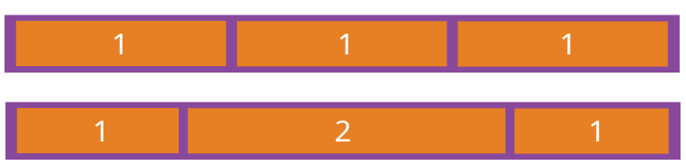

## flex布局

> flex 的核心的概念就是 **容器** 和 **轴**。

### 父容器

以下6个属性设置在容器上

1. **`flex-direction`**： row | row-reverse | column | column-reverse;

   > 决定主轴的方向（即项目的排列方向）

2. **`flex-wrap`：** nowrap | wrap | wrap-reverse;

   > 默认情况下，项目都排在一条线（又称"轴线"）上。`flex-wrap`属性定义，如果**一条轴线排不下，如何换行**

   * `wrap`：换行，第一行在上方。

   * `wrap-reverse`：换行，第一行在下方。

3. **`flex-flow`**：flex-direction | flex-wrap;

   > **是`flex-direction`属性和`flex-wrap`属性的简写形式，默认值为`row nowrap`**

4. **`justify-content`：**flex-start | flex-end | center | space-between | space-around;

   > **定义了项目在主轴上的对齐方式**

   - space-between 子容器沿主轴均匀分布，位于首尾两端的子容器与父容器相切。
   - space-around  子容器沿主轴均匀分布，位于首尾两端的子容器到父容器的距离是子容器间距的一半。

5. **`align-items`**：flex-start | flex-end | center | baseline | stretch;

   > **定义项目在交叉轴上如何对齐**

   - `flex-start`：交叉轴的起点对齐。
   - `flex-end`：交叉轴的终点对齐。
   - `center`：交叉轴的中点对齐。
   - `baseline`: 项目的第一行文字的基线对齐。
   - `stretch`（默认值）：如果项目未设置高度或设为auto，将占满整个容器的高度。

6. **`align-content`：**flex-start | flex-end | center | space-between | space-around | stretch;

   > **定义了多根轴线的对齐方式。如果项目只有一根轴线，该属性不起作用。**

   - `flex-start`：与交叉轴的起点对齐。
   - `flex-end`：与交叉轴的终点对齐。
   - `center`：与交叉轴的中点对齐。
   - `space-between`：与交叉轴两端对齐，轴线之间的间隔平均分布。
   - `space-around`：每根轴线两侧的间隔都相等。所以，轴线之间的间隔比轴线与边框的间隔大一倍。
   - `stretch`（默认值）：轴线占满整个交叉轴

   

### 子容器

以下6个属性设置在项目上。

1. **`order`：** number

   > **定义项目的排列顺序。数值越小，排列越靠前，默认为0**

2. **`flex-grow`：** number  

   > **定义项目的放大比例，默认为`0`，即如果存在剩余空间，也不放大**

   如果所有项目的`flex-grow`属性都为1，则它们将等分剩余空间（如果有的话）。如果一个项目的`flex-grow`属性为2，其他项目都为1，则前者占据的剩余空间将比其他项多一倍。

   

3. **`flex-shrink`：** number

   > **定义了项目的缩小比例，默认为1，即如果空间不足，该项目将缩小。**

   如果所有项目的`flex-shrink`属性都为1，当空间不足时，都将等比例缩小。如果一个项目的`flex-shrink`属性为0，其他项目都为1，则空间不足时，前者不缩小。

   负值对该属性无效。

   

   

4. **`flex-basis`：** length | auto

   > **定义了在分配多余空间之前，项目占据的主轴空间（main size）。浏览器根据这个属性，计算主轴是否有多余空间。默认值为`auto`，即项目的本来大小。**

   它可以设为跟`width`或`height`属性一样的值（比如350px），则项目将占据固定空间。

5. **`flex`：** none | [ flex-grow flex-shrink || flex-basis ]

   > **是`flex-grow`, `flex-shrink` 和 `flex-basis`的简写，默认值为`0 1 auto`。后两个属性可选**

   该属性有两个快捷值：`auto` (`1 1 auto`) 、 none (`0 0 auto`)。建议优先使用这个属性，而不是单独写三个分离的属性，因为浏览器会推算相关值。

   - `flex-grow`： 放大比例 根据所设置的比例分配盒子所剩余的空间

   - `flex-shrink`： 缩小比例 设置元素的收缩比例   多出盒子的部分，按照比例的大小砍掉相应的大小，即比例越大，被砍的越大，默认值是1

   - `flex-basis`：  伸缩基准值 项目占据主轴的空间。 **该属性设置元素的宽度或高度**，当然width也可以用来设置元素宽度，如果元素上同时出现了width 和flex-basis那么flex-basis会覆盖width的值

6. **`align-self`：**auto | flex-start | flex-end | center | baseline | stretch;

   > **`align-self` 单个项目对齐方式**，**`align-self`属性允许单个项目有与其他项目不一样的对齐方式，可覆盖`align-items`属性。**
   >
   > **默认值为`auto`，表示继承父元素的`align-items`属性，如果没有父元素，则等同于`stretch`。**

   

   

   

## **现代布局场景**


### 1. 左右两栏，左侧定宽，右侧自适应剩余宽度，并加一个最小的宽度

```html
<div class="g-app-wrapper">
    <div class="g-sidebar"></div>
    <div class="g-main"></div>
</div>
```

```css
.g-app-wrapper {
    display: flex;
    min-width: 1200px; /*利用 min-width 保证了整个容器的最小宽度*/
}
.g-sidebar {
    flex-basis: 250px;
    margin-right: 10px;
}
.g-main {
    flex-grow: 1; /*利用了 flex 布局下的 flex-grow: 1，让 .main 进行伸缩，占满剩余空间*/
}
```

