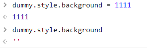

## CSS特性检测

> 有时候你想尝试的某个CSS特性非常新，但不知道当前浏览器是否支持，这时我们就可以写一段JavaScript代码来做特性检测，检测某个CSS样式属性是否被支持。

有两种方式，一种是检测**属性**是否存在，一种是检测某个具体的**属性值**是否支持

### 一、我要尝试的CSS属性能否被浏览器解析？

```js
function testProperty(property) {
    const rootEl = document.documentElement;
    if (property in rootEl.style) { // 样式表上存在所有既定的CSS属性
        rootEl.classList.add(property.toLowerCase())
        return true;
    }
    rootEl.classList.add('no-' + property.toLowerCase())
    return false;
}
```

### 二、检测具体的属性值能否被支持？

如果我们想要检测某个具体的属性值是否被支持，那就需要把它赋给对应的属性，然后再检查浏览器是不是还保存着这个值,如下图



```js
function testValue(id, value, property) {
    const rootEl = document.documentElement;
    const dummy = document.createElement('p'); // 标签元素根据情况自选
    dummy.style[property] = value;
    if (dummy.style[property]) {
        rootEl.classList.add(id);
        return true;
    }
    rootEl.classList.add('no-' + id);
    return false;
}
testValue('lineargradients', 'linear-gradient(0deg, black, transparent)', 'backgroundImage');
```