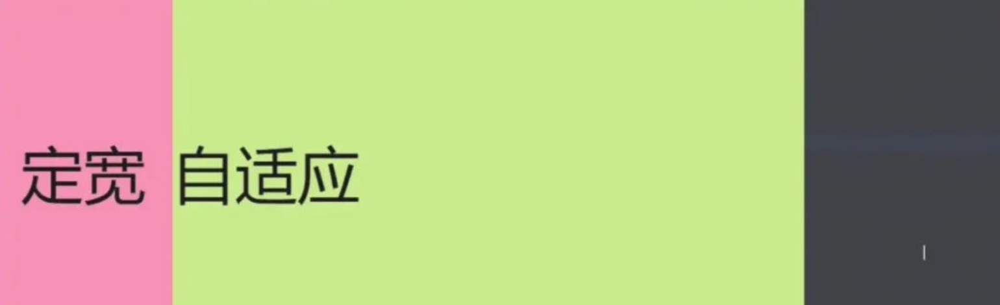
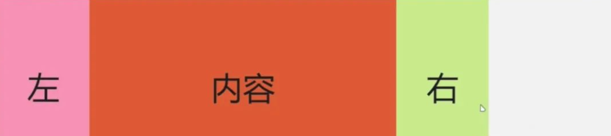
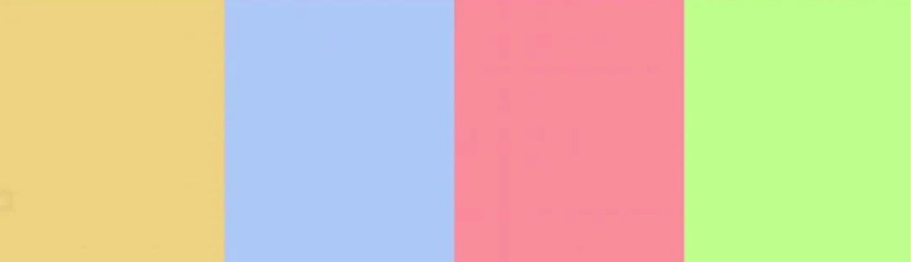
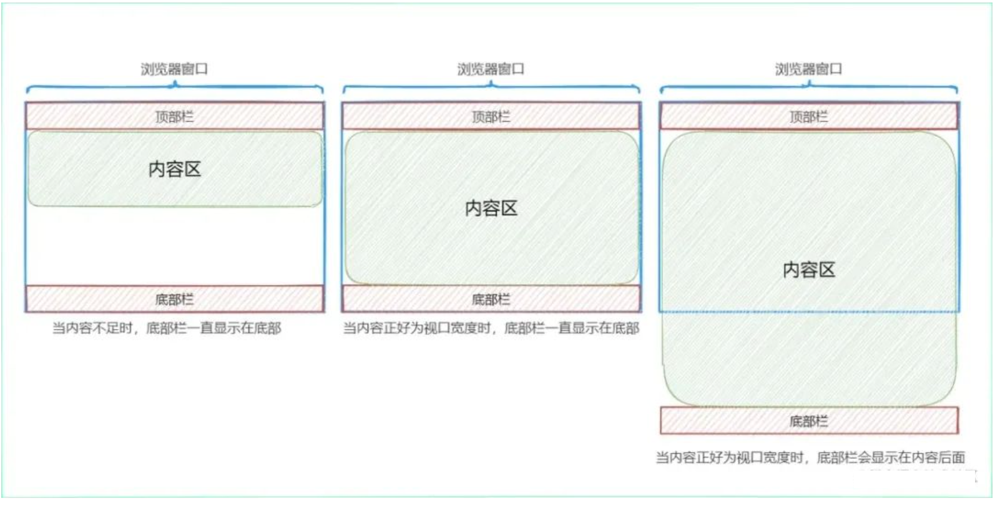
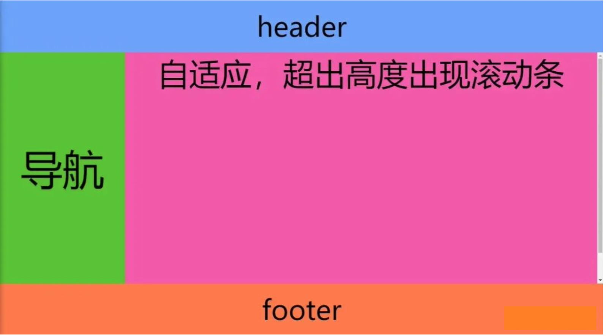

- 两列布局
- 三列布局
- 等分布局
- Sticky Footer布局
- 全屏布局

## 两列布局

所谓的两列布局就是一列定宽(也有可能由子元素决定宽度)，一列自适应的布局。最终效果如下所示：



这里用到的 `HTML` 结构如下：

```html
<!-- 解决高度塌陷 -->
<div class="container clearfix">
  <div class="left">定宽</div>
  <div class="right">自适应</div>
</div>
```

公共的 `CSS` 代码如下:

```css
.container {
  height: 400px;
  background-color: #eebefa;
}
.left {
  width: 200px;
  height: 400px;
  line-height: 400px;
  background-color: #f783ac;
}
.right {
  height: 400px;
  line-height: 400px;
  background-color: #c0eb75;
}
/* 清除浮动 */
.clearfix:after {
  content: '';
  display: block;
  height: 0;
  clear: both;
  visibility: hidden;
}
```

### 1. float+calc()函数完成左列定宽右列自适应

步骤如下：

- 左边列开启浮动
- 右边列开启浮动
- 右边列宽度为父级 100%减去左列的宽度

实现CSS代码如下：

```css
.left {
  /* 左边列开启浮动 */
  float: left;
}
.right {
  /* 右边列开启浮动 */
  float: left;
  /* 宽度减去左列的宽度 */
  width: calc(100% - 200px);
}
```

### 2. float+margin-left完成左列定宽右列自适应

步骤如下：

- 左边列开启浮动
- 通过外边距的方式使该容器的左边有左边列容器的宽度的外边距

实现CSS代码如下：

```css
.left {
  /* 左边列开启浮动 */
  float: left;
}
.right {
  /* 通过外边距的方式使该容器的左边有200px */
  margin-left: 200px;
}
```

### 3. absolute+margin-left完成左列定宽右列自适应

步骤如下：

- 开启定位脱离文档流
- 通过外边距的方式使该容器的左边有左边列容器的宽度的外边距

实现CSS代码如下：

```css
.left {
  /* 开启定位脱离文档流 */
  position: absolute;
}
.right {
  /* 通过外边距的方式使该容器的左边有200px */
  margin-left: 200px;
}
```

> 值得注意的是 以上几种方案左边列必须定宽，才可以实现，下面这几种方案左边列可以由子级撑起。

### 4. float+overflow完成左列定宽右列自适应

步骤如下：

- 左侧元素开始浮动
- 右侧自适应元素设置overflow会创建一个BFC完成自适应

实现CSS代码如下：

```css
.left {
  /* 1. 左侧元素开始浮动 */
  float: left;
}
.right {
  /* 2. 右侧自适应元素设置 overflow 会创建一个BFC 完成自适应 */
  overflow: hidden;
}
```

### 5. Flex方案

通过Flex布局实现该功能主要是通过 flex 属性来实现示例代码如下：

```css
.container {
  display: flex;
}
.right {
  flex: 1;
  /* flex: 1; 表示 flex-grow: 1; 即该项占所有剩余空间 */
}
```

### 6. Grid方案

通过 Grid 布局实现该功能主要是通过template属性实现，具体代码如下所示：

```css
.container {
  display: grid;
  /* 将其划分为两行，其中一列有本身宽度决定， 一列占剩余宽度*/
  grid-template-columns: auto 1fr;
}
```

## 三列布局

三列布局主要分为两种：

- 第一种是前两列定宽，最后一列自适应，这一种本质上与两列布局没有什么区别，可以参照两列布局实现。
- 第二种是前后两列定宽，中间自适应，最终效果图如下



公共 CSS 如下：

```css
.container {
  height: 400px;
  background-color: #eebefa;
}
.left {
  height: 400px;
  width: 200px;
  background-color: #f783ac;
}
.content {
  height: 400px;
  background-color: #d9480f;
}
.right {
  height: 400px;
  width: 200px;
  background-color: #c0eb75;
}
.left,
.content,
.right {
  font-size: 70px;
  line-height: 400px;
  text-align: center;
}
/* 清除浮动 */
.clearfix:after {
  content: '';
  display: block;
  height: 0;
  clear: both;
  visibility: hidden;
}
```

HTML 结构如下：

```html
<!-- 解决高度塌陷 -->
<div class="container clearfix">
  <div class="left">左</div>
  <div class="content">内容</div>
  <div class="right">右</div>
</div>
```

### 1. 通过float实现(一)

实现步骤：

- 为了完成效果需要调整HTML结构，调整后如下：

```html
<!-- 解决高度塌陷 -->
<div class="container clearfix">
  <div class="left">左</div>
  <div class="right">右</div>
  <div class="content">内容</div>
</div>
```

- 左列容器开启左浮动
- 右列容器开启右浮动
- 自适应元素设置overflow会创建一个BFC完成自适应

实现CSS代码如下

```css
.left {
  /* 1. 左列容器开启左浮动 */
  float: left;
}
.content {
  /* 自适应元素设置 overflow 会创建一个BFC 完成自适应 */
  overflow: hidden;
}
.right {
  /* 2. 右列容器开启右浮动 */
  float: right;
}
```

### 2. 通过float实现(二)

实现步骤：

- 为了完成效果需要调整 HTML 结构，调整后如下：

```css
<!-- 解决高度塌陷 -->
<div class="container clearfix">
  <div class="left">左</div>
  <div class="right">右</div>
  <div class="content">内容</div>
</div>
```

- 左列容器开启左浮动
- 右列容器开启右浮动
- 使中间自适应的宽度为父级容器减去两个定宽的列

实现CSS代码如下：

```css
.left {
  /* 1. 左列容器开启左浮动 */
  float: left;
}
.content {
  /* 3. 使中间自适应的宽度为父级容器减去两个定宽的列 */
  width: calc(100%-400px);
}
.right {
  /* 2. 右列容器开启右浮动 */
  float: right;
}
```

### 3. 通过position实现

实现步骤

- 左右两列脱离文档流，并通过偏移的方式到达自己的区域
- 使中间自适应的宽度为父级容器减去两个定宽的列
- 通过外边距将容器往内缩小

实现CSS代码如下：

```css
.left {
  /* 1. 左右两列脱离文档流，并通过偏移的方式到达自己的区域 */
  position: absolute;
  left: 0;
  top: 0;
}
.content {
  /* 2. 使中间自适应的宽度为父级容器减去两个定宽的列 */
  width: calc(100%-400px);
  /* 3. 通过外边距将容器往内缩小 */
  margin-right: 200px;
  margin-left: 200px;
}
.right {
  position: absolute;
  right: 0;
  top: 0;
}
```

### 4. Flex方案

通过 `Flex` 布局实现该功能主要是通过 `flex` 属性来实现。

实现CSS代码如下：


### 5. Grid方案

通过 `Grid` 布局实现该功能主要是通过 `template` 属性实现。

实现CSS代码如下：

```css
.container {
  display: grid;
  /* 将其划分为两行，其中一列有本身宽度决定， 一列占剩余宽度*/
  grid-template-columns: auto 1fr auto;
}
```

## 等分布局

等分布局就是将一个容器平均分成几等份，这里以 4 等分为例，主要介绍4种方法。

公共CSS部分如下：

```css
body {
  margin: 0;
}
.container {
  height: 400px;
  background-color: #eebefa;
}
.item {
  height: 100%;
}
.item1 {
  background-color: #eccc68;
}
.item2 {
  background-color: #a6c1fa;
}
.item3 {
  background-color: #fa7d90;
}
.item4 {
  background-color: #b0ff70;
}
/* 清除浮动 */
.clearfix:after {
  content: '';
  display: block;
  height: 0;
  clear: both;
  visibility: hidden;
}
```

公共HTML代码如下：

```html
<!-- 父元素清除浮动 -->
<div class="container clearfix">
  <div class="item item1"></div>
  <div class="item item2"></div>
  <div class="item item3"></div>
  <div class="item item4"></div>
</div>
```

最终的效果如下图所示：



### 1. 浮动+百分比方式

这种方式比较简单，开启浮动，使每个元素占25%的宽度。

实现CSS代码如下：

```css
.item {
  /* 开启浮动，每个元素占 25% 的宽度 */
  width: 25%;
  float: left;
}
```

### 2. 行内块级+百分比方式

这种方式与上面那种方式类似，不过需要注意的是行内块级元素有一些类似于边距的几个像素，导致各25%会超出容器。

实现CSS代码如下：

```css
.item {
  /* 设置每个元素为行内块级元素，每个元素占 24.5% 的宽度 */
  width: 24.5%;
  /* 因为行内块级元素有一些类似于边距的几个像素，导致各占25会超出容器 */
  display: inline-block;
}
```

### 3. Flex方案

通过 Flex 布局实现该功能主要是通过 `flex` 属性来实现。

实现CSS代码如下：

```css
.container {
  /* 开启 flex 布局 */
  display: flex;
}
.item {
  /* 每个元素占相同的宽度 */
  flex: 1;
}
```

### 4. Grid方案

通过 Grid 布局实现该功能主要是通过 template 属性实现。

实现CSS代码如下

```css
.container {
  /* 开启 grid 布局 */
  display: grid;
  grid-template-columns: repeat(4, 1fr);
  /* 使用 repeat 函数生成如下代码 */
  /* grid-template-columns: 1fr 1fr 1fr 1fr; */
}
```

## Sticky Footer布局

所谓的 `Sticky Footer` 布局并不是一种新的前端技术和概念，它就是一种网页布局。如果页面内容不够长时，底部栏就会固定到浏览器的底部；如果足够长时，底部栏就后跟随在内容的后面。如下图所示：



这里来介绍实现该布局的4种方式

公共的CSS代码如下：

```css
.container {
    height: 400px;
    display: flex;
}
.left {
    height: 400px;
    width: 200px;
    background-color: #f759ab;
}
.content {
    height: 400px;
    background-color: #52c41a;
    flex: 1;
}
.right {
    height: 400px;
    width: 200px;
    background-color: #f759ab;
}
.left,
.content,
.right {
    font-size: 70px;
    line-height: 400px;
    text-align: center;
}
.header {
    height: 100px;
    background-color: #70a1ff;
}
.footer {
    height: 100px;
    background-color: #ff7a45;
}
.header,
.footer {
    line-height: 100px;
    font-size: 52px;
    text-align: center;
}
```

公共的HTML如下：

```html
<div class="main">
    <div class="header">header</div>
    <div class="container">
        <div class="left">left</div>
        <div class="content">content</div>
        <div class="right">right</div>
    </div>
    <div class="footer">footer</div>
</div>
```

### 1. 绝对定位的方式

通过绝对定位的方式实现Sticky Footer布局的步骤如下：

- 设置最外层容器高度为100%；
- 让子元素相对于容器元素进行定位，并设置容器元素最小高度为100%；
- 在中间区域设置padding-bottom为footer的高度 ；
- 底部栏绝对定位，并一直吸附在底部即可实现。

实现CSS代码如下：

```css
/* 1. 设置最外层容器为100% */
html,
body {
    height: 100%;
}
/* 2. 让子元素相对于容器元素进行定位，并设置容器元素最小高度为100% */
.main {
    position: relative;
    min-height: 100%;
}
/* 3. 在中间区域设置 padding-bottom 为footer 的高度 */
.container {
    padding-bottom: 100px;
}
/* 由于开启了绝对定位，宽度成了自适应，设置为100% bottom:0 始终保持底部 */
.footer {
    position: absolute;
    width: 100%;
    bottom: 0;
}
```

### 2. 使用calc函数实现

使用 `calc` 函数实现的方式会比较简单，中间的容器最少高度为视口宽度的100% - 头部和底部两部分的高度即可完成该功能。

实现CSS代码如下：

```css
.container {
    /* 这里的 中间 部分的容器最少为视口宽度的 100% - 头部和底部两部分的高度即可完成该功能 */
    min-height: calc(100vh - 200px);
}
```

### 3. Flex方案

实现步骤如下

- 开启 `flex` 布局
- 将子元素布局方向修改为垂直排列
- 设置最小高度为当前视口，使不管中间部分有多高，始终都可以保持在底部
- 设置中间部分容器高度为自适应

实现CSS代码如下：

```css
.main {
    /* 开启flex布局 */
    display: flex;
    /* 将子元素布局方向修改为垂直排列 */
    flex-flow: column;
    /* 设置最小高度为当前视口，使不管中间部分有多高，始终都可以保持在底部 */
    min-height: 100vh;
}
.container {
    /* 设置 中间 部分自适应 */
    flex: 1;
}
```

### 4. Grid方案

实现步骤如下

- 开启 `grid` 布局
- 置最小高度为当前视口，使不管中间部分有多高，始终都可以保持在底部

实现CSS代码如下：

```css
.main {
    /* 开启grid布局 */
    display: grid;
    grid-template-rows: auto 1fr auto;
    /* 设置最小高度为当前视口，使不管中间部分有多高，始终都可以保持在底部 */
    min-height: 100vh;
}
```

## 全屏布局

全部布局主要应用在后台，主要效果如下所示：



这里介绍三种全屏布局的实现方法。

公共的CSS代码如下：

```css
body {
  margin: 0;
}
body,
html,
.container {
  height: 100vh;
  box-sizing: border-box;
  text-align: center;
  overflow: hidden;
}
.content {
  background-color: #52c41a;
  /* * 中间部门的布局可以参考 两列 三列 布局 */
  display: grid;
  grid-template-columns: auto 1fr;
}
.left {
  width: 240px;
  background-color: #52c41a;
  font-size: 80px;
  line-height: calc(100vh - 200px);
}
.right {
  background-color: #f759ab;
  font-size: 60px;
}
.header {
  height: 100px;
  background-color: #70a1ff;
}
.footer {
  height: 100px;
  background-color: #ff7a45;
}
.header,
.footer {
  line-height: 100px;
  font-size: 52px;
}
```

HTML结构如下：

```html
<div class="container">
    <div class="header">header</div>
    <div class="content">
        <div class="left">导航</div>
        <div class="right">
            <div class="right-in">自适应，超出高度出现滚动条</div>
        </div>
    </div>
    <div class="footer">footer</div>
</div>
```

### 1. 使用calc函数实现

实现步骤如下：

- 通过 `calc` 函数计算出中间容器的高度。
- 中间出现滚动条的容器设置overflow: auto即出现滚动条的时候出现滚动条。

实现CSS代码如下：

```css
.content {
    overflow: hidden;
    /* 通过 calc 计算容器的高度 */
    height: calc(100vh - 200px);
}
.left {
    height: 100%;
}
.right {
    /* 如果超出出现滚动条 */
    overflow: auto;
    height: 100%;
}
.right-in {
    /* 假设容器内有500px的元素 */
    height: 500px;
}
```

### 2. Flex 方案

使用 `Flex` 方式实现该布局比较简单。

实现CSS代码如下

```css
.container {
    /* 开启flex布局 */
    display: flex;
    /* 将子元素布局方向修改为垂直排列 */
    flex-flow: column;
}
.content {
    /* 如果超出出现滚动条 */
    overflow: auto;
    /* 设置 中间 部分自适应 */
    flex: 1;
}
.right-in {
    /* 假设容器内有500px的元素 */
    height: 500px;
}
```

### 3. Grid 方案

grid布局对于这种布局来说，实现起来是非常得心应手的，通过template属性即可实现。

实现CSS代码如下

```css
.container {
    /* 开启grid布局 */
    display: grid;
    grid-template-rows: auto 1fr auto;
}
.content {
    /* 如果超出出现滚动条 */
    overflow: auto;
}
.right-in {
    /* 假设容器内有500px的元素 */
    height: 500px;
}
```