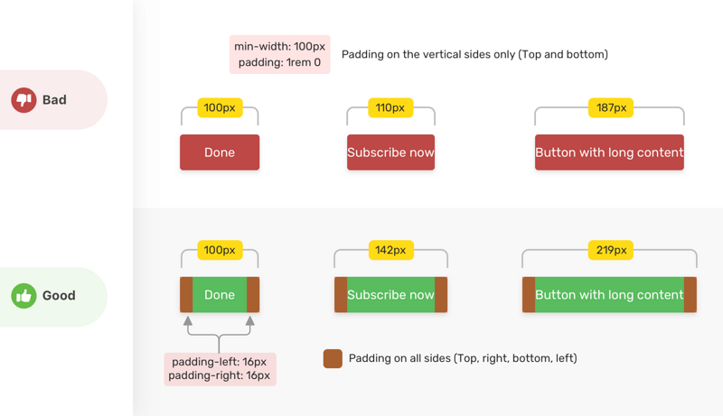

## 1. 0内容展示

对于 0 结果页面，分清楚：

- **数据为空**：其中又可能包括了用户无权限、搜索无结果、筛选无结果、页面无数据
- **异常状态**：其中又可能包括了网络异常、服务器异常、加载失败等待

不同的情况可能对应不同的 0 结果页面，附带不同的操作引导。


## 2.处理动态内容 - 保护边界 使用 `min/max-width` 或 `min/max-height` 对容器的高宽限度进行合理的控制

```css
.btn {
    min-width: 88px;
    padding: 0 16px; /*使用padding保护边界*/
}
```



## 3. 图片相关

### 给图片同时设置高宽

> 给 `` 标签同时写上高宽，可以在图片未加载之前提前占住位置，避免图片从未加载状态到渲染完成状态高宽变化引起的重排问题 以及 避免因为图片尺寸错误带来的布局问题

```css
img {
    width: 150px;
    height: 100px;
}
```

**借助 `object-fit`**解决限制高宽出现的问题(如图片拉伸)：

* `object-fit: cover`使图片内容在保持其宽高比的同时填充元素的整个内容框

* `object-position`控制图片在其内容框中的位置，类似于 `background-position`。默认是 `object-position: 50% 50%`居中显示

  可以将以上内容包装在@supports中，以避免在不支持对象适配的浏览器中拉伸徽标图像。

  ```css
  @supports (object-fit: contain) {
    img {
      object-fit: contain;
      height: 75px;
    }
  }
  ```

### 考虑屏幕 `dpr `-- 响应式图片

> 不同的屏幕有不同的`dpr`，这种时候需要考虑利用多倍图去适配不同 `dpr` 的屏幕。

**使用 标签提供的属性 `srcset `让进行该骚操作,可以给不同 `dpr` 的屏幕，提供最适合的图片：**

* **旧写法**

  ```html
  
  ```

* **新写法**

   使用 w  宽度描述符并配合 `sizes` 一起使用

  ```html
  
  ```

### 图片丢失

**处理的方式:**

1. 利用图片加载失败，触发 `` 元素的 `onerror` 事件，给加载失败的 `` 元素新增一个样式类

2. 利用新增的样式类，配合 `` 元素的伪元素，展示默认兜底图的同时，还能一起展示 `` 元素的 `alt` 信息

   ```html
   
   ```

   ```css
   img.error {
       position: relative;
       display: inline-block;
   }
   
   img.error::before { /*伪元素 before ，加载默认错误兜底图*/
       content: "";
       /** 定位代码 **/
       background: url(error-default.png);
   }
   
   img.error::after { /*利用伪元素 after，展示图片的 alt 信息*/
       content: attr(alt);
       /** 定位代码 **/
   }
   ```

   

## 4. 页面渲染优化 属性 will-change

> `will-change`的功能是：提前通知浏览器元素将要做什么动画，让浏览器提前准备合适的优化设置

### 语法

```css
will-change: auto
will-change: scroll-position
will-change: contents
will-change: transform        // Example of <custom-ident> 
will-change: opacity          // Example of <custom-ident>
will-change: left, top        // Example of two <animateable-feature>

will-change: unset
will-change: initial
will-change: inherit
```

- `auto`

  表示没有特别指定哪些属性会变化，需要浏览器自己去猜，然后使用浏览器经常使用的一些常规方法进行优化。

- `scroll-position`

  表示开发者希望在不久后改变滚动条的位置或者使之产生动画

- `contents`

  表示开发者希望在不久后改变元素内容中的某些东西，或者使它们产生动画

### 使用

#### hover使用

不要直接写在默认状态中，因为will-change会一直挂载

```css
.will-change {
  will-change: transform;
  transition: transform 0.3s;
}
.will-change:hover {
  transform: scale(1.5);
}
```

可以让父元素hover的时候，声明will-change，这样移出的时候就会自动remove，触发的范围基本上是有效元素范围。

```css
.will-change-parent:hover .will-change {
  will-change: transform;
}
.will-change {
  transition: transform 0.3s;
}
.will-change:hover {
  transform: scale(1.5);
}
```

#### JS使用

```css
var el = document.getElementById('element');

// 当鼠标移动到该元素上时给该元素设置 will-change 属性
el.addEventListener('mouseenter', hintBrowser);
// 当 CSS 动画结束后清除 will-change 属性
el.addEventListener('animationEnd', removeHint);

function hintBrowser() {
  // 填写上那些你知道的，会在 CSS 动画中发生改变的 CSS 属性名们
  this.style.willChange = 'transform, opacity';
}

function removeHint() {
  this.style.willChange = 'auto';
}
```

如果某个应用在按下键盘的时候会翻页，比如相册或者幻灯片一类的，它的页面很大很复杂，此时在样式表中写上 will-change 是合适的。这会使浏览器提前准备好过渡动画，当键盘按下的时候就能立即看到灵活轻快的动画。

```css
.slide {
  will-change: transform;
}
```

### 注意事项

#### 不要将 will-change应用到太多元素上：

浏览器已经尽力尝试去优化一切可以优化的东西了。有一些更强力的优化，如果与 will-change 结合在一起的话，有可能会消耗很多机器资源，如果过度使用的话，可能导致页面响应缓慢或者消耗非常多的资源。

#### 有节制地使用：

通常，当元素恢复到初始状态时，浏览器会丢弃掉之前做的优化工作。但是如果直接在样式表中显式声明了 will-change 属性，则表示目标元素可能会经常变化，浏览器会将优化工作保存得比之前更久。所以最佳实践是当元素变化之前和之后通过脚本来切换 will-change 的值。

#### 不要过早应用 will-change优化：

如果你的页面在性能方面没什么问题，则不要添加 will-change 属性来榨取一丁点的速度。 will-change 的设计初衷是作为最后的优化手段，用来尝试解决现有的性能问题。它不应该被用来预防性能问题。过度使用 will-change 会导致大量的内存占用，并会导致更复杂的渲染过程，因为浏览器会试图准备可能存在的变化过程。这会导致更严重的性能问题。

#### 给它足够的工作时间：

这个属性是用来让页面开发者告知浏览器哪些属性可能会变化的。然后浏览器可以选择在变化发生前提前去做一些优化工作。所以给浏览器一点时间去真正做这些优化工作是非常重要的。使用时需要尝试去找到一些方法提前一定时间获知元素可能发生的变化，然后为它加上 will-change 属性。

