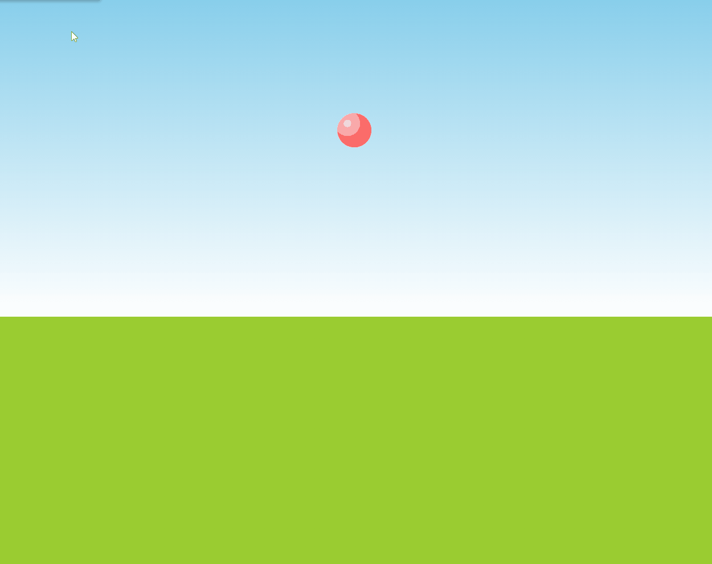

## 小球弹跳动画

```html
<div class="ball"></div>
```

```css
/**
 * Bouncing animation
 */
@keyframes bounce {
	60%, 80%, to {
		transform: translateY(400px);
		animation-timing-function: ease;
	}
	70% { transform: translateY(300px); }
	90% { transform: translateY(360px); }
}

.ball {
	width: 0; height: 0; padding: 1.5em;
	border-radius: 50%;
	margin: auto;
	background: red radial-gradient(at 30% 30%, #fdd, red);
	animation: bounce 2s cubic-bezier(.1,.25,1,.25) forwards;
}

body {
	background: linear-gradient(skyblue, white 450px, yellowgreen 0);
	min-height: 100vh;
}
```

## 效果

