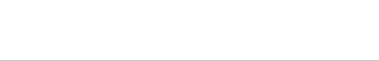

## 打字动画

```html
<h1>CSS is awesome!</h1>
```

```css
/**
 * Typing animation
 */

@keyframes typing {
	from { width: 0 }
}

@keyframes caret {
	50% { border-right-color: transparent; }
}

h1 {
	font: bold 200% Consolas, Monaco, monospace;
	/*width: 8.25em;*/
	width: 15ch;
	white-space: nowrap;
	overflow: hidden;
	border-right: .05em solid;
	animation: typing 8s steps(15),
	           caret 1s steps(1) infinite;
}
```

单位`ch`表示“0”字形的宽度。在等宽字体中，“0”字形的宽度和其他所有字形的宽度一样。如上标题的宽度就是字符的数量(空格也算)

## 效果

