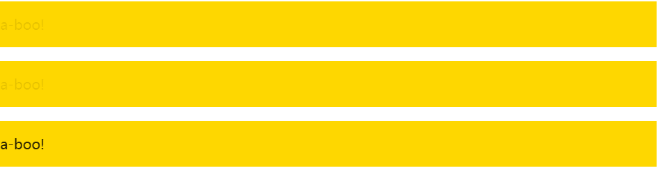

## 文本闪烁

```html
<p class="blink-smooth-1">Peek-a-boo!</p>
<p class="blink-smooth-2">Peek-a-boo!</p>
<p class="blink">Peek-a-boo!</p>
```

```css
/**
 * Blinking
 */

@keyframes blink-1 { 50% { color: transparent } }
@keyframes blink-2 { to { color: transparent } }

p {
	padding: 1em;
	background: gold;
}

.blink-smooth-1 {
	animation: 1s blink-1 3;
}

.blink-smooth-2 {
	animation: .5s blink-2 6;
	animation-direction: alternate;
}

.blink {
	animation: 1s blink-1 3 steps(1);
}
```

### 效果

