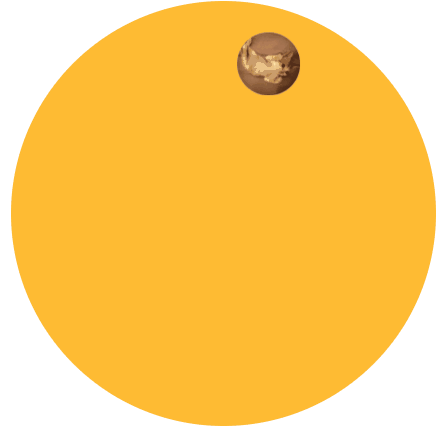

## 沿环形路径平移的动画

### 效果




### 方案一

> 需要2个元素

```html
<div class="path">
	<div class="avatar">
		
	</div>
</div>
```

```css
/**
 * Animation along a circular path - Solution 1
 */
 
@keyframes spin {
	to { transform: rotate(1turn); }
}

.avatar {
	animation: spin 3s infinite linear;
	transform-origin: 50% 150px;
}

.avatar > img {
	animation: inherit;
	animation-direction: reverse;
}

/* Anything below this is just styling */

.avatar {
	width: 50px;
	margin: 0 auto;
	border-radius: 50%;
	overflow: hidden;
}

.avatar > img {
	display: block;
	width: inherit;
}

.path {
	width: 300px;
    height: 300px;
	padding: 20px;
	border-radius: 50%;
	background: #fb3;
}
```

### 方案二

> 单个元素

```html
<div class="path">
	
</div>
```

```css
/**
 * Animation along a circular path - Solution 2
 */
 
@keyframes spin {
	from {
		transform: rotate(0turn)
		           translateY(-150px) translateY(50%)
		           rotate(1turn)
	}
	to {
		transform: rotate(1turn)
		           translateY(-150px) translateY(50%)
		           rotate(0turn);
	}
}


.avatar {
	animation: spin 3s infinite linear;
}

/* Anything below this is just styling */

.avatar {
	display: block;
	width: 50px;
	margin: calc(50% - 25px) auto 0;
	border-radius: 50%;
	overflow: hidden;
}

.path {
	width: 300px; height: 300px;
	padding: 20px;
	margin: 100px auto;
	border-radius: 50%;
	background: #fb3;
}
```

