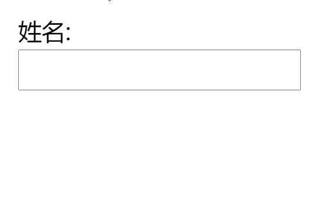

## 文本输入框提示的弹性过渡

```html
<label>
	姓名:
	<input value=""></input>
	<span class="callout">
	只允许字母、数字、下划线（_）和连字符（-）！
	</span>
</label>
```

```css
/**
 * 弹性过渡
 */

input:not(:focus) + .callout:not(:hover) {
	transform: scale(0);
	transition: .25s transform;
}

.callout {
	transition: .5s cubic-bezier(.25,.1,.3,1.5) transform;
	transform-origin: 1.4em -.4em;
}

/* 基础样式 */

input {
	display: block;
	padding: 0 .4em;
	font: inherit;
}

.callout {	
	position: absolute;
	max-width: 14em;
	padding: .6em .8em;
	border-radius: .3em;
	margin: .3em 0 0 -.2em;
	background: #fed;
	border: 1px solid rgba(0,0,0,.3);
	box-shadow: .05em .2em .6em rgba(0,0,0,.2);
	font-size: 75%;
}

.callout:before {
	content: "";
	position: absolute;
	top: -.4em;
	left: 1em;
	padding: .35em;
	background: inherit;
	border: inherit;
	border-right: 0;
	border-bottom: 0;
	transform: rotate(45deg);
}
```

### 效果

