# docker详解

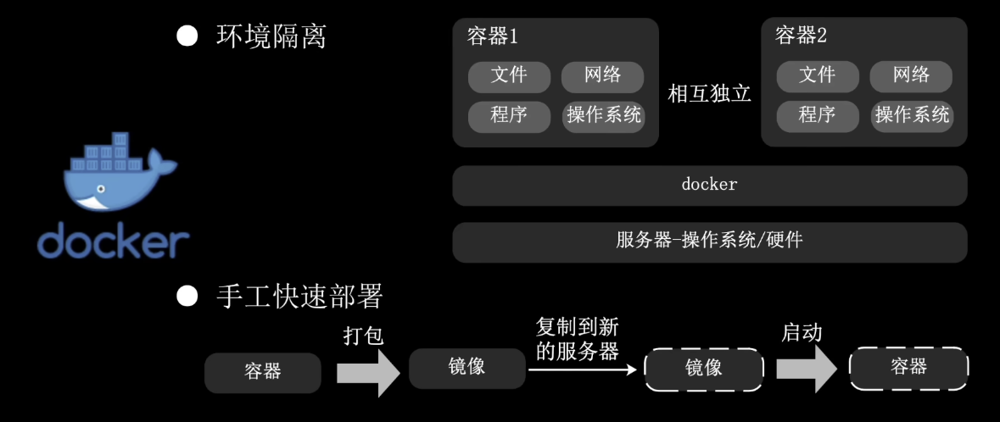

##  一、docker工作原理

> docker整体分为四个部分：远程镜像仓库、本地镜像、本地容器、docker软件

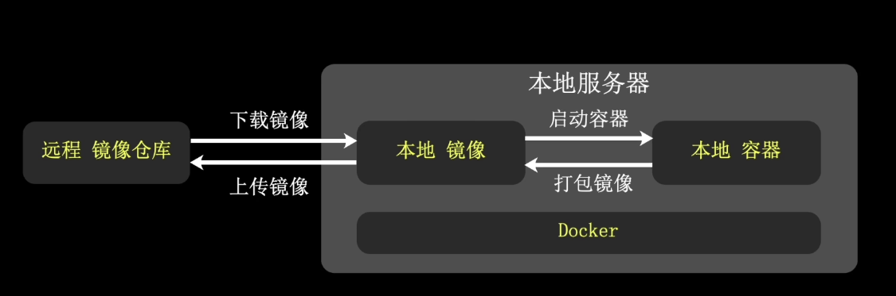

### 远程镜像仓库

* 云端镜像仓库，供用户上传、下载需要的镜像。默认是<u>Docker Hub</u>，也可以是其他仓库

### 本地镜像

* 镜像是容器的模板

### 本地容器

* 容器是根据镜像创建的，它是真正运行的实例

### docker软件

* 它是连接远程镜像仓库、本地镜像仓库和本地容器的基座，也是运行容器的引擎。

## 二、`docker image`镜像

### 1. 镜像特点

* 镜像是容器的模板，它是只读的，不能对其修改。
* Linux镜像可以在Linux、Windows的docker中使用，而Windows镜像只能在Windows的docker中使用。

### 2. 镜像命令

| 命令                                             | 说明             |
| ------------------------------------------------ | ---------------- |
| `docker images`                                  | 查看本地镜像     |
| `docker search <名称关键字>`                     | 搜索镜像仓库     |
| `docker pull <镜像名:tag版本>`                   | 下载镜像         |
| `docker push <镜像名:tag版本>`                   | 上传镜像         |
| `docker rmi <镜像名:tag版本>`                    | 删除镜像         |
| `docker save -o <输出文件路径> <镜像名:tag版本>` | 打包本地镜像文件 |
| `docker load -i <加载文件路径>`                  | 导入本地镜像文件 |

## 三、`docker container`容器

> 容器是真正运行的实例，容器隔离网络、文件、进程等环境。一个容器是一个沙盒隔离环境。


### 1. 创建容器

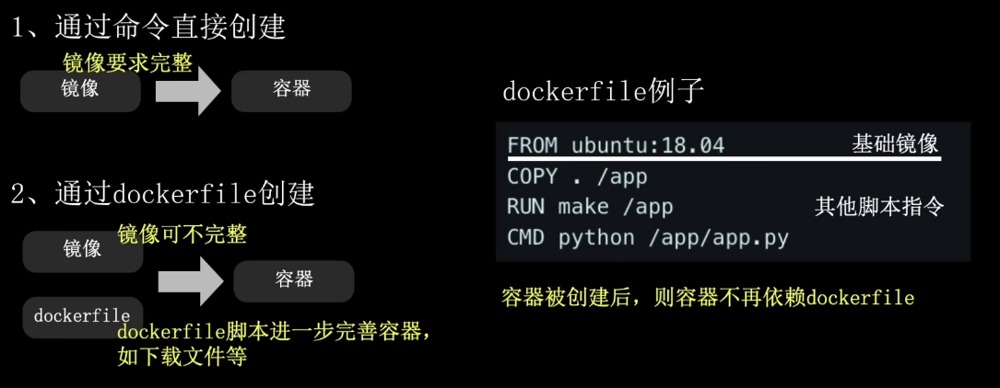

两种创建容器 方式（两者都是基于docker镜像创建）：

1. 通过命令直接创建(需要完整镜像)
2. 通过`dockerfile`创建(镜像可不完整)

#### **容器创建命令**

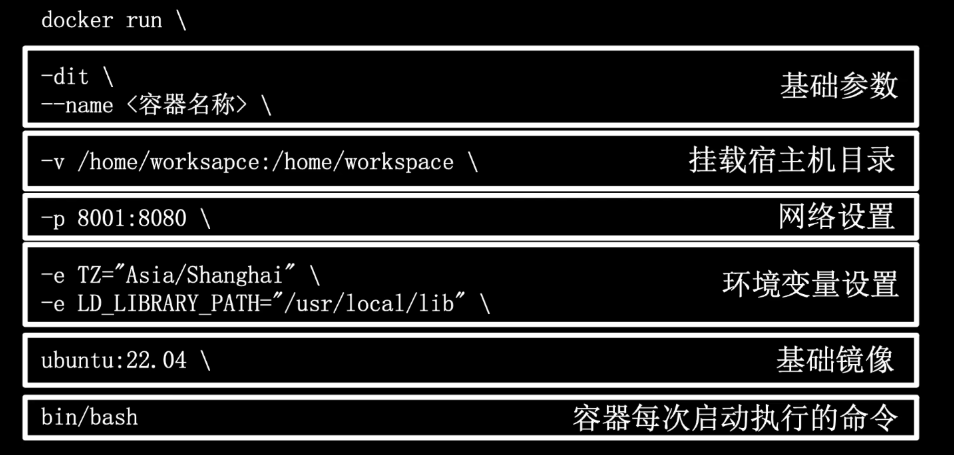

##### 1. 基础参数

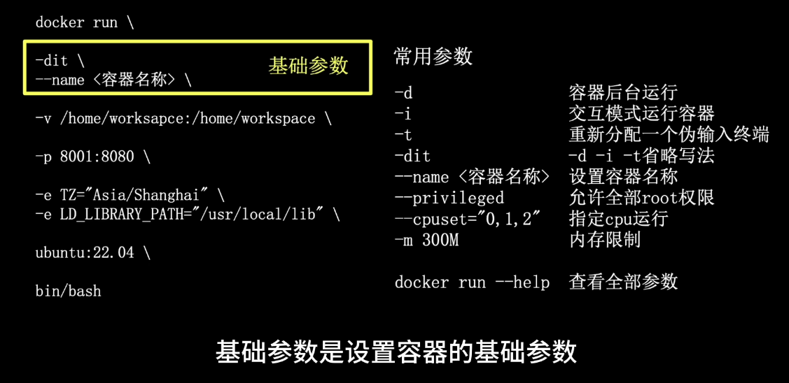

##### 2. 挂载宿主机目录

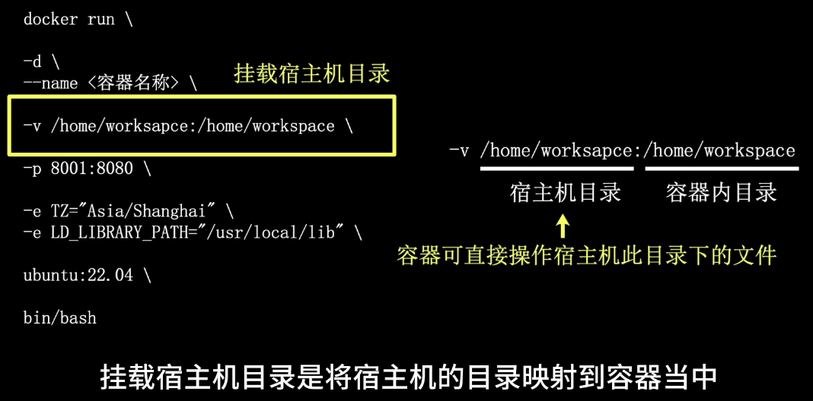

##### 3.网络设置

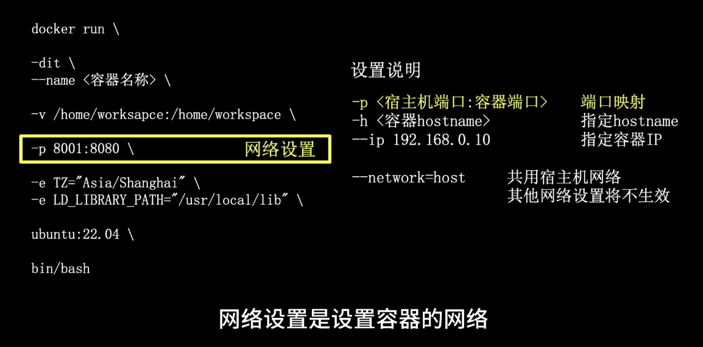

* 容器内的`127.0.0.1`指向的是容器本身，如果容器共用宿主机网络，则`127.0.0.1`会指向宿主机

##### 4.环境变量设置

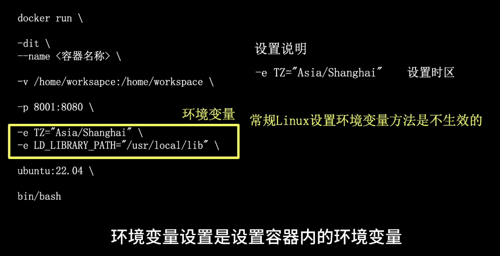

##### 5.基础镜像

##### 6.容器每次启动执行的命令

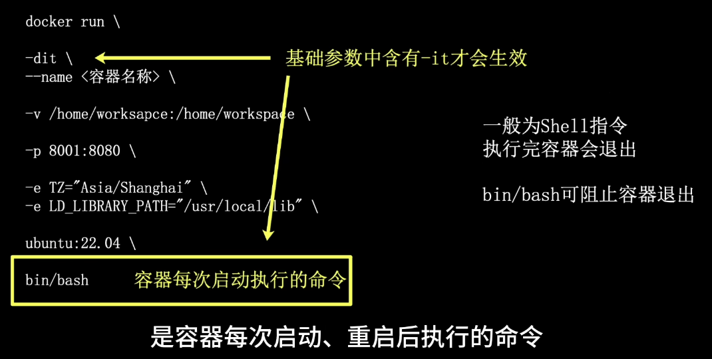

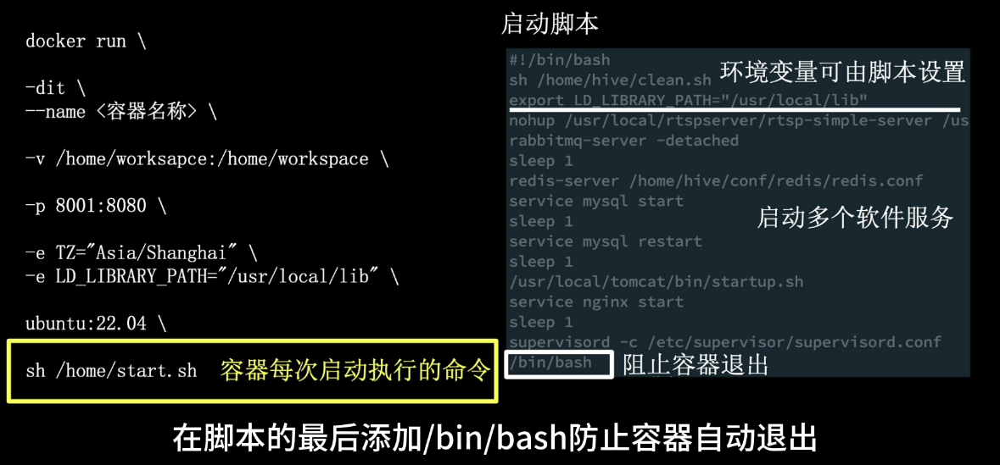

* 一般为`shell`指令

### 2. 容器命令

| 命令                                                         | 说明                                             |
| ------------------------------------------------------------ | ------------------------------------------------ |
| `docker ps`                                                  | 查看本地容器                                     |
| `docker ps -a`                                               | 查看所有容器（包括未运行的）                     |
| `docker start <容器ID>`                                      | 启动容器                                         |
| `docker restart <容器ID>`                                    | 重启容器                                         |
| `docker stop <容器ID>`                                       | 停止容器                                         |
| `docker rm <容器ID>`                                         | 删除容器                                         |
| `docker exec -it <容器ID> /bin/bash`                         | 进入容器内部                                     |
| `docker commit -a "作者信息" -m "log信息" <容器ID> <目标镜像名称:tag版本>` | 容器打包成镜像                                   |
| `docker cp <文件目录> <容器ID>：<目标目录>`                  | 拷贝文件到容器                                   |
| `docker cp <容器ID>:<文件目录> <宿主机目标目录>`             | 拷贝容器文件到宿主机                             |
| `docker update <容器ID> <相关设置>`                          | 更新容器设置(一些容器设置无法再容器创还能后修改) |

## 四、`Dockerfile`定制镜像文件

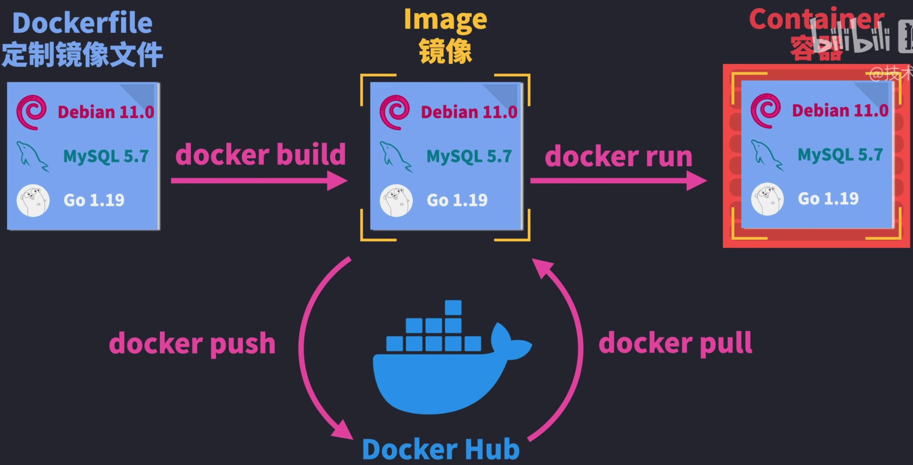

`Dockerfile`文件例子：

```dockerfile
FROM node:18-alpines3.15   # 镜像包，alpines是linux的轻量化版本
WORKDIR /egg							 # docker容器的工作目录
COPY package.json					 # 复制packer.json到/egg目录下
RUN npm install						 # 执行命令
COPY . .									 # 复制当前目录下的所有文件到/egg目录下，第二次执行COPY会复制两次package.json，有缓存
EXPOSE 3000								 # 暴露容器端口
CMD ["node", "app.js"]		 # 
```

### `.dockerignore` 文件

> 忽略打包的文件，类似与`.gitignore`

```
node_modules
Dockerfile
.dockerignore
```

1. 以上文件编写完后，在当前项目下执行`docker build .`来构建镜像(或者`docker build -t <镜像名> .`，可省略第2步)

2. 在用`docker tag`给镜像起名

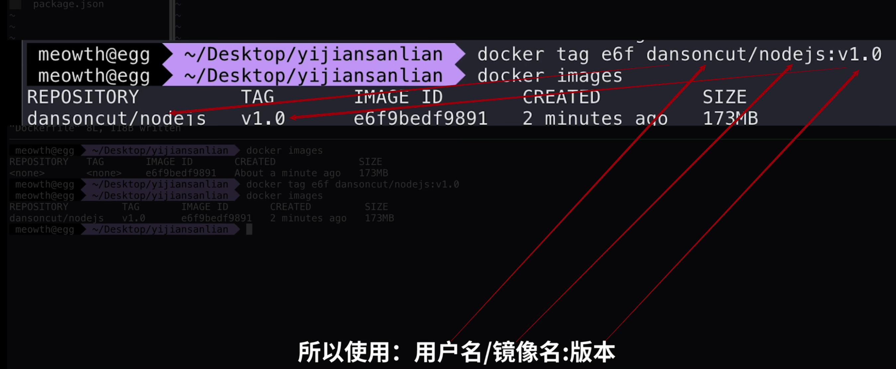

3. 创建运行容器

   ```bash
   docker run -d -p 3000:3000 --name <容器名称> <镜像名称>
   ```

   * `-d`: detached mode 后台运行
   * `-p`: port 端口映射，主机端口:容器端口


## 多容器间共享数据卷`volume`

> 即多个容器共享的”文件夹“

创建：

```bash
docker volume create <数据卷名称>
```

