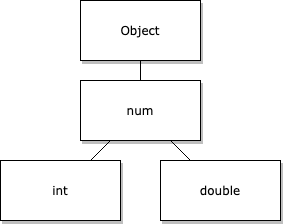

> Dart 是强类型语言，需要进行类型约束

## Dart 8大内置类型

1. Numbers (`num`, `int`, `double`)

   * num 等效于 JavaScript 中的泛型数字类型
   * int 不包含小数部分的数值
   * double 64位(双精度)浮点数

2. Strings (`String`)

3. Booleans (`bool`)

4. Lists (`List`)

   列表，也称为数组

5. Sets (`Set`)

6. Maps (`Map`)

7. Symbols (`Symbol`)

8. null (`Null`)

### 更详细的解释

> Dart 中的所有非空类型都是 `Object` 的子类型

##### 关于`Numbers`

* `int` 和 `double` 类型都共享 `num` 作为它们的父类:



* Dart 将数字`Numbers`视为对象，所以数字可以使用它们自己的实用函数

  ```js
  let rounded = Math.round(2.5);
  ```

  ```dart
  var rounded = 2.5.round();
  ```

##### 关于`Strings`

```dart
var a = 'This is a string.';
```

- **插值**

  使用单个标识符时可以省略大括号

  ```dart
  var food = 'bread';
  var str = 'I eat $food'; // I eat bread
  var str = 'I eat ${food}'; // I eat bread
  ```

- **多行字符串**

  1. 使用隐式字符串连接:Dart 连接任何相邻的字符串文字，即使分布在多行上

     ```dart
     final s1 = 'String '
         'concatenation'
         " even works over line breaks.";
     ```

  2. 在字符串的两边使用三个引号(单引号或双引号)

     ```dart
     final s2 = '''
     You can create
     multiline strings like this one.
     ''';
     
     final s3 = """
     This is also a
     multiline string.""";
     ```

##### 关于`Booleans`

```dart
var isBananaPeeled = false;
```


## 变量类型

* 在声明中写入类型

```dart
String name;
```

* 用于初始化变量赋值时，推断类型

```dart
var name = 'bob';
```

当分析器推断类型时，使用 `var` 或 `final`

* 如果没有提供**初始值**或**显式类型**，Dart 会将变量的类型推断为**全捕类型动态类型**

```dart
// Declare a variable without a type or assigned value
// and Dart infers the 'dynamic' type
var name;
// Initialize the variable and the type remains `dynamic`
name = 'bob';
name = 5; // Allowed, as `name` has type `dynamic`.
```

## 变量修饰符

### `final` 

> 等同与JS的`const`，在其他代码读取变量值之前初始化该变量。一旦初始化，就不能更改该变量的引用。
>
> 只可以被赋值一次。但是是`运行时`的。被使用到的时候才会进行初始化, 如果只是被定义, 而没有被使用到, 那么这个变量一直没有被初始化 (可以理解为'懒加载')

### `const`变量修饰符

> 当 Dart 使用 `const` 时，它引用在编译时创建的特殊值。
>
> 只可以被赋值一次。一经定义就会在`编译期间`对其进行初始化。一般用于记录一些常量，例如宏

在 Dart 中，常量变量必须包含常量值。非常量变量可以包含常量值，将其标记为 `const`。

```dart
var foo = const [];
// foo 不是常量，但它指向的值是。
// 你可以将foo重新分配给不同的列表值，但不能更改其当前列表值。

const baz = []; // 等同于 `const []`
```

另外，类可以有自己的 `const 构造函数`，它们将生成不可变的实例。

### `var`

> 可以被赋值多次


## 注释

* `/* ... */`

* `//`

* `///` doc 注释

  ```dart
  /// The number of characters in this chunk when unsplit.
  int get length => ...
  ```

  