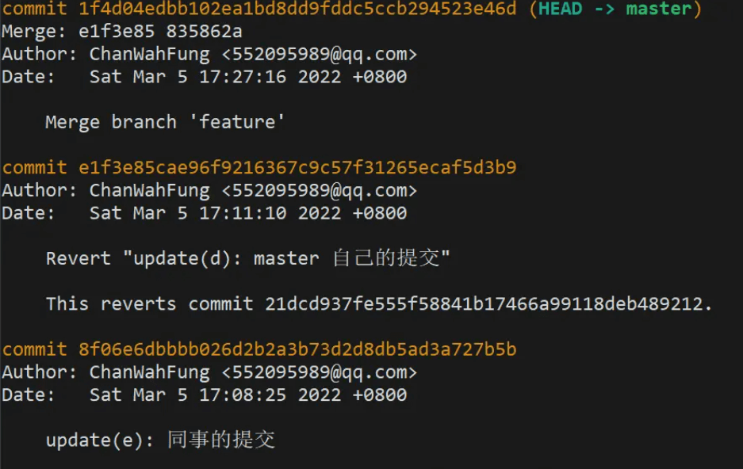
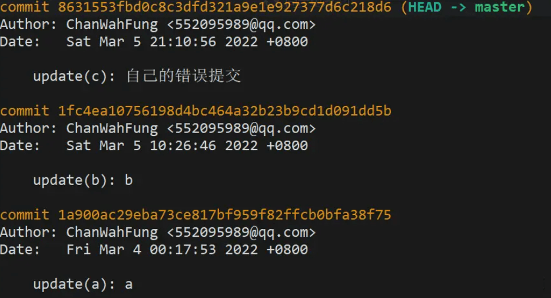
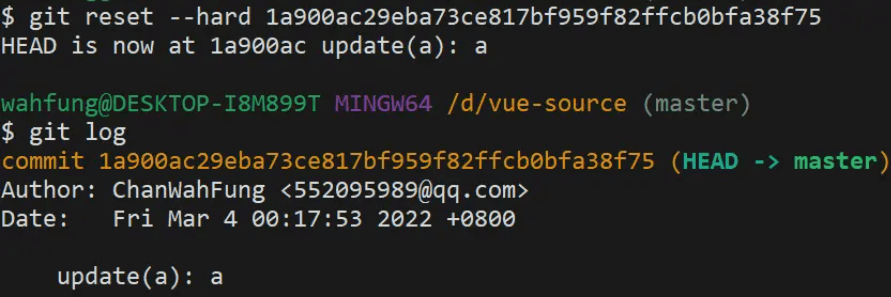
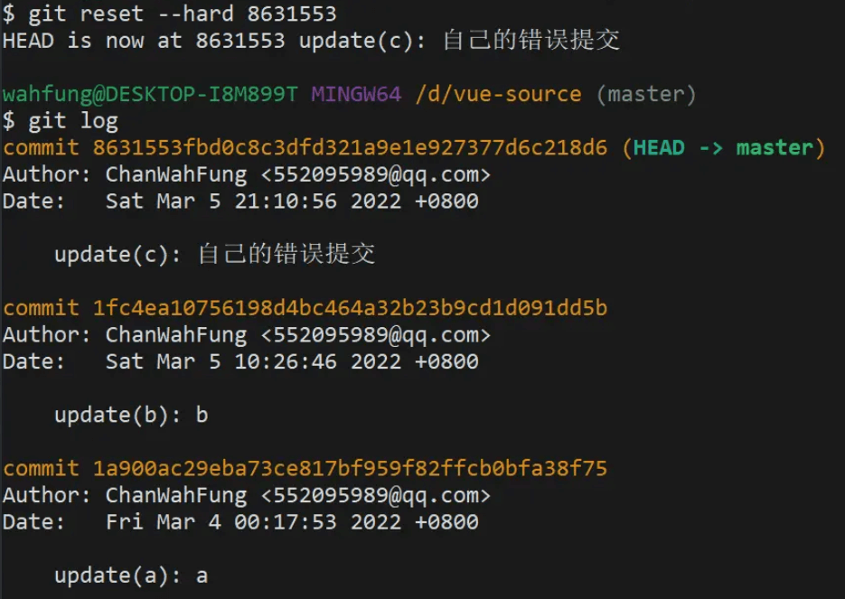

## 1.`git reset/revert` | 撤销提交

> 撤销提交分为 **撤销本地提交** 与 **撤销远程提交**。
>

### 一、`reset` 撤销本地提交

**命令：**

1. **`git reset --soft HEAD~`**
2. **`git reset --hard HEAD~`**

**案例：**

> 当你提交了代码到**本地版本库**，但此时，你想撤回这个提交，重新编辑修改一下。这时你可以通过 `git reset` 来实现。

这个撤销分为**是否保留修改**。

- 保留修改：**`git reset --soft`**，你之前所作的更改都在，这也称为最安全的撤销。
- 舍弃修改：**`git reset --hard`**，你之前所作的更改都会消失，所以要谨慎使用。

举个例子： 当前你处于`feature-4`分支上，你提了一个本地提交`第二次修改`，

- 这时你想撤销回来继续修改：

  ```sh
  $ git reset --soft HEAD~
  ```

- 如果，我直接不要这个`第二次修改`本地提交，则：

  ```sh
  $ git reset --hard HEAD~
  HEAD is now at 16960c7 第一次修改
  ```

```
$ git reset --hard HEAD^ 回退到上个版本
$ git reset --hard HEAD~3 回退到前3次提交之前，以此类推，回退到n次提交之前 $ git reset --hard commit_id 退到/进到 指定commit的sha码

强推到远程：

$ git push origin HEAD --force
```

### 二、`revert` 撤销远程提交(回滚操作)

> 当你将你的本地提交推送到了远程仓库中，这时，你发现你完全做错了，你想进行回滚操作。这时你就需要用到`git revert`操作。

举个例子： 我在`feature-4`分支上提了两个提交且都推送到了仓库，分别是`第一次修改`与`第二次修改`，现在我想进行回滚操作，撤销`第二次修改`这个提交。

```shell
jere@JereMBP GitTest (feature-4) $ git revert HEAD
[feature-4 c73e361] Revert "第二次修改"
 1 file changed, 1 deletion(-)
```

执行命令后，会自动打开一个`vim`文件来让你修改提交文本信息，默认在开头加上`revert `修饰，保存退出，操作结束。

这样回滚操作后，会多一个`revert xxx`提交记录，**如果你不想要这个提交，不想让人知道你进行了回滚**，你可以使用`git rebase -i HEAD~x`进行整理合并提交。

另外，你也可以通过`git revert <commit_hash>`来对指定提交进行回滚，如果遇到冲突就先解决冲突，然后执行`git revert --continue`继续。

`注意`：执行回滚操作需要注意环境，如果别人拉了你的代码，这时你再执行回滚操作，那就不好了。

#### revert 普通提交

**命令：**

1. `git revert HEAD`

   或者

   `git revert <commit_hash>`

2. 如果遇到冲突就先解决冲突，然后执行`git revert --continue`继续。

**案例：**


```sh
# revert 掉自己提交的 commit
$ git revert 21dcd937fe555f58841b17466a99118deb489212
```

再来看下最新的 log，生成了一条 revert 记录，虽然自己之前的提交记录还是会保留着，但你修改的代码内容已经被撤回了。

#### revert 合并提交

**命令：**

1. `git revert -m 1 <commitHash>` 

   `-m` 后面要跟一个 `parent number` 标识出"主线"，一般使用 `1` 保留主分支代码

**案例：**

> 在 git 的 commit 记录里，还有一种类型是 **合并提交**，想要 `revert `合并提交，使用上会有些不一样。



现在的 master 分支里多了条合并提交


发现命令行报错了,为什么会这样？因为合并提交是两条分支的交集节点，而 git 不知道需要撤销的哪一条分支，需要添加参数 `-m` 指定主线分支，保留主线分支的代码，另一条则被撤销。

`-m` 后面要跟一个 `parent number` 标识出"主线"，一般使用 `1` 保留主分支代码。

```sh
$ git revert -m 1 <commitHash>
```

**在 master 分支 revert 合并提交后，然后切到 feature 分支修复好 bug，再合并到 master 分支时，会发现之前被 `revert `的修改内容没有重新合并进来。**

**因为使用 revert 后， feature 分支的 commit 还是会保留在 master 分支的记录中，当你再次合并进去时，git 判断有相同的 `commitHash`，就忽略了相关 commit 修改的内容。**

这时就需要 revert 掉之前 revert 的合并提交，有点拗口，接下来看操作吧。


现在 master 的记录是这样的


再次使用 revert，之前被 revert 的修改内容就又回来了

## 2. `git cherry-pick` | 挑选分支commit合并

**命令：**

1. 切换到要被提交的分支（如`main`分支）
2. `git cherry-pick commit_hash` **commit_hash**为被挑选的分支(如`develop`)的 **commit**
3. 解决冲突然后`git add .`
4. `git cherry-pick --continue`

**案例：**

> 经过一段时间的开发，你们的产品终于上线了，版本为`V1.0`，产品上线后你马上投入到了`V1.1`版本的需求开发。某天，运营与产品同时过来找你，说刚刚发现线上存在一个很严重的`bug`，需要紧急修复一下。你马上投入修复工作，经过紧张的排查与测试，最终你修复了这个问题，准备发版。 而此时，你才注意到，你是在`develop`分支上进行的修复工作，而`develope`分支已经包含了`v1.1`的部分功能，这时，怎么把这个紧急修复提交给到`V1.0`呢？

可以通过`git cherry-pick`做到，翻译为挑选的意思，将某个提交挑选过来。

```sh
# 一次挑选多个提交
$ git cherry-pick commit1 commit2

# 挑选多个连续的commit
# 该命令将 commit1 到 commit2 这个区间的 commit 都应用到当前分支（包含commit1、commit2），commit1 是最早的提交
$ git cherry-pick commit1^..commit2
# 该方式不包含 commit1
$ git cherry-pick commit1..commit2
```

如：我们现在要将`develop`分支上的`d818f10 紧急修复线上bug`这个提交合并到我们`main V1.0`上。先切换到`main`分支上，然后将`d818f10`这个提交挑选过来合并。

```shell
GitTest (develop) $ git checkout main 
Switched to branch 'main'
Your branch is up to date with 'origin/main'.
GitTest (main) $ git cherry-pick d818f10
[main 55e808c] 紧急修复线上bug
 Date: Wed Dec 1 15:49:48 2021 +0800
 1 file changed, 2 insertions(+)
```

如果有冲突，就先解决冲突然后`git add .`，再`git cherry-pick --continue`继续执行当前的`git cherry-pick`过程

`git cherry-pick`的参数有如下几个：

```shell
--continue 用户解决代码冲突后，第一步将修改的文件重新加入暂存区（git add .），第二步使用下面的命令，让 Cherry pick 过程继续执行。
--abort 发生代码冲突后，放弃合并，回到操作前的样子.
--quit  发生代码冲突后，退出 Cherry pick，但是不回到操作前的样子
```

### cherry-pick 可用配置项


## 3.开发错分支怎么办？

### 一、没提交代码时

```shell
$ git add .
$ git stash (把暂存区的代码放入到git暂存栈)
$ git checkout name(切换到正确的分支)
$ git stash pop(把git暂存栈的代码放出来)
```

### 二、已提交代码时

```shell
$ git reset HEAD~1  （最近一次提交放回暂存区, 并取消此次提交）
$ git stash (暂存区的代码放入到git暂存栈)
$ git checkout (应该提交代码的分支)
$ git stash pop (把git暂存栈的代码放出来)
$ git checkout  (切换到刚才提交错的分支上)
$ git push origin 错误的分支 -f  (把文件回退掉)
```

## 4.不小心reset 过头，把同事的 commit 搞没了怎么办？用`reflog`

**命令：**

1. `git reflog`
2. `git reset --hard commitHash `

**案例：**

> 如果说 `reset --soft` 是后悔药，那 `reflog `就是强力后悔药。它**记录了所有的 commit 操作记录，便于错误操作后找回记录**。

某天你眼花，发现自己在其他人分支提交了代码还推到远程分支，这时因为分支只有你的最新提交，就想着使用 `reset --hard`，结果紧张不小心记错了 `commitHash`，`reset `过头，把同事的 `commit `搞没了。没办法，`reset --hard` 是强制回退的，找不到 `commitHash `了，只能让同事从本地分支再推一次（同事瞬间拳头就硬了，怎么又是你）



1. 分支记录如上，想要 reset 到 b



2. 误操作 reset 过头，b 没了，最新的只剩下 a


3. 这时用 `git reflog` 查看历史记录，把错误提交的那次 `commitHash `记下



4. 再次 reset 回去，就会发现 b 回来了
