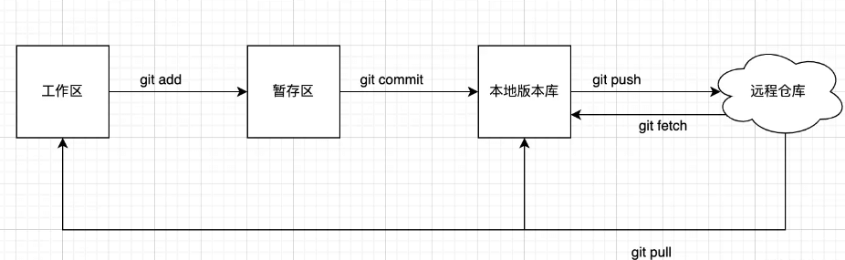
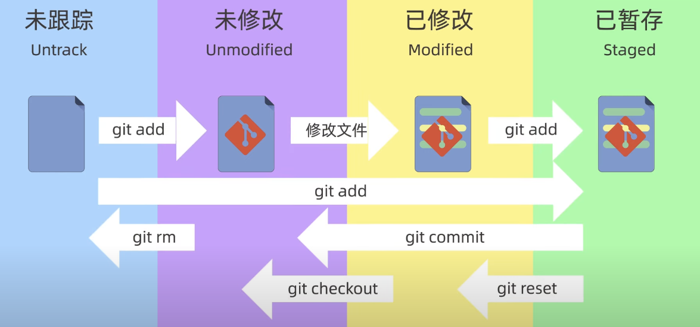

## `Git`的三个工作区域

> **工作区(Working Directory)**、**暂存区(Staging Area/Index)**、**本地仓库(Local Repository)**。其中暂存区和本地仓库具体指的是用`git init`命令生成`.git`目录下的内容

* **工作区(Working Directory)**

  我们本地电脑上的**项目目录**，开发者直接编辑的地方，即`.git`目录所在的目录。只要文件发生了更改，在这就会显示出来，包含追踪与未追踪文件。通过`git add`将工作区文件添加到暂存区。

* **暂存区(Staging Area/Index)**

  临时存储区域，用于保存即将提交到Git仓库的修改内容，指向`.git/index`文件。通过`git commit`将暂存区文件添加到本地版本库。

* **本地仓库(Local Repository)**

  本地仓库是Git存储代码和版本信息的主要位置，存放所有已经提交的数据，指向`.git/objects`目录。通过`git push`推送到远程仓库。

## `Git`文件的四个状态

1. 未跟踪(`Untrack`)

   新创建的文件，但没有被git管理起来

2. 未修改(`Unmodified`)

   被git管理起来的文件，但文件内容没有发生变化

3. 已修改(`Modified`)

   被git管理起来的文件，但文件内容被修改

4. 已暂存(`Staged`)

   被添加到了暂存区内的文件

