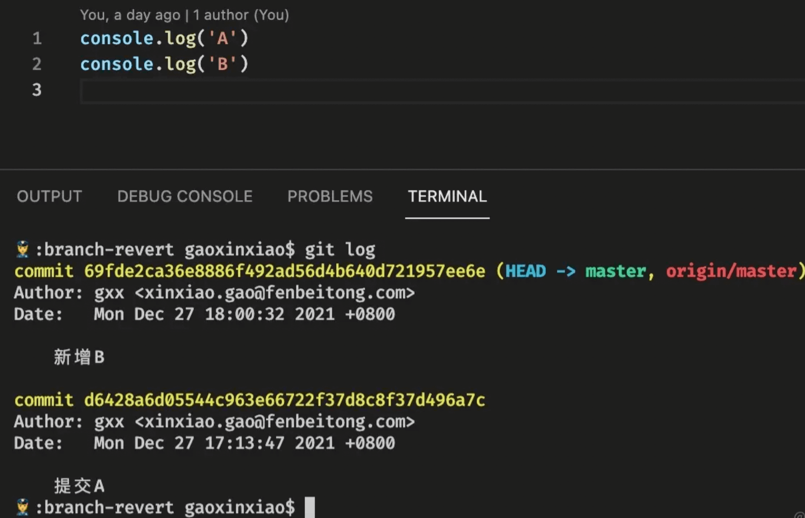

## 放弃文件修改

### 放弃`工作区`所作的修改

```sh
# 1. 放弃特定文件的修改
$ git restore <file>

# 2. 放弃所有文件的修改
$ git checkout . 
# 或者
$ git checkout head .

# 3. 撤销尚未提交的单个后缀文件
$ git checkout *.后缀 
# 或者 
$ git checkout head *.后缀

```

### 放弃`暂存区`所作的修改

```sh
$ git restore --staged <file> # git add 的反向操作
```

### 放弃`已提交`的修改

```sh
# 4. 恢复一个文件到之前的版本
$ git checkout <file> <commit-hash>
```

## `branch` 分支操作

`git `命令行中一些参数选项解释:

```sh
-d 或者 --delete：删除

-D 或者 --delete --force：强制删除

-f 或者 --force：强制

-m 或者 --move：移动或重命名

-M 或者 --move --force：强制移动或重命名

-r 或者 --remote：远程

-a 或者 --all：所有
```

### 1. 创建新分支

```sh
# 1.创建本地分支并切换到该分支
$ git checkout -b <new_branch_name>
# 等同于
$ git branch <new_branch_name>  # 或者 git branch <new_branch_name> <base_branch_name>
$ git checkout <new_branch_name> 

# 2. 基于某个分支开出新分支
$ git branch <new-branch> <base-branch>

# 3. 基于某个提交开出新分支
$ git branch <new-branch> <commit_hash>

# 4.基于某个tag开出有新分支
$ git branch <new-branch> <tag-name>
```

创建新分支之后，需要将该分支推送到远程： 

```sh
$ git push --set-upstream <origin-name> <远程分支名>
```

### 2. 删除分支

```sh
# 1. 强制删除本地分支
$ git branch -D <branch-name> 

# 2. 删除远程分支
$ git push -d <origin-name> <branch-name> 

# 3.删除本地和远程分支，删除后还需推送到服务器
$ git branch -d -r <branch-name>
$ git push <origin-name>:<branch-name> 
```

### 3. 重命名分支

```sh
$ git branch -m <old-branch> <new-branch> # 重命名本地分支
```

### 4. 查看分支

```sh
# 1. 查看 本地 所有分支，同时以*确认当前所在分支
$ git branch

# 2. 查看 本地和远程 所有分支，同时以*确认当前所在分支
$ git branch -a

# 3. 查看 远程 所有分支
$ git branch -r

# 4. 以图表形式查看分支
$ git log --graph
```

## `remote` 源地址操作

### 1. 添加项目源地址

```sh
# 1. 添加一个源地址为要提交的仓库地址
$ git remote add <remote_name> <remote_url>

# 2. 添加完源地址后，推送分支
$ git push -u <remote_name> <branch-name>

# 从远程仓库拉取代码
$ git pull <remote-name> <branch-name>
```

**`-u` 参数** 可以在推送的同时，将 `<remote_name>` 仓库的 `branch-name` 分支设置为本地仓库当前分支的 `upstream`（上游）。添加了这个参数，将来运行 `git pull` 命令从远程仓库获取内容时，本地仓库的这个分支就可以直接从`<remote_name>` 的 `branch-name` 分支获取内容，省去了另外添加参数的麻烦。

### 2. 查看项目源地址

```shell
$ git remote -v
origin  git@github.com:refinec/FrontEndNotes.git (fetch)
origin  git@github.com:refinec/FrontEndNotes.git (push) 
```

### 3. 删除项目源地址

```shell
$ git remote remove <origin_name> # 删除源地址
```

### 4. 重命名远程仓库

```sh
$ git remote <old-name> <new-name>
```


## `git merge` 合并分支

```sh
$ git switch main # 先切换到要合并的分支上
$ git merge dev   # 把dev分支合并到main分支上
```

### 1. 禁用`Fast forward`模式

> 合井分支a到分支b，`no-ff` 参数表示禁用`Fast forward`模式，合并后的历史有分支，能看出曾经做过合并。

```sh
$ git merge -no-ff -m "message" <branch-name>
```


### 2. 使用`Fast forward`模式

> 合井分支a到分支b，`ff` 参数表示使用`Fast forward`模式，合并后的历史会变成一条直线。

```sh
$ git merge --ff -m "message" <branch-name>
```


### 3. 使用`squash`压缩记录

> 合井`squash`所有提交到一个提交，被合并的分支的`commit`记录不会出现

```sh
$ git merge -squash <branch-name>
```


```js

```

yuan

```js
const columns: ProColumns<Model.Insurance.Equity.List.Item>[] = useMemo(() => [
    {
      title: '保单号',
      dataIndex: 'policyNo',
      width: 100,
    },
    {
      title: '客户手机号',
      dataIndex: 'customerPhone',
      width: 100,
    },
    {
      title: '车牌号',
      dataIndex: 'carNumber',
      width: 100,
    },
    {
      title: `${carPolicyLabelMap[bizVersion || COMPANY_BIZ_VERSION.PERSONAL_BAO]}保费（费率）`,
      dataIndex: 'policyAmount',
      hideInSearch: true,
      width: 150,
      render: (_, record) => (
        <span>{integerToDecimal(record.policyAmount)}

          <span style={{ color: companyInfo?.rateThreshold && parseFloat(record.policyRate) > parseFloat(companyInfo?.rateThreshold) ? 'red' : 'green' }}>{`（${record.policyRate}%）`}</span>
        </span>
      ),
    },
    {
      title: '权益总额（元）',
      dataIndex: 'equityAmount',
      hideInSearch: true,
      width: 150,
      render: (_, record) => `${integerToDecimal(record.equityAmount)}`,
    },
    {
      title: '发放人',
      dataIndex: 'salesmanName',
      width: 100,
    },
    {
      title: '所属机构',
      dataIndex: 'institutionName',
      width: 100,
      hideInSearch: true,
    },
    {
      title: '审核状态',
      dataIndex: 'auditStatus',
      valueEnum: AUDIT_STATUS_ENUM,
      width: 100,
    },
    {
      title: '验真状态',
      dataIndex: 'verifyStatus',
      valueType: 'select',
      valueEnum: VERIFY_STATUS_ENUM,
      width: 100,
    },
    {
      title: '兑换状态',
      dataIndex: 'takeStatus',
      hideInSearch: true,
      valueEnum: TAKE_STATUS_ENUM,
      width: 100,
    },
    {
      title: '代领人',
      dataIndex: 'takeProxyName',
      hideInSearch: true,
      width: 100,
    },
    {
      title: '创建时间',
      dataIndex: 'gmtCreate',
      valueType: 'dateTime',
      hideInSearch: true,
      width: 100,
    },
    {
      title: '审核时间',
      dataIndex: 'auditTime',
      valueType: 'dateTime',
      hideInSearch: true,
      width: 100,
    },
    {
      title: '审核人员',
      dataIndex: 'auditOperatorName',
      hideInSearch: true,
      width: 100,
    },
    // 搜索
    {
      title: '创建时间',
      dataIndex: 'time',
      valueType: 'dateRange',
      hideInTable: true,
      search: {
        transform: (value) => ({
          startTime: dayjs(value?.[0]).startOf('day').format('YYYY-MM-DD HH:mm:ss'),
          endTime: dayjs(value?.[1]).endOf('day').format('YYYY-MM-DD HH:mm:ss'),
        }),
      },
      formItemProps: {
        initialValue: [dayjs().startOf('month'), dayjs().endOf('month')],
      },
    },
  ], [bizVersion, companyInfo?.rateThreshold])

  const GzyyColumns: ProColumns<Model.Insurance.Equity.List.Item>[] = useMemo(() => [
    {
      title: '客户手机号',
      dataIndex: 'customerPhone',
      width: 100,
    },
    {
      title: '权益费用',
      dataIndex: '',
      width: 100,
      hideInSearch: true,
    },
    {
      title: '创建时间',
      dataIndex: 'gmtCreate',
      valueType: 'dateTime',
      hideInSearch: true,
      width: 100,
    },
    {
      title: '兑换状态',
      dataIndex: 'takeStatus',
      hideInSearch: true,
      valueEnum: TAKE_STATUS_ENUM,
      width: 100,
    },
    {
      title: '已兑换金额',
      dataIndex: '',
      width: 100,
      hideInSearch: true,
    },
    {
      title: '备注',
      dataIndex: '',
      width: 100,
      hideInSearch: true,
    },
    // 搜索
    {
      title: '创建时间',
      dataIndex: 'time',
      valueType: 'dateRange',
      hideInTable: true,
      search: {
        transform: (value) => ({
          startTime: dayjs(value?.[0]).startOf('day').format('YYYY-MM-DD HH:mm:ss'),
          endTime: dayjs(value?.[1]).endOf('day').format('YYYY-MM-DD HH:mm:ss'),
        }),
      },
      formItemProps: {
        initialValue: [dayjs().startOf('month'), dayjs().endOf('month')],
      },
    },
  ], [])
```


## `git diff` 比较差异

### 1. 查看工作区、暂存区、本地仓库之间的差异

```sh
$ git diff # 默认比较工作区和暂存区之间的差异内容.
$ git diff HEAD # 比较工作区和本地仓库之间的差异内容
$ git diff --cached # 比较暂存区和本地仓库之间的差异内容. cached也可以改成staged
```

### 2. 查看不同版本之间的差异

```sh
$ git diff <commit_hash_1> <commit_hash_2> # 比较两个特定版本之间的内容
$ git diff HEAD~ HEAD # 比较上一个版本和当前版本之间的差异。HEAD~等同于HEAD^表示上一个版本
$ git diff HEAD^3 HEAD # 比较之前第三个版本和当前版本之间的差异
$ git diff HEAD^3 HEAD xxx.txt # 比较之前第三个版本和当前版本中xxx.txt文件之间的差异
```

### 3. 查看不同分支之间的差异

```sh
$ git diff <branch_name1> <branch_name2>
```

### 4. 解决合并冲突 `conflict`

打开冲突文件来查看具体冲突内容

```shell
# GitTest
For git command practice

<<<<<<< HEAD
chagne README file on the main branch //内容1
=======
do something on develop branch //内容2

>>>>>>> develop
```

冲突的内容会被`<<<<<<<`与`>>>>>>>`所包围，中间用`=======`隔离开，也就如我所注释的分成了`内容1`与`内容2`两块。

- `内容1`：是当前所在分支节点的内容，也就是`main`。
- `内容2`：要合并进来分支的内容，也就是`develop`。

选择你要的内容，将`<<<<<<<`、`>>>>>>>`、`=======`这些隔离符删除掉，并保存，然后执行`git add`、`git commit`完成合并。


> 这些命令将在终端内打开差异视图，但如果你更喜欢使用更直观的工具来比较差异的话，不妨试试`git difftool`。`Meld`是一款不错的查看器/编辑器，可用于直观地比较差异。

配置`Meld`：

```shell
$ git config --global diff.tool git-meld
```

查看差异:

```shell
$ git difftool $start_commit..$end_commit -- path/to/file
# 或者
$ git difftool $start_commit..$end_commit
```


## `git blame` 查看谁更改了文件中某一行代码

```sh
$ git blame -w  # ignores white space

$ git blame -M  # ignores moving text

$ git blame -C  # ignores moving text into other files
```


## `git commit --amend`  修改上次 `commit` 信息

> 修改最近一次提交的 `commit` 文本信息

```sh
$ git commit --amend
# 或者
$ git commit --amend -m "重新提交的信息"
```

## `git stash` 暂时保存当前开发内容

> 比如某天你正在认真的开发需求中，测试过来找你让你帮忙看一个线上问题。此时，你代码也刚写了一半，不想提交，这时怎么办？
>
> 此时我们可以通过`git stash`来暂存我们代码，然后切换到线上环境分支排查问题，解决后，切换回之前分支执行`git stash pop`继续开发。

```sh
$ git stash save "未完成的功能" # 暂存在stash
$ git stash pop # 取出第一个stash
```

### `git stash` 的常用操作

```shell
# 保存到stash栈中，并加上自定义message修饰。save参数表示存储的信息，可以不写
$ git stash save "message"

# 查看所有stash
$ git stash list

# 恢复最近一次stash
$ git stash pop
# 恢复指定的stash,stash@｛2｝表示第三个stash,stash@（0｝表示最近的stash
$ git stash pop stash@{2}

# 应用最近一次stash
$ git stash apply
# 应用stash栈中的第x个元素，pop是应用的同时且从栈中删除，而apply则是只应用不删除
$ git stash apply stash@{x}

# 删除stash栈中的第x个元素
$ git stash drop stash@{x}

# 删除所有stash
$ git stash clear
```


## `git rebase` 变基(合并)分支 

> `rebase`同`merge`一样，可以合并分支。但有所区别：
>
> 1. `merge`不会破坏原分支的提交历史，方便回溯和查看。但会产生额外的提交节点，分支图比较复杂。
> 2. `rebase`不会新增额外的提交记录（而是把当前分支的每一个提交都“**复制**“到目标分支上，然后再把当前分支指向目标分支），形成线性历史，直观且干净。但会改变提交历史，改变了当前分支`branch out`的节点，**应避免在共享分支使用**。

在不同的分支上执行`git rebase`变基操作，变基的方向也不同，它会移动你当前所在分支的和操作分支的公共节点。如下图：

1. 在`dev`分支上变基到`main`主分支上时，git会先找到它们公共的祖先节点即`main:3`节点，再把`dev:1`和`dev:2`两个节点嫁接到`main`主分支上。
2. 在`main`主分支上变基到`dev`分支上时，git会先找到它们公共的祖先节点即`main:3`节点，再把`main:4`和`main:5`两个节点嫁接到`dev`分支上。


**案例：**

> 在实际项目中，我们都是多人配合协同开发，会将一些需求进行拆分，然后大家同时开发，开发完成后，各自将自己的代码合并到`develop`分支上。 在这过程中，如果某个组员已经开发完了并且将代码合并到了`develop`分支，而你还没开发完，但是这时你想同步这个组员的代码，这时就可以使用**`git rebase`**来做。

1. `feature-1` 与 `feature-2` 都是基于 `develop` 同一节点开出来的分支。
2. 随着开发的进行，`feature-1`先开发完成，并合并到`develop`分支。
3. 此时`feature-2`利用 **`git rebase origin develop`** 来同步`feature-1`的代码。

## `git rebase -i` 合并`commit`提交记录

> 📢注意：你最好在你自己的分支进行该操作。

1. 选择要合并的`commit`

   ```sh
   $ git rebase -i HEAD~x
   # 或者
   $ git rebase -i start_commit_hash end_commit_hash # (start_commit_hash, end_commit_hash] 左开右闭，变基操作不包含start_commit_hash
   ```

   这里 `i` 的意思为`interactive`交互，`HEAD~x`代表要合并`HEAD`到前`x`个历史提交。

   如 `HEAD~2`为历史的前两个提交，`HEAD~4`就是历史的前四个提交。

2. 修改 `pick` 为 `s`
3. 修改合并`commit` 提交信息
4. **`git push origin <branch-name> -f`**

**案例：**

> 我们在`feature-3分支`上对`feature-3.txt`进行了两次提交修改，分别是`598cc68 修改feature-3.txt`与`8561ef3 再次修改feature-3.txt`，现在我们要将这**两个提交进行合并**。

1. 执行 `git rebase -i HEAD~2`。

2. 这是会自动进入`vim`，显示如下内容：

   ```
   pick 598cc68 修改feature-3.txt
   pick 8561ef3 再次修改feature-3.txt
   ...省略...
   ```

3. 这里我们要合并这两个提交，所以将第二个`pick`更改为`s`，如下：

   ```shell
   pick 598cc68 修改feature-3.txt
   s 8561ef3 再次修改feature-3.txt
   ...省略...
   ```

4. 保存退出，将自动打开另外一个`vim`文件，用来修改提交文本信息，如下：

   ```shell
   # This is a combination of 2 commits.
   # This is the 1st commit message:
   
   修改feature-3.txt
   
   # This is the commit message #2:
   
   再次修改feature-3.txt
   
   # Please enter the commit message for your changes. Lines starting
   # with '#' will be ignored, and an empty message aborts the commit.
   #
   ```

   这里我们将其修改为`最终版本，修改feature-3.txt`，保存退出

   ```shell
   jere@JereMBP GitTest (feature-3) $ git rebase -i HEAD~2
   [detached HEAD 18296c5] 最终版本，修改feature-3.txt
    Date: Wed Dec 1 10:21:05 2021 +0800
    1 file changed, 2 insertions(+)
   Successfully rebased and updated refs/heads/feature-3.
   jere@JereMBP GitTest (feature-3) $
   ```

5. 此时，本地分支已经完成了合并，但尝试将其推送到仓库中时，会发现被拒绝。通过提示可知，拒绝理由是`our current branch is behind 你当前分支落后远程分支`，这时，我们需要 `git push origin feature-3 -f`，**强制推送**，完成合并。

### `pick`更改为`s`？

这里的`s`指的是`squash`，意思是将该提交挤压合并到上一个提交。 它还有一些其它选项操作可以了解一下：

```shell
p, pick <commit> = 使用提交
r, reword <commit> = 使用提交，但是会编辑提交文本信息
e, edit <commit> = 使用提交，在修改完成后，可以通过git commit --amend再次进行修改；修改满意后再使用git rebase --continue
s, squash <commit> = 使用提交，挤压合并到上一个提交
f, fixup <commit> = 类似"squash"，会挤压合并到上一个提交，但是会忽略修改提交文本信息这一步。
```

**整理提交的必要性** 如果你的分支上存在这样的情况：`提交1：finish login feature`，紧接着后面就是`提交2：code review for login feature`。 这样的操作其实很正常，也很合理，你在做好功能后，去做了`code review`，但其实我们完全可以将这两个提交合并成一个提交，方便自己以及同事查看你的代码。


## `git revert` 回滚版本

> `revert`命令会在当前提交后面，新增一次提交，抵消掉上一次提交导致的所有变化。它不会改变过去的历史，所以是首选方式，没有任何丢失代码的风险。
>
> `revert`可以抵消上一个提交，那么如果想要抵消多个需要执行 `git revert 倒数第一个commit 倒数第二个commit`。如果遇到冲突就先解决冲突，然后执行`git revert --continue`继续。
>
> 还有一种情景是已经有很多人提交过代码，但是想改之前的某一次`commit`记录又不想影响后面的也可以使用`revert`，他会把你后面提交的记录都放到工作区只是合并的时候需要注意一点

**操作一下revert来感受一下**

1. 如现在该分支有三个`commit`记录

   

2. 接着执行`git revert 16083ce`进行回滚，打开`VS Code`可以看到工作区的变化，并且在控制台可以提交默认的`commit`,如果遇到冲突就先解决冲突，然后执行`git revert --continue`继续

   

3. 看一下log记录，可以看到新增了一个记录`Revert 新增C`，并且原来的`新增C`还是在的

   

### `revert` 合并提交

```sh
$ git revert -m 1 <commitHash>
```

* `-m` 后面要跟一个 `parent number` 标识出"主线"，一般使用 `1` 保留主分支代码

**案例：**

> 在 git 的 commit 记录里，还有一种类型是 **合并提交**，想要 `revert `合并提交，使用上会有些不一样。


现在的 master 分支里多了条合并提交


发现命令行报错了,为什么会这样？因为合并提交是两条分支的交集节点，而 git 不知道需要撤销的哪一条分支，需要添加参数 `-m` 指定主线分支，保留主线分支的代码，另一条则被撤销。

`-m` 后面要跟一个 `parent number` 标识出"主线"，一般使用 `1` 保留主分支代码。

```sh
$ git revert -m 1 <commitHash>
```

**在 master 分支 revert 合并提交后，然后切到 feature 分支修复好 bug，再合并到 master 分支时，会发现之前被 `revert `的修改内容没有重新合并进来。**

**因为使用 revert 后， feature 分支的 commit 还是会保留在 master 分支的记录中，当你再次合并进去时，git 判断有相同的 `commitHash`，就忽略了相关 commit 修改的内容。**

这时就需要 revert 掉之前 revert 的合并提交，有点拗口，接下来看操作吧。


现在 master 的记录是这样的


再次使用 revert，之前被 revert 的修改内容就又回来了


## `git reset` 回退版本

> `reset`命令会把`commit`从历史记录中删除。比如你在`master`分支提交了`A-->B-->C`提交了三个记录，这个时候如果**C记录**有问题你想回退到**B记录**就可以用`git reset`进行。这个命令大概率的情况都是用在我们主分支的，因为我们上线的分支一般是`master`分支然后从`develop`进行功能开发，开发完成之后将分支合并到`master`，如果在上线之前发现合并的分支用问题可以将`develop`合并过来的分支进行回退，说白了就是取消`develop`的本次合并，但是有一种情况就是协作开发的时候大家都合并到`master`之后就不能用`reset`强行回滚`commit`因为这样会把其他人的提交记录给冲掉，这时候就可以用`revert`来进行操作。

`git reset`命令可以回退到之前的某一个提交的状态，他有两个作用：

1. 撤销之前的内容
2. 回退到之前的某一个版本

### 一、`git reset`的三种模式

```sh
$ git reset --xxx HEAD^ # 回退到上个版本
$ git reset --xxx HEAD~n # 回退到前n次提交之前
$ git reset --xxx commit_id # 退到/进到 指定commit的sha码
```

* `git reset --mixed <commit_hash | HEAD..>`

  > `mixed`参数是该命令的默认参数。
  >
  > 回退到之前的某一个版本，并且只**保留**工作区的修改内容，而**丢弃**暂存区的修改内容。

* `git reset --soft <commit_hash | HEAD..>`

  > 回退到之前的某一个版本，并且**保留**工作区和暂存区的所有修改内容

* `git reset --hard <commit_hash | HEAD..>`

  > 回退到之前的某一个版本，并且**丢弃**工作区和暂存区的所有修改内容


**操作一下reset来感受一下**

1. 在master分支使用`git log`查看`commit`记录找到B记录，准备回退到这一条，回退的时候不需要输入全部的`commit`一般是前7位就够用

   

2. 接着使用`git reset --hard 69fde2c` 或者`git reset --hard HEAD^`进行回滚，这个时候查看log记录发现最后一条`新增c`记录没有了，这里还有个问题如果直接使用`git push origin`推送会有以下提示

   

   这是因为本地的记录因为我们的回滚已经落后于仓库的代码了，这个使用需要使用`git push origin -f`进行强制提交

3. 这个时候master分支就剩下A和B的commit记录了，到这里就是一次完整的reset回滚记录，之后我们还是可以继续正常把develop分支合并到master的

   

### 二、`reset` 撤销本地提交

> 当你提交了代码到**本地版本库**，但此时，你想撤回这个提交，重新编辑修改一下。这时你可以通过 `git reset` 来实现。

举个例子： 当前你处于`feature-4`分支上，你提了一个本地提交`第二次修改`，

- 这时你想撤销回来继续修改：

  ```sh
  $ git reset --soft HEAD~
  ```

- 如果，我直接不要这个`第二次修改`本地提交，则：

  ```sh
  $ git reset --hard HEAD~
  HEAD is now at 16960c7 第一次修改
  ```

### 三、`reset` 撤销远程提交

先撤销本地提交，然后强推到远程：

```sh
$ git push origin HEAD --force
```

### 四、不小心`reset` 过头，把同事的 `commit` 搞没了怎么办？用`reflog`

```sh
$ git reflog # 1. 先查看commit-hash
$ git reset --hard <commit-hash> # 2. 再回退commit-hash
```

**案例：**

> 如果说 `reset --soft` 是后悔药，那 `reflog `就是强力后悔药。它**记录了所有的 commit 操作记录，便于错误操作后找回记录**。

某天你眼花，发现自己在其他人分支提交了代码还推到远程分支，这时因为分支只有你的最新提交，就想着使用 `reset --hard`，结果紧张不小心记错了 `commitHash`，`reset `过头，把同事的 `commit `搞没了。没办法，`reset --hard` 是强制回退的，找不到 `commitHash `了，只能让同事从本地分支再推一次（同事瞬间拳头就硬了，怎么又是你）


1. 分支记录如上，想要 reset 到 b


2. 误操作 reset 过头，b 没了，最新的只剩下 a

   

3. 这时用 `git reflog` 查看历史记录，把错误提交的那次 `commitHash `记下


4. 再次 reset 回去，就会发现 b 回来了


## `git cherry-pick` 挑选其他分支的`commit`合并

https://ruanyifeng.com/blog/2020/04/git-cherry-pick.html

**命令：**

1. 切换到要被提交的分支（如`main`分支）
2. `git cherry-pick commit_hash` **commit_hash**为被挑选的分支(如`develop`)的 **commit**
3. 解决冲突然后`git add .`
4. `git cherry-pick --continue`

**案例：**

> 经过一段时间的开发，你们的产品终于上线了，版本为`V1.0`，产品上线后你马上投入到了`V1.1`版本的需求开发。某天，运营与产品同时过来找你，说刚刚发现线上存在一个很严重的`bug`，需要紧急修复一下。你马上投入修复工作，经过紧张的排查与测试，最终你修复了这个问题，准备发版。 而此时，你才注意到，你是在`develop`分支上进行的修复工作，而`develope`分支已经包含了`v1.1`的部分功能，这时，怎么把这个紧急修复提交给到`V1.0`呢？

可以通过`git cherry-pick`做到，翻译为挑选的意思，将某个提交挑选过来。

```sh
# 一次挑选多个提交
$ git cherry-pick commit1 commit2

# 挑选多个连续的commit
# 该命令将 commit1 到 commit2 这个区间的 commit 都应用到当前分支（包含commit1、commit2），commit1 是最早的提交
$ git cherry-pick commit1^..commit2
# 该方式不包含 commit1
$ git cherry-pick commit1..commit2
```

如：我们现在要将`develop`分支上的`d818f10 紧急修复线上bug`这个提交合并到我们`main V1.0`上。先切换到`main`分支上，然后将`d818f10`这个提交挑选过来合并。

```shell
GitTest (develop) $ git checkout main 
Switched to branch 'main'
Your branch is up to date with 'origin/main'.
GitTest (main) $ git cherry-pick d818f10
[main 55e808c] 紧急修复线上bug
 Date: Wed Dec 1 15:49:48 2021 +0800
 1 file changed, 2 insertions(+)
```

如果有冲突，就先解决冲突然后`git add .`，再`git cherry-pick --continue`继续执行当前的`git cherry-pick`过程

`git cherry-pick`的参数有如下几个：

```shell
--continue 用户解决代码冲突后，第一步将修改的文件重新加入暂存区（git add .），第二步使用下面的命令，让 Cherry pick 过程继续执行。
--abort 发生代码冲突后，放弃合并，回到操作前的样子.
--quit  发生代码冲突后，退出 Cherry pick，但是不回到操作前的样子
```


## `git tag` 打版本

> 创建一个tag来指向软件开发中的一个关键时期，比如版本号更新的时候可以建一个`v2.0`、`v3.1`之类的标签，这样在以后回顾的时候会比较方便。tag的使用很简单，主要操作有：查看`tag`、创建`tag`、验证`tag`以及共享`tag`。

### 创建 `tag`

```sh
# 1.创建tag名称为v1.0
$ git tag v1.0

# 2.创建带信息的tag
$ git tag -a v1.0 -m "first version" 
$ git show v1.0 # 查看 tag 相关信息

# 3.创建带签名的tag(前提得有GPG私钥)
$ git tag -s v1.0 -m "first version"
$ git tag -v v1.0 # 验证签署标签

# 4.为以前的commit添加tag
$ git log --oneline # 先查看commit记录
commit：8a5cbc2 updated readme
$ git tag -a v1.1 8a5cbc2 # 为其添加tag

# 5.后期补tag
$ git log --pretty=oneline  # 查看提交记录
$ git tag -a tagName  SHA-1 # 在指定的提交指针处添加 标签
```

### 上传 `tag`

> 在创建`tag`后`git push`，`tag`是不会上传到服务器的，在远程仓库上是看不到tag的，为了共享这些tag，指定tag:

```sh
# 1. 提交指定的tag
$ git push origin v1.0 

# 2. 提交所有未提交的 tag
$ git push origin --tags 
```

### 查看 `tag`

```sh
$ git tag # 列出所有tag，这样列出的tag是按字母排序的，和创建时间没关系

$ git tag -l v1.* # 列出满足条件的 tag
```

### 删除 `tag`

```sh
$ git tag -d v1.0
```

### 验证 `tag`

```sh
$ git tag -v <tag_name> # 在有GPG私钥的前提下验证tag
```


## `git rm` 删除文件

1. 把文件从工作区和暂存区中同时删除

   ```sh
   $ git rm xxx.txt # 把xxx.txt文件从工作区和暂存区中同时删除
   $ git commit -m 'delete xxx.txt' # 提交删除的文件
   ```

2. 把文件从暂存区中删除，但保留在当前工作区中

   ```sh
   $ git rm --cached xxx.txt # 把xxx.txt文件从暂存区中删除
   ```

3. 删除某个目录下的所有文件和目录

   ```sh
   $ git rm -r *
   ```

## `git mv` 移动文件

```sh
# 移动一个文件到新的位置
$ git mv <file> <new-file>
```


## 其他

### 删除已从远程移除的本地分支

本地存储库中可能存在已经失效的分支。要在每次`fetch/pull`时删除这些远程存储库中已不再存在的分支，请运行：

```shell
$ git config --global fetch.prune true
```

或者手动将以下内容添加到`~/.gitconfig`中：

```
[fetch]
  prune = true
```

### `HEAD `的别名

`@`与`HEAD`相同。在`rebase`期间使用`@`可以帮上大忙：

```shell
$ git rebase -i @~2
```

### 撤销修改

#### 方式一

> 当你在修改代码时，突然意识到所做的更改不是很好，并且想要重置这些更改时，你可以将文件重置为分支的`HEAD`，而非单击撤消你编辑的所有内容。

```shell
git reset --hard HEAD
```

如果你要重置单个文件：

```shell
git checkout HEAD -- path/to/file
```

如果你已经提交了更改，但仍想恢复，可以使用：

```shell
git reset --soft HEAD~1
```

#### 方式二

> 撤回文件

```shell
git restore [file path]
```

