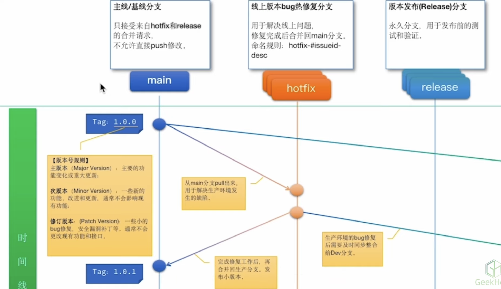

## 开发规范

### 分支命名

> 推荐使用带有意义的描述名称来命名分支

* 版本发布分支/Tag示例：`v1.0.0`
* 功能分支示例：`feature-login-page`
* 修复分支示例：`hotfix-#issueid-desc`

### 分支管理

* 定期合并已经成功验证的分支，及时删除已经合并的分支
* 保持合适的分支数量
* 为分支设置合适的管理权限

### `Git Flow`(工作流模型)




## `git merge` 合并分支

```sh
$ git switch main # 先切换到要合并的分支上
$ git merge dev # 把dev分支合并到main分支上
```


## `git rebase` 变基(合并)分支 

> `rebase`同`merge`一样，可以合并分支。但有所区别：
>
> 1. `merge`不会破坏原分支的提交历史，方便回溯和查看。但会产生额外的提交节点，分支图比较复杂。
> 2. `rebase`不会新增额外的提交记录，形成线性历史，直观且干净。但会改变提交历史，改变了当前分支`branch out`的节点，**应避免在共享分支使用**。

在不同的分支上执行`git rebase`，变基的方向也不同。如下图：

1. 在`dev`分支上变基到`main`主分支上时，git会先找到它们公共的祖先节点即`main:3`节点，再把`dev:1`和`dev:2`两个节点嫁接到`main`主分支上。
2. 在`main`主分支上变基到`dev`分支上时，git会先找到它们公共的祖先节点即`main:3`节点，再把`main:4`和`main:5`两个节点嫁接到`dev`分支上。


## `git reset` 回退版本

> `git reset`命令可以回退到之前的某一个提交的状态
>
> 1. 撤销之前的内容
> 2. 回退到之前的某一个版本

### `git reset`的三种模式

* `git reset --mixed <commit_hash | HEAD..>`

  > `mixed`参数是该命令的默认参数。
  >
  > 回退到之前的某一个版本，并且只**保留**工作区的修改内容，而**丢弃**暂存区的修改内容。

* `git reset --soft <commit_hash | HEAD..>`

  > 回退到之前的某一个版本，并且**保留**工作区和暂存区的所有修改内容

* `git reset --hard <commit_hash | HEAD..>`

  > 回退到之前的某一个版本，并且**丢弃**工作区和暂存区的所有修改内容


## `git tag` 打版本

> 创建一个tag来指向软件开发中的一个关键时期，比如版本号更新的时候可以建一个`v2.0`、`v3.1`之类的标签，这样在以后回顾的时候会比较方便。tag的使用很简单，主要操作有：查看`tag`、创建`tag`、验证`tag`以及共享`tag`。

### 创建 `tag`

```sh
# 1.创建tag名称为v1.0
$ git tag v1.0

# 2.创建带信息的tag
$ git tag -a v1.0 -m "first version" 
$ git show v1.0 # 查看 tag 相关信息

# 3.创建带签名的tag(前提得有GPG私钥)
$ git tag -s v1.0 -m "first version"
$ git tag -v v1.0 # 验证签署标签

# 4.为以前的commit添加tag
$ git log --oneline # 先查看commit记录
commit：8a5cbc2 updated readme
$ git tag -a v1.1 8a5cbc2 # 为其添加tag

# 5.后期补tag
$ git log --pretty=oneline  # 查看提交记录
$ git tag -a tagName  SHA-1 # 在指定的提交指针处添加 标签
```

### 上传 `tag`

> 在创建`tag`后`git push`，`tag`是不会上传到服务器的，在远程仓库上是看不到tag的，为了共享这些tag，指定tag:

```sh
# 1. 提交指定的tag
$ git push origin v1.0 

# 2. 提交所有未提交的 tag
$ git push origin --tags 
```

### 查看 `tag`

```sh
$ git tag # 列出所有tag，这样列出的tag是按字母排序的，和创建时间没关系

$ git tag -l v1.* # 列出满足条件的 tag
```

### 删除 `tag`

```sh
$ git tag -d v1.0
```

### 验证 `tag`

```sh
$ git tag -v <tag_name> # 在有GPG私钥的前提下验证tag
```


## `git rm` 删除文件

1. 把文件从工作区和暂存区中同时删除

   ```sh
   $ git rm xxx.txt # 把xxx.txt文件从工作区和暂存区中同时删除
   $ git commit -m 'delete xxx.txt' # 提交删除的文件
   ```

2. 把文件从暂存区中删除，但保留在当前工作区中

   ```sh
   $ git rm --cached xxx.txt # 把xxx.txt文件从暂存区中删除
   ```

3. 删除某个目录下的所有文件和目录

   ```sh
   $ git rm -r *
   ```


## `git diff` 比较差异

### 1. 查看工作区、暂存区、本地仓库之间的差异

```sh
$ git diff # 默认比较工作区和暂存区之间的差异内容.
$ git diff HEAD # 比较工作区和本地仓库之间的差异内容
$ git diff --cached # 比较暂存区和本地仓库之间的差异内容. cached也可以改成staged
```

### 2. 查看不同版本之间的差异

```sh
$ git diff <commit_hash_1> <commit_hash_2> # 比较两个特定版本之间的内容
$ git diff HEAD~ HEAD # 比较上一个版本和当前版本之间的差异。HEAD~等同于HEAD^表示上一个版本
$ git diff HEAD^3 HEAD # 比较之前第三个版本和当前版本之间的差异
$ git diff HEAD^3 HEAD xxx.txt # 比较之前第三个版本和当前版本中xxx.txt文件之间的差异
```

### 3. 查看不同分支之间的差异

```sh
$ git diff <branch_name1> <branch_name2>
```

## `git blame` 查看谁更改了文件中某一行代码

```sh
$ git blame -w  # ignores white space

$ git blame -M  # ignores moving text

$ git blame -C  # ignores moving text into other files
```

