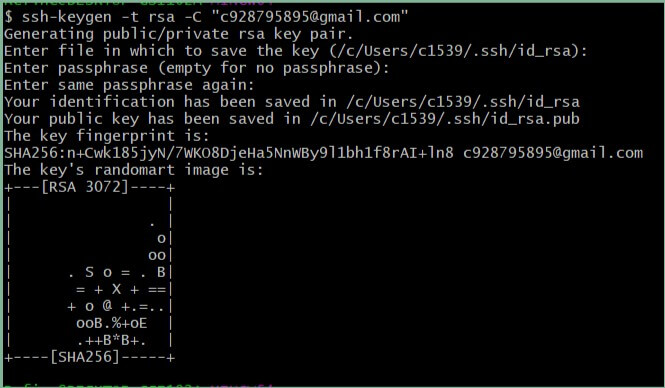

## 一、`git config` 配置查看

> `git config --list`：查看你的`git配置信息`
>
> `git config --global -l`：查看全局配置
> `git config --system -l`：查看本地配置

## 二、基本设置（初始化）

```shell
#设置用户名
$ git config --global user.name <name>
#设置邮箱
$ git config --global user.email <email>

#查看用户名
$ git config --global user.name
#查看邮箱
$ git config --global user.email

#初始化git版本库
$ git init

#创建.gitignore文件
$ touch .gitigonre
# 文件中写入需要忽略的文件名（示例:node_modules /dist .idea ...），如果需要忽略的文件已经提交到仓库，需要删除后，再次提交.gitignore文件才可生效
```

几个参数：

* `--local`：本地配置，只对本地仓库有效
* `--global`：全局配置，所有仓库生效
* `--system`：系统配置，对所有用户生效

## 三、配置`git`别名

> 为常用命令创建别名，可以节省你花在终端的时间。比如我们每次都要输入完整的`checkout`、`commit`，很麻烦，我们可以通过设置别名来实现。

```shell
$ git config --global alias.co checkout
$ git config --global alias.br branch
$ git config --global alias.ci commit
$ git config --global alias.st status
```

设置完成后，你在通过`git config --list`查看配置，就会发现：

```shell
alias.co=checkout
alias.br=branch
alias.ci=commit
alias.st=status
```

之后你就可以通过`git co <branch>`来切换分支、`git st`查看分支状态了.

你还可以通过直接修改`~/.gitconfig`文件来编辑这些命令或添加更多命令：

```
[alias]
    co = checkout
    ci = commit
    br = branch
```

## 三、配置代理

因为一些特殊网络原因，我们很多时候上`github`很不稳定，有时候我们推送一些代码会`403`失败。这时我们就可以通过设置代理来解决。

比如：我们设置一个本地代理。

```shell
git config --global http.proxy http://127.0.0.1:1080
git config --global https.proxy https://127.0.0.1:1080
git config --global http.proxy 'socks5://127.0.0.1:1080'
git config --global https.proxy 'socks5://127.0.0.1:1080'
```

设置完成后，你再通过`git config --list`查看配置，就会发现：

```shell
http.proxy=http://127.0.0.1:1080
https.proxy=https://127.0.0.1:1080
```

设置代理成功后，某天，你想取消该代理，这时我们可以通过`unset`来取消代理设置。

```shell
$ git config --global --unset http.proxy
$ git config --global --unset https.proxy
```

## 四、其他

**对特定用户、组织进行评论**

@ 用户名、@ 组织名、@ 组织名 / 团队

输入“用户名 / 仓库名 # 编号”则可以连接到指定仓库所对应的 Issue 编号

**初始设置：**对本地计算机里安装的 Git 进行设置

- 设置使用 Git 时的姓名和邮箱地址，这里设置的姓名和邮箱地址会用在 Git 的提交日志中：

  ```sh
  $ git config --global user.name "Firstname Lastname"
  $ git config --global user.email "your_email@example.com"
  ```

  在“`~/.gitconfig`”中以如下形式输出设置文件：

  ```
  [user]
    name = Firstname Lastname
    email = your_email@example.com
  ```

- 提高命令输出的可读性，将 `color.ui` 设置为 **auto** 可以让命令的输出拥有更高的可读性

  ```sh
  $ git config --global color.ui auto
  ```

  “~/.gitconfig”中会增加下面一行

  ```
  [color]
    ui = auto
  ```

**设置 SSH Key**

GitHub 上连接已有仓库时的认证，是通过使用了 SSH 的公开密钥认证方式进行的

```sh
$ ssh-keygen -t rsa -C "your_email@example.com"
 Generating public/private rsa key pair.
 Enter file in which to save the key
 (/Users/your_user_directory/.ssh/id_rsa): 按回车键
 Enter passphrase (empty for no passphrase): 输入密码
 Enter same passphrase again: 再次输入密码
```



**id_rsa** 文件是私有密钥，**id_rsa.pub** 是公开密钥

在 GitHub 中添加公开密钥，今后就可以用私有密钥进行认证了：

**Account Settings --->SSH Keys  ---->Add SSH Key**。在 Title 中输入适当的密钥名称。Key 部分请粘贴 id_rsa.pub 文件里的内容,