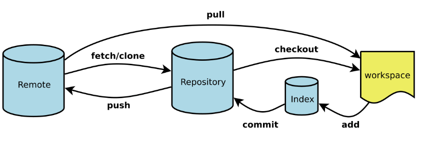
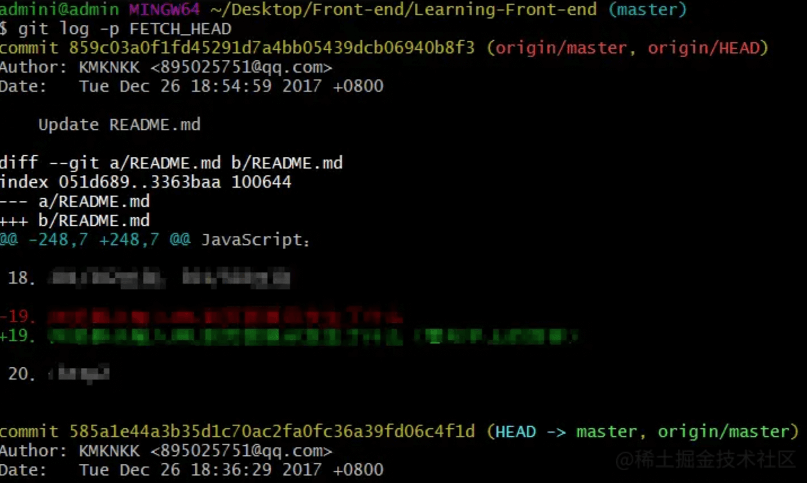

# git fetch 和 git pull区别



- `git fetch`是将远程主机的最新内容拉到本地，用户在检查了以后决定是否合并到工作本机分支中。
- `git pull` 则是将远程主机的最新内容拉下来后直接合并，即：`git pull = git fetch + git merge`，这样可能会产生冲突，需要手动解决。

## git fetch 用法

命令格式：`git fetch <远程主机名>`这个命令将某个远程主机的更新全部取回本地

### 1. 取回特定分支的更新

> `git fetch <远程主机名> <分支名>` 注意之间有空格

最常见的命令如取回`origin` 主机的`master` 分支：`git fetch origin master`。取回更新后，会返回一个`FETCH_HEAD` ，指的是某个branch在服务器上的最新状态，我们可以在本地通过`git log -p FETCH_HEAD`查看刚取回的更新信息：



可以看到返回的信息包括更新的文件名，更新的作者和时间，以及更新的代码（19行红色[删除]和绿色[新增]部分）。我们可以通过这些信息来判断是否产生冲突，以确定是否将更新合并到当前分支`git merge FETCH_HEAD`。

## git pull 用法

`git pull` 的过程可以分解为：

```shell
$ git fetch origin master //从远程主机的master分支拉取最新内容 
$ git merge FETCH_HEAD    //将拉取下来的最新内容合并到当前所在的分支中
```

即将远程主机的某个分支的更新取回，并与本地指定的分支合并，

完整格式可表示为：`git pull <远程主机名> <远程分支名>:<本地分支名>`

如果远程分支是与当前分支合并，则冒号后面的部分可以省略：`git pull <远程主机名> <远程分支名>`