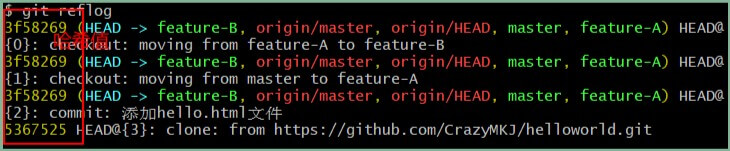

## 基本命令

**生成`.gitignore`文件：** 打开` git bash` 输入`touch .gitignore`

|            **git init**            | 初始化git仓库                                                |
| :--------------------------------: | ------------------------------------------------------------ |
|           **git status**           | 查看仓库的状态  工作树和仓库在被操作的过程中，状态会不断发生变化。在 Git 操作过程中时常用该命令查看当前状态，可谓基本中的基本 |
|            **git add**             | 向暂存区中添加文件，暂存区是提交之前的一个临时区域  git  add file1 file2 file3、   git config/\*、   git home/*.php、   git add .   git add --all |
|         **git diff(HEAD)**         | **查看更改前后的差别,即查看工作树、暂存区、最新提交之间的差别**。 * 显示的内容中“+”号标出的是新添加的行，被删除的行则用“-”号标出. * **好习惯：**在执行 git commit 命令之前先执行 git diff HEAD 命令,查看本次提交与上次提交之间有什么差别,HEAD 是指向当前分支中最新一次提交的指针 |
| **git commit** -m "提交说明信息…." | 保存仓库的历史记录，该命令可以将当前暂存区中的文件实际保存到仓库的历史记录中。通过这些记录，我们就可以在工作树中复原文件。  **如果想要记述得更加详细，请不加 - m**      第一行：用一行文字简述提交的更改内容    第二行：空行    第三行以后：记述更改的原因和详细内容 |
|  **git log** (-p)（目录\|文件名）  | **查看提交日志，该命令可以查看以往仓库中提交的日志。包括可以查看什么人在什么时候进行了提交或合并，以及操作前后有怎样的差别。**      - p 参数:查看提交所带来的改动,文件的前后差别就会显示在提交信息之后.    在 git log 命令后加上目录名，便会只显示该目录下的日志。如果加的是文件名，就会只显示与该文件相关的日志 |
|           **git reflog**           | 查看当前仓库的操作日志，在日志中找出回溯历史之前的哈希值  |

## 更改提交的操作

Git 的另一特征便是可以灵活操作历史版本。借助分散仓库的优势，可以在不影响其他仓库的前提下对历史版本进行操作。

| **git reset** **--hard** **目标时间点的哈希值** | **回溯历史版本，让仓库的** **HEAD**、暂存区、当前工作树回溯到指定状态。哈希值只要输入** **4** **位以上就可以执行** |
| ----------------------------------------------- | ------------------------------------------------------------ |
| **git commit --amend**                          | **修改上一条提交信息**                                       |
| **git rebase -i**                               | **压缩历史**                                                 |
| **git commit -am**                              | 小小的变更(如修改拼写错误)就没必要先执行 `git add `命令再执行 `git commit `命令了，用 `git commit -am` 命令来一次完成这两步操作。 错字漏字等失误称作 typo，所以我们将提交信息记为 " Fix typo" |
| **git rebase -i HEAD~2**                        | 更改历史(健全的历史记录不需要拼写修改等)，该命令把最近2次提交修改为一次完美的提交 HEAD最新提交，2为最近2条历史记录 |