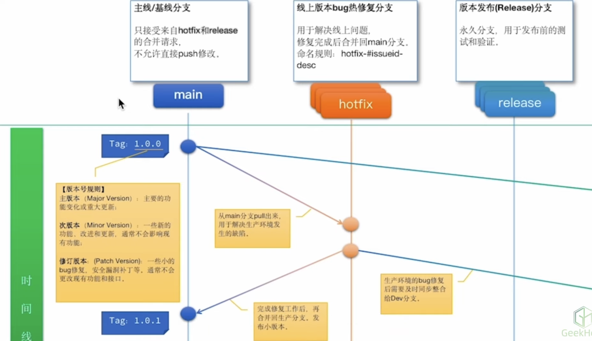
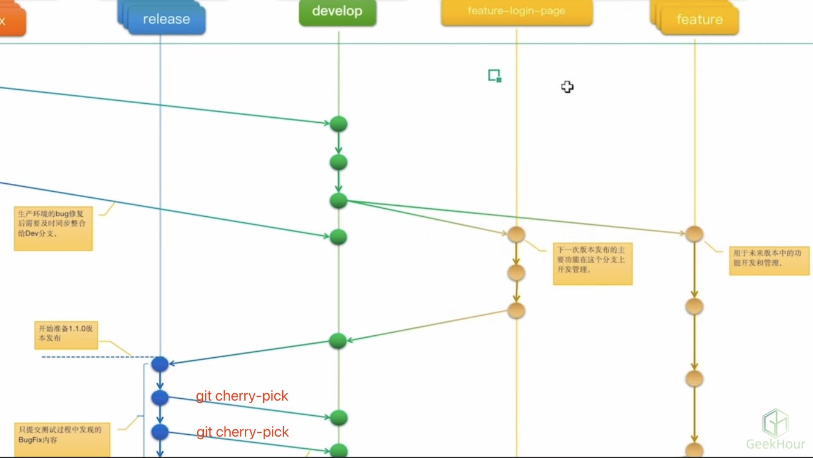

## 分支命名

> 推荐使用带有意义的描述名称来命名分支

* 版本发布分支/Tag示例：`v1.0.0`
* 功能分支示例：`feature-login-page`
* 修复分支示例：`hotfix-#issueid-desc`

## 分支管理

* 定期合并已经成功验证的分支，及时删除已经合并的分支
* 保持合适的分支数量
* 为分支设置合适的管理权限

## `Git Flow`(工作流模型)

