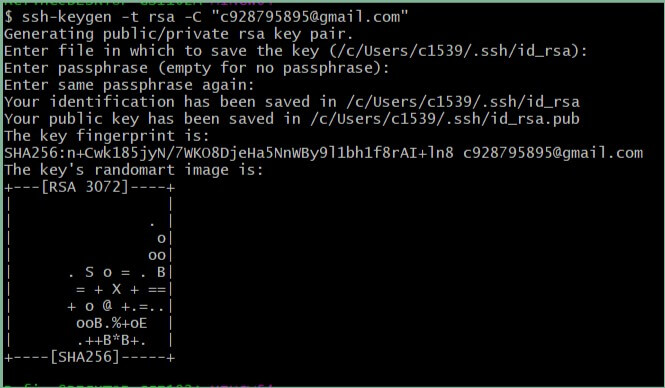

# 修改本机git账户

```sh
git config --global -l:查看全局配置
git config --system -l：查看本地配置

git config user.name：查看用户名
git config user.email：查看邮箱
git config user.name "你的用户名"：修改你本地一个仓库的用户名
git config user.email"你的邮箱"：修改你本地一个仓库的邮箱
git config --global user.name"你的用户名"：修改全局仓库的用户名
git config --global user.email"你的邮箱"：修改全局仓库的邮箱

cd ~/.ssh // 如果是Mac 先进这里
ssh-keygen -t rsa -C "邮箱"
```

## github后台配置ssh key之后本地无法git clone的问题 Permission denied (publickey).

当你在github后台添加了ssh keys之后，如果你在本地 git clone git://www.somesite.com/test.git 的时候出现了一些问题，不如access denied，那么你要在本地这么测试一下：

ssh -T git@github.com

如果返回是：

Permission denied (publickey).

那么你可能要在本地ssh-add一下，当然在这之前你可以使用 ssh -vT git@github.com 查看一下到底是因为什么原因导致的失败。

ssh-add ~/.ssh/youraccount_rsa

然后会返回如下：

Enter passphrase for /Users/andy/.ssh/youraccount_rsa:
Identity added: /Users/andy/.ssh/youraccount_rsa (/Users/andy/.ssh/youraccount_rsa)

之后再使用 ssh -T git@github.com

会返回成功：

Hi youraccount! You've successfully authenticated, but GitHub does not provide shell access.

说明你目前本地的ssh已经切换到了youraccount这个账号，

之后便可以进行git clone到本地：

git clone git@github.com:youraccount/yourproject.git

另：如果你有使用github官方的那个小猫app，那么当你git -T git@github.com的时候会使用你在github这个程序中设置的github账号进行登录，而不是ssh的rsa账号登录。


## 其他

**对特定用户、组织进行评论**

@ 用户名、@ 组织名、@ 组织名 / 团队

输入“用户名 / 仓库名 # 编号”则可以连接到指定仓库所对应的 Issue 编号

**初始设置：**对本地计算机里安装的 Git 进行设置

- 设置使用 Git 时的姓名和邮箱地址，这里设置的姓名和邮箱地址会用在 Git 的提交日志中：

```sh
$ git config --global user.name "Firstname Lastname"
$ git config --global user.email "your_email@example.com"
```

在“`~/.gitconfig`”中以如下形式输出设置文件：

```sh
[user]
  name = Firstname Lastname
  email = your_email@example.com
```

- 提高命令输出的可读性，将 `color.ui` 设置为 **auto** 可以让命令的输出拥有更高的可读性

  ```sh
  $ git config --global color.ui auto
  ```

  “~/.gitconfig”中会增加下面一行

  [color]
    ui = auto

**设置 SSH Key**

GitHub 上连接已有仓库时的认证，是通过使用了 SSH 的公开密钥认证方式进行的

```sh
$ ssh-keygen -t rsa -C "your_email@example.com"
 Generating public/private rsa key pair.
 Enter file in which to save the key
 (/Users/your_user_directory/.ssh/id_rsa): 按回车键
 Enter passphrase (empty for no passphrase): 输入密码
 Enter same passphrase again: 再次输入密码
```



**id_rsa** 文件是私有密钥，**id_rsa.pub** 是公开密钥

在 GitHub 中添加公开密钥，今后就可以用私有密钥进行认证了：

**Account Settings --->SSH Keys  ---->Add SSH Key**。在 Title 中输入适当的密钥名称。Key 部分请粘贴 id_rsa.pub 文件里的内容,
