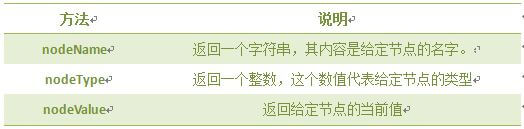
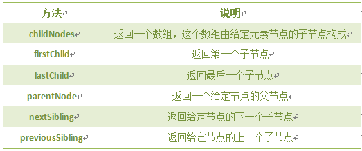
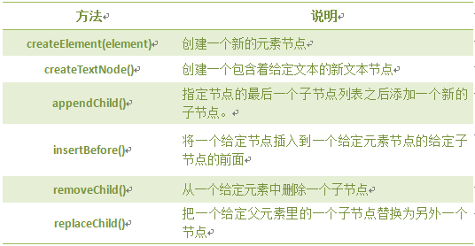

**节点属性：**

**一、nodeName 属性:** 节点的名称，是只读的。

1. 元素节点的 nodeName 与标签名相同
2. 属性节点的 nodeName 是属性的名称
3. 文本节点的 nodeName 永远是 #text
4. 文档节点的 nodeName 永远是 #document

**二、nodeValue 属性：**节点的值

1. 元素节点的 nodeValue 是 undefined 或 null
2. 文本节点的 nodeValue 是文本自身
3. 属性节点的 nodeValue 是属性的值

**三、nodeType 属性:** 节点的类型，是只读的。以下常用的几种结点类型:

**元素类型   节点类型**
 元素      1
 属性      2
 文本      3
 注释      8
 文档      9

**遍历节点树:**

**dom操作：**

