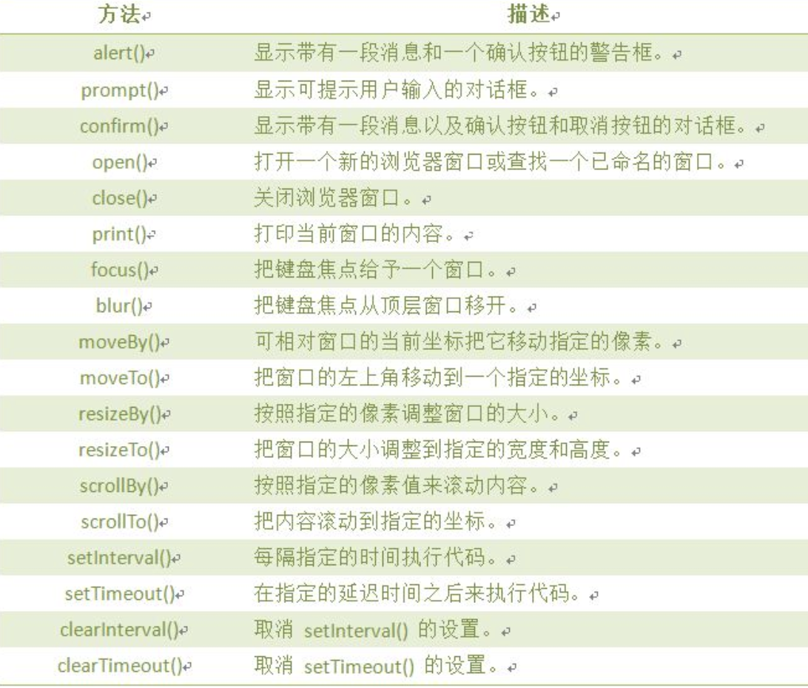
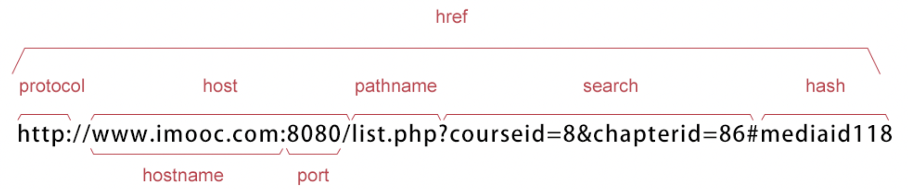
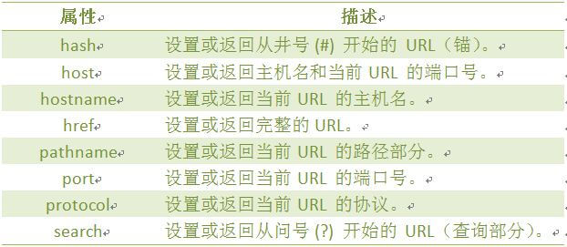
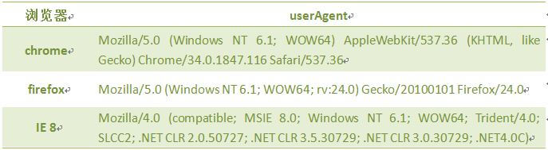
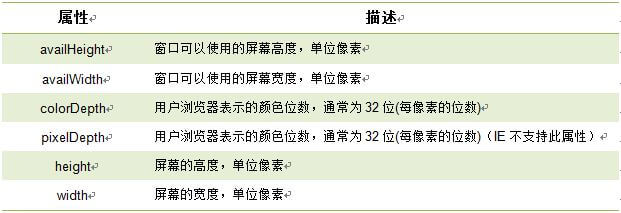

## window 对象



## location 对象

> location用于获取或设置窗体的URL，并且可以用于解析URL

**语法**：`location.[属性|方法]`



**location 对象属性：**



**location 对象方法:**

| 属性      | 描述                   |
| --------- | ---------------------- |
| assign()  | 加载新的文档           |
| reload()  | 重新加载当前文档       |
| replace() | 用新的文档替换当前文档 |

## Navigator对象

> Navigator 对象包含有关浏览器的信息，通常用于检测浏览器与操作系统的版本

**对象属性：**

| 属性        | 描述                                        |
| ----------- | ------------------------------------------- |
| appCodeName | 浏览器代码名的字符串表示                    |
| appName     | 返回浏览器的名称                            |
| appVersion  | 返回浏览器的平台和版本信息                  |
| platform    | 返回运行浏览器的操作系统平台                |
| userAgent   | 返回由客户机发送服务器的 user-agent头部的值 |

几种浏览的user_agent.，像360的兼容模式用的是IE、极速模式用的是chrom的内核:



```js
// 使用userAgent判断使用的是什么浏览器(假设使用的是IE8浏览器),
function validB(){ 
  var u_agent =  navigator.userAgent; // 返回用户代理头的字符串表示(就是包括浏览器版本信息等的字符串)
  var B_name="不是想用的主流浏览器!"; 
  if(u_agent.indexOf("Firefox")>-1){ 
    B_name="Firefox"; 
  }else if(u_agent.indexOf("Chrome")>-1){ 
    B_name="Chrome"; 
  }else if(u_agent.indexOf("MSIE")>-1&&u_agent.indexOf("Trident")>-1){ 
    B_name="IE(8-10)";  
  }
  document.write("浏览器:"+B_name+"<br>");
  document.write("u_agent:"+u_agent+"<br>"); 
} 
```

## screen 对象

> screen对象用于获取用户的屏幕信息

**语法：** window.screen.属性



