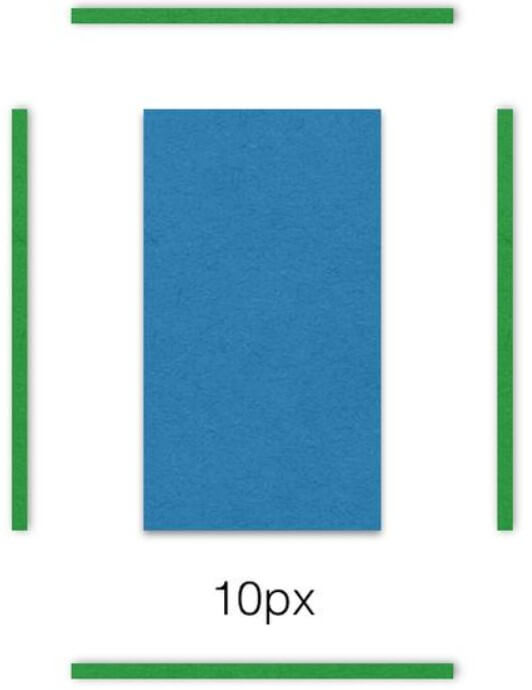
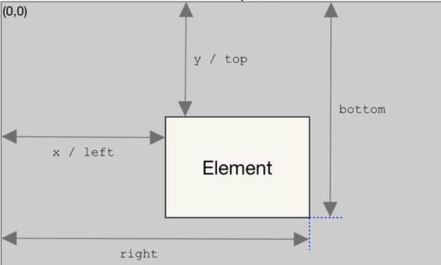

# 功能函数

## 1.bytes 转换为 KB、MB、GB……

```javascript
bytesToHuman(bytes) {
    const sizes = ['Bytes', 'KB', 'MB', 'GB', 'TB'];
    if (bytes === 0) return '0 Bytes';
    const i = parseInt(Math.floor(Math.log(bytes) / Math.log(1024)), 10);
    if (i === 0) return `${bytes} ${sizes[i]}`;
    return `${(bytes / (1024 ** i)).toFixed(1)} ${sizes[i]}`;
}
```

## 2.throttle节流函数、防抖函数

```javascript
# 节流函数(每调用一次后在规定的时间wait内不可再次调用)
throttle(callback,wait){
    let last = Date.now();
    return function(...args){
        if((Date.now() - last) > wait){
            callback.call(this,...args);
            last = Date.now();
        }
    }
}
# 防抖函数(在事件被触发n秒后再执行回调，如果在这n秒内又被触发，则重新计时)
function debounce(callback, delay){
    let timer = null;
    return function(...args){
        if(timer) clearTimeout(timer);
        timer = setTimeout(function(){
            callback.apply(this, args);
        },delay)
    }
}
```


## 3.滚动页面中用 IntersectionObserver 来计算元素是否可视性

> 使用该API时要注意兼容性。对于一些优化性质或者兼容性要求不高的项目可以尝试使用。

传统的实现方法是，监听到`scroll`事件后，调用目标元素的[`getBoundingClientRect()`](https://developer.mozilla.org/en/docs/Web/API/Element/getBoundingClientRect)方法，得到它对应于视口左上角的坐标，再判断是否在视口之内。这种方法的缺点是，由于`scroll`事件密集发生，计算量很大，容易造成[性能问题](http://www.ruanyifeng.com/blog/2015/09/web-page-performance-in-depth.html)。

**new一个IntersectionObserver实例**

1. 第一个参数是一个回调函数，回调函数被触发仅出现在 **'被监听的元素出现'** 或者 **'不出现在可视区域内'** 这两个时机
2. 第二个参数是配置对象.把页面中某个元素作为滚动的容器，用root属性配置，这时就会出现一种情况，滚动容器可能不在视窗内，但它内部元素依然可滚动，此时实例的回调依然会触发，所以回调会不会被执行并不在于肉眼是否可见，而在于被监控的元素和滚动容器的交叉部分是否发生变化,即交集区域的变化

```js
var observer = new IntersectionObserver(function(item){
    // 当被监控的元素可视性发生了变化。回调函数的 参数item 会返回该dom元素的数据
    // 这个参数是数组类型，数组的每个元素都是 IntersectionObserverEntry对象
    
},{
    root: document.getElementById('container'), // 指定目标元素所在的容器节点（即根元素）。容器元素必须是目标元素的祖先节点。因为很多时候，目标元素不仅会随着窗口滚动，还会在容器里面滚动（比如在iframe窗口里滚动）
    threshold:[0, 0.25, 0.5, 0.75, 1], // 使用threshold属性设置交集区域的比例，达到这个比例才触发回调。可以一次性定义多个交叉比例，滚动时在每个比例处都会触发。这些值表示当目标元素 0%、25%、50%、75%、100% 可见时，会触发回调函数
    rootMargin:'10px', // 属性还可以扩大或者缩小rootBounds的大小,虽然滚动容器的尺寸没变化，但rootBounds向四周扩展了10px，这个属性的主要作用是提前或者延迟回调的触发，它的用法和margin一致,如下图
})
observer.observe("被监听的一个或多个元素对象");
observer.takeRecords(); // 返回所有观察目标的IntersectionObserverEntry对象数组
observer.unobserve("被监控的某个特定元素对象"); // 移除特定被监控的元素
observer.disconnect(); // 关闭观察器，所有的元素都不会再被监控。
```



**IntersectionObserverEntry对象：**

| 参数                                                   | 说明                                                         |
| ------------------------------------------------------ | ------------------------------------------------------------ |
| `time`                                                 | 可见性发生变化时的**时间**，单位为毫秒                       |
| `target`                                               | 可见性发生变化的**dom元素**                                  |
| `intersectionRatio`                                    | 可见性发生变化时目标元素**可见区域面积 与 整个元素面积的比值**，即`intersectionRect`占`boundingClientRect`的比例，完全可见时为`1`，完全不可见时小于等于`0` |
| `isIntersecting`                                       | **是否出现在可视区**，也可以用它来判断是否可见               |
| `isVisible`                                            | 这个属性看字面意思是是否可见，但经测试一直无变化，暂且不知其用法 |
| `rootBounds`、`boundingClientRect`、`intersectionRect` | 这三个属性分别代表三种矩形区域的信息:<br />1. **rootBounds：**代表滚动元素容器的矩形区域。如果没有根元素（即直接相对于视口滚动），则返回`null`<br />2.**boundingClientRect：**代表被监控元素的矩形区域。<br />3.**intersectionRect：**代表被监控元素暴露在可视区内的矩形区域部分。<br />每个矩形区域提供8个属性，他们表示的意义和用`getBoundingClientRect`方法获取的数据意义相同。x、y代表坐标，坐标原点是滚动容器的左上角顶点，所有的数据都是元素可见性发生变化的那一瞬间的值### |

### 实例1：实现图片的懒加载

```js
function query(selector) {
  return Array.from(document.querySelectorAll(selector));
}

var observer = new IntersectionObserver(
  function(changes) {
    changes.forEach(function(change) {
      let container = change.target;
      let content = container.querySelector('template').content;
      container.appendChild(content);
      observer.unobserve(container);
    });
  }
);

query('.lazy-loaded').forEach(function (item) {
  observer.observe(item);
});
```

### 实例2：无限滚动（infinite scroll）

```js
var intersectionObserver = new IntersectionObserver(
  function (entries) {
    // 如果不可见，就返回
    if (entries[0].intersectionRatio <= 0) return;
    loadItems(10); // 加载新数据
    console.log('Loaded new items');
  });

// 开始观察
intersectionObserver.observe(
  document.querySelector('.scrollerFooter') // 监控滚动页脚的可视性
);
```

无限滚动时，最好在页面底部有一个页尾栏（又称[sentinels](http://www.ruanyifeng.com/blog/2016/11/sentinels)）。一旦页尾栏可见，就表示用户到达了页面底部，从而加载新的条目放在页尾栏前面。这样做的好处是，不需要再一次调用`observe()`方法，现有的`IntersectionObserver`可以保持使用