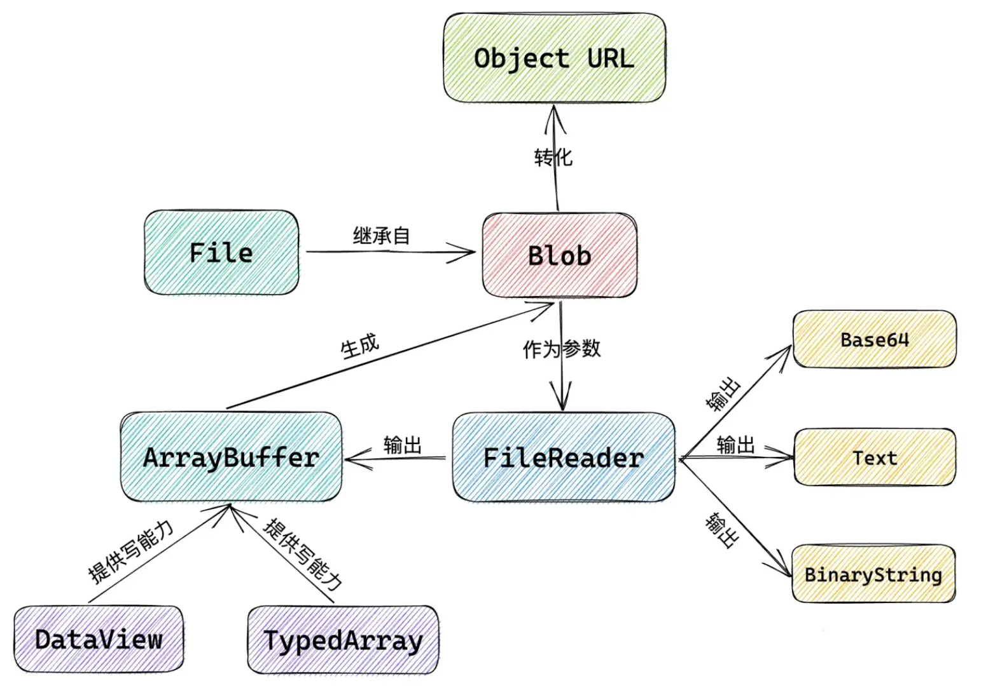

## 文件类型

> JS 提供了一些 API 来处理文件或原始文件数据，例如：`File`、`Blob`、`FileReader`、`Base64`、`ArrayBuffer`、`Canvas` 等。



## 类型说明

### Blob

> Blob 对象表示一个不可变、只读原始数据的类文件对象（二进制文件）。Blob 表示的不一定是 JavaScript 原生格式的数据。[`File`](https://juejin.cn/zh-CN/docs/Web/API/File) 接口基于 `Blob`，继承了 blob 的功能并将其扩展以支持用户系统上的文件。

#### 创建 `Blob`

```js
const blob = new Blob(array, options);
```

* array：是一个由`ArrayBuffer`, `ArrayBufferView`, `Blob`, `DOMString` 等对象构成的数组 ，或者其他类似对象的混合体。

* options：可选的 `BlobPropertyBag` 字典，它可能会指定如下两个属性：

  - `type`：默认值为 ""，表示将会被放入到 Blob 中的数组内容的 **MIME 类型**。

  - `endings`：默认值为"`transparent`"，用于指定包含行结束符`\n`的字符串如何被写入，不常用。

```js
// 创建一个blob
const blob = new Blob(["Hello World"], { type: "text/plain" })
console.log(blob.size) // 11
console.log(blob.type) // "text/plain"

// 使用示例：转化为 URL，并在 iframe 中加载
const iframe = document.getElementsById("iframe")
iframe.src = URL.createObjectURL(blob)
```

**常用的 MIME 类型如下：** [参考链接](https://developer.mozilla.org/zh-CN/docs/Web/HTTP/Basics_of_HTTP/MIME_types/Common_types)

| **MIME 类型**      | **说明**       |
| ------------------ | -------------- |
| `text/plain`       | 纯文本文档     |
| `text/html`        | HTML文档       |
| `text/javascript`  | JavaScript文件 |
| `text/css`         | CSS文件        |
| `application/json` | JSON文件       |
| `application/pdf`  | PDF文件        |
| `application/xml`  | XML文件        |
| `image/jpeg`       | JPEG图像       |
| `image/png`        | PNG图像        |
| `image/gif`        | GIF图像        |
| `image/svg+xml`    | SVG图像        |
| `audio`            | MP3文件        |
| `video`            | MP4文件        |

#### `Blob` 分片

```js
const blob = instanceOfBlob.slice([start [, end [, contentType]]])
```

- start

  可选，切片起点，默认值为 `0`

- end

  可选，切片结束位置，默认值为 `blob.size`

- contentType

  可选，设置新 blob 的 MIME 类型。如果省略 type，则默认为 blob 的原始值

```js
// 切片示例：页面上会显示：Hello Wo
const iframe = document.getElementsById("iframe")

const blob = new Blob(["Hello World"], { type: "text/plain" })
const subBlob = blob.slice(0, 8)
iframe.src = URL.createObjectURL(subBlob)
```

### File

> File 对象是特殊类型的 Blob，且可以用在任意的 Blob 类型的 context 中。比如说， `FileReader`, `URL.createObjectURL()`, `createImageBitmap()`(en-US), 及 `XMLHttpRequest.send()` 都能处理 Blob 和 File。

以下为 `FileReader` 的对象方法：

* `FileReader.abort()`

  中止读取操作。在返回时，`readyState`属性为DONE

* `FileReader.readAsArrayBuffer()`

  开始读取指定的 Blob中的内容。完成后，result 属性中保存的将是被读取文件的 `ArrayBuffer` 数据对象。

* `FileReader.readAsBinaryString()`

  开始读取指定的Blob中的内容。完成后，result属性中将包含所读取文件的`原始二进制`数据

* `FileReader.readAsDataURL()`

  开始读取指定的Blob中的内容。完成后，result属性中将包含一个data: URL 格式的 `Base64` 字符串以表示所读取文件的内容

* `FileReader.readAsText()`

  开始读取指定的Blob中的内容。一旦完成，result属性中将包含一个`字符串`以表示所读取的文件内容

### Base64

> Base64 是一组相似的二进制到文本（binary-to-text）的编码规则。一个常见应用是对二进制数据进行编码，以便将其纳入 `dataURL` 中。
>
> 格式：`data:文件MIME类型;base64,文件Base64编码`

在 JavaScript 中，有两个函数被分别用来处理解码和编码 Base64 字符串：

* `atob()`：解码通过 Base-64 编码的字符串数据（“atob”应读作“ASCII to binary”）

* `btoa()`：从二进制数据“字符串”创建一个 Base-64 编码的 ASCII 字符串（“btoa”应读作“binary to ASCII”）

```js
// 用 Base64 展示图片
const input = document.getElementById("input");
const img = document.getElementById("img");

input.onchange = (e) => {
  const reader = new FileReader();
  reader.readAsDataURL(e.target.files[0]); // 获取文件的Base64编码链接
  reader.onload = (e) => {
    img.src = e.target.result; 
  };
};
```

### Object URL

> Object URL（MDN 定义名称）又称 Blob URL（W3C 定义名称），是 HTML5 中的新标准。它是一个用来表示 File Object 或 Blob Object 的 URL。Blob URL(Object URL) 是一种伪协议，允许将 Blob 和 File 对象用作图像、二进制数据下载链接等的 URL 源。

```js
// 通过 Object URL 展示和下载图片
const input = document.getElementById("input");
const img = document.getElementById("img");

input.onchange = (e) => {
  const url = URL.createObjectURL(e.target.files[0]);
  img.src = url;

  // 实现下载
  const a = document.createElement("a");
  a.href = url;
  a.download = "img";
  document.body.appendChild(a);
  a.click();
  document.body.removeChild(a);
};
```

### ArrayBuffer

> ArrayBuffer 是一个只读对象，用来表示通用的、固定长度的原始二进制数据缓冲区。


## 类型转换

### 1. `Blob`、`File` → `Base64`

```js
function fileToDataURL(file) {
  let reader = new FileReader();
  reader.readAsDataURL(file); // 获取文件的base64链接
  reader.onload = function (e) {
    return reader.result;
  };
}
```

### 2. `Base64` → `Blob`、`File`

* Base64 转为 Blob

  ```js
  function dataURLToBlob(fileDataURL) {
    let arr = fileDataURL.split(","),
      mime = arr[0].match(/:(.*?);/)[1],
      bstr = atob(arr[1]),
      n = bstr.length,
      u8arr = new Uint8Array(n);
    while (n--) {
      u8arr[n] = bstr.charCodeAt(n);
    }
    return new Blob([u8arr], { type: mime });
  }
  ```

* Base64 转为 File

  ```js
  function dataURLToBlob(fileDataURL, filename) {
    let arr = fileDataURL.split(","),
      mime = arr[0].match(/:(.*?);/)[1],
      bstr = atob(arr[1]),
      n = bstr.length,
      u8arr = new Uint8Array(n);
    while (n--) {
      u8arr[n] = bstr.charCodeAt(n);
    }
    return new File([u8arr], filename, { type: mime });
  }
  ```

### 3. `Blob`、`File` → `Object URL`

```js
// object：用于创建 URL 的 File 对象、Blob 对象
const objectUrl = URL.createObjectURL(object)
```

### 4. `ArrayBuffer` → `Blob`

```js
const blob = new Blob([new Uint8Array(buffer, byteOffset, length)])
```

### 5. `ArrayBuffer` → `base64`

```js
const base64 = btoa(String.fromCharCode.apply(null, new Uint8Array(arrayBuffer)))
```

### 6. `Blob` → `ArrayBuffer`

```js
function blobToArrayBuffer (blob) { 
  const reader = new FileReader()
  reader.readAsArrayBuffer(blob)
  reader.onload = () =>{
    return reader.result;
  }
}
```

### 7. `Blob`、`File` 文件数据绘制到 `canvas`

```js
// Blob、File ——> dataURL(Base64) ——> canvas
function fileAndBlobToCanvas(fileDataURL) {
  let img = new Image()
  img.src = fileDataURL
  let canvas = document.createElement('canvas')
  if (!canvas.getContext) {
    alert('浏览器不支持canvas')
    return
  }
  let ctx = canvas.getContext('2d')
  document.getElementById('container').appendChild(canvas)
  img.onload = function () {
    ctx.drawImage(img, 0, 0, img.width, img.height)
  }
}
```

### 8. 从 `canvas` 中获取文件 `Base64`

```js
function canvasToDataURL() {
  let canvas = document.createElement('canvas')
  let canvasDataURL = canvas.toDataURL('image/png', 1.0)
  return canvasDataURL
}
```

