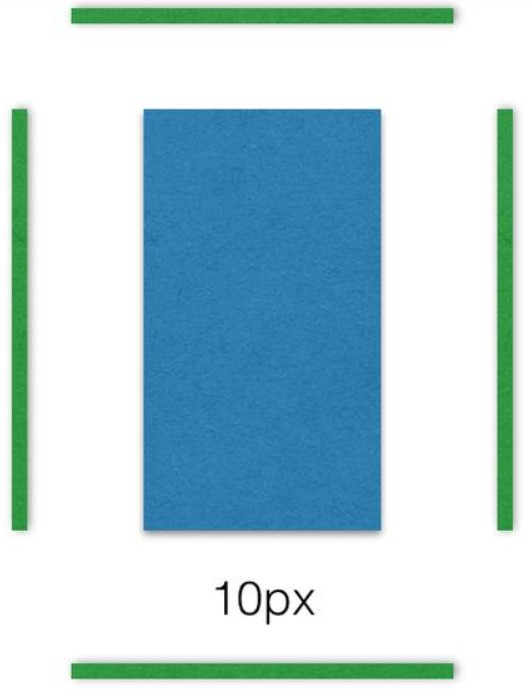
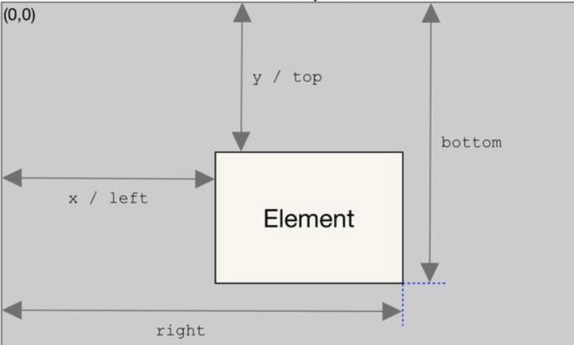

## 1. 日期时间格式化

```js
const formatTime = date => {
    const year = date.getFullYear()
    const month = date.getMonth() + 1
    const day = date.getDate()
    const hour = date.getHours()
    const minute = date.getMinutes()
    const second = date.getSeconds()

    return [year, month, day].map(formatNumber).join('/') + ' ' + [hour, minute, second].map(formatNumber).join(':')
}

const formatNumber = n => {
    n = n.toString()
    return n[1] ? n : '0' + n
}

module.exports = {
    formatTime: formatTime
}
```

## 2.bytes 转换为 KB、MB、GB……

```javascript
bytesToHuman(bytes) {
    const sizes = ['Bytes', 'KB', 'MB', 'GB', 'TB'];
    if (bytes === 0) return '0 Bytes';
    const i = parseInt(Math.floor(Math.log(bytes) / Math.log(1024)), 10);
    if (i === 0) return `${bytes} ${sizes[i]}`;
    return `${(bytes / (1024 ** i)).toFixed(1)} ${sizes[i]}`;
}
```

## 3.throttle节流函数、防抖函数

```javascript
// 节流函数(每调用一次后在规定的时间wait内不可再次调用)
function throttle(callback,wait){
    let last = Date.now();
    return function(...args){
        if((Date.now() - last) >= wait){
            callback.apply(this, args);
            last = Date.now();
        }
    }
}
// 防抖函数(在事件被触发n秒后再执行回调，如果在这n秒内又被触发，则重新计时)
// 比如鼠标滚动或键盘事件时
function debounce(callback, delay)
    let timer = null;
    return function(...args){
        if(timer) clearTimeout(timer);
        timer = setTimeout(function(){
            callback.apply(this, args);
        },delay)
    }
}
```


## 4.滚动页面中用 IntersectionObserver 来计算元素是否可视性

> 使用该API时要注意兼容性。对于一些优化性质或者兼容性要求不高的项目可以尝试使用。

传统的实现方法是，监听到`scroll`事件后，调用目标元素的[`getBoundingClientRect()`](https://developer.mozilla.org/en/docs/Web/API/Element/getBoundingClientRect)方法，得到它对应于视口左上角的坐标，再判断是否在视口之内。这种方法的缺点是，由于`scroll`事件密集发生，计算量很大，容易造成[性能问题](http://www.ruanyifeng.com/blog/2015/09/web-page-performance-in-depth.html)。

**new一个IntersectionObserver实例**

1. 第一个参数是一个回调函数，回调函数被触发仅出现在 **'被监听的元素出现'** 或者 **'不出现在可视区域内'** 这两个时机
2. 第二个参数是配置对象.把页面中某个元素作为滚动的容器，用root属性配置，这时就会出现一种情况，滚动容器可能不在视窗内，但它内部元素依然可滚动，此时实例的回调依然会触发，所以回调会不会被执行并不在于肉眼是否可见，而在于被监控的元素和滚动容器的交叉部分是否发生变化,即交集区域的变化

```js
var observer = new IntersectionObserver(function(item){
    // 当被监控的元素可视性发生了变化。回调函数的 参数item 会返回该dom元素的数据
    // 这个参数是数组类型，数组的每个元素都是 IntersectionObserverEntry对象
    
},{
    root: document.getElementById('container'), // 指定目标元素所在的容器节点（即根元素）。容器元素必须是目标元素的祖先节点。因为很多时候，目标元素不仅会随着窗口滚动，还会在容器里面滚动（比如在iframe窗口里滚动）
    threshold:[0, 0.25, 0.5, 0.75, 1], // 使用threshold属性设置交集区域的比例，达到这个比例才触发回调。可以一次性定义多个交叉比例，滚动时在每个比例处都会触发。这些值表示当目标元素 0%、25%、50%、75%、100% 可见时，会触发回调函数
    rootMargin:'10px', // 属性还可以扩大或者缩小rootBounds的大小,虽然滚动容器的尺寸没变化，但rootBounds向四周扩展了10px，这个属性的主要作用是提前或者延迟回调的触发，它的用法和margin一致,如下图
})
observer.observe("被监听的一个或多个元素对象");
observer.takeRecords(); // 返回所有观察目标的IntersectionObserverEntry对象数组
observer.unobserve("被监控的某个特定元素对象"); // 移除特定被监控的元素
observer.disconnect(); // 关闭观察器，所有的元素都不会再被监控。
```



**IntersectionObserverEntry对象：**

| 参数                                                   | 说明                                                         |
| ------------------------------------------------------ | ------------------------------------------------------------ |
| `time`                                                 | 可见性发生变化时的**时间**，单位为毫秒                       |
| `target`                                               | 可见性发生变化的**dom元素**                                  |
| `intersectionRatio`                                    | 可见性发生变化时目标元素**可见区域面积 与 整个元素面积的比值**，即`intersectionRect`占`boundingClientRect`的比例，完全可见时为`1`，完全不可见时小于等于`0` |
| `isIntersecting`                                       | **是否出现在可视区**，也可以用它来判断是否可见               |
| `isVisible`                                            | 这个属性看字面意思是是否可见，但经测试一直无变化，暂且不知其用法 |
| `rootBounds`、`boundingClientRect`、`intersectionRect` | 这三个属性分别代表三种矩形区域的信息:<br />1. **rootBounds：**代表滚动元素容器的矩形区域。如果没有根元素（即直接相对于视口滚动），则返回`null`<br />2.**boundingClientRect：**代表被监控元素的矩形区域。<br />3.**intersectionRect：**代表被监控元素暴露在可视区内的矩形区域部分。<br />每个矩形区域提供8个属性，他们表示的意义和用`getBoundingClientRect`方法获取的数据意义相同。x、y代表坐标，坐标原点是滚动容器的左上角顶点，所有的数据都是元素可见性发生变化的那一瞬间的值### |

### 实例1：实现图片的懒加载

```js
function query(selector) {
  return Array.from(document.querySelectorAll(selector));
}

var observer = new IntersectionObserver(
  function(changes) {
    changes.forEach(function(change) {
      let container = change.target;
      let content = container.querySelector('template').content;
      container.appendChild(content);
      observer.unobserve(container);
    });
  }
);

query('.lazy-loaded').forEach(function (item) {
  observer.observe(item);
});
```

### 实例2：无限滚动（infinite scroll）

```js
var intersectionObserver = new IntersectionObserver(
  function (entries) {
    // 如果不可见，就返回
    if (entries[0].intersectionRatio <= 0) return;
    loadItems(10); // 加载新数据
    console.log('Loaded new items');
  });

// 开始观察
intersectionObserver.observe(
  document.querySelector('.scrollerFooter') // 监控滚动页脚的可视性
);
```

无限滚动时，最好在页面底部有一个页尾栏（又称[sentinels](http://www.ruanyifeng.com/blog/2016/11/sentinels)）。一旦页尾栏可见，就表示用户到达了页面底部，从而加载新的条目放在页尾栏前面。这样做的好处是，不需要再一次调用`observe()`方法，现有的`IntersectionObserver`可以保持使用

## 5.字符串与buffer之间相互转换

```js
// buffer转为字符串
function ab2str(buf) {
    return String.fromCharCode.apply(null, new Uint16Array(buf));
}

// 字符串转为buffer
function str2ab(str) {
    var buf = new ArrayBuffer(str.length * 2); // 2 bytes for each char
    var bufView = new Uint16Array(buf);
    for (var i = 0, strLen = str.length; i < strLen; i++) {
        bufView[i] = str.charCodeAt(i);
    }
    return buf;
}
```

## 6.点击下载

```js
function downlink(fileName,fileUrl){
    const tempLink = document.createElement('a');
    tempLink.style.display = 'none';
    tempLink.setAttribute('download', fileName);
    tempLink.href = fileUrl;
    document.body.appendChild(tempLink);
    tempLink.click();
    document.body.removeChild(tempLink);
  	// 或者 从服务器返回的信息中获取文件
    let fileNames = res.headers["content-disposition"]; //获取到Content-Disposition;filename
    let regFileNames = decodeURIComponent(fileNames.match(/=(.*)$/)[1]); //文件名称  截取=后面的文件名称
    const link = document.createElement("a");
    let blob = new Blob([res.data], { type: "application/vnd.ms-excel" }); //类型设置为application/vnd.ms-excel
    link.style.display = "none";
    link.href = URL.createObjectURL(blob); //创建一个指向该参数对象的URL
    link.setAttribute(
      "download",
      `${regFileNames}`
    );
    document.body.appendChild(link);
    link.click(); //触发下载
    document.body.removeChild(link);
}
```

```js
fetch(file.fileUrl).then((res) => {
        res.blob().then((blob) => {
            const blobUrl = window.URL.createObjectURL(blob);
            const filename = file.fileName;
            const a = document.createElement('a');
            a.href = blobUrl;
            a.download = filename;;
            a.click();
            window.URL.revokeObjectURL(blobUrl);
        });
    });
```


## 7. 判断用户使用设备

```js
getUserPlatform: function () {
    const os = function () {
        var ua = navigator.userAgent,
            isWindowsPhone = /(?:Windows Phone)/.test(ua),
            isSymbian = /(?:SymbianOS)/.test(ua) || isWindowsPhone,
            isAndroid = /(?:Android)/.test(ua),
            isFireFox = /(?:Firefox)/.test(ua),
            isTablet = /(?:iPad|PlayBook)/.test(ua) || (isAndroid && !/(?:Mobile)/.test(ua)) || (isFireFox && /(?:Tablet)/.test(ua)),
            isPhone = /(?:iPhone)/.test(ua) && !isTablet,
            isWeixin = /(?:MicroMessenger)/.test(ua),
            isDingTalk = /(?:DingTalk)/.test(ua),
            isPc = !isPhone && !isAndroid && !isSymbian;
        return {
            isPhone: isPhone,
            isAndroid: isAndroid,
            isWeixin: isWeixin,
            isDingTalk: isDingTalk,
            isPc: isPc,
        };
    }();
    if (os.isPc) {
        return 'pc'
    } else {
        return 'h5'
    }
}
```

## 8. 千分位算法

```js
function format(v /* 数字 */) {
	const reg = /\d{1,3}(?=(\d{3})+$)/g
    return `${v}`.replace(reg, '$&,') // $& 表示原始值
}
```

## 9. 查找数组中的最大值

```js
[3, 5, 4, 3, 6, 2, 3, 4].reduce((a, i) => Math.max(a, i), -Infinity);
Math.max(...[3, 5, 4, 3, 6, 2, 3, 4]);
```

## 10. 删除数组中的重复项

```js
let dupes = [1,2,3,'a','a','f',3,4,2,'d','d']
let withOutDupes = dupes.reduce((noDupes, curVal) => {
  if (noDupes.indexOf(curVal) === -1) { noDupes.push(curVal) }
  return noDupes
}, [])
// 或者使用 set 
```

## 11. 验证括号

```js
[..."(())()(()())"].reduce((a,i)=> i==='('?a+1:a-1,0); // 状态为0，则括号是对称是对称的
```

## 12. 按属性分组

```js
let obj = [
  {name: 'Alice', job: 'Data Analyst', country: 'AU'},
  {name: 'Bob', job: 'Pilot', country: 'US'},
  {name: 'Lewis', job: 'Pilot', country: 'US'},
  {name: 'Karen', job: 'Software Eng', country: 'CA'},
  {name: 'Jona', job: 'Painter', country: 'CA'},
  {name: 'Jeremy', job: 'Artist', country: 'SP'},
]
let ppl = obj.reduce((group, curP) => {
  let newkey = curP['country']
  if(!group[newkey]){
    group[newkey]=[]
  }
  group[newkey].push(curP)
  return group
}, [])
```

## 13.二进制转十进制

```js
const bin2dec = str=>[...String(str)].reduce((acc,cur)=>+cur+acc*2,0)
// (10111)->1+(1+(1+(0+(1+0*2)*2)*2)*2)*2
```

## 14.获取浏览器Cookie的值

```js
const cookie = name => `; ${document.cookie}`.split(`; ${name}=`).pop().split(';').shift();
cookie('_ga');
// Result: "GA1.2.1929736587.1601974046"
```

## 15.清除所有Cookie

```js
const clearCookies = document.cookie.split(';').forEach(cookie => document.cookie = cookie.replace(/^ +/, '').replace(/=.*/, `=;expires=${new Date(0).toUTCString()};path=/`));
```

## 16.将RGB转换为十六进制

```js
const rgbToHex = (r, g, b) => "#" + ((1 << 24) + (r << 16) + (g << 8) + b).toString(16).slice(1);

rgbToHex(0, 51, 255); 
// Result: #0033ff
```

## 17.生成随机十六进制

使用`Math.random`和`padEnd`属性生成随机的十六进制颜色。

```js
const randomHex = () => `#${Math.floor(Math.random() * 0xffffff).toString(16).padEnd(6, "0")}`;

console.log(randomHex());
// Result: #92b008
```

## 17.复制到剪贴板

使用`navigator.clipboard.writeText`可以轻松将文本复制到剪贴板。

```js
const copyToClipboard = (text) => navigator.clipboard.writeText(text);

copyToClipboard("Hello World");
```

## 18. 检查日期是否有效

```js
const isDateValid = (...val) => !Number.isNaN(new Date(...val).valueOf());

isDateValid("December 17, 1995 03:24:00");
// Result: true
```

## 19. 查找一年中的某一天

```js
const dayOfYear = (date) => Math.floor((date - new Date(date.getFullYear(), 0, 0)) / 1000 / 60 / 60 / 24);

dayOfYear(new Date());
// Result: 272
```

## 20. 查找两个日期之间的天数

```js
const dayDif = (date1, date2) => Math.ceil(Math.abs(date1.getTime() - date2.getTime()) / 86400000)

dayDif(new Date("2020-10-21"), new Date("2021-10-22"))
// Result: 366
```

## 21.从URL获取查询参数

通过传递`window.location`或原始URL`goole.com?search=easy&page=3`从url轻松检索查询参数。

```js
const getParameters = (URL) => {
  URL = JSON.parse('{"' + decodeURI(URL.split("?")[1]).replace(/"/g, '\\"').replace(/&/g, '","').replace(/=/g, '":"') +'"}');
  return JSON.stringify(URL);
};
```

## 22.给日期输出时间

从给定日期以`hour::minutes::seconds`的格式输出时间。

```js
const timeFromDate = date => date.toTimeString().slice(0, 8);

console.log(timeFromDate(new Date(2021, 0, 10, 17, 30, 0))); 
// Result: "17:30:00"
```

## 23.获取用户选定的文本

```js
const getSelectedText = () => window.getSelection().toString();
getSelectedText();
```

## 24.打乱数组

```js
const shuffleArray = (arr) => arr.sort(() => 0.5 - Math.random());

console.log(shuffleArray([1, 2, 3, 4]));
// Result: [ 1, 4, 3, 2 ]
```

## 25.检查用户的设备是否处于暗模式

```js
const isDarkMode = window.matchMedia && window.matchMedia('(prefers-color-scheme: dark)').matches

console.log(isDarkMode) // Result: True or False
```

## 26. 获取当前元素的所有兄弟节点(不包括自己)

```js
// 先获取此元素的父节点的所有子节点，因为所有子节点也包括此元素自己，所以要从结果中去掉自己
function siblings(elm) {
  var a = [];
  var p = elm.parentNode.children;
  for(var i =0,pl= p.length;i<pl;i++) {
    if(p[i] !== elm) a.push(p[i]);
  }
  return a;
}

# jQuery里面获取兄弟节点的源码
// 先找到此元素的父节点的第一个子节点，然后循环查找此节点的下一个兄弟节点，一直到查找完毕
function sibling( elem ) {
  var r = [];
  var n = elem.parentNode.firstChild;
  for ( ; n; n = n.nextSibling ) {
    if ( n.nodeType === 1 && n !== elem ) {
      r.push( n );
    }
  }
  return r;
}
```

## 27. JS事件监听(addEventListener)和卸载(removeEventListener)

```js
export const on = (function() {
    if (document.addEventListener) {
        return function(element, event, handler, useCapture = false) {
            if (element && event && handler) {
                element.addEventListener(event, handler, useCapture);
            }
        };
    } else {
        return function(element, event, handler) {
            if (element && event && handler) {
                element.attachEvent('on' + event, handler);
            }
        };
    }
})();

export const off = (function() {
    if (document.removeEventListener) {
        return function(element, event, handler, useCapture = false) {
            if (element && event) {
                element.removeEventListener(event, handler, useCapture);
            }
        };
    } else {
        return function(element, event, handler) {
            if (element && event) {
                element.detachEvent('on' + event, handler);
            }
        };
    }
})();
```

## 28. Anchor 锚点滚动

### 一、使用scrollIntoView

> 优点：简短方便、原生函数、有滚动动画
>
> 缺点：会造成整个页面随滚动元素下移

```javascript
// el 为滚动元素id
document.getElementById(el).scrollIntoView({ block: "start", inline: "nearest", behavior: "smooth" });
```

### 二、使用scrollTop

> 优点：不会造成整个页面随滚动元素下移
>
> 缺点：没有滚动动画（但可以使用cos函数弥补这点）

```javascript
// el 为滚动元素id
document.getElementById(el).parentNode.scrollTop = document.getElementById(el).offsetTop;
```

#### 使用cos函数添加动画

> 注意：函数默认使用 ***document.scrollingElement*** 指定整个html页面为滚动的父容器，可替换此为指定的自定义父容器

```js
# scrollToY函数（必需）
/*
 * y: the y coordinate to scroll, 0 = top
 * duration: scroll duration in milliseconds; default is 0 (no transition)
 * element: the html element that should be scrolled ; default is the main scrolling element
 */
function scrollToY (y, duration = 0, element = document.scrollingElement) {
  // cancel if already on target position
  if (element.scrollTop === y) return;

  const cosParameter = (element.scrollTop - y) / 2;
  let scrollCount = 0, oldTimestamp = null;

  function step (newTimestamp) {
    if (oldTimestamp !== null) {
      // if duration is 0 scrollCount will be Infinity
      scrollCount += Math.PI * (newTimestamp - oldTimestamp) / duration;
      if (scrollCount >= Math.PI) return element.scrollTop = y;
      element.scrollTop = cosParameter + y + cosParameter * Math.cos(scrollCount);
    }
    oldTimestamp = newTimestamp;
    window.requestAnimationFrame(step);
  }
  window.requestAnimationFrame(step);
}
```

**1. 滚动到页面顶部**

```js
/*
 * duration: scroll duration in milliseconds; default is 0 (no transition)
 * this function is using the scrollToY function
 */
function scrollToTop(duration = 0) {
  scrollToY(0, duration, document.scrollingElement);
}
```

**2. 滚动到指定id的元素**

```js
/*
 * id: the id of the element as a string that should be scrolled to
 * duration: scroll duration in milliseconds; default is 0 (no transition)
 * this function is using the scrollToY function on the main scrolling element
 */
function scrollToId(id, duration = 0) {
  const offset = Math.round(document.getElementById(id).getBoundingClientRect().top);
	scrollToY(document.scrollingElement.scrollTop + offset, duration);
}
```

**3. 滚动到指定的节点**

```js
/*
 * element: the node object that should be scrolled to
 * duration: scroll duration in milliseconds; default is 0 (no transition)
 * this function is using the scrollToY function on the main scrolling element
 */
function scrollToElement(element, duration = 0) {
	const offset = Math.round(element.getBoundingClientRect().top);
	scrollToY(document.scrollingElement.scrollTop + offset, duration);
}
```

## 29. 获取兄弟节点

```js
siblings(elm) {
  var a = [];
  var p = elm.parentNode.children;
  for (var i = 0, pl = p.length; i < pl; i++) {
    if (p[i] !== elm) p[i].classList.add("hidden");
  }
},
```

## 30.浏览器允许`copy`

```js
// allow_copy.js
(function agent() {
    let unlock = false
    document.addEventListener('allow_copy', (event) => {
      unlock = event.detail.unlock
    })

    const copyEvents = [
      'copy',
      'cut',
      'contextmenu',
      'selectstart',
      'mousedown',
      'mouseup',
      'mousemove',
      'keydown',
      'keypress',
      'keyup',
    ]
    const rejectOtherHandlers = (e) => {
      if (unlock) {
        e.stopPropagation()
        if (e.stopImmediatePropagation) e.stopImmediatePropagation()
      }
    }
    copyEvents.forEach((evt) => {
      document.documentElement.addEventListener(evt, rejectOtherHandlers, {
        capture: true,
      })
    })
  })()
```

