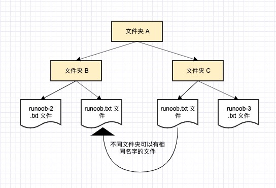
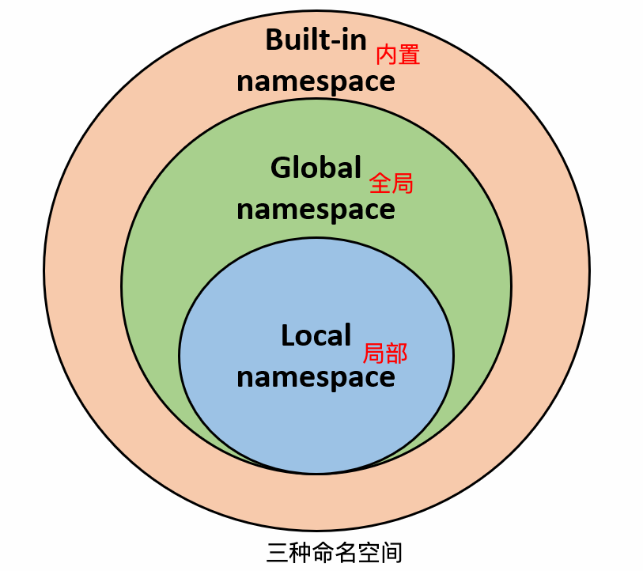

## 命名空间
> **命名空间(Namespace)是从名称到对象的映射，大部分的命名空间都是通过 Python 字典来实现的。**
>
> 命名空间提供了在项目中避免名字冲突的一种方法。各个命名空间是独立的，没有任何关系的，所以一个命名空间中不能有重名，但不同的命名空间是可以重名而没有任何影响。

我们举一个计算机系统中的例子，一个文件夹(目录)中可以包含多个文件夹，每个文件夹中不能有相同的文件名，但不同文件夹中的文件可以重名。



### 三种命名空间

- **内置名称（built-in names**）， Python 语言内置的名称，比如函数名 abs、char 和异常名称 BaseException、Exception 等等。
- **全局名称（global names）**，模块中定义的名称，记录了模块的变量，包括函数、类、其它导入的模块、模块级的变量和常量。
- **局部名称（local names）**，函数中定义的名称，记录了函数的变量，包括函数的参数和局部定义的变量。（类中定义的也是）



#### 命名空间查找顺序:

假设我们要使用变量 runoob，则 Python 的查找顺序为：**局部的命名空间去 -> 全局命名空间 -> 内置命名空间**。

如果找不到变量 runoob，它将放弃查找并引发一个 NameError 异常:

```
NameError: name 'runoob' is not defined。
```

#### 命名空间的生命周期：

> 命名空间的生命周期取决于对象的作用域，如果对象执行完成，则该命名空间的生命周期就结束。

因此，我们无法从外部命名空间访问内部命名空间的对象。

```python
# var1 是全局名称
var1 = 5
def some_func():
 
    # var2 是局部名称
    var2 = 6
    def some_inner_func():
 
        # var3 是内嵌的局部名称
        var3 = 7
```

## 作用域

> 作用域就是一个 Python 程序可以直接访问命名空间的正文区域。
>
> 在一个 python 程序中，直接访问一个变量，会从内到外依次访问所有的作用域直到找到，否则会报未定义的错误。
>
> Python 中，程序的变量并不是在哪个位置都可以访问的，访问权限决定于这个变量是在哪里赋值的。

### 四种作用域

> 变量的作用域决定了在哪一部分程序可以访问哪个特定的变量名称。

- **L（Local）**：最内层，包含局部变量，比如一个函数/方法内部。
- **E（Enclosing）**：包含了非局部(non-local)也非全局(non-global)的变量。比如两个嵌套函数，一个函数（或类） A 里面又包含了一个函数 B ，那么对于 B 中的名称来说 A 中的作用域就为 nonlocal。
- **G（Global）**：当前脚本的最外层，比如当前模块的全局变量。
- **B（Built-in）**： 包含了内建的变量/关键字等，最后被搜索。

#### 查找顺序

规则顺序： **L –> E –> G –> B**。

在局部找不到，便会去局部外的局部找（例如闭包），再找不到就会去全局找，再者去内置中找。


```python
g_count = 0  # 全局作用域
def outer():
    o_count = 1  # 闭包函数外的函数中
    def inner():
        i_count = 2  # 局部作用域
```

内置作用域是通过一个名为 builtin 的标准模块来实现的，但是这个变量名自身并没有放入内置作用域内，所以必须导入这个文件才能够使用它。在Python3.0中，可以使用以下的代码来查看到底预定义了哪些变量:

```python
>>> import builtins
>>> dir(builtins)
```

#### 如何才能引入新的作用域

Python 中只有**模块（module），类（class）以及函数（def、lambda）**才会引入新的作用域，其它的代码块（如 **if/elif/else/、try/except、for/while**等）是不会引入新的作用域的，也就是说这些语句内定义的变量，外部也可以访问，如下代码：

```python
>>> if True:
...  msg = 'I am from Runoob'
... 
>>> msg
'I am from Runoob'
>>> 
```

## 全局变量和局部变量

> 定义在函数内部的变量拥有一个局部作用域，定义在函数外的拥有全局作用域。
>
> 局部变量只能在其被声明的函数内部访问，而全局变量可以在整个程序范围内访问。调用函数时，所有在函数内声明的变量名称都将被加入到作用域中。

```python
total = 0 # 这是一个全局变量
# 可写函数说明
def sum( arg1, arg2 ):
    #返回2个参数的和."
    total = arg1 + arg2 # total在这里是局部变量.
    print ("函数内是局部变量 : ", total)
    return total
 
#调用sum函数
sum( 10, 20 )
print ("函数外是全局变量 : ", total)
```

以上实例输出结果：

```
函数内是局部变量 :  30
函数外是全局变量 :  0
```

### global 和 nonlocal关键字

> 当内部作用域想修改外部作用域的变量时，就要用到 global 和 nonlocal 关键字了

修改全局变量 num：

```python
num = 1
def fun1():
    global num  # 需要使用 global 关键字声明
    print(num) 
    num = 123
    print(num)
fun1()
print(num)
```

以上实例输出结果：

```
1
123
123
```

> 如果要修改嵌套作用域（enclosing 作用域，外层非全局作用域）中的变量则需要 nonlocal 关键字了

```python
def outer():
    num = 10
    def inner():
        nonlocal num   # nonlocal关键字声明
        num = 100
        print(num)
    inner()
    print(num)
outer()
```

以上实例输出结果：

```
100
100
```