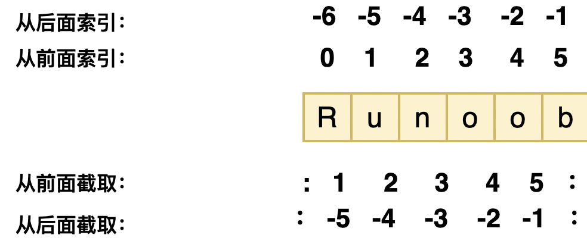
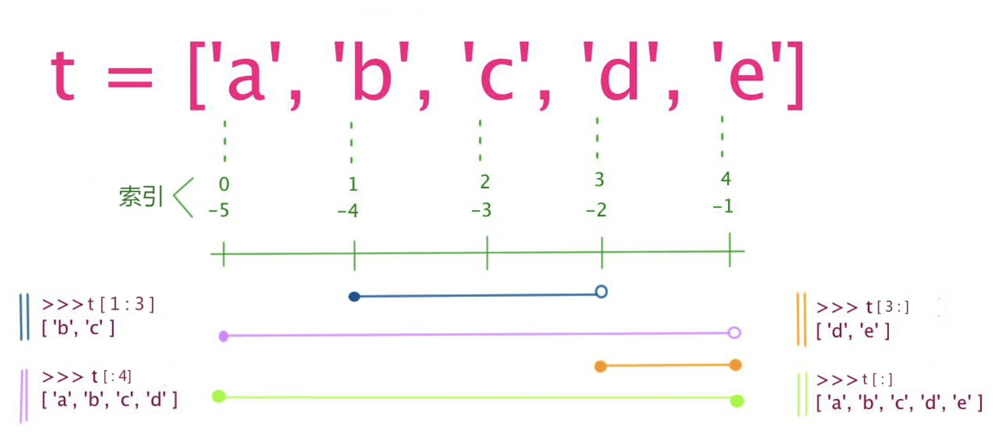
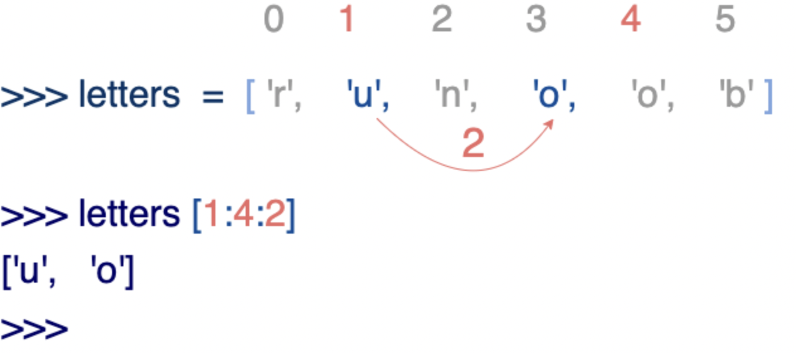

## 一、变量

> 在 Python 中，变量就是变量，它没有类型，我们所说的"类型"是**变量所指的内存中对象的类型**

### 变量在使用前必须赋值，变量赋值以后该变量才会被创建

```python
counter = 100          # 整型变量
miles   = 1000.0       # 浮点型变量
name    = "runoob"     # 字符串
```

### 多个变量赋值

```python
a = b = c = 1 # 三个变量被赋予相同的数值
a, b, c = 1, 2, "runoob" # 两个整型对象 1 和 2 的分配给变量 a 和 b，字符串对象 "runoob" 分配给变量 c
```

### 变量和对象之间的关系

- 赋值操作，本质是创建引用
- 变量是变量，对象是对象，当将某个对象赋值给某个变量时，可以认为是创建了变量对该对象的引用
- 变量没有数据类型之说，只有对象有，即变量不是直接代表对象或对象占用的内存空间
- Python中，变量无需提前声明，无需指定其数据类型，其表现完全是动态的，其所为的数据类型决定于当前该变量所引用的对象的数据类型
- 所谓变量对对象的引用，本质是创建了变量指向对象内存空间的指针
- 对象内存空间，一般最起码有**类型**和当前**被引用次数**这两个信息，类型记录了该对象的数据类型，被引用次数记录了该对象内存空间被变量引用的次数
- 当某对象的被引用次数为0时，Python便会自动回收该对象内存空间

比如下面的

```python
a=10
a='122'
a=[1,2,3]
del a
```

此时，a在不同的赋值代码行中，引用的对象类型不同，相当于在不断改变a引用的对象，最后当把a变量删除时，其实本质只是删除了a变量名，但由于a引用的[1,2,3]对象，因为a被删除，其被引用次数变为0，也就自动被Python回收，最终表现就是del a时，[1,2,3]也被删除了。

另外一个小知识是，Python为提升代码执行和内存分配效率，会对一些常用的对象提前创建好，并常驻内存，比如下面：

```python
id(4) #不管运行多少次该代码，其返回的值均不变，因为python会保持一些常用的数字常驻内存，不会每次都重新分配内存空间
id('hello world') #每次运行，返回的值均会发生变化，因为每次运行，相当于都在重新分配内存空间
```

## 二、标准数据类型

> Python3 中有六个标准的数据类型：
>
> 1. **不可变数据（3 个）：**Number（数字）、String（字符串）、Tuple（元组）
> 2. **可变数据（3 个）：**List（列表）、Dictionary（字典）、Set（集合）

### 1. Number（数字）(**不可变数据**)

>  Python3 支持 **int、float、bool、complex（复数）**,布尔(bool)是整型(int)的子类型
>
> **complex** 可以用`a + bj` 或 `complex(a,b)`表示， 复数的实部a和虚部b都是浮点型

```python
>>> 5 + 4  # 加法
9
>>> 4.3 - 2 # 减法
2.3
>>> 3 * 7  # 乘法
21
>>> 2 / 4  # 除法，得到一个浮点数
0.5
>>> 2 // 4 # 除法，得到一个整数
0
>>> 17 % 3 # 取余
2
>>> 2 ** 5 # 乘方
32
```

**注意：** 在混合计算时，Python会把整型转换成为浮点数

| int    | float      | complex    |
| :----- | :--------- | :--------- |
| 10     | 0.0        | 3.14j      |
| 100    | 15.20      | 45.j       |
| -786   | -21.9      | 9.322e-36j |
| 080    | 32.3e+18   | .876j      |
| -0490  | -90.       | -.6545+0J  |
| -0x260 | -32.54e100 | 3e+26J     |
| 0x69   | 70.2E-12   | 4.53e-7j   |

#### type() 、isinstance() 查询变量所指的对象类型

> 用来查询变量所指的对象类型

```python
a, b, c, d = 20, 5.5, True, 4+3j
print(type(a), type(b), type(c), type(d))
'''输出值：<class 'int'> <class 'float'> <class 'bool'> <class 'complex'> '''
```

```python
# 比较变量a所指的对象类型是否为int类型
isinstance(a, int)
'''输出值：True '''
```

**区别：**

- **type()** 不会认为子类是一种父类类型
- **isinstance()** 会认为子类是一种父类类型

```python
>>> class A:
...     pass
... 
>>> class B(A):
...     pass
... 
>>> isinstance(A(), A)
True
>>> type(A()) == A 
True
>>> isinstance(B(), A)
True
>>> type(B()) == A
False
```

#### issubclass()函数、is函数

**注意：** *Python3 中，**bool 是 int 的子类**，**True 和 False 可以和数字相加**，* **True==1、False==0** *会返回* **True***，但可以通过* **is** *来判断类型*

```python
>>> issubclass(bool, int) 
True
>>> True==1
True
>>> False==0
True
>>> True+1
2
>>> False+1
1
>>> 1 is True
False
>>> 0 is False
False
```

#### del 语句删除被创建对象的引用

```python
# 删除单个或多个对象
del var
del var_a, var_b
```

#### bool

> Python 中布尔值使用常量 **True** 和 **False** 来表示。

1、在数值上下文环境中，**True** 被当作 **1**，**False** 被当作 **0**，例如：

```python
>>> True+3
4
>>> False+2
2
```

2、其他类型值转换 **bool** 值时除了 **''、""、''''''、""""""、0、()、[]、{}、None、0.0、0L、0.0+0.0j、False** 为 **False** 外，其他都为 **True** 例如：

```python
>>> bool(-2)
True
>>> bool('')
False
```

#### complex复数

```Python
#coding=utf8  
''''' 
复数是由一个实数和一个虚数组合构成，表示为：x+yj 
一个负数时一对有序浮点数(x,y)，其中x是实数部分，y是虚数部分。 
Python语言中有关负数的概念： 
1、虚数不能单独存在，它们总是和一个值为0.0的实数部分一起构成一个复数 
2、复数由实数部分和虚数部分构成 
3、表示虚数的语法：real+imagej 
4、实数部分和虚数部分都是浮点数 
5、虚数部分必须有后缀j或J 
 
复数的内建属性： 
复数对象拥有数据属性，分别为该复数的实部和虚部。 
复数还拥有conjugate方法，调用它可以返回该复数的共轭复数对象。 
复数属性：real(复数的实部)、imag(复数的虚部)、conjugate()（返回复数的共轭复数） 
'''  
class Complex(object):  
    '''''创建一个静态属性用来记录类版本号'''  
    version=1.0  
    '''''创建个复数类，用于操作和初始化复数'''  
    def __init__(self,rel=15,img=15j):  
        self.realPart=rel  
        self.imagPart=img  
         
    #创建复数  
    def creatComplex(self):  
        return self.realPart+self.imagPart  
    #获取输入数字部分的虚部  
    def getImg(self):  
        #把虚部转换成字符串  
        img=str(self.imagPart)  
        #对字符串进行切片操作获取数字部分  
        img=img[:-1]   
        return float(img)    
                         
def test():  
    print "run test..........."  
    com=Complex()  
    Cplex= com.creatComplex()  
    if Cplex.imag==com.getImg():  
        print com.getImg()  
    else:  
        pass  
    if Cplex.real==com.realPart:  
        print com.realPart  
    else:  
        pass  
    #原复数  
    print "the religion complex is :",Cplex  
    #求取共轭复数  
    print "the conjugate complex is :",Cplex.conjugate()  
      
if __name__=="__main__":  
    test()
```

#### 数学函数

部分函数需要`import math`

| 函数                                                         | 返回值 ( 描述 )                                              |
| :----------------------------------------------------------- | :----------------------------------------------------------- |
| [abs(x)](https://www.runoob.com/python3/python3-func-number-abs.html) | 返回数字的绝对值，如abs(-10) 返回 10                         |
| [ceil(x)](https://www.runoob.com/python3/python3-func-number-ceil.html) | 返回数字的上入整数，如math.ceil(4.1) 返回 5                  |
| cmp(x, y)                                                    | 如果 x < y 返回 -1, 如果 x == y 返回 0, 如果 x > y 返回 1。 **Python 3 已废弃，使用 (x>y)-(x<y) 替换**。 |
| [exp(x)](https://www.runoob.com/python3/python3-func-number-exp.html) | 返回e的x次幂(ex),如math.exp(1) 返回2.718281828459045         |
| [fabs(x)](https://www.runoob.com/python3/python3-func-number-fabs.html) | 返回数字的绝对值，如math.fabs(-10) 返回10.0                  |
| [floor(x)](https://www.runoob.com/python3/python3-func-number-floor.html) | 返回数字的下舍整数，如math.floor(4.9)返回 4                  |
| [log(x)](https://www.runoob.com/python3/python3-func-number-log.html) | 如math.log(math.e)返回1.0,math.log(100,10)返回2.0            |
| [log10(x)](https://www.runoob.com/python3/python3-func-number-log10.html) | 返回以10为基数的x的对数，如math.log10(100)返回 2.0           |
| [max(x1, x2,...)](https://www.runoob.com/python3/python3-func-number-max.html) | 返回给定参数的最大值，参数可以为序列。                       |
| [min(x1, x2,...)](https://www.runoob.com/python3/python3-func-number-min.html) | 返回给定参数的最小值，参数可以为序列。                       |
| [modf(x)](https://www.runoob.com/python3/python3-func-number-modf.html) | 返回x的整数部分与小数部分，两部分的数值符号与x相同，整数部分以浮点型表示。 |
| [pow(x, y)](https://www.runoob.com/python3/python3-func-number-pow.html) | x**y 运算后的值。                                            |
| [round(x [,n])](https://www.runoob.com/python3/python3-func-number-round.html) | 返回浮点数 x 的四舍五入值，如给出 n 值，则代表舍入到小数点后的位数。**其实准确的说是保留值将保留到离上一位更近的一端。** |
| [sqrt(x)](https://www.runoob.com/python3/python3-func-number-sqrt.html) | 返回数字x的平方根。                                          |

`cmp()`函数被如下五个函数替代:

```python
import operator       #首先要导入运算符模块

operator.gt(1,2)      #意思是greater than（大于）
operator.ge(1,2)      #意思是greater and equal（大于等于）
operator.eq(1,2)      #意思是equal（等于）
operator.le(1,2)      #意思是less and equal（小于等于）
operator.lt(1,2)      #意思是less than（小于）
```

#### 数学常量

| 常量 | 描述                                  |
| :--- | :------------------------------------ |
| pi   | 数学常量 pi（圆周率，一般以π来表示）  |
| e    | 数学常量 e，e即自然常数（自然常数）。 |

#### 随机数函数

> 随机数可以用于数学，游戏，安全等领域中，还经常被嵌入到算法中，用以提高算法效率，并提高程序的安全性

部分函数需要`import random`

| 函数                                                         | 描述                                                         |
| :----------------------------------------------------------- | :----------------------------------------------------------- |
| [choice(seq)](https://www.runoob.com/python3/python3-func-number-choice.html) | 从序列的元素中随机挑选一个元素，比如`random.choice(range(10))`，从0到9中随机挑选一个整数。 |
| [randrange ([start,\] stop [,step])](https://www.runoob.com/python3/python3-func-number-randrange.html) | 从指定范围内，按指定基数递增的集合中获取一个随机数，基数默认值为 1 |
| [random()](https://www.runoob.com/python3/python3-func-number-random.html) | 随机生成下一个实数，它在[0,1)范围内。                        |
| [seed([x])](https://www.runoob.com/python3/python3-func-number-seed.html) | 改变随机数生成器的种子seed。如果你不了解其原理，你不必特别去设定seed，Python会帮你选择seed。 |
| [shuffle(lst)](https://www.runoob.com/python3/python3-func-number-shuffle.html) | 将序列的所有元素随机排序                                     |
| [uniform(x, y)](https://www.runoob.com/python3/python3-func-number-uniform.html) | 随机生成下一个实数，它在[x,y]范围内。                        |
| **randint(x, y)**                                            | 随机生一个整数int类型，可以指定这个整数的范围[x, y]          |
| **sample(sequence,length)**                                  | 从指定的序列中，随机的截取指定长度的片断，不修改原序列。<br />`random.sample('abcd1234',4) # ['b', '1', 'a', '2']` |

#### 三角函数

| 函数                                                         | 描述                                              |
| :----------------------------------------------------------- | :------------------------------------------------ |
| [acos(x)](https://www.runoob.com/python3/python3-func-number-acos.html) | 返回x的反余弦弧度值。                             |
| [asin(x)](https://www.runoob.com/python3/python3-func-number-asin.html) | 返回x的反正弦弧度值。                             |
| [atan(x)](https://www.runoob.com/python3/python3-func-number-atan.html) | 返回x的反正切弧度值。                             |
| [atan2(y, x)](https://www.runoob.com/python3/python3-func-number-atan2.html) | 返回给定的 X 及 Y 坐标值的反正切值。              |
| [cos(x)](https://www.runoob.com/python3/python3-func-number-cos.html) | 返回x的弧度的余弦值。                             |
| [hypot(x, y)](https://www.runoob.com/python3/python3-func-number-hypot.html) | 返回欧几里德范数 sqrt(x*x + y*y)。                |
| [sin(x)](https://www.runoob.com/python3/python3-func-number-sin.html) | 返回的x弧度的正弦值。                             |
| [tan(x)](https://www.runoob.com/python3/python3-func-number-tan.html) | 返回x弧度的正切值。                               |
| [degrees(x)](https://www.runoob.com/python3/python3-func-number-degrees.html) | 将弧度转换为角度,如degrees(math.pi/2) ， 返回90.0 |
| [radians(x)](https://www.runoob.com/python3/python3-func-number-radians.html) | 将角度转换为弧度                                  |

### 2. String（字符串）(**不可变数据**)

> 字符串用单引号 **'** 或双引号 **"** 括起来，同时使用反斜杠  \ 转义特殊字符

字符串的截取的语法格式如下：

```
变量[头下标:尾下标]
```

索引值以 0 为开始值，-1 为从末尾的开始位置。



加号 **+** 是字符串的连接符， 星号 ***** 表示复制当前字符串，与之结合的数字为复制的次数。实例如下：

```python
#!/usr/bin/python3

str = 'Runoob'
print(str)      # 输出字符串
print(str[0:-1])   # 输出第一个到倒数第二个的所有字符
print(str[0])    # 输出字符串第一个字符
print(str[2:5])   # 输出从第三个开始到第五个的字符
print(str[2:])    # 输出从第三个开始的后的所有字符
print(str * 2)    # 输出字符串两次，也可以写成 print (2 * str)
print(str + "TEST") # 连接字符串
```

#### \ 转义

```python
print('Ru\noob') # 转义
Ru
oob
print(r'Ru\noob') # 不转义
Ru\noob
```

#### 注意

1. 反斜杠可以用来转义，使用r可以让反斜杠不发生转义。
2. 字符串可以用+运算符连接在一起，用*运算符重复。
3. Python中的字符串有两种索引方式，从左往右以0开始，从右往左以-1开始。
4. Python中的字符串不能改变。

### 3. List（列表）(**可变数据**)

> 列表中元素的类型可以不相同，它支持数字，字符串甚至可以包含列表（所谓嵌套）
>
> 列表是写在方括号 **[]** 之间、用逗号分隔开的元素列表

列表截取的语法格式如下：

```
变量[头下标:尾下标]
```

**索引值以 0 为开始值，-1 为从末尾的开始位置。**



加号 **+** 是列表连接运算符，星号 ***** 是重复操作。如下实例：

```python
list = [ 'abcd', 786 , 2.23, 'runoob', 70.2 ]
tinylist = [123, 'runoob']

print (list)            # 输出完整列表 >> ['abcd', 786, 2.23, 'runoob', 70.2]
print (list[0])         # 输出列表第一个元素 >> abcd
print (list[1:3])       # 从第二个开始输出到第三个元素 >> [786, 2.23]
print (list[2:])        # 输出从第三个元素开始的所有元素 >> [2.23, 'runoob', 70.2]
print (tinylist * 2)    # 输出两次列表 >> [123, 'runoob', 123, 'runoob']
print (list + tinylist) # 连接列表 >> ['abcd', 786, 2.23, 'runoob', 70.2, 123, 'runoob']
```

列表中的元素是可以改变的：

```python
>>> a = [1, 2, 3, 4, 5, 6]
>>> a[0] = 9
>>> a[2:5] = [13, 14, 15]
>>> a
[9, 2, 13, 14, 15, 6]
>>> a[2:5] = []   # 将对应的元素值设置为 []
>>> a
[9, 2, 6]
```

列表截取可以接收第三个参数，参数作用是截取的步长，以下实例在索引 1 到索引 4 的位置并设置为步长为 2（间隔一个位置）来截取字符串：



如果第三个参数为负数表示逆向读取，以下实例用于翻转字符串：

```python
def reverseWords(input):
     
    # 通过空格将字符串分隔符，把各个单词分隔为列表
    inputWords = input.split(" ")
 
    # 翻转字符串
    # 假设列表 list = [1,2,3,4],  
    # list[0]=1, list[1]=2 ，而 -1 表示最后一个元素 list[-1]=4 ( 与 list[3]=4 一样)
    # inputWords[-1::-1] 有三个参数
    # 第一个参数 -1 表示最后一个元素
    # 第二个参数为空，表示移动到列表末尾
    # 第三个参数为步长，-1 表示逆向
    inputWords=inputWords[-1::-1]
 
    # 重新组合字符串
    output = ' '.join(inputWords)
     
    return output
 
if __name__ == "__main__":
    input = 'I like runoob'
    rw = reverseWords(input)
    print(rw) # >>> runoob like I
```

* 添加列表项 append()

  `list.append('Baidu')`

* 删除列表元素 del

  `del list[2]`

#### 列表脚本操作符

列表对 + 和 * 的操作符与字符串相似。+ 号用于组合列表，* 号用于重复列表。

| Python 表达式                         | 结果                         | 描述                 |
| :------------------------------------ | :--------------------------- | :------------------- |
| len([1, 2, 3])                        | 3                            | 长度                 |
| [1, 2, 3] + [4, 5, 6]                 | [1, 2, 3, 4, 5, 6]           | 组合                 |
| ['Hi!'] * 4                           | ['Hi!', 'Hi!', 'Hi!', 'Hi!'] | 重复                 |
| 3 in [1, 2, 3]                        | True                         | 元素是否存在于列表中 |
| for x in [1, 2, 3]: print(x, end=" ") | 1 2 3                        | 迭代                 |

#### 列表函数&方法

| 函数                                                         |
| :----------------------------------------------------------- |
| [len(list)](https://www.runoob.com/python3/python3-att-list-len.html) 列表元素个数 |
| [max(list)](https://www.runoob.com/python3/python3-att-list-max.html) 返回列表元素最大值 |
| [min(list)](https://www.runoob.com/python3/python3-att-list-min.html) 返回列表元素最小值 |
| [list(seq)](https://www.runoob.com/python3/python3-att-list-list.html) 将元组转换为列表 |

| 方法                                                         |
| :----------------------------------------------------------- |
| [list.append(obj)](https://www.runoob.com/python3/python3-att-list-append.html) 在列表末尾添加新的对象 |
| [ list.count(obj)](https://www.runoob.com/python3/python3-att-list-count.html) 统计某个元素在列表中出现的次数 |
| [list.extend(seq)](https://www.runoob.com/python3/python3-att-list-extend.html)<br/>在列表末尾一次性追加另一个序列中的多个值（用新列表扩展原来的列表） |
| [list.index(obj)](https://www.runoob.com/python3/python3-att-list-index.html)<br/>从列表中找出某个值第一个匹配项的索引位置 |
| [list.insert(index, obj)](https://www.runoob.com/python3/python3-att-list-insert.html)<br/>将对象插入列表 |
| [list.pop([index=-1])](https://www.runoob.com/python3/python3-att-list-pop.html)<br/>移除列表中的一个元素（默认最后一个元素），并且返回该元素的值 |
| [list.remove(obj)](https://www.runoob.com/python3/python3-att-list-remove.html)<br/>移除列表中某个值的第一个匹配项 |
| [list.reverse()](https://www.runoob.com/python3/python3-att-list-reverse.html)<br/>反向列表中元素 |
| [ list.sort( key=None, reverse=False)](https://www.runoob.com/python3/python3-att-list-sort.html) 对原列表进行排序 |
| [ list.clear()](https://www.runoob.com/python3/python3-att-list-clear.html) 清空列表 |
| [ list.copy()](https://www.runoob.com/python3/python3-att-list-copy.html) 复制列表 |

### 4. Tuple（元组）(**不可变数据**)

> 元组（tuple）与列表类似，不同之处在于元组的元素不能修改。元组写在小括号 **()** 里，元素之间用逗号隔开。

元组中的元素类型也可以不相同：

```python
tuple = ( 'abcd', 786 , 2.23, 'runoob', 70.2  )
tinytuple = (123, 'runoob')

print (tuple)             >>> ('abcd', 786, 2.23, 'runoob', 70.2) # 输出完整元组
print (tuple[0])          >>> abcd # 输出元组的第一个元素
print (tuple[1:3])        >>> (786, 2.23) # 输出从第二个元素开始到第三个元素
print (tuple[2:])         >>> (2.23, 'runoob', 70.2) # 输出从第三个元素开始的所有元素
print (tinytuple * 2)     >>> (123, 'runoob', 123, 'runoob') # 输出两次元组
print (tuple + tinytuple) >>> ('abcd', 786, 2.23, 'runoob', 70.2, 123, 'runoob') # 连接元组
```

虽然**tuple的元素不可改变，但它可以包含可变的对象，比如list列表**。

构造包含 0 个或 1 个元素的元组比较特殊，所以有一些额外的语法规则：

```python
tup1 = ()    # 空元组
tup2 = (20,) # 一个元素，需要在元素后添加逗号
```

元组中只包含一个元素时，需要在元素后面添加逗号 **,** ，否则括号会被当作运算符使用：

```python
>>> tup1 = (50)
>>> type(tup1)     # 不加逗号，类型为整型
<class 'int'>

>>> tup1 = (50,)
>>> type(tup1)     # 加上逗号，类型为元组
<class 'tuple'>
```

#### 元组内置函数

| 序号 | 方法及描述                               | 实例                                                         |
| :--- | :--------------------------------------- | :----------------------------------------------------------- |
| 1    | len(tuple) 计算元组元素个数。            | `>>> tuple1 = ('Google', 'Runoob', 'Taobao') >>> len(tuple1) 3 >>> ` |
| 2    | max(tuple) 返回元组中元素最大值。        | `>>> tuple2 = ('5', '4', '8') >>> max(tuple2) '8' >>> `      |
| 3    | min(tuple) 返回元组中元素最小值。        | `>>> tuple2 = ('5', '4', '8') >>> min(tuple2) '4' >>> `      |
| 4    | tuple(iterable) 将可迭代系列转换为元组。 | `>>> list1= ['Google', 'Taobao', 'Runoob', 'Baidu'] >>> tuple1=tuple(list1) >>> tuple1 ('Google', 'Taobao', 'Runoob', 'Baidu')` |

#### **元组的升级版本 -- namedtuple(具名元组)**

因为元组的局限性：不能为元组内部的数据进行命名，所以往往我们并不知道一个元组所要表达的意义，所以在这里引入了 **collections.namedtuple** 这个工厂函数，来构造一个带字段名的元组。具名元组的实例和普通元组消耗的内存一样多，因为字段名都被存在对应的类里面。这个类跟普通的对象实例比起来也要小一些，因为 Python 不会用 __dict__ 来存放这些实例的属性。

namedtuple 对象的定义如以下格式：

```python
collections.namedtuple(typename, field_names, verbose=False, rename=False) 
```

返回一个具名元组子类 typename，其中参数的意义如下：

-  **typename**：元组名称
-  **field_names**: 元组中元素的名称
-  **rename**: 如果元素名称中含有 python 的关键字，则必须设置为 rename=True
-  **verbose**: 默认就好

下面来看看声明一个具名元组及其实例化的方法：

```python
import collections

# 两种方法来给 namedtuple 定义方法名
#User = collections.namedtuple('User', ['name', 'age', 'id'])
User = collections.namedtuple('User', 'name age id')
user = User('tester', '22', '464643123')

print(user)
```

**collections.namedtuple('User', 'name age id')** 创建一个具名元组，需要两个参数，一个是类名，另一个是类的各个字段名。后者可以是有多个字符串组成的可迭代对象，或者是有空格分隔开的字段名组成的字符串（比如本示例）。具名元组可以通过字段名或者位置来获取一个字段的信息。

输出结果：

```python
User(name='tester', age='22', id='464643123')
```

**具名元组的特有属性:**

类属性 **_fields**：包含这个类所有字段名的元组 类方法 **_make(iterable)**：接受一个可迭代对象来生产这个类的实例 实例方法 **_asdict()**：把具名元组以 collections.OrdereDict 的形式返回，可以利用它来把元组里的信息友好的展示出来

```python
from collections import namedtuple

# 定义一个namedtuple类型User，并包含name，sex和age属性。
User = namedtuple('User', ['name', 'sex', 'age'])

# 创建一个User对象
user = User(name='Runoob', sex='male', age=12)

# 获取所有字段名
print( user._fields )

# 也可以通过一个list来创建一个User对象，这里注意需要使用"_make"方法
user = User._make(['Runoob', 'male', 12])

print( user )
# User(name='user1', sex='male', age=12)

# 获取用户的属性
print( user.name )
print( user.sex )
print( user.age )

# 修改对象属性，注意要使用"_replace"方法
user = user._replace(age=22)
print( user )
# User(name='user1', sex='male', age=21)

# 将User对象转换成字典，注意要使用"_asdict"
print( user._asdict() )
# OrderedDict([('name', 'Runoob'), ('sex', 'male'), ('age', 22)])
```

以上实例输出结果为：

```python
('name', 'sex', 'age')
User(name='Runoob', sex='male', age=12)
Runoob
male
12
User(name='Runoob', sex='male', age=22)
OrderedDict([('name', 'Runoob'), ('sex', 'male'), ('age', 22)])
```

### 5. Set（集合）(**可变数据**)

> 基本功能是进行**成员关系测试**和**删除重复元素**。
>
> 使用大括号` { } `或者 **`set()`** 函数创建集合，注意：**创建一个空集合必须用 set() 而不是 { }，因为 { } 是用来创建一个空字典。**

创建格式：

```python
parame = {value01,value02,...}
或者
set(value)
```

```python
sites = {'Google', 'Taobao', 'Runoob', 'Facebook', 'Zhihu', 'Baidu'}
print(sites)   # 输出集合，重复的元素被自动去掉 >>> {'Zhihu', 'Baidu', 'Taobao', 'Runoob', 'Google', 'Facebook'}

# 成员测试
if 'Runoob' in sites :
    print('Runoob 在集合中')
else :
    print('Runoob 不在集合中')

# set可以进行集合运算
a = set('abracadabra')
b = set('alacazam')

print(a) # >>> {'a', 'b', 'r', 'c', 'd'}
print(b) # >>> {'a', 'l', 'c', 'z', 'm'}
print(a - b)     # a 和 b 的差集 >>> {'r', 'b', 'd'}
print(a | b)     # a 和 b 的并集 >>> {'b', 'c', 'a', 'z', 'm', 'r', 'l', 'd'}
print(a & b)     # a 和 b 的交集 >>> {'c', 'a'}
print(a ^ b)     # a 和 b 中不同时存在的元素 >>> {'z', 'b', 'm', 'r', 'l', 'd'}
```

#### 集合内置方法

| 方法                                                         | 描述                                                         |
| :----------------------------------------------------------- | :----------------------------------------------------------- |
| [add()](https://www.runoob.com/python3/ref-set-add.html)     | 为集合添加元素                                               |
| [clear()](https://www.runoob.com/python3/ref-set-clear.html) | 移除集合中的所有元素                                         |
| [copy()](https://www.runoob.com/python3/ref-set-copy.html)   | 拷贝一个集合                                                 |
| [difference()](https://www.runoob.com/python3/ref-set-difference.html) | 返回多个集合的差集                                           |
| [difference_update()](https://www.runoob.com/python3/ref-set-difference_update.html) | 移除集合中的元素，该元素在指定的集合也存在。                 |
| [discard()](https://www.runoob.com/python3/ref-set-discard.html) | 删除集合中指定的元素                                         |
| [intersection()](https://www.runoob.com/python3/ref-set-intersection.html) | 返回集合的交集                                               |
| [intersection_update()](https://www.runoob.com/python3/ref-set-intersection_update.html) | 返回集合的交集。                                             |
| [isdisjoint()](https://www.runoob.com/python3/ref-set-isdisjoint.html) | 判断两个集合是否包含相同的元素，如果没有返回 True，否则返回 False。 |
| [issubset()](https://www.runoob.com/python3/ref-set-issubset.html) | 判断指定集合是否为该方法参数集合的子集。                     |
| [issuperset()](https://www.runoob.com/python3/ref-set-issuperset.html) | 判断该方法的参数集合是否为指定集合的子集                     |
| [pop()](https://www.runoob.com/python3/ref-set-pop.html)     | 随机移除元素                                                 |
| [remove()](https://www.runoob.com/python3/ref-set-remove.html) | 移除指定元素                                                 |
| [symmetric_difference()](https://www.runoob.com/python3/ref-set-symmetric_difference.html) | 返回两个集合中不重复的元素集合。                             |
| [symmetric_difference_update()](https://www.runoob.com/python3/ref-set-symmetric_difference_update.html) | 移除当前集合中在另外一个指定集合相同的元素，并将另外一个指定集合中不同的元素插入到当前集合中。 |
| [union()](https://www.runoob.com/python3/ref-set-union.html) | 返回两个集合的并集                                           |
| [update()](https://www.runoob.com/python3/ref-set-update.html) | 给集合添加元素                                               |

1. **添加元素**

   * `s.add( x )`

     > 将元素 x 添加到集合 s 中，如果元素已存在，则不进行任何操作

     ```python
     >>> thisset = set(("Google", "Runoob", "Taobao"))
     >>> thisset.add("Facebook")
     >>> print(thisset)
     {'Taobao', 'Facebook', 'Google', 'Runoob'}
     ```

   * `s.update( x )`

     > Update() 也可以添加元素，且参数可以是列表，元组，字典等
     >
     > **s.update( {"字符串"} )** 将字符串添加到集合中，有重复的会忽略
     >
     > **s.update( "字符串" )** 将字符串拆分单个字符后，然后再一个个添加到集合中，有重复的会忽略

     ```python
     >>> thisset = set(("Google", "Runoob", "Taobao"))
     >>> thisset.update({1,3})
     >>> print(thisset)
     {1, 3, 'Google', 'Taobao', 'Runoob'}
     >>> thisset.update([1,4],[5,6])  
     >>> print(thisset)
     {1, 3, 4, 5, 6, 'Google', 'Taobao', 'Runoob'}
     >>>
     ```

2. **移除元素**

   * `s.remove( x )`

     > 将元素 x 从集合 s 中移除，如果元素不存在，则会发生错误

     ```python
     >>> thisset = set(("Google", "Runoob", "Taobao"))
     >>> thisset.remove("Taobao")
     >>> print(thisset)
     {'Google', 'Runoob'}
     >>> thisset.remove("Facebook")   # 不存在会发生错误
     Traceback (most recent call last):
       File "<stdin>", line 1, in <module>
     KeyError: 'Facebook'
     >>>
     ```

   * `s.discard( x )`

     > discard() 也是移除集合中的元素，且如果元素不存在，不会发生错误

     ```python
     >>> thisset = set(("Google", "Runoob", "Taobao"))
     >>> thisset.discard("Facebook")  # 不存在不会发生错误
     >>> print(thisset)
     {'Taobao', 'Google', 'Runoob'}
     ```

   * `s.pop()` 随机删除集合中的一个元素

     > set 集合的 pop 方法会对集合进行无序的排列，然后将这个无序排列集合的左面第一个元素进行删除。

     ```python
     thisset = set(("Google", "Runoob", "Taobao", "Facebook"))
     x = thisset.pop()
     
     print(x)
     ```

3. `x in s` **判断元素是否在集合中存在**

   ```python
   >>> thisset = set(("Google", "Runoob", "Taobao"))
   >>> "Runoob" in thisset
   True
   >>> "Facebook" in thisset
   False
   >>>
   ```

**添加元素**

```python
setx.add(string|tuple|bool|number):void
setx.update(y [,z...]):void # y、z 为 list|tuple|dict

setx.clear():void
setx.copy():set # 深拷贝（指向新的内存地址）
```

**删除元素**

```python
setx.remove(y):void|KeyError #如删除不存在的元素，有报错
setx.discard(y):void
setx.pop():mixed #随机删除集合元素，并返回被删除的元素
```

**右全包含布尔真**：判断 setx 集合的所有元素是否都包含在 sety 集合中

```python
setx.issubset(sety):bool
>>> x = {"a", "b", "c"}
>>> y = {"f", "e", "d", "c", "b", "a"}
>>> x.issubset(y)
True
```

**左全包含布尔真**: 判断 sety 集合的所有元素是否都包含在原始 setx 的集合中

```python
setx.issuperset(sety):bool
>>> x = {"a", "b", "c"}
>>> y = {"f", "e", "d", "c", "b", "a"}
>>> y.issuperset(x)
True
```

**右半包含布尔取反**：判断集合 sety 中是否有集合 setx 的任一元素（包含返回 False，不包含返回 True）

```python
setx.isdisjoint(sety):bool
```

**合并集合（并集）**：(注意：集合元素的去重、唯一性)

```python
setx.union(sety [, setz...]):set
>>> x = {"a", "b", "c"}
>>> y = {"f", "d", "a"}
>>> z = {"c", "d", "e"}
>>> x.union(y, z) 
{'c', 'd', 'f', 'e', 'b', 'a'}
```

**左包含差集**: 返回集合的差集，即返回的集合元素包含在第一个集合 x 中，但不包含在第二个集合 y(方法的参数)中

```python
setx.difference(sety):set
```

**左引用删除交集（无返回值，即直接修改原内存指向）**

```python
setx.difference_update(sety):void
>>> x,y
({'banana', 'cshit', 'vipkwd.com', 'alipay'}, {'google', 'runoob', 'facebook', 'alipay'})>>> type(x.difference_update(y))
<class 'NoneType'>
>>> x,y
({'banana', 'cshit', 'vipkwd.com'}, {'google', 'runoob', 'facebook', 'alipay'})
```

**左右差集**：返回两个集合中不重复的元素集合，即会移除两个集合中都存在的元素

```python
setx.symmetric_difference(sety):set
```

**左引用删除交集且引用追加右差集（引用操作，无返回值）**

```python
setx.symmetric_difference_update(sett):void
```

**左右交集**：返回两个或更多集合中都包含的元素，即交集

```python
setx.intersection(sety[, seyz....]):set
```

**左引用交集**

```python
setx.intersection_update(sety):void
```

辅助理解：所有提到 “引用” 俩字的都是函数内部直接操作内存指向，故无返回值；反之：如果一个函数没有实质返回值，那么它一定是在函数内部改变了其他位置内容， 否则这个函数就是 dog shit，因为它不具有实质的意义。

### 6. Dictionary（字典）(**可变数据**)

> 字典是一种映射类型，字典用 **{ }** 标识，它是一个无序的 **键(key) : 值(value)** 的集合。
>
> 键(key)必须使用不可变类型。
>
> 在同一个字典中，键(key)必须是唯一的。

```python
dict = {}
dict['one'] = "1 - 菜鸟教程"
dict[2]     = "2 - 菜鸟工具"

tinydict = {'name': 'runoob','code':1, 'site': 'www.runoob.com'}

print (dict['one'])       # 输出键为 'one' 的值 >>> 1 - 菜鸟教程
print (dict[2])           # 输出键为 2 的值 >>> 2 - 菜鸟工具
print (tinydict)          # 输出完整的字典 >>> {'name': 'runoob', 'code': 1, 'site': 'www.runoob.com'}
print (tinydict.keys())   # 输出所有键 >>> ['code', 'name', 'site']
print (tinydict.values()) # 输出所有值 >>> [1, 'runoob', 'www.runoob.com']
```

#### dict() 创建字典

直接从键值对序列中构建字典如下：

```python
>>> dict_1 = dict([('a',1),('b',2),('c',3)]) # 元素为元组的列表
>>> dict_1
{'a': 1, 'b': 2, 'c': 3}
>>> dict_2 = dict({('a',1),('b',2),('c',3)}) # 元素为元组的集合
>>> dict_2
{'b': 2, 'c': 3, 'a': 1}
>>> dict_3 = dict([['a',1],['b',2],['c',3]]) # 元素为列表的列表
>>> dict_3
{'a': 1, 'b': 2, 'c': 3}
>>> dict_4 = dict((('a',1),('b',2),('c',3))) # 元素为元组的元组
>>> dict_4
{'a': 1, 'b': 2, 'c': 3}

>>> {x: x**2 for x in (2, 4, 6)}
{2: 4, 4: 16, 6: 36}
>>> dict(Runoob=1, Google=2, Taobao=3)
{'Runoob': 1, 'Google': 2, 'Taobao': 3}
```

另外，字典类型也有一些内置的函数，例如clear()、keys()、values()等。

**注意：**

- 1、字典是一种映射类型，它的元素是键值对。
- 2、字典的关键字必须为不可变类型，且不能重复。
- 3、创建空字典使用 **{ }**。

#### items()函数

输入 dict 的键值对，可直接用 **items()** 函数：

```python
dict1 = {'abc':1,"cde":2,"d":4,"c":567,"d":"key1"}
# dict1.items() 输出dict_items([('abc', 1), ('cde', 2), ('d', 'key1'), ('c', 567)])
for k,v in dict1.items():
    print(k,":",v)
```

#### clear() 清空字典

```python
tinydict = {'Name': 'Runoob', 'Age': 7, 'Class': 'First'}
tinydict.clear()     # 清空字典
del tinydict         # 删除字典
```

#### 字典内置函数

| 序号 | 函数及描述                                                   | 实例                                                         |
| :--- | :----------------------------------------------------------- | :----------------------------------------------------------- |
| 1    | len(dict) 计算字典元素个数，即键的总数。                     | `>>> tinydict = {'Name': 'Runoob', 'Age': 7, 'Class': 'First'} >>> len(tinydict) 3` |
| 2    | str(dict) 输出字典，可以打印的字符串表示。                   | `>>> tinydict = {'Name': 'Runoob', 'Age': 7, 'Class': 'First'} >>> str(tinydict) "{'Name': 'Runoob', 'Class': 'First', 'Age': 7}"` |
| 3    | type(variable) 返回输入的变量类型，如果变量是字典就返回字典类型。 | `>>> tinydict = {'Name': 'Runoob', 'Age': 7, 'Class': 'First'} >>> type(tinydict) <class 'dict'>` |

#### 字典内置方法

| 序号 | 函数及描述                                                   |
| :--- | :----------------------------------------------------------- |
| 1    | [dict.clear()](https://www.runoob.com/python3/python3-att-dictionary-clear.html) 删除字典内所有元素 |
| 2    | [dict.copy()](https://www.runoob.com/python3/python3-att-dictionary-copy.html) 返回一个字典的浅复制 |
| 3    | [dict.fromkeys()](https://www.runoob.com/python3/python3-att-dictionary-fromkeys.html) 创建一个新字典，以序列seq中元素做字典的键，val为字典所有键对应的初始值 |
| 4    | [dict.get(key, default=None)](https://www.runoob.com/python3/python3-att-dictionary-get.html) 返回指定键的值，如果键不在字典中返回 default 设置的默认值 |
| 5    | [key in dict](https://www.runoob.com/python3/python3-att-dictionary-in.html) 如果键在字典dict里返回true，否则返回false |
| 6    | [dict.items()](https://www.runoob.com/python3/python3-att-dictionary-items.html) 以列表返回一个视图对象 |
| 7    | [dict.keys()](https://www.runoob.com/python3/python3-att-dictionary-keys.html) 返回一个视图对象 |
| 8    | [dict.setdefault(key, default=None)](https://www.runoob.com/python3/python3-att-dictionary-setdefault.html) 和get()类似, 但如果键不存在于字典中，将会添加键并将值设为default |
| 9    | [dict.update(dict2)](https://www.runoob.com/python3/python3-att-dictionary-update.html) 把字典dict2的键/值对更新到dict里 |
| 10   | [dict.values()](https://www.runoob.com/python3/python3-att-dictionary-values.html) 返回一个视图对象 |
| 11   | [pop(key[,default\])](https://www.runoob.com/python3/python3-att-dictionary-pop.html) 删除字典给定键 key 所对应的值，返回值为被删除的值。key值必须给出。 否则，返回default值。 |
| 12   | [popitem()](https://www.runoob.com/python3/python3-att-dictionary-popitem.html) 返回并删除字典中的最后一对键和值。 |

#### 示例

##### 反转字典

```python
dic = {
    'a': 1,
    'b': 2,
    'c': 3,
}

reverse = {v: k for k, v in dic.items()}

print(dic)
print(reverse)
```

输出如下：

```
{'a': 1, 'b': 2, 'c': 3}
{1: 'a', 2: 'b', 3: 'c'}
```

##### 用字典记录学生名字和分数，再分级

```python
students= {}
write = 1
while write :
    name = str(input('输入名字:'))
    grade = int(input('输入分数:'))
    students[str(name)] = grade
    write= int(input('继续输入？\n 1/继续  0/退出'))
print('name  rate'.center(20,'-'))
for key,value in students.items():
    if value >= 90:
        print('%s %s  A'.center(20,'-')%(key,value))
    elif 89 > value >= 60 :
        print('%s %s  B'.center(20,'-')%(key,value))
    else:
        print('%s %s  C'.center(20,'-')%(key,value))
```

测试输出结果：

```python
输入名字:a
输入分数:98
继续输入？
 1/继续  0/退出1
输入名字:b
输入分数:23
继续输入？
 1/继续  0/退出0
-----name  rate-----
------a 98  A------
------b 23  C------
```

##### dict.fromkeys() 存在一个坑

例如:

```python
l = [1,2,3]
d = {}.fromkeys(l , [])
```

这样得到的 d 是:

```python
{1:[] , 2:[] , 3:[]}
```

其实这三个列表的地址是一样的，修改任意一个列表的值会导致所有列表的值都发生改变。

可以使用这种方法来解决：

```python
d = {key : [] for key in l}
```

## 三、Python数据类型转换

> 要转换时只需要将数据类型作为函数名即可

| 函数                                                         | 描述                                                  |
| :----------------------------------------------------------- | :---------------------------------------------------- |
| [int(x [,base])](https://www.runoob.com/python3/python-func-int.html) | 将x转换为一个**整数**                                 |
| [float(x)](https://www.runoob.com/python3/python-func-float.html) | 将x转换到一个**浮点数**                               |
| [complex(real [,imag])](https://www.runoob.com/python3/python-func-complex.html) | 创建一个**复数**                                      |
| [str(x)](https://www.runoob.com/python3/python-func-str.html) | 将对象 x 转换为**字符串**                             |
| [repr(x)](https://www.runoob.com/python3/python-func-repr.html) | 将对象 x 转换为**表达式字符串**                       |
| [eval(str)](https://www.runoob.com/python3/python-func-eval.html) | 用来计算在字符串中的有效Python表达式,并返回一个对象   |
| [tuple(s)](https://www.runoob.com/python3/python3-func-tuple.html) | 将序列 s 转换为一个**元组**                           |
| [list(s)](https://www.runoob.com/python3/python3-att-list-list.html) | 将序列 s 转换为一个**列表**                           |
| [set(s)](https://www.runoob.com/python3/python-func-set.html) | 转换为**可变集合**                                    |
| [frozenset(s)](https://www.runoob.com/python3/python-func-frozenset.html) | 转换为**不可变集合**                                  |
| [dict(d)](https://www.runoob.com/python3/python-func-dict.html) | 创建一个**字典**。d 必须是一个 (key, value)元组序列。 |
| [chr(x)](https://www.runoob.com/python3/python-func-chr.html) | 将一个整数转换为一个**字符**                          |
| [ord(x)](https://www.runoob.com/python3/python-func-ord.html) | 将一个字符转换为它的**整数值**                        |
| [hex(x)](https://www.runoob.com/python3/python-func-hex.html) | 将一个整数转换为一个**十六进制字符串**                |
| [oct(x)](https://www.runoob.com/python3/python-func-oct.html) | 将一个整数转换为一个**八进制字符串**                  |

### 隐式类型转换

> 对两种不同类型的数据进行运算时，较低数据类型（整数）就会转换为较高数据类型（浮点数）以避免数据丢失

### 显式类型转换

> 有时候隐式转换会报错，如整型和字符串类型运算结果会报错，所以我们使用 int()、float()、str() 等预定义函数来执行显式类型转换

1. **int()** 强制转换为整型

   ```python
   x = int(1)  # x 输出结果为 1
   y = int(2.8) # y 输出结果为 2
   z = int("3") # z 输出结果为 3
   ```


2. **float()** 强制转换为浮点型：

   ```python
   x = float(1)     # x 输出结果为 1.0
   y = float(2.8)   # y 输出结果为 2.8
   z = float("3")   # z 输出结果为 3.0
   w = float("4.2") # w 输出结果为 4.2
   ```

3. **str()** 强制转换为字符串类型：

   ```python
   x = str("s1") # x 输出结果为 's1'
   y = str(2)    # y 输出结果为 '2'
   z = str(3.0)  # z 输出结果为 '3.0'
   ```

4. **complex(real [,imag])** 强制转换为复数

   image虚数部分可选

   ```python
   complex(10) # (10+0j)
   complex(10, 2) # (10+2j)
   ```

   

