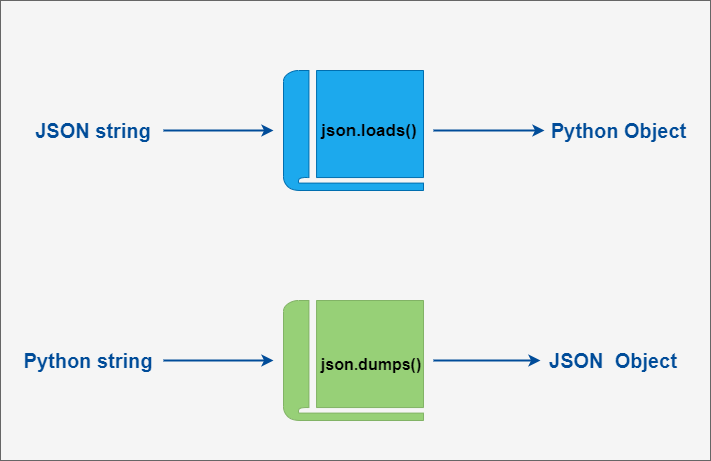

使用 json 模块来对 JSON 数据进行编解码，它包含了两个函数：

- **json.dumps():** 对数据进行编码。
- **json.loads():** 对数据进行解码。



在 json 的编解码过程中，Python 的原始类型与 json 类型会相互转换，具体的转化对照如下：

### Python 编码为 JSON 类型转换对应表：

| Python                                 | JSON   |
| :------------------------------------- | :----- |
| dict                                   | object |
| list, tuple                            | array  |
| str                                    | string |
| int, float, int- & float-derived Enums | number |
| True                                   | true   |
| False                                  | false  |
| None                                   | null   |

### JSON 解码为 Python 类型转换对应表：

| JSON          | Python |
| :------------ | :----- |
| object        | dict   |
| array         | list   |
| string        | str    |
| number (int)  | int    |
| number (real) | float  |
| true          | True   |
| false         | False  |
| null          | None   |

### json.dumps 与 json.loads 实例

 **Python 数据结构转换为JSON**：

```python
import json
 
# Python 字典类型转换为 JSON 对象
data = {
    'no' : 1,
    'name' : 'Runoob',
    'url' : 'http://www.runoob.com'
}
 
json_str = json.dumps(data)
print ("Python 原始数据：", repr(data))
print ("JSON 对象：", json_str)
```

执行以上代码输出结果为：

```
Python 原始数据： {'url': 'http://www.runoob.com', 'no': 1, 'name': 'Runoob'}
JSON 对象： {"url": "http://www.runoob.com", "no": 1, "name": "Runoob"}
```

通过输出的结果可以看出，简单类型通过编码后跟其原始的repr()输出结果非常相似。

接着以上实例，我们可以**将一个JSON编码的字符串转换回一个Python数据结构**：

```python
import json
 
# Python 字典类型转换为 JSON 对象
data1 = {
    'no' : 1,
    'name' : 'Runoob',
    'url' : 'http://www.runoob.com'
}
 
json_str = json.dumps(data1)
print ("Python 原始数据：", repr(data1))
print ("JSON 对象：", json_str)
 
# 将 JSON 对象转换为 Python 字典
data2 = json.loads(json_str)
print ("data2['name']: ", data2['name'])
print ("data2['url']: ", data2['url'])
```

执行以上代码输出结果为：

```
Python 原始数据： {'name': 'Runoob', 'no': 1, 'url': 'http://www.runoob.com'}
JSON 对象： {"name": "Runoob", "no": 1, "url": "http://www.runoob.com"}
data2['name']:  Runoob
data2['url']:  http://www.runoob.com
```

如果你要处理的是文件而不是字符串，你可以使用 **json.dump()** 和 **json.load()** 来编码和解码JSON数据。例如：

```python
# 写入 JSON 数据
with open('data.json', 'w') as f:
    json.dump(data, f)
 
# 读取数据
with open('data.json', 'r') as f:
    data = json.load(f)
```

