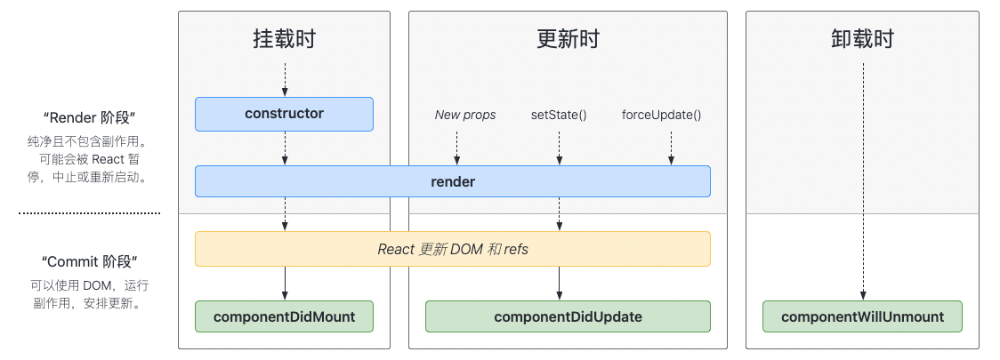
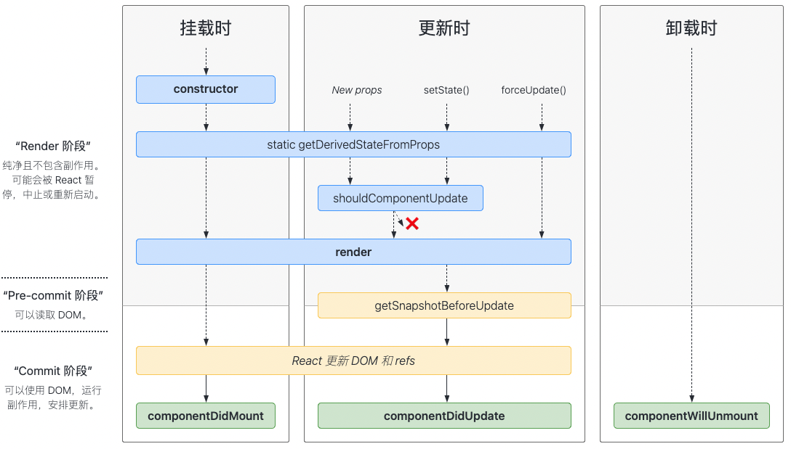

# react 组件生命周期

**常用生命周期图谱：**



**展示不常用生命周期图谱：**



## 挂载

当组件实例被创建并插入 DOM 中时，其生命周期调用顺序如下：

1. **`constructor()`**
2. `static getDerivedStateFromProps()`
3. **`render()`**
4. **`componentDidMount()`**

### 1. constructor(props)

```jsx
constructor(props) {
  super(props);
  // 不要在这里调用 this.setState()
  this.state = { counter: 0 };
  this.handleClick = this.handleClick.bind(this);
}
```

**注意📢**：

- **如果不初始化 `state` 或不进行`方法绑定`，则不需要为 React 组件实现构造函数**

- 在 React 组件挂载之前，会调用它的构造函数。在为 `React.Component` 子类实现构造函数时，应在其他语句之前调用 `super(props)`。否则，`this.props` 在构造函数中可能会出现未定义的 bug。

- **避免将 props 的值复制给 state**，因为这么做毫无必要，同时还产生了 bug（更新 prop 中的 `color` 时，并不会影响 state），你可以直接使用 `this.props.color`

   ```jsx
   constructor(props) {
    super(props);
    // 不要这样做
    this.state = { color: props.color };
   }
   ```

### 3. render()

> `render()` 方法是 class 组件中唯一一个必须实现的方法。

当 `render` 被调用时，它会检查 `this.props` 和 `this.state` 的变化并返回以下类型之一：

* **React 元素**

* **数组或 fragments**

  使得 render 方法可以返回多个元素。👉🏻参阅 [fragments](https://zh-hans.reactjs.org/docs/fragments.html) 文档

* **Portals**

  可以渲染子节点到不同的 DOM 子树中。👉🏻参阅 [portals](https://zh-hans.reactjs.org/docs/portals.html) 文档

* **字符串或数值类型**

  它们在 DOM 中会被渲染为文本节点。

* **布尔类型或 `null`**。

  什么都不渲染。（主要用于支持返回 `test && <Child />` 的模式，其中 test 为布尔类型。)

**注意📢**：

- `render()` 函数应该为纯函数，这意味着在不修改组件 state 的情况下，每次调用时都返回相同的结果，并且它不会直接与浏览器交互。

- 如需与浏览器进行交互，请在 `componentDidMount()` 或其他生命周期方法中执行你的操作。
- 如果 `shouldComponentUpdate()` 返回 **false**，则不会调用 `render()`。

### 4. componentDidMount() 组件挂载

> `componentDidMount()` 会在组件挂载后（插入 DOM 树中）立即调用。

#### 用处

1. 网络请求获取数据
2. 获取DOM节点
3. 适合添加订阅（如果添加了订阅，不要忘记在 `componentWillUnmount()` 里取消订阅）

## 更新

当组件的 **props** 或 **state** 发生变化时会触发更新。组件更新的生命周期调用顺序如下：

1. `static getDerivedStateFromProps()`
2. `shouldComponentUpdate()`
3. **`render()`**
4. `getSnapshotBeforeUpdate()`
5. **`componentDidUpdate()`**

### 1. static getDerivedStateFromProps(`props`, `state`)

> `getDerivedStateFromProps` 会在调用 render 方法之前调用，并且在初始挂载及后续更新时都会被调用。它应返回一个对象来更新 state，如果返回 `null` 则不更新任何内容。

#### 使用场景

此方法适用于[罕见的用例](https://zh-hans.reactjs.org/blog/2018/06/07/you-probably-dont-need-derived-state.html#when-to-use-derived-state)，即 state 的值在任何时候都取决于 props。例如，实现 `<Transition>` 组件可能很方便，该组件会比较当前组件与下一组件，以决定针对哪些组件进行转场动画。

**注意📢：**

派生状态会导致代码冗余，并使组件难以维护。 [确保你已熟悉这些简单的替代方案：](https://zh-hans.reactjs.org/blog/2018/06/07/you-probably-dont-need-derived-state.html)

- 如果你需要**执行副作用**（例如，数据提取或动画）以响应 props 中的更改，请改用 [`componentDidUpdate`](https://zh-hans.reactjs.org/docs/react-component.html#componentdidupdate)。
- 如果只想在 **prop 更改时重新计算某些数据**，[请使用 memoization helper 代替](https://zh-hans.reactjs.org/blog/2018/06/07/you-probably-dont-need-derived-state.html#what-about-memoization)。
- 如果你想**在 prop 更改时“重置”某些 state**，请考虑使组件[完全受控](https://zh-hans.reactjs.org/blog/2018/06/07/you-probably-dont-need-derived-state.html#recommendation-fully-controlled-component)或[使用 `key` 使组件完全不受控](https://zh-hans.reactjs.org/blog/2018/06/07/you-probably-dont-need-derived-state.html#recommendation-fully-uncontrolled-component-with-a-key) 代替。

此方法无权访问组件实例。如果你需要，可以通过提取组件 props 的纯函数及 class 之外的状态，在`getDerivedStateFromProps()`和其他 class 方法之间重用代码。

请注意，不管原因是什么，都会在*每次*渲染前触发此方法。这与 `UNSAFE_componentWillReceiveProps` 形成对比，后者仅在父组件重新渲染时触发，而不是在内部调用 `setState` 时。

### 2. shouldComponentUpdate(`nextProps`, `nextState`)

> 📢：该方法请仅在需要**[性能优化](https://zh-hans.reactjs.org/docs/optimizing-performance.html)**的时候使用
>
> 每次当 `props` 或 `state` 发生变化时，组件都会重新渲染，`shouldComponentUpdate()` 会在渲染执行之前被调用。返回值默认为 **true**（`true`：重新渲染，`false`：不重新渲染）

### 如何使用？

> 将 `this.props` 与 `nextProps` 以及 `this.state` 与`nextState` 进行比较，并返回 `false` 以告知 React 可以跳过更新。请注意，返回 `false` 并不会阻止**<u>子组件</u>**在 `state` 更改时重新渲染。

目前，如果 `shouldComponentUpdate()` 返回 `false`，则不会调用 [`UNSAFE_componentWillUpdate()`](https://zh-hans.reactjs.org/docs/react-component.html#unsafe_componentwillupdate)，[`render()`](https://zh-hans.reactjs.org/docs/react-component.html#render) 和 [`componentDidUpdate()`](https://zh-hans.reactjs.org/docs/react-component.html#componentdidupdate)。后续版本，React 可能会将 `shouldComponentUpdate` 视为提示而不是严格的指令，并且，当返回 `false` 时，仍可能导致组件重新渲染。

#### 什么情况下不被调用？

1. 首次渲染
2. 使用 `forceUpdate()` 时

**注意📢：**

1. 我们不建议在 `shouldComponentUpdate()` 中进行深层比较或使用 `JSON.stringify()`。这样非常影响效率，且会损害性能。

2. 不要企图依靠此方法来“阻止”渲染，因为这可能会产生 bug。

   你应该**考虑使用内置的 [`PureComponent`](https://zh-hans.reactjs.org/docs/react-api.html#reactpurecomponent) 组件**，而不是手动编写 `shouldComponentUpdate()`。`PureComponent` 会对 **`props`** 和 **`state`** 进行浅层比较，并减少了跳过必要更新的可能性。

### 4. getSnapshotBeforeUpdate(`prevProps`, `prevState`)

> `getSnapshotBeforeUpdate()` 在最近一次渲染输出（提交到 DOM 节点）之前调用。
>
> 它使得组件能在发生更改之前从 DOM 中捕获一些信息（例如，滚动位置）。此生命周期方法的任何返回值将作为参数传递给 `componentDidUpdate()`。

#### 使用场景

1. 可能出现在 UI 处理中
2. 需要以特殊方式处理滚动位置的聊天线程等。

**应返回 `snapshot` 的值（或 `null`）**。

```jsx
class ScrollingList extends React.Component {
  constructor(props) {
    super(props);
    this.listRef = React.createRef();
  }

  getSnapshotBeforeUpdate(prevProps, prevState) {
    // 我们是否在 list 中添加新的 items ？
    // 捕获滚动​​位置以便我们稍后调整滚动位置。
    if (prevProps.list.length < this.props.list.length) {
      const list = this.listRef.current;
      return list.scrollHeight - list.scrollTop;
    }
    return null;
  }

  componentDidUpdate(prevProps, prevState, snapshot) {
    // 如果我们 snapshot 有值，说明我们刚刚添加了新的 items，
    // 调整滚动位置使得这些新 items 不会将旧的 items 推出视图。
    //（这里的 snapshot 是 getSnapshotBeforeUpdate 的返回值）
    if (snapshot !== null) {
      const list = this.listRef.current;
      list.scrollTop = list.scrollHeight - snapshot;
    }
  }

  render() {
    return (
      <div ref={this.listRef}>{/* ...contents... */}</div>
    );
  }
}
```

在上述示例中，重点是从 `getSnapshotBeforeUpdate` 读取 `scrollHeight` 属性，因为 “render” 阶段生命周期（如 `render`）和 “commit” 阶段生命周期（如 `getSnapshotBeforeUpdate` 和 `componentDidUpdate`）之间可能存在延迟。

### 5. componentDidUpdate(`prevProps`, `prevState`, `snapshot`) 组件更新

> `componentDidUpdate()` 会在更新后会被立即调用，首次渲染不会执行此方法。

**第三参数**(`snapshot`)：如果组件实现了 `getSnapshotBeforeUpdate()` 生命周期（不常用），则它的返回值将作为 `componentDidUpdate()` 的第三个参数 “`snapshot`” 参数传递。否则此参数将为 **`undefined`**。

### 用处

1. **DOM操作**（当组件更新后，可以在此处对 DOM 进行操作）

2. **网络请求**（如果你对更新前后的 **props** 进行了比较，也可以选择在此处进行网络请求）

   ```jsx
   componentDidUpdate(prevProps) {
     // 典型用法（不要忘记比较 props）：
     if (this.props.userID !== prevProps.userID) {
       this.fetchData(this.props.userID);
     }
   }
   ```

**注意📢**：

- 在 `componentDidUpdate()` 中**直接调用 `setState()`**时，要注意**它必须被包裹在一个条件语句里**，正如上述的例子那样进行处理，否则会导致死循环，它还会导致额外的重新渲染，虽然用户不可见，但会影响组件性能。
- 如果 [`shouldComponentUpdate()`](https://zh-hans.reactjs.org/docs/react-component.html#shouldcomponentupdate) 返回值为 false，则不会调用 `componentDidUpdate()`

## 卸载

当组件从 DOM 中移除时会调用如下方法：

1. **`componentWillUnmount()`**

### componentWillUnmount()

> `componentWillUnmount()` 会在组件卸载及销毁之前直接调用。
>
> 在此方法中执行必要的清理操作。

#### 用处

1. 清除 **timer**
2. 取消网络请求
3. 清除在 `componentDidMount()` 中创建的订阅等

**注意📢**：

- `componentWillUnmount()` 中**不应调用 `setState()`**，因为该组件将永远不会重新渲染（组件实例卸载后，将永远不会再挂载它）


## 错误处理

> [Error boundaries](https://zh-hans.reactjs.org/docs/error-boundaries.html) 是 React 组件，它会在其子组件树中的任何位置捕获 JavaScript 错误，并记录这些错误，展示降级 UI 而不是崩溃的组件树。
>
> Error boundaries 组件会捕获**在渲染期间**，**在生命周期方法**以及其整个树的**构造函数**中发生的错误。

> 如果 class 组件定义了生命周期方法 `static getDerivedStateFromError()` 或 `componentDidCatch()` 中的任何一个（或两者），它就成为了 **Error boundaries**。
>
> 通过生命周期更新 `state` 可让组件捕获树中未处理的 JavaScript 错误并展示降级 UI。

> 仅使用 **Error boundaries** 组件来从意外异常中恢复的情况；**不要将它们用于流程控制。**参阅 [*React 16 中的错误处理*](https://zh-hans.reactjs.org/blog/2017/07/26/error-handling-in-react-16.html)。
>
> **Error boundaries** 仅捕获组件树中`static getDerivedStateFromError()`和`componentDidCatch()`组件中的错误。但它本身的错误无法捕获。


当渲染过程，生命周期，或子组件的构造函数中抛出错误时，会调用如下方法：

- `static getDerivedStateFromError()`
- `componentDidCatch()`

### static getDerivedStateFromError(`error`)

> 此生命周期会在后代组件抛出错误后被调用。 
> 它将抛出的错误作为参数，并返回一个值以更新 `state`

```jsx
class ErrorBoundary extends React.Component {
  constructor(props) {
    super(props);
    this.state = { hasError: false };
  }

  static getDerivedStateFromError(error) {
    // 更新 state 使下一次渲染可以显降级 UI
    return { hasError: true };
  }

  render() {
    if (this.state.hasError) {
      // 你可以渲染任何自定义的降级  UI
      return <h1>Something went wrong.</h1>;
    }

    return this.props.children;
  }
}
```

**注意📢：**

`getDerivedStateFromError()` 会在`渲染`阶段调用，因此不允许出现副作用。 如遇此类情况，请改用 `componentDidCatch()`

### componentDidCatch(`error`, `info`)

此生命周期在后代组件抛出错误后被调用。 它接收两个参数：

1. `error` —— 抛出的错误。
2. `info` —— 带有 `componentStack` key 的对象，其中包含[有关组件引发错误的栈信息](https://zh-hans.reactjs.org/docs/error-boundaries.html#component-stack-traces)。

`componentDidCatch()` 会在“提交”阶段被调用，因此允许执行副作用。 它应该用于记录错误之类的情况：

```jsx
class ErrorBoundary extends React.Component {
  constructor(props) {
    super(props);
    this.state = { hasError: false };
  }

  static getDerivedStateFromError(error) {
    // 更新 state 使下一次渲染可以显示降级 UI
    return { hasError: true };
  }

  componentDidCatch(error, info) {
    // "组件堆栈" 例子:
    //   in ComponentThatThrows (created by App)
    //   in ErrorBoundary (created by App)
    //   in div (created by App)
    //   in App
    logComponentStackToMyService(info.componentStack);
  }

  render() {
    if (this.state.hasError) {
      // 你可以渲染任何自定义的降级 UI
      return <h1>Something went wrong.</h1>;
    }

    return this.props.children;
  }
}
```

**注意📢：**

React 的开发和生产构建版本在 `componentDidCatch()` 的方式上有轻微差别。

在开发模式下，错误会冒泡至 `window`，这意味着任何 `window.onerror` 或 `window.addEventListener('error', callback)` 会中断这些已经被 `componentDidCatch()` 捕获的错误。

相反，在生产模式下，错误不会冒泡，这意味着任何根错误处理器只会接受那些没有显式地被 `componentDidCatch()` 捕获的错误。

如果发生错误，你可以通过调用 `setState` 使用 `componentDidCatch()` 渲染降级 UI，但在未来的版本中将不推荐这样做。 可以使用静态 `getDerivedStateFromError()` 来处理降级渲染。

# 其他 APIs

不同于上述生命周期方法（React 主动调用），以下方法是你可以在组件中调用的方法：

- `setState()`
- `forceUpdate()`

### setState(updater[, callback])

> `setState()` 并不总是立即更新组件，它会批量推迟更新（为了更好的感知性能，React 会延迟调用它，然后通过一次传递更新多个组件）。
>
> 在罕见的情况下，你需要强制 DOM 更新同步应用，你可以使用 [`flushSync`](https://zh-hans.reactjs.org/docs/react-dom.html#flushsync) 来包装它，但这可能会损害性能

这使得在调用 `setState()` 后立即读取 `this.state` 成为了隐患。为了消除隐患，请使用 `componentDidUpdate` 或者 `setState` 的回调函数（`setState(updater, callback)`），这两种方式都可以保证在应用更新后触发。

除非 `shouldComponentUpdate()` 返回 `false`，否则 `setState()` 将始终执行重新渲染操作。如果可变对象被使用，且无法在 `shouldComponentUpdate()` 中实现条件渲染，那么仅在新旧状态不一时调用 `setState()`可以避免不必要的重新渲染

更多详细信息，请参阅：

- [State 和生命周期指南](https://zh-hans.reactjs.org/docs/state-and-lifecycle.html)
- [深入学习：何时以及为什么 `setState()` 会批量执行？](https://stackoverflow.com/a/48610973/458193)
- [深入：为什么不直接更新 `this.state`？](https://github.com/facebook/react/issues/11527#issuecomment-360199710)

#### 参数一(`updater`)

##### 1. 函数形式

格式：`(state, props) => stateChange`

`state` 是对应用变化时组件状态的引用，它不应直接被修改，你应该使用基于 `state` 和 `props` 构建的新对象来表示变化。例如，假设我们想根据 `props.step` 来增加 state：

```jsx
this.setState((state, props) => {
  return {counter: state.counter + props.step};
});
```

updater 函数中接收的 `state` 和 `props` 都保证为最新。updater 的返回值会与 `state` 进行浅合并。

##### 2.对象形式

格式：`setState(stateChange[, callback])`

`stateChange` 会将传入的对象浅层合并到新的 state 中，例如，调整购物车商品数：

```jsx
this.setState({quantity: 2})
```

这种形式的 `setState()` 也是异步的，并且在同一周期内会对多个 `setState` 进行批处理。例如，如果在同一周期内多次设置商品数量增加，则相当于：

```js
Object.assign(
  previousState,
  {quantity: state.quantity + 1},
  {quantity: state.quantity + 1},
  ...
)
```

后调用的 `setState()` 将覆盖同一周期内先调用 `setState` 的值，因此商品数仅增加一次。如果后续状态取决于当前状态，我们建议使用 updater 函数的形式代替：

```jsx
this.setState((state) => {
  return {quantity: state.quantity + 1};
});
```

#### 参数二(`callback`)

> `setState()` 的第二个参数为可选的回调函数，它将在 `setState` 完成合并并重新渲染组件后执行。通常，我们建议使用 `componentDidUpdate()` 来代替此方式。

### component.forceUpdate(callback)

> 默认情况下，当组件的 `state` 或 `props` 发生变化时，组件将重新渲染。如果 `render()` 方法依赖于其他数据，则可以调用 `forceUpdate()` 强制让组件重新渲染。

调用 `forceUpdate()` 将致使组件调用 `render()` 方法，此操作会跳过该组件的 `shouldComponentUpdate()`。但其子组件会触发正常的生命周期方法，包括 `shouldComponentUpdate()` 方法。如果标记发生变化，React 仍将只更新 DOM。

通常你应该避免使用 `forceUpdate()`，尽量在 `render()` 中使用 `this.props` 和 `this.state`。

# class 属性

- `defaultProps`
- `displayName`

## defaultProps

> `defaultProps` 可以为 Class 组件添加默认 `props`。这一般用于 props 未赋值，但又不能为 `null` 的情况

```jsx
class CustomButton extends React.Component {
  // ...
}

CustomButton.defaultProps = {
  color: 'blue'
};
```

如果未提供 `props.color`，则默认设置为 `'blue'`

```jsx
  render() {
    return <CustomButton /> ; // props.color 将设置为 'blue'
  }
```

如果 `props.color` 被设置为 `null`，则它将保持为 `null`

```jsx
  render() {
    return <CustomButton color={null} /> ; // props.color 将保持是 null
  }
```

## displayName

`displayName` 字符串多用于调试消息。通常，你不需要设置它，因为它可以根据函数组件或 class 组件的名称推断出来。如果调试时需要显示不同的名称或创建高阶组件，请参阅[使用 displayname 轻松进行调试](https://zh-hans.reactjs.org/docs/higher-order-components.html#convention-wrap-the-display-name-for-easy-debugging)

