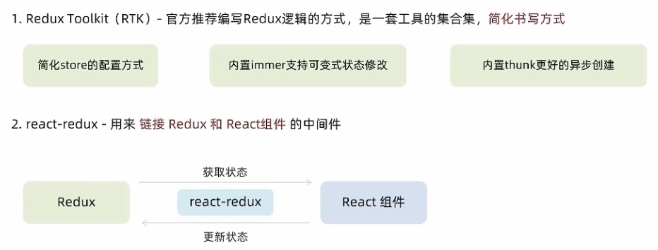

> 在react中使用redux，官方要求安装两个其他插件：`Redux Toolkit` 和 `react-redux`
>
> 安装：`npm install react-redux @reduxjs/toolkit -S`



## 1. 用RTK创建store

`store/index.js`

```react
import { createSlice } from '@reduxjs/toolkit';
// createSlice 创建 reducer 的切片
// 它需要一个配置对象作为参数，通过对象的不同属性来指定它的配置
const stuSlice = createSlice({
  name: 'stu', // 用来自动生成 action 中的 type
  initialState: { // state的初始值
    name: 'xx',
    age: 18,
  },
  reducers: { // 指定state的各种操作
    setName(state, action) {
      state.name = action.payload;
    }
  }
});

// 切片对象会自动的帮我们生成action
// actions中存储的是slice自动生成action创建器(函数) ，调用函数后会自动生成action对象
export const { setName } = stuSlice.actions;
const nameAction = setName('哈哈');
console.log(nameAction) // { type: name/函数名,payload: 函数的参数 }

// 创建store
const store = configureStore({
  reducer: {
    student: stuSlice.reducer
  }
})

export default store;
```

## 2. 为React注入store

`index.js`

```js
import { Provider } from 'react-redux';
import store from './store'

const root = ReactDOM.createRoot(document.getElementById('root'))
root.render(
  /*注入*/
	<Provider store={store}>
  	<App />
  </Provider>
)
```

## 3. React组件使用store中的数据

> `useSelector`钩子函数的作用 是把store中的数据映射到组件中
>
> `useDispatch`函数的作用是生成提交action对象的dispatch函数

`App.js`

```react
import { useSelector, useDispatch } from "react-redux";
import { setName } from './store'
const App = () => {
  // useSelector 用来加载 state 中的数据
  const student = useSelector(state => state.student);
  const dispatch = useDispatch();
  const setName = () => {
    dispatch(setName('张三'));
    // 或者
    dispatch({ type: 'stu/setName', payload: '张三' })
  }
  return (<div onClick={setName}>{student}</div>)
}
```

