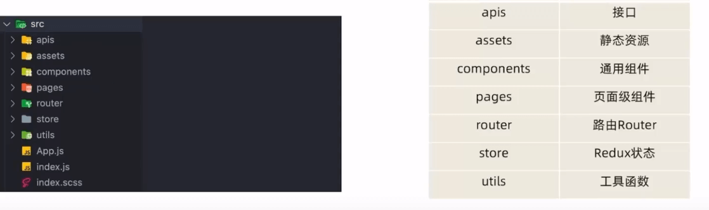
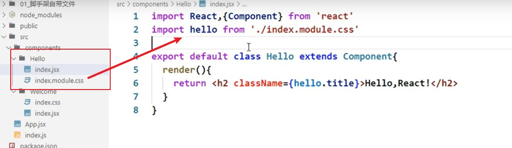

## 创建项目并启动

- 普通**react** 项目

  `npx create-react-app my-app`

  或者

  `yarn create react-app my-app`

- **react + typescript** 项目

  `npx create-react-app my-app --template typescript`

  或者

  `yarn create react-app my-app --template typescript`

* 将 **TypeScript** 添加到已有**react**项目中

  `npm install --save typescript @types/node @types/react @types/react-dom @types/jest`

  或者

  `yarn add typescript @types/node @types/react @types/react-dom @types/jest`

  然后创建`tsconfig.json`文件：`yarn run tsc --init` 或者`npx tsc --init`。

  `tsconfig.json` 文件中的配置项参考：https://www.typescriptlang.org/docs/handbook/tsconfig-json.html


## 项目结构



* **`public/index.html`**

  ```html
  <!DOCTYPE html>
  <html lang="en">
    <head>
      <meta charset="utf-8" />
        <!-- %PUBLIC_URL%代表public文件夹的路径 -->
      <link rel="icon" href="%PUBLIC_URL%/favicon.ico" />
        <!-- 开启理想视口，用于做移动端网页的适配 -->
      <meta name="viewport" content="width=device-width, initial-scale=1" />
    <!-- 用于配置浏览器页签+地址栏的颜色(仅支持安卓手机浏览器，兼容性不好) -->
      <meta name="theme-color" content="#000000" />
      <meta
        name="description"
        content="Web site created using create-react-app"
      />
       <!-- 用于指定网页添加到苹果手机主屏后的图标 -->
      <link rel="apple-touch-icon" href="%PUBLIC_URL%/logo192.png" />
        <!-- 只用于应用加壳，manifest.json为加壳时的配置文件 -->
      <link rel="manifest" href="%PUBLIC_URL%/manifest.json" />
      <title>React App</title>
    </head>
    <body>
      <noscript>You need to enable JavaScript to run this app.</noscript>
      <div id="root"></div>
    </body>
  </html>
  ```

* `public/robots.txt`

  爬虫协议文件

* `src/reportWebVitals.js`

  页面性能分析文件，用到`web-vitals`库

* `src/setupTests.js`

  组件单元测试文件，用到 jest-dom 库

## 样式的模块化



## `@`路径解析配置

> `create-react-app`本身将webpack配置包装到了黑盒，所以无法直接修改，需要借助插件：`@craco/craco`

配置步骤：

1. `npm i @craco/craco -D`

2. 在项目根目录下创建配置文件

   `craco.config.js`

3. 配置文件中添加路径解析配置

   ```js
   const path = require("path");
   
   module.exports = {
     // webpack 配置
     webpack: {
       alias: {
         '@': path.resolve(__dirname, 'src')
       }
     }
   }
   ```

4. `package.json`中配置启动和打包命令

   ```json
   {
     "scripts": {
       "start": "craco start",
       "build": "craco build"
     }
   }
   ```

### `vscode`联想路径配置

1. 在项目目录下添加`jsconfig.json`文件，加入之后vscode会自动读取配置帮我们联想提示

2. 添加联想配置

   ```json
   {
     "compilerOptions": {
       "baseUrl": "./",
       "paths": {
         "@/*": ["src/*"]
       }
     }
   }
   ```

   