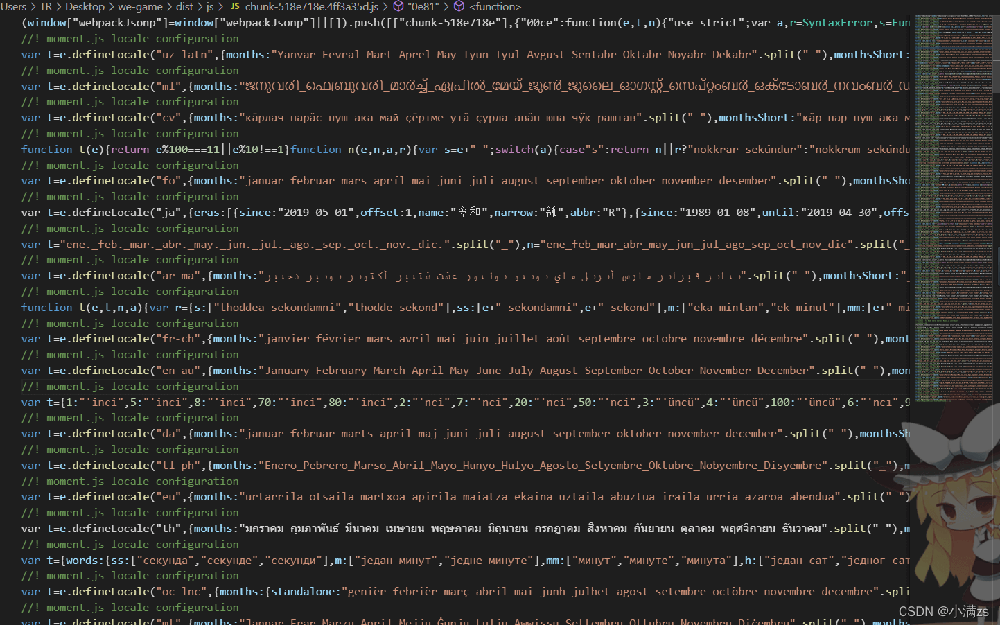
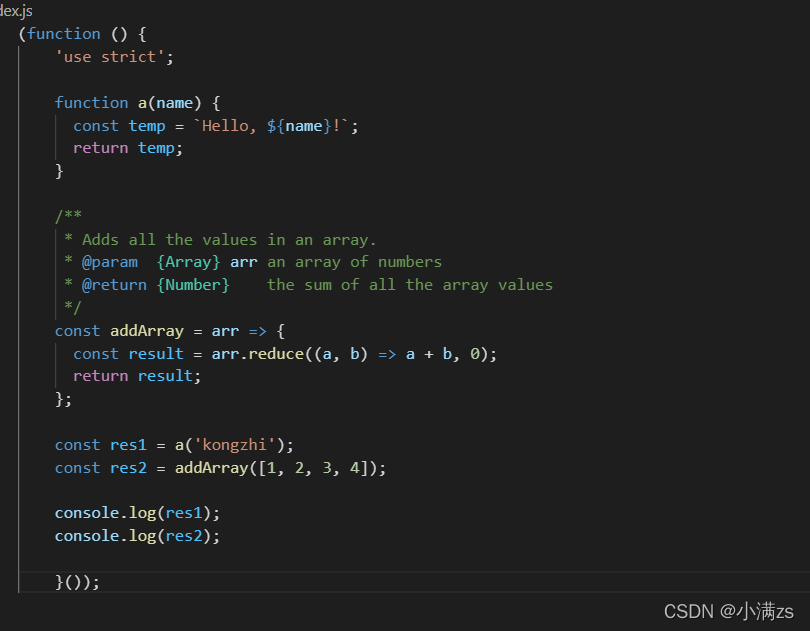

## Rollup构建TS项目

### 安装依赖

1. 全局安装rollup `npm install rollup-g`

2. 安装TypeScript   `npm install typescript -D`

3. 安装TypeScript 转换器 `npm install rollup-plugin-typescript2 -D`

4. 安装代码压缩插件 `npm install rollup-plugin-terser -D`

5. 安装rollupweb服务 `npm install rollup-plugin-serve -D`

6. 安装热更新 `npm install rollup-plugin-livereload -D`

7. 引入外部依赖 `npm install rollup-plugin-node-resolve -D`

8. 安装配置环境变量用来区分本地和生产 ` npm install cross-env -D`

9. 替换环境变量给浏览器使用 `npm install rollup-plugin-replace -D`

### [webpack](https://so.csdn.net/so/search?q=webpack&spm=1001.2101.3001.7020)与rollup打包对比





### 配置json文件

`npm init -y`

```json
{
  "name": "rollupTs",
  "version": "1.0.0",
  "description": "",
  "main": "index.js",
  "scripts": {
    "test": "echo \"Error: no test specified\" && exit 1",
    "dev": "cross-env NODE_ENV=development  rollup -c -w",
    "build":"cross-env NODE_ENV=produaction  rollup -c"
  },
  "keywords": [],
  "author": "",
  "license": "ISC",
  "devDependencies": {
    "cross-env": "^7.0.3",
    "rollup-plugin-livereload": "^2.0.5",
    "rollup-plugin-node-resolve": "^5.2.0",
    "rollup-plugin-replace": "^2.2.0",
    "rollup-plugin-serve": "^1.1.0",
    "rollup-plugin-terser": "^7.0.2",
    "rollup-plugin-typescript2": "^0.31.1",
    "typescript": "^4.5.5"
  }
}
```

### 配置rollup文件

```js
console.log(process.env);
import ts from 'rollup-plugin-typescript2'
import path from 'path'
import serve from 'rollup-plugin-serve'
import livereload from 'rollup-plugin-livereload'
import { terser } from 'rollup-plugin-terser'
import resolve from 'rollup-plugin-node-resolve'
import repacle from 'rollup-plugin-replace'
 
const isDev = () => {
    return process.env.NODE_ENV === 'development'
}
export default {
    input: "./src/main.ts",
    output: {
        file: path.resolve(__dirname, './lib/index.js'),
        format: "umd",
        sourcemap: true
    },
 
    plugins: [
        ts(),
        terser({
            compress: {
                drop_console: !isDev()
            }
        }),
        repacle({
            'process.env.NODE_ENV': JSON.stringify(process.env.NODE_ENV)
        }),
        resolve(['.js', '.ts']),
        isDev() && livereload(),
        isDev() && serve({
            open: true,
            openPage: "/public/index.html"
        })
    ]
}
```

### 配置tsconfig.json

```json
{
  "compilerOptions": {
    /* Visit https://aka.ms/tsconfig.json to read more about this file */
 
    /* Projects */
    // "incremental": true,                              /* Enable incremental compilation */
    // "composite": true,                                /* Enable constraints that allow a TypeScript project to be used with project references. */
    // "tsBuildInfoFile": "./",                          /* Specify the folder for .tsbuildinfo incremental compilation files. */
    // "disableSourceOfProjectReferenceRedirect": true,  /* Disable preferring source files instead of declaration files when referencing composite projects */
    // "disableSolutionSearching": true,                 /* Opt a project out of multi-project reference checking when editing. */
    // "disableReferencedProjectLoad": true,             /* Reduce the number of projects loaded automatically by TypeScript. */
 
    /* Language and Environment */
    "target": "es5",                                  /* Set the JavaScript language version for emitted JavaScript and include compatible library declarations. */
    // "lib": [],                                        /* Specify a set of bundled library declaration files that describe the target runtime environment. */
    // "jsx": "preserve",                                /* Specify what JSX code is generated. */
    // "experimentalDecorators": true,                   /* Enable experimental support for TC39 stage 2 draft decorators. */
    // "emitDecoratorMetadata": true,                    /* Emit design-type metadata for decorated declarations in source files. */
    // "jsxFactory": "",                                 /* Specify the JSX factory function used when targeting React JSX emit, e.g. 'React.createElement' or 'h' */
    // "jsxFragmentFactory": "",                         /* Specify the JSX Fragment reference used for fragments when targeting React JSX emit e.g. 'React.Fragment' or 'Fragment'. */
    // "jsxImportSource": "",                            /* Specify module specifier used to import the JSX factory functions when using `jsx: react-jsx*`.` */
    // "reactNamespace": "",                             /* Specify the object invoked for `createElement`. This only applies when targeting `react` JSX emit. */
    // "noLib": true,                                    /* Disable including any library files, including the default lib.d.ts. */
    // "useDefineForClassFields": true,                  /* Emit ECMAScript-standard-compliant class fields. */
 
    /* Modules */
    "module": "ES2015",                                /* Specify what module code is generated. */
    // "rootDir": "./",                                  /* Specify the root folder within your source files. */
    // "moduleResolution": "node",                       /* Specify how TypeScript looks up a file from a given module specifier. */
    // "baseUrl": "./",                                  /* Specify the base directory to resolve non-relative module names. */
    // "paths": {},                                      /* Specify a set of entries that re-map imports to additional lookup locations. */
    // "rootDirs": [],                                   /* Allow multiple folders to be treated as one when resolving modules. */
    // "typeRoots": [],                                  /* Specify multiple folders that act like `./node_modules/@types`. */
    // "types": [],                                      /* Specify type package names to be included without being referenced in a source file. */
    // "allowUmdGlobalAccess": true,                     /* Allow accessing UMD globals from modules. */
    // "resolveJsonModule": true,                        /* Enable importing .json files */
    // "noResolve": true,                                /* Disallow `import`s, `require`s or `<reference>`s from expanding the number of files TypeScript should add to a project. */
 
    /* JavaScript Support */
    // "allowJs": true,                                  /* Allow JavaScript files to be a part of your program. Use the `checkJS` option to get errors from these files. */
    // "checkJs": true,                                  /* Enable error reporting in type-checked JavaScript files. */
    // "maxNodeModuleJsDepth": 1,                        /* Specify the maximum folder depth used for checking JavaScript files from `node_modules`. Only applicable with `allowJs`. */
 
    /* Emit */
    // "declaration": true,                              /* Generate .d.ts files from TypeScript and JavaScript files in your project. */
    // "declarationMap": true,                           /* Create sourcemaps for d.ts files. */
    // "emitDeclarationOnly": true,                      /* Only output d.ts files and not JavaScript files. */
      "sourceMap": true,                                /* Create source map files for emitted JavaScript files. */
    // "outFile": "./",                                  /* Specify a file that bundles all outputs into one JavaScript file. If `declaration` is true, also designates a file that bundles all .d.ts output. */
    // "outDir": "./",                                   /* Specify an output folder for all emitted files. */
    // "removeComments": true,                           /* Disable emitting comments. */
    // "noEmit": true,                                   /* Disable emitting files from a compilation. */
    // "importHelpers": true,                            /* Allow importing helper functions from tslib once per project, instead of including them per-file. */
    // "importsNotUsedAsValues": "remove",               /* Specify emit/checking behavior for imports that are only used for types */
    // "downlevelIteration": true,                       /* Emit more compliant, but verbose and less performant JavaScript for iteration. */
    // "sourceRoot": "",                                 /* Specify the root path for debuggers to find the reference source code. */
    // "mapRoot": "",                                    /* Specify the location where debugger should locate map files instead of generated locations. */
    // "inlineSourceMap": true,                          /* Include sourcemap files inside the emitted JavaScript. */
    // "inlineSources": true,                            /* Include source code in the sourcemaps inside the emitted JavaScript. */
    // "emitBOM": true,                                  /* Emit a UTF-8 Byte Order Mark (BOM) in the beginning of output files. */
    // "newLine": "crlf",                                /* Set the newline character for emitting files. */
    // "stripInternal": true,                            /* Disable emitting declarations that have `@internal` in their JSDoc comments. */
    // "noEmitHelpers": true,                            /* Disable generating custom helper functions like `__extends` in compiled output. */
    // "noEmitOnError": true,                            /* Disable emitting files if any type checking errors are reported. */
    // "preserveConstEnums": true,                       /* Disable erasing `const enum` declarations in generated code. */
    // "declarationDir": "./",                           /* Specify the output directory for generated declaration files. */
    // "preserveValueImports": true,                     /* Preserve unused imported values in the JavaScript output that would otherwise be removed. */
 
    /* Interop Constraints */
    // "isolatedModules": true,                          /* Ensure that each file can be safely transpiled without relying on other imports. */
    // "allowSyntheticDefaultImports": true,             /* Allow 'import x from y' when a module doesn't have a default export. */
    "esModuleInterop": true,                             /* Emit additional JavaScript to ease support for importing CommonJS modules. This enables `allowSyntheticDefaultImports` for type compatibility. */
    // "preserveSymlinks": true,                         /* Disable resolving symlinks to their realpath. This correlates to the same flag in node. */
    "forceConsistentCasingInFileNames": true,            /* Ensure that casing is correct in imports. */
 
    /* Type Checking */
    "strict": true,                                      /* Enable all strict type-checking options. */
    // "noImplicitAny": true,                            /* Enable error reporting for expressions and declarations with an implied `any` type.. */
    // "strictNullChecks": true,                         /* When type checking, take into account `null` and `undefined`. */
    // "strictFunctionTypes": true,                      /* When assigning functions, check to ensure parameters and the return values are subtype-compatible. */
    // "strictBindCallApply": true,                      /* Check that the arguments for `bind`, `call`, and `apply` methods match the original function. */
    // "strictPropertyInitialization": true,             /* Check for class properties that are declared but not set in the constructor. */
    // "noImplicitThis": true,                           /* Enable error reporting when `this` is given the type `any`. */
    // "useUnknownInCatchVariables": true,               /* Type catch clause variables as 'unknown' instead of 'any'. */
    // "alwaysStrict": true,                             /* Ensure 'use strict' is always emitted. */
    // "noUnusedLocals": true,                           /* Enable error reporting when a local variables aren't read. */
    // "noUnusedParameters": true,                       /* Raise an error when a function parameter isn't read */
    // "exactOptionalPropertyTypes": true,               /* Interpret optional property types as written, rather than adding 'undefined'. */
    // "noImplicitReturns": true,                        /* Enable error reporting for codepaths that do not explicitly return in a function. */
    // "noFallthroughCasesInSwitch": true,               /* Enable error reporting for fallthrough cases in switch statements. */
    // "noUncheckedIndexedAccess": true,                 /* Include 'undefined' in index signature results */
    // "noImplicitOverride": true,                       /* Ensure overriding members in derived classes are marked with an override modifier. */
    // "noPropertyAccessFromIndexSignature": true,       /* Enforces using indexed accessors for keys declared using an indexed type */
    // "allowUnusedLabels": true,                        /* Disable error reporting for unused labels. */
    // "allowUnreachableCode": true,                     /* Disable error reporting for unreachable code. */
 
    /* Completeness */
    // "skipDefaultLibCheck": true,                      /* Skip type checking .d.ts files that are included with TypeScript. */
    "skipLibCheck": true                                 /* Skip type checking all .d.ts files. */
  }
}
```

