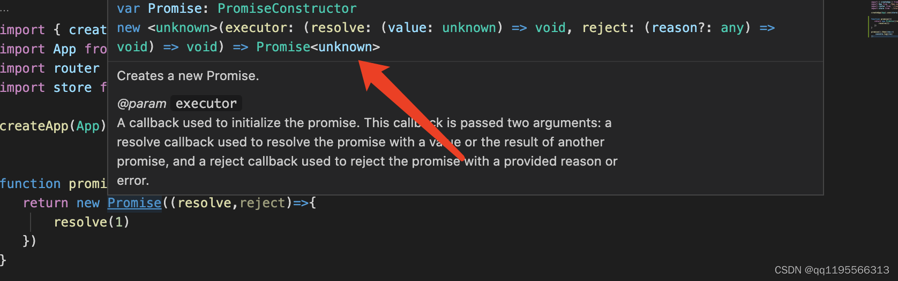
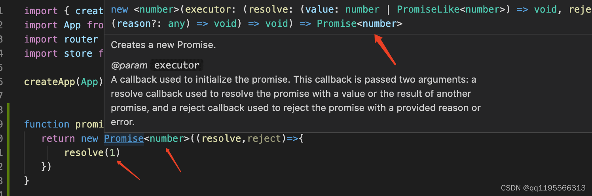
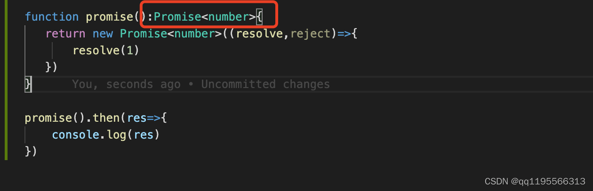

## 内置对象

### [ECMAScript](https://so.csdn.net/so/search?q=ECMAScript&spm=1001.2101.3001.7020) 的内置对象

> **`Boolean`、`Number`、`string`、`RegExp`、`Date`、`Error`**

```ts
let b: Boolean = new Boolean(1)
console.log(b)
let n: Number = new Number(true)
console.log(n)
let s: String = new String('哔哩哔哩关注小满zs')
console.log(s)
let d: Date = new Date()
console.log(d)
let r: RegExp = /^1/
console.log(r)
let e: Error = new Error("error!")
console.log(e)
```

### DOM 和 BOM 的内置对象

> **`Document`、`HTMLElement`、`Event`、`NodeList` 等**

```ts
let body: HTMLElement = document.body;
let allDiv: NodeList = document.querySelectorAll('div');
//读取div 这种需要类型断言 或者加个判断应为读不到返回null
let div:HTMLElement = document.querySelector('div') as HTMLDivElement
document.addEventListener('click', function (e: MouseEvent) {
    
});
//dom元素的映射表
interface HTMLElementTagNameMap {
    "a": HTMLAnchorElement;
    "abbr": HTMLElement;
    "address": HTMLElement;
    "applet": HTMLAppletElement;
    "area": HTMLAreaElement;
    "article": HTMLElement;
    "aside": HTMLElement;
    "audio": HTMLAudioElement;
    "b": HTMLElement;
    "base": HTMLBaseElement;
    "bdi": HTMLElement;
    "bdo": HTMLElement;
    "blockquote": HTMLQuoteElement;
    "body": HTMLBodyElement;
    "br": HTMLBRElement;
    "button": HTMLButtonElement;
    "canvas": HTMLCanvasElement;
    "caption": HTMLTableCaptionElement;
    "cite": HTMLElement;
    "code": HTMLElement;
    "col": HTMLTableColElement;
    "colgroup": HTMLTableColElement;
    "data": HTMLDataElement;
    "datalist": HTMLDataListElement;
    "dd": HTMLElement;
    "del": HTMLModElement;
    "details": HTMLDetailsElement;
    "dfn": HTMLElement;
    "dialog": HTMLDialogElement;
    "dir": HTMLDirectoryElement;
    "div": HTMLDivElement;
    "dl": HTMLDListElement;
    "dt": HTMLElement;
    "em": HTMLElement;
    "embed": HTMLEmbedElement;
    "fieldset": HTMLFieldSetElement;
    "figcaption": HTMLElement;
    "figure": HTMLElement;
    "font": HTMLFontElement;
    "footer": HTMLElement;
    "form": HTMLFormElement;
    "frame": HTMLFrameElement;
    "frameset": HTMLFrameSetElement;
    "h1": HTMLHeadingElement;
    "h2": HTMLHeadingElement;
    "h3": HTMLHeadingElement;
    "h4": HTMLHeadingElement;
    "h5": HTMLHeadingElement;
    "h6": HTMLHeadingElement;
    "head": HTMLHeadElement;
    "header": HTMLElement;
    "hgroup": HTMLElement;
    "hr": HTMLHRElement;
    "html": HTMLHtmlElement;
    "i": HTMLElement;
    "iframe": HTMLIFrameElement;
    "img": HTMLImageElement;
    "input": HTMLInputElement;
    "ins": HTMLModElement;
    "kbd": HTMLElement;
    "label": HTMLLabelElement;
    "legend": HTMLLegendElement;
    "li": HTMLLIElement;
    "link": HTMLLinkElement;
    "main": HTMLElement;
    "map": HTMLMapElement;
    "mark": HTMLElement;
    "marquee": HTMLMarqueeElement;
    "menu": HTMLMenuElement;
    "meta": HTMLMetaElement;
    "meter": HTMLMeterElement;
    "nav": HTMLElement;
    "noscript": HTMLElement;
    "object": HTMLObjectElement;
    "ol": HTMLOListElement;
    "optgroup": HTMLOptGroupElement;
    "option": HTMLOptionElement;
    "output": HTMLOutputElement;
    "p": HTMLParagraphElement;
    "param": HTMLParamElement;
    "picture": HTMLPictureElement;
    "pre": HTMLPreElement;
    "progress": HTMLProgressElement;
    "q": HTMLQuoteElement;
    "rp": HTMLElement;
    "rt": HTMLElement;
    "ruby": HTMLElement;
    "s": HTMLElement;
    "samp": HTMLElement;
    "script": HTMLScriptElement;
    "section": HTMLElement;
    "select": HTMLSelectElement;
    "slot": HTMLSlotElement;
    "small": HTMLElement;
    "source": HTMLSourceElement;
    "span": HTMLSpanElement;
    "strong": HTMLElement;
    "style": HTMLStyleElement;
    "sub": HTMLElement;
    "summary": HTMLElement;
    "sup": HTMLElement;
    "table": HTMLTableElement;
    "tbody": HTMLTableSectionElement;
    "td": HTMLTableDataCellElement;
    "template": HTMLTemplateElement;
    "textarea": HTMLTextAreaElement;
    "tfoot": HTMLTableSectionElement;
    "th": HTMLTableHeaderCellElement;
    "thead": HTMLTableSectionElement;
    "time": HTMLTimeElement;
    "title": HTMLTitleElement;
    "tr": HTMLTableRowElement;
    "track": HTMLTrackElement;
    "u": HTMLElement;
    "ul": HTMLUListElement;
    "var": HTMLElement;
    "video": HTMLVideoElement;
    "wbr": HTMLElement;
}
```

## 定义Promise

如果我们不指定返回的类型TS是推断不出来返回的是什么类型



指定返回的类型



函数定义返回promise 语法规则:`Promise<T>` 类型 



```ts
function promise():Promise<number>{
   return new Promise<number>((resolve,reject)=>{
       resolve(1)
   })
}
 
promise().then(res=>{
    console.log(res)
})
```

