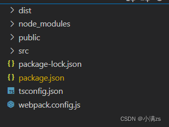

## webpack构建TS项目

### 安装依赖

- 安装webpack   `npm install webpack -D`

- webpack4以上需要 `npm install  webpack-cli -D`

- 编译TS  `npm install ts-loader -D`

- TS环境 `npm install typescript -D`

- 热更新服务 `npm install  webpack-dev-server -D`

- HTML模板 `npm install html-webpack-plugin -D`

### 配置文件

```js
const path = require('path')
const htmlWebpackPlugin = require('html-webpack-plugin')
module.exports = {
    entry: "./src/index.ts",
    mode: "development",
    output: {
        path: path.resolve(__dirname, './dist'),
        filename: "index.js"
    },
    stats: "none",
    resolve: {
        extensions: ['.ts', '.js'], // import 
        alias: {
            '@': path.resolve(__dirname, './src')
        }
    },
    module: {
        rules: [
            {
                test: /\.ts$/,
                use: "ts-loader"
            }
        ]
    },
    devServer: {
        port: 1988,
        proxy: {}
    },
    plugins: [
        new htmlWebpackPlugin({
            template: "./public/index.html"
        })
    ]
}
```

### 目录结构

