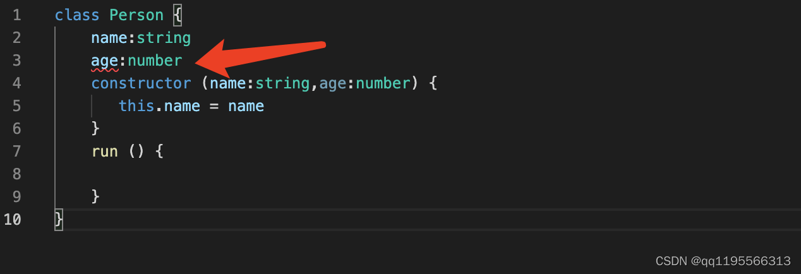
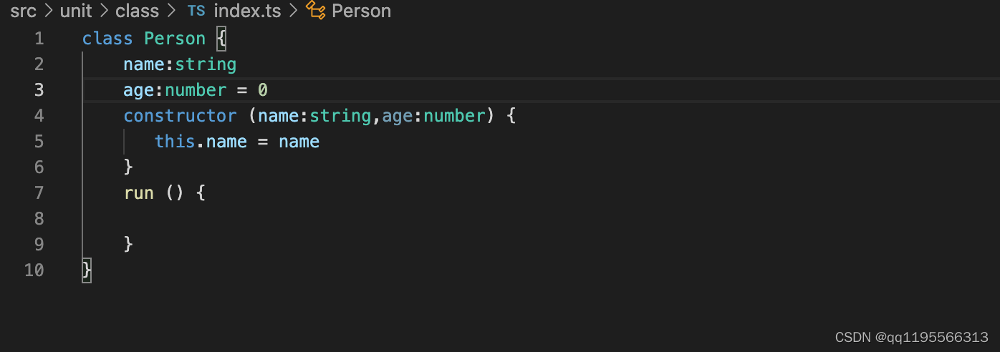
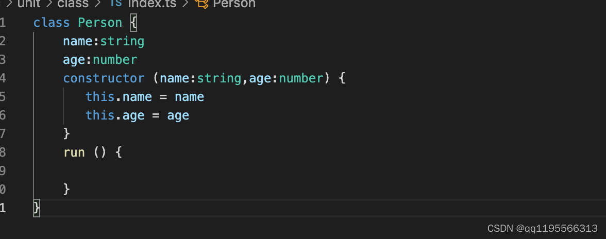
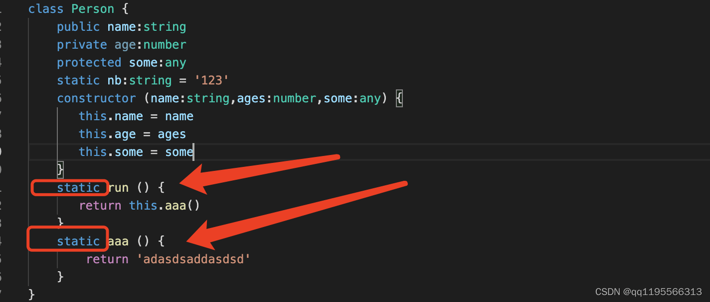

# 类 class

> 传统的JavaScript程序使用函数和基于原型的继承来创建可重用的组件，现在JavaScript程序员将能够使用基于类的面向对象的方式，基于类的继承并且对象是由类构建出来

在TypeScript是不允许直接在constructor 定义变量的，需要在constructor上面先声明：



这样引发了第二个问题你如果了定义了变量不用也会报错，通常是给个**默认值** 或者 **进行赋值**





```typescript
class Greeter {
    greeting: string;
    constructor(message: string) {
        this.greeting = message; // 在引用任何一个类成员的时候都用了this。 它表示我们访问的是类的成员。
    }
    greet() {
        return "Hello, " + this.greeting;
    }
}

let greeter = new Greeter("world");
```

## `extends` 继承

```ts
class Animal {
    move(distanceInMeters: number = 0) {
        console.log(`Animal moved ${distanceInMeters}m.`);
    }
}

class Dog extends Animal { // Dog派生类从基类Animal中继承了属性和方法。
    bark() {
        console.log('Woof! Woof!');
    }
}

const dog = new Dog();
dog.bark();
dog.move(10);
dog.bark();
```

```ts
class Animal {
    name: string;
    constructor(theName: string) { this.name = theName; }
    move(distanceInMeters: number = 0) {
        console.log(`${this.name} moved ${distanceInMeters}m.`);
    }
}

class Snake extends Animal {
    constructor(name: string) { 
        // 派生类包含了一个构造函数，它 必须调用 super()，它会执行基类的构造函数。 
        // 并且在构造函数里访问 this的属性之前，一定要调用 super()。
        super(name); 
    }
    // 重写继承自父类的move方法
    move(distanceInMeters = 5) {
        console.log("Slithering...");
        super.move(distanceInMeters);
    }
}

class Horse extends Animal {
    constructor(name: string) { 
        super(name); 
    }
    move(distanceInMeters = 45) { // 重写继承自父类的move方法
        console.log("Galloping...");
        super.move(distanceInMeters);
    }
}

let sam = new Snake("Sammy the Python");
// 虽然tom被声明为 Animal类型，但因为它的值是 Horse
let tom: Animal = new Horse("Tommy the Palomino");

sam.move();
// Slithering...
// Sammy the Python moved 5m.
tom.move(34); // 调用 tom.move(34)时，它会调用 Horse里重写的方法
// Galloping...
// Tommy the Palomino moved 34m.
```

## `public`，`private`，`protected`修饰符

### `public` 公共

> `public`修饰符可以让你定义的变量在内部访问，也可以在外部访问。如果不写默认就是public

```typescript
class Animal {
    public name: string;
    public constructor(theName: string) { this.name = theName; }
    public move(distanceInMeters: number) {
        console.log(`${this.name} moved ${distanceInMeters}m.`);
    }
}
```

### `private` 私有

> 当成员被标记成 `private`时，它就**不能在声明它的类的外部访问**，只能在类内部中访问。

```ts
class Animal {
    private name: string;
    constructor(theName: string) { this.name = theName; }
}

new Animal("Cat").name; // 错误: 'name' 是私有的.
```

> TypeScript使用的是结构性类型系统。当比较两种不同的类型时，并不在乎它们从何处而来，如果所有成员的类型都是兼容的，就认为它们的类型是兼容的。

但是，当我们比较带有 `private`或 `protected`成员的类型的时候，情况就不同了。 如果其中一个类型里包含一个 `private`成员，那么只有当另外一个类型中也存在这样一个 `private`成员， 并且它们都是来自同一处声明时，我们才认为这两个类型是兼容的。 对于 `protected`成员也使用这个规则。

```ts
class Animal {
    private name: string;
    constructor(theName: string) { this.name = theName; }
}

class Rhino extends Animal {
    constructor() { super("Rhino"); }
}

class Employee {
    private name: string;
    constructor(theName: string) { this.name = theName; }
}

let animal = new Animal("Goat");
let rhino = new Rhino();
let employee = new Employee("Bob");

animal = rhino; // 因为 Animal和 Rhino共享了来自 Animal里的私有成员定义 private name: string，因此它们是兼容的
animal = employee; // 错误: Animal 与 Employee 不兼容.尽管 Employee里也有一个私有成员 name，但它明显不是 Animal里面定义的那个
```

### `protected` 受保护

> `protected`修饰符定义的变量只能在**内部和继承的子类中**访问，不能在外部访问

```ts
class Person {
    protected name: string;
    constructor(name: string) { this.name = name; }
}

class Employee extends Person {
    private department: string;

    constructor(name: string, department: string) {
        super(name)
        this.department = department;
    }

    public getElevatorPitch() {
        return `Hello, my name is ${this.name} and I work in ${this.department}.`;
    }
}

let howard = new Employee("Howard", "Sales");
console.log(howard.getElevatorPitch());// 可以通过 Employee类的实例方法访问,因为 Employee是由 Person派生而来
console.log(howard.name); // 错误, 不能在 Person类外使用 name
```

**构造函数也可以被标记成 `protected`**: 意味着这个类不能在包含它的类外被实例化，但是能被继承。

```ts
class Person {
    protected name: string;
    protected constructor(theName: string) { this.name = theName; }
}

// Employee 能够继承 Person
class Employee extends Person {
    private department: string;

    constructor(name: string, department: string) {
        super(name);
        this.department = department;
    }

    public getElevatorPitch() {
        return `Hello, my name is ${this.name} and I work in ${this.department}.`;
    }
}

let howard = new Employee("Howard", "Sales");
let john = new Person("John"); // 错误: 'Person' 的构造函数是被保护的.
```

## `readonly`修饰符

> 使用 `readonly`关键字将属性设置为只读的。 **只读属性必须在声明时或构造函数里被初始化**。

```ts
class Octopus {
    readonly name: string;
    readonly numberOfLegs: number = 8; // 声明并初始化
    constructor (theName: string) {
        this.name = theName; // 在构造函数里将只读属性初始化
    }
}
let dad = new Octopus("Man with the 8 strong legs");
dad.name = "Man with the 3-piece suit"; // 错误! name 是只读的.
```

### 参数属性

**(重点) ：** 

* 参数属性通过给构造函数参数前面添加一个访问限定符来声明。 
* 使用 `private`限定一个参数属性会声明并初始化一个私有成员；
* 对于 `public`和 `protected`来说也是一样。

```ts
// 对上面 Octopus类的修改版，使用了参数属性
class Octopus {
    readonly numberOfLegs: number = 8;
    constructor(readonly name: string) { // 参数属性可以方便地让我们在一个地方定义并初始化一个成员。 
    }
}
```

## 存取器 `getters/setters`

> 通过**`getters/setters`**来截取对对象成员的访问，有效的控制对对象成员的访问。

```ts
let passcode = "secret passcode";

class Employee {
    private _fullName: string;

    get fullName(): string {
        return this._fullName;
    }

    set fullName(newName: string) { // 设置属性值时添加限制
        if (passcode && passcode == "secret passcode") {
            this._fullName = newName;
        }
        else {
            console.log("Error: Unauthorized update of employee!");
        }
    }
}

let employee = new Employee();
employee.fullName = "Bob Smith";
if (employee.fullName) {
    alert(employee.fullName);
}
```

**注意：** 

* 存取器要求你将编译器设置为输出ECMAScript 5或更高。 不支持降级到ECMAScript 3。

* 其次，**只带有 `get`不带有 `set`的存取器自动被推断为 `readonly`。 ** 这在从代码生成 `.d.ts`文件时是有帮助的，因为利用这个属性的用户会看到不允许够改变它的值。

## 静态属性 `static`

> 静态属性存在于类本身上面而不是类的实例上。
>
> 可分为：`静态属性`、`静态函数`

```ts
class Grid {
  	// 使用 static定义 origin，因为它是所有网格都会用到的属性。
    static origin = {x: 0, y: 0}; 
    calculateDistanceFromOrigin(point: {x: number; y: number;}) {
      	// 每个实例想要访问这个属性时，都要在 origin前面加上类名
        let xDist = (point.x - Grid.origin.x); 
        let yDist = (point.y - Grid.origin.y);
        return Math.sqrt(xDist * xDist + yDist * yDist) / this.scale;
    }
    constructor (public scale: number) { }
}

let grid1 = new Grid(1.0);  // 1x scale
let grid2 = new Grid(5.0);  // 5x scale

console.log(grid1.calculateDistanceFromOrigin({x: 10, y: 10}));
console.log(grid2.calculateDistanceFromOrigin({x: 10, y: 10}));
```

**需注意📢**： 如果两个函数都是`static` 静态的是可以通过`this`互相调用

> 因为**静态函数**中的`this`指的是当前这个类，那么就可以访问所有`static`修饰的类成员
>
> 而**构造函数**里面的`this`指的是新的**实例对象**



## 抽象类 `abstract`

> 抽象类可以**包含或不包含**成员的实现细节。 `abstract`关键字是用于定义抽象类和在抽象类内部定义抽象方法

1. **<u>抽象类做为其它派生类的基类使用</u>。一般不会直接被实例化。**
2. **抽象方法的语法与接口方法相似，两者都是定义方法签名但不包含方法体。但不同于接口，抽象类可以包含成员的实现细节（抽象类中除抽象函数之外，其他函数可以包含具体实现），但在有`abstract`关键字修饰的属性上，抽象类中的抽象方法不包含具体实现并且必须在派生类中实现。**
3. **抽象方法必须包含 `abstract`关键字并且可以包含访问修饰符**

```ts
abstract class Animal {
    abstract makeSound(): void; // 抽象类中的抽象方法不包含具体实现并且必须在派生类中实现。
    move(): void {
        console.log('roaming the earch...');
    }
}
```

```ts
abstract class Department {

    constructor(public name: string) {
    }

    printName(): void {
        console.log('Department name: ' + this.name);
    }

    abstract printMeeting(): void; // 必须在派生类中实现
}

class AccountingDepartment extends Department {

    constructor() {
        super('Accounting and Auditing'); // 在派生类的构造函数中必须调用 super()
    }

    printMeeting(): void {
        console.log('The Accounting Department meets each Monday at 10am.');
    }

    generateReports(): void {
        console.log('Generating accounting reports...');
    }
}

let department: Department; // 允许创建一个对抽象类型的引用
department = new Department(); // 错误: 不能创建一个抽象类的实例
department = new AccountingDepartment(); // 允许对一个抽象子类进行实例化和赋值
department.printName();
department.printMeeting();
department.generateReports(); // 错误: 方法在声明的抽象类中不存在。因为department是对对抽象类型的引用，声明为 AccountingDepartment类型便可
```

## 构造函数

```ts
class Greeter {
    static standardGreeting = "Hello, there";
    greeting: string;
    greet() {
        if (this.greeting) {
            return "Hello, " + this.greeting;
        }
        else {
            return Greeter.standardGreeting;
        }
    }
}

let greeter1: Greeter;
greeter1 = new Greeter(); // 实例化 Greeter类，并使用这个对象
console.log(greeter1.greet());

// greeterMaker变量保存了这个类或者说保存了类构造函数
// 使用 typeof Greeter，意思是取Greeter类的类型，而不是实例的类型。 或者更确切的说，"告诉我 
// Greeter标识符的类型"，也就是构造函数的类型。 这个类型包含了类的所有静态成员和构造函数。
let greeterMaker: typeof Greeter = Greeter;
greeterMaker.standardGreeting = "Hey there!";

let greeter2: Greeter = new greeterMaker(); // 在 greeterMaker上使用 new，创建 Greeter的实例
console.log(greeter2.greet());
```

## 把类当做接口使用

> 类定义会创建两个东西：类的**实例类型**和一个**构造函数**。

**因为类可以创建出类型，所以你能够在允许使用接口的地方使用类。**

```tsx
class Point {
    x: number;
    y: number;
}

interface Point3d extends Point {
    z: number;
}

let point3d: Point3d = {x: 1, y: 2, z: 3};
```

## 小结

- ***静态属性*** **存在于类本身上面而不是类的实例上，通过类名访问**
- **类具有 *实例部分*与 *静态部分*这两个部分。**
- **因为类可以创建出类型，所以可以在允许使用接口的地方使用类。**

### 继承

1. **子类从父类继承 属性 和 方法**
2. **子类继承父类时，子类的 constructor构造函数内 必须先调用 super()执行父类的构造函数。并且在构造函数里访问 this的属性之前，一定要调用 super()，super函数可传参数**

3. **子类的方法内，可通过super关键字调用父类的方法**

### 修饰符

*  **公共** ***public*** **默认**

*  **私有** ***private*** 

  不能在声明它的类的外部访问

* **受保护** ***protected***

  在子类中仍然可以访问，但在类外不能访问。

  构造函数被标记成 ***protected*** 时，该类不能被实例化，但可以被子类继承使用

* **只读** **readonly**

  只读属性必须在 **声明时 ** 或 **构造函数里** 被初始化

最后，通过以上修饰符在**构造函数constructor**的参数前添加，实现***参数属性***。参数属性可以方便地定义并初始化一个成员

```ts
constructor(readonly name: string) 
即是 
readonly name: string;
constructor(name: string) {}
```

### 存取器

通过**getters/setters**来截取对对象成员的访问，有效的控制对对象成员的访问。**只带有 `get`不带有 `set`的存取器自动被推断为 `readonly`。 **

### 抽象类

* `abstract`关键字是用于定义抽象类和在抽象类内部定义抽象方法

* **抽象类做为其它派生类的基类使用。一般不会直接被实例化。**

*  **抽象方法的语法与接口方法相似，两者都是定义方法签名但不包含方法体。**

  抽象类可以**包含或不包含**成员的实现细节，**在有`abstract`关键字修饰的属性上，抽象类中的抽象方法不包含具体实现并且必须在派生类中实现。在没有abstract修饰符的方法上要有具体实现细节**