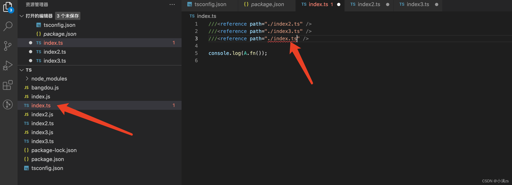

# `///` 三斜线指令

> 三斜线指令是包含单个XML标签的单行注释，注释的内容会做为编译器指令使用。

1. **三斜线指令*仅*可放在包含它的文件的最顶端**。

2. **一个三斜线指令的前面只能出现单行或多行注释，这包括其它的三斜线指令。 如果它们出现在一个语句或声明之后，那么它们会被当做普通的单行注释，并且不具有特殊的涵义。**

3. **如果指定了`--noResolve`编译选项，三斜线引用会被忽略**

   如果你在配置文件 配置了noResolve 或者自身调用自身文件会报错

   

**`/// <reference path="..." />`指令是三斜线指令中最常见的一种。 它用于声明文件间的 *依赖*。三斜线引用告诉编译器在编译过程中要引入的额外的文件**。可以理解成`import`

当使用`--out`或`--outFile`时，它也可以做为调整输出内容顺序的一种方法。 文件在输出文件内容中的位置与经过预处理后的输入顺序一致。

## 预处理输入文件

编译器会对输入文件进行预处理来解析所有三斜线引用指令。 在这个过程中，额外的文件会加到编译过程中。这个过程会以一些*根文件*开始； 它们是在命令行中指定的文件或是在 `tsconfig.json`中的`"files"`列表里的文件。

## `/// <reference types="..." />`

**与 `/// <reference path="..." />`指令相似，`/// <reference types="..." />`指令则声明了对某个包的依赖。对这些包的名字的解析与在 `import`语句里对模块名的解析类似。 可以简单地把三斜线类型引用指令当做 `import`声明的包**。

例如，把 `/// <reference types="node" />`引入到声明文件，表明这个文件使用了 `@types/node/index.d.ts`里面声明的名字； 并且，这个包需要在编译阶段与声明文件一起被包含进来。

仅当在你需要写一个`d.ts`文件时才使用这个指令。

对于那些在编译阶段生成的声明文件，编译器会自动地添加`/// <reference types="..." />`； *当且仅当*结果文件中使用了引用的包里的声明时才会在生成的声明文件里添加`/// <reference types="..." />`语句。

若要在`.ts`文件里声明一个对`@types`包的依赖，使用`--types`命令行选项或在`tsconfig.json`里指定。

## `/// <reference no-default-lib="true"/>`

**这个指令把一个文件标记成*默认库*。 这个指令告诉编译器在编译过程中*不要*包含这个默认库（比如，`lib.d.ts`）。 这与在命令行上使用 `--noLib`相似。**

当传递了`--skipDefaultLibCheck`时，编译器只会忽略检查带有`/// <reference no-default-lib="true"/>`的文件。

## `/// <amd-module />`

默认情况下生成的AMD模块都是匿名的。

`amd-module`指令允许给编译器传入一个可选的模块名：

```ts
# amdModule.ts
///<amd-module name='NamedModule'/>
export class C {
}
```

这会将`NamedModule`传入到AMD `define`函数里：

```tsx
# amdModule.js
define("NamedModule", ["require", "exports"], function (require, exports) {
    var C = (function () {
        function C() {
        }
        return C;
    })();
    exports.C = C;
});
```

## `/// <amd-dependency />`

> **注意**：这个指令被废弃了。使用`import "moduleName";`语句代替。

`/// <amd-dependency path="x" />`告诉编译器有一个非TypeScript模块依赖需要被注入，做为目标模块`require`调用的一部分。

`amd-dependency`指令也可以带一个可选的`name`属性；它允许我们为amd-dependency传入一个可选名字：

```ts
/// <amd-dependency path="legacy/moduleA" name="moduleA"/>
declare var moduleA:MyType
moduleA.callStuff()
```

生成的JavaScript代码：

```js
define(["require", "exports", "legacy/moduleA"], function (require, exports, moduleA) {
    moduleA.callStuff()
});
```