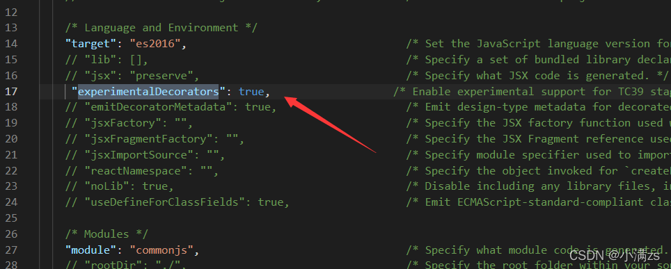

## 装饰器 `Decorator`

> 它们不仅增加了代码的可读性，清晰地表达了意图，而且提供一种方便的手段，**增加**或**修改类的功能**

Decorator [装饰器](https://so.csdn.net/so/search?q=装饰器&spm=1001.2101.3001.7020)是一项实验性特性，在未来的版本中可能会发生改变。若要启用实验性的装饰器特性，必须在[命令行](https://so.csdn.net/so/search?q=命令行&spm=1001.2101.3001.7020)或`tsconfig.json`里启用[编译器](https://so.csdn.net/so/search?q=编译器&spm=1001.2101.3001.7020)选项。



>  装饰器是一种特殊类型的声明，是一个方法，可以被附加到**类，方法，属性，参数**上

**4种常见装饰器**：

* 类装饰器
* 属性装饰器
* 方法装饰器
* 参数装饰器

**装饰器的写法**：

* 普通装饰器（无法传参）
* 装饰器工厂（可传参）


**简单示例**

1. 首先定义一个类

   ```ts
   class A {
       constructor() {
    
       }
   }
   ```

2. 定义一个类装饰器函数 他会把ClassA的构造函数传入你的watcher函数当做第一个参数

   ```ts
   const watcher: ClassDecorator = (target: Function) => {
       target.prototype.getParams = <T>(params: T):T => {
           return params
       }
   }
   ```

3. 使用的时候 直接通过@函数名使用

   ```ts
   @watcher
   class A {
       constructor() {
    
       }
   }
   ```

4. 验证

   ```ts
   const a = new A();
   console.log((a as any).getParams('123'));
   ```

### 装饰器工厂`ClassDecorator`

> 其实也就是一个高阶函数，外层的函数接受值，内层的函数最终接受类的构造函数

```ts
const watcher = (name: string): ClassDecorator => {
    return (target: Function) => {
        target.prototype.getParams = <T>(params: T): T => {
            return params
        }
        target.prototype.getOptions = (): string => {
            return name
        }
    }
}
 
@watcher('name')
class A {
    constructor() {
 
    }
}
 
const a = new A();
console.log((a as any).getParams('123'));
```

#### 装饰器组合

```ts
const watcher = (name: string): ClassDecorator => {
    return (target: Function) => {
        target.prototype.getParams = <T>(params: T): T => {
            return params
        } 
        target.prototype.getOptions = (): string => {
            return name
        }
    }
}
const watcher2 = (name: string): ClassDecorator => {
    return (target: Function) => {
        target.prototype.getNames = ():string => {
            return name
        }
    }
}
 
@watcher2('name2')
@watcher('name')
class A {
    constructor() {
 
    }
}
 
 
const a = new A();
console.log((a as any).getOptions());
console.log((a as any).getNames());
```

### 方法装饰器`MethodDecorator`

返回三个参数

1. 对于静态成员来说是类的构造函数，对于实例成员是类的原型对象。
2. 成员的名字。
3. 成员的*属性描述符*。

`[
  {},
  'setParasm',
  {
    value: [Function: setParasm],
    writable: true,
    enumerable: false,
    configurable: true
  }
]`

```ts
const met:MethodDecorator = (...args) => {
    console.log(args);
}
 
class A {
    constructor() {
 
    }
    @met
    getName ():string {
        return '小满'
    }
}
 
 
const a = new A();
```

### 属性装饰器`PropertyDecorator`

返回两个参数

1. 对于静态成员来说是类的构造函数，对于实例成员是类的原型对象。
2. 属性的名字。

`[ {}, 'name', undefined ]`

```ts
const met:PropertyDecorator = (...args) => {
    console.log(args);
}
 
class A {
    @met
    name:string
    constructor() { 
 
    }
   
}
 
const a = new A();
```

### 参数装饰器`ParameterDecorator`

返回三个参数

1. 对于静态成员来说是类的构造函数，对于实例成员是类的原型对象。
2. 成员的名字。
3. 参数在函数参数列表中的索引。

`[ {}, 'setParasm', 0 ]`

```ts
const met:ParameterDecorator = (...args) => {
    console.log(args);
}
 
class A {
    constructor() {
 
    }
    setParasm (@met name:string = '213') {
 
    }
}
 
 
const a = new A();
```

