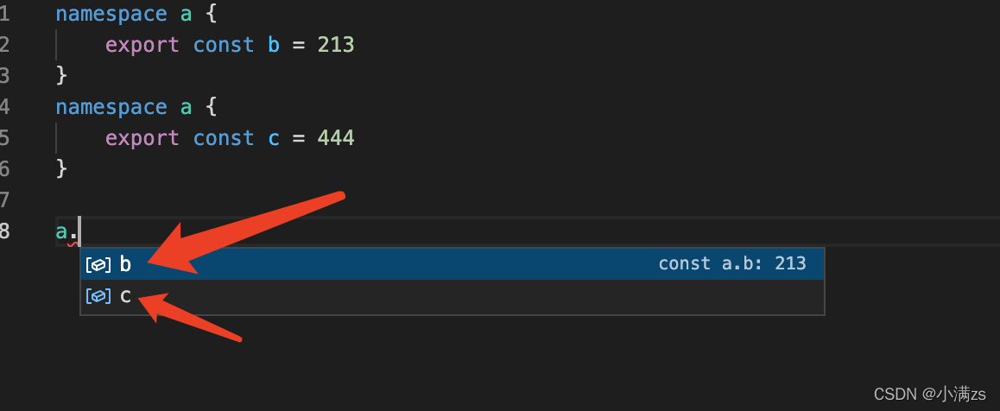

# 模块

> 模块在其自身的作用域里执行，而不是在全局作用域里；这意味着定义在一个模块里的变量，函数，类等等在模块外部是不可见的，除非你明确地使用[`export`形式](https://www.tslang.cn/docs/handbook/modules.html#export)之一导出它们。 相反，如果想使用其它模块导出的变量，函数，类，接口等的时候，你必须要导入它们，可以使用 [`import`形式](https://www.tslang.cn/docs/handbook/modules.html#import)之一。

**模块是自声明的；两个模块之间的关系是通过在文件级别上使用imports和exports建立的。任何包含顶级`import`或者`export`的文件都被当成一个模块。相反地，如果一个文件不带有顶级的`import`或者`export`声明，那么它的内容被视为全局可见的（因此对模块也是可见的）**

## 导出

> 任何声明（比如变量，函数，类，类型别名或接口）都能够通过添加`export`关键字来导出。

```tsx
# 1.导出申明
export interface StringValidator { // 导出接口
    isAcceptable(s: string): boolean;
}
export const numberRegexp = /^[0-9]+$/; // 导出变量

export class ZipCodeValidator implements StringValidator { // 导出类
    isAcceptable(s: string) {
        return s.length === 5 && numberRegexp.test(s);
    }
}

# 2.导出语句
export { ZipCodeValidator };
export { ZipCodeValidator as mainValidator }; // 导出重命名

# 3.重新导出
// 1.扩展其它模块，并且只导出那个模块的部分内容。 重新导出功能并不会在当前模块导入那个模块或定义一个新的局部变量。
export class ParseIntBasedZipCodeValidator {
	// ...
}
// 导出原先的验证器但做了重命名
export {ZipCodeValidator as RegExpBasedZipCodeValidator} from "./ZipCodeValidator";

// 2.一个模块可以包裹多个模块，并把他们导出的内容联合在一起通过语法：export * from "module"
export * from "./StringValidator"; // exports interface StringValidator
export * from "./LettersOnlyValidator"; // exports class LettersOnlyValidator
export * from "./ZipCodeValidator";  // exports class ZipCodeValidator
```

### 默认导出

每个模块都可以有一个`default`导出。 默认导出使用 `default`关键字标记；并且一个模块只能够有一个`default`导出。

```ts
declare let $: JQuery;
export default $;

// default导出也可以是一个值
export default "123";

# Log.ts
import num from "./OneTwoThree";
console.log(num); // "123"
```

**类和函数声明可以直接被标记为默认导出。 标记为默认导出的类和函数的名字是可以省略的**

```tsx
# ZipCodeValidator.ts
export default class ZipCodeValidator {
    static numberRegexp = /^[0-9]+$/;
    isAcceptable(s: string) {
        return s.length === 5 && ZipCodeValidator.numberRegexp.test(s);
    }
}
# Test.ts
import validator from "./ZipCodeValidator";

let myValidator = new validator();
```

## 导入

```ts
# 在一个模块中导入另一个模块中的某个导出内容
import { ZipCodeValidator } from "./ZipCodeValidator";
let myValidator = new ZipCodeValidator();

# 对导入内容重命名
import { ZipCodeValidator as ZCV } from "./ZipCodeValidator";
let myValidator = new ZCV();

# 将整个模块导入到一个变量，并通过它来访问模块的导出部分
import * as validator from "./ZipCodeValidator";
let myValidator = new validator.ZipCodeValidator();

# 尽管不推荐这么做，一些模块会设置一些全局状态供其它模块使用。 这些模块可能没有任何的导出或用户根本就不关注它的导出。 使用下面的方法来导入这类模块：
import "./my-module.js";
```

## `export =` 和 `import = require()`

`CommonJS`和`AMD`的环境里都有一个`exports`变量，这个变量包含了一个模块的所有导出内容。

`CommonJS`和`AMD`的`exports`都可以被赋值为一个`对象`, 这种情况下其作用就类似于 es6 语法里的默认导出，即 `export default`语法了。虽然作用相似，但是 `export default` 语法并不能兼容`CommonJS`和`AMD`的`exports`。

**为了支持`CommonJS`和`AMD`的`exports`, TypeScript提供了`export =`语法。`export =`语法定义一个模块的导出`对象`。 该`对象`指的是类，接口，命名空间，函数或枚举**。

**若使用`export =`导出一个模块，则必须使用TypeScript的特定语法`import module = require("module")`来导入此模块。**

```ts
# ZipCodeValidator.ts
let numberRegexp = /^[0-9]+$/;
class ZipCodeValidator {
    isAcceptable(s: string) {
        return s.length === 5 && numberRegexp.test(s);
    }
}
export = ZipCodeValidator;

# Test.ts
import zip = require("./ZipCodeValidator");

// Some samples to try
let strings = ["Hello", "98052", "101"];

// Validators to use
let validator = new zip();

// Show whether each string passed each validator
strings.forEach(s => {
  console.log(`"${ s }" - ${ validator.isAcceptable(s) ? "matches" : "does not match" }`);
});
```

## 生成模块代码

根据编译时指定的模块目标参数，编译器会生成相应的供Node.js ([CommonJS](http://wiki.commonjs.org/wiki/CommonJS))，Require.js ([AMD](https://github.com/amdjs/amdjs-api/wiki/AMD))，[UMD](https://github.com/umdjs/umd)，[SystemJS](https://github.com/systemjs/systemjs)或[ECMAScript 2015 native modules](http://www.ecma-international.org/ecma-262/6.0/#sec-modules) (ES6)模块加载系统使用的代码。

下面的例子说明了导入导出语句里使用的名字是怎么转换为相应的模块加载器代码的：

```tsx
#SimpleModule.ts
import m = require("mod");
export let t = m.something + 1;

#AMD / RequireJS SimpleModule.js
define(["require", "exports", "./mod"], function (require, exports, mod_1) {
    exports.t = mod_1.something + 1;
});

#CommonJS / Node SimpleModule.js
let mod_1 = require("./mod");
exports.t = mod_1.something + 1;

#UMD SimpleModule.js
(function (factory) {
    if (typeof module === "object" && typeof module.exports === "object") {
        let v = factory(require, exports); if (v !== undefined) module.exports = v;
    }
    else if (typeof define === "function" && define.amd) {
        define(["require", "exports", "./mod"], factory);
    }
})(function (require, exports) {
    let mod_1 = require("./mod");
    exports.t = mod_1.something + 1;
});

# System SimpleModule.js
System.register(["./mod"], function(exports_1) {
    let mod_1;
    let t;
    return {
        setters:[
            function (mod_1_1) {
                mod_1 = mod_1_1;
            }],
        execute: function() {
            exports_1("t", t = mod_1.something + 1);
        }
    }
});
```

**对于Node.js来说，使用`--module commonjs`； 对于Require.js来说，使用`--module amd`。比如：**

```tsx
tsc --module commonjs Test.ts
```

## 可选的模块加载和其它高级加载场景

有时候，你只想在某种条件下才加载某个模块。

**这种模式的核心是`import id = require("...")`语句可以让我们访问模块导出的类型**。 模块加载器会被动态调用（通过 `require`），就像下面`if`代码块里那样。 它利用了省略引用的优化，所以模块只在被需要时加载。 为了让这个模块工作，一定要注意 **`import`定义的标识符只能在表示类型处使用**（不能在会转换成JavaScript的地方）。

**为了确保类型安全性，可以使用`typeof`关键字，当在表示类型的地方使用时，会得出一个类型值，这里就表示模块的类型。**

```tsx
# Node.js里的动态模块加载
declare function require(moduleName: string): any;

import { ZipCodeValidator as Zip } from "./ZipCodeValidator";

if (needZipValidation) {
    let ZipCodeValidator: typeof Zip = require("./ZipCodeValidator");
    let validator = new ZipCodeValidator();
    if (validator.isAcceptable("...")) { /* ... */ }
}

# require.js里的动态模块加载
declare function require(moduleNames: string[], onLoad: (...args: any[]) => void): void;

import * as Zip from "./ZipCodeValidator";

if (needZipValidation) {
    require(["./ZipCodeValidator"], (ZipCodeValidator: typeof Zip) => {
        let validator = new ZipCodeValidator.ZipCodeValidator();
        if (validator.isAcceptable("...")) { /* ... */ }
    });
}

#System.js里的动态模块加载
declare const System: any;

import { ZipCodeValidator as Zip } from "./ZipCodeValidator";

if (needZipValidation) {
    System.import("./ZipCodeValidator").then((ZipCodeValidator: typeof Zip) => {
        var x = new ZipCodeValidator();
        if (x.isAcceptable("...")) { /* ... */ }
    });
}
```

## 使用其它的JavaScript库

要想描述非TypeScript编写的类库的类型，我们需要声明类库所暴露出的API。 它们通常是在 `.d.ts`文件里定义的。

### 外部模块

在Node.js里大部分工作是通过加载一个或多个模块实现的。 可以使用顶级的 `export`声明来为每个模块都定义一个`.d.ts`文件，但最好还是写在一个大的`.d.ts`文件里。我们使用与构造一个外部命名空间相似的方法，但是这里**使用 `module`关键字并且把名字用引号括起来，方便之后`import`**。 例如：

```ts
# node.d.ts (simplified excerpt)
declare module "url" {
    export interface Url {
        protocol?: string;
        hostname?: string;
        pathname?: string;
    }

    export function parse(urlStr: string, parseQueryString?, slashesDenoteHost?): Url;
}

declare module "path" {
    export function normalize(p: string): string;
    export function join(...paths: any[]): string;
    export let sep: string;
}
```

然后可以**`/// <reference>` `node.d.ts`并且使用`import url = require("url");`或`import * as URL from "url"`加载模块**。

```ts
/// <reference path="node.d.ts"/>
import * as URL from "url";
let myUrl = URL.parse("http://www.typescriptlang.org");
```

#### 外部模块简写

假如你不想在使用一个新模块之前花时间去编写声明，你可以采用声明的简写形式以便能够快速使用它。

```ts
# declarations.d.ts
declare module "hot-new-module";
// 简写模块里所有导出的类型将是`any`
import x, {y} from "hot-new-module";
x(y);
```

#### 模块声明通配符

某些模块加载器如[SystemJS](https://github.com/systemjs/systemjs/blob/master/docs/overview.md#plugin-syntax) 和 [AMD](https://github.com/amdjs/amdjs-api/blob/master/LoaderPlugins.md)支持导入非JavaScript内容。 它们通常会使用一个前缀或后缀来表示特殊的加载语法。 模块声明通配符可以用来表示这些情况。

```ts
declare module "*!text" {
    const content: string;
    export default content;
}
// 或者
declare module "json!*" {
    const value: any;
    export default value;
}

// 导入匹配"*!text"或"json!*"的内容
import fileContent from "./xyz.txt!text";
import data from "json!http://example.com/data.json";
console.log(data, fileContent);
```

#### UMD模块

有些模块被设计成兼容多个模块加载器，或者不使用模块加载器（全局变量）。 它们以 [UMD](https://github.com/umdjs/umd)模块为代表。 这些库可以通过导入的形式或全局变量的形式访问。 例如：

```ts
# math-lib.d.ts
export function isPrime(x: number): boolean;
export as namespace mathLib;
    
// 之后，这个库可以在某个模块里通过导入来使用：
import { isPrime } from "math-lib";
isPrime(2);
mathLib.isPrime(2); // 错误: 不能在模块内使用全局定义。
```

**在某个不带有模块导入或导出的脚本文件里, 可以通过全局变量的形式使用**

```tsx
mathLib.isPrime(2);
```

## 创建模块结构

1. **尽可能地在顶层导出**

   用户应该更容易地使用模块导出的内容, 嵌套层次过多会变得难以处理。

   从模块中导出一个命名空间就是增加了一个嵌套，在使用模块的时候它们额外地增加了一层， 这对用户来说是很不便的并且通常是多余的。

   导出类的静态方法也有同样的问题 - 这个类本身就增加了一层嵌套。 

2. **如果仅导出单个 `class` 或 `function`，使用 `export default`**

3. **如果要导出多个对象，把它们放在顶层里导出**

4. **当你要导出大量内容的时候使用命名空间导入模式**

   ```ts
   # MyLargeModule.ts
   export class Dog { ... }
   export class Cat { ... }
   export class Tree { ... }
   export class Flower { ... }
   
   # Consumer.ts
   import * as myLargeModule from "./MyLargeModule.ts";
   let x = new myLargeModule.Dog();
   ```

#### 使用重新导出来扩展一个模块的功能

```ts
# Calculator.ts 一个简单的计算器实现
export class Calculator {
    private current = 0;
    private memory = 0;
    private operator: string;

    protected processDigit(digit: string, currentValue: number) {
        if (digit >= "0" && digit <= "9") {
            return currentValue * 10 + (digit.charCodeAt(0) - "0".charCodeAt(0));
        }
    }

    protected processOperator(operator: string) {
        if (["+", "-", "*", "/"].indexOf(operator) >= 0) {
            return operator;
        }
    }

    protected evaluateOperator(operator: string, left: number, right: number): number {
        switch (this.operator) {
            case "+": return left + right;
            case "-": return left - right;
            case "*": return left * right;
            case "/": return left / right;
        }
    }

    private evaluate() {
        if (this.operator) {
            this.memory = this.evaluateOperator(this.operator, this.memory, this.current);
        }
        else {
            this.memory = this.current;
        }
        this.current = 0;
    }

    public handleChar(char: string) {
        if (char === "=") {
            this.evaluate();
            return;
        }
        else {
            let value = this.processDigit(char, this.current);
            if (value !== undefined) {
                this.current = value;
                return;
            }
            else {
                let value = this.processOperator(char);
                if (value !== undefined) {
                    this.evaluate();
                    this.operator = value;
                    return;
                }
            }
        }
        throw new Error(`Unsupported input: '${char}'`);
    }

    public getResult() {
        return this.memory;
    }
}

export function test(c: Calculator, input: string) {
    for (let i = 0; i < input.length; i++) {
        c.handleChar(input[i]);
    }

    console.log(`result of '${input}' is '${c.getResult()}'`);
}

# TestCalculator.ts
import { Calculator, test } from "./Calculator";

let c = new Calculator();
test(c, "1+2*33/11="); // prints 9
```

现在扩展它，添加支持输入其它进制（十进制以外）

```ts
# ProgrammerCalculator.ts
import { Calculator } from "./Calculator";

class ProgrammerCalculator extends Calculator {
    static digits = ["0", "1", "2", "3", "4", "5", "6", "7", "8", "9", "A", "B", "C", "D", "E", "F"];

    constructor(public base: number) {
        super();
        const maxBase = ProgrammerCalculator.digits.length;
        if (base <= 0 || base > maxBase) {
            throw new Error(`base has to be within 0 to ${maxBase} inclusive.`);
        }
    }

    protected processDigit(digit: string, currentValue: number) {
        if (ProgrammerCalculator.digits.indexOf(digit) >= 0) {
            return currentValue * this.base + ProgrammerCalculator.digits.indexOf(digit);
        }
    }
}

// 将新的扩展计算器导出为 Calculator
export { ProgrammerCalculator as Calculator };

// 导出辅助函数
export { test } from "./Calculator";

# TestProgrammerCalculator.ts
import { Calculator, test } from "./ProgrammerCalculator";

let c = new Calculator(2);
test(c, "001+010="); // prints 3
```

#### 危险信号

以下均为模块结构上的危险信号。重新检查以确保你没有在对模块使用命名空间：

- 文件的顶层声明是`export namespace Foo { ... }` （删除`Foo`并把所有内容向上层移动一层）
- 文件只有一个`export class`或`export function` （考虑使用`export default`）
- 多个文件的顶层具有同样的`export namespace Foo {` （不要以为这些会合并到一个`Foo`中！）

## 小结

1. **在一个模块里重新导出其他模块，可扩展该模块的功能。重新导出功能并不会在当前模块导入那个模块或定义一个新的局部变量。**
2. **一个模块可以包裹多个模块，并把他们导出的内容联合在一起通过语法：`export * from "module"`**

3. **类和函数声明可以直接被标记为默认导出。 标记为默认导出的类和函数的名字是可以省略的**

4. **为了支持`CommonJS`和`AMD`的`exports`, TypeScript提供了`export =`语法。`export =`语法定义一个模块的导出`对象`。 该`对象`指的是<u>类，接口，命名空间，函数或枚举</u>**。

   **若使用`export =`导出一个模块，则必须使用TypeScript的特定语法`import module = require("module")`来导入此模块。**

5. **使用其他JS库的API时，`.d.ts`文件里使用 `module`关键字并且把模块名字用引号括起来。在需要使用模块的地方`/// <reference>` `node.d.ts`并且使用`import url = require("url");`或`import * as URL from "url"`加载模块****
6. **如果仅导出单个 `class` 或 `function`，使用 `export default`**
7. **如果要导出多个对象，把它们放在顶层里导出**
8. **当你要导出大量内容的时候使用命名空间导入模式**
9. **模块里不要使用命名空间。 模块具有其自己的作用域，并且只有导出的声明才会在模块外部可见。 记住这点，命名空间在使用模块时几乎没什么价值。**

# 命名空间

> 我们在工作中无法避免[全局变量](https://so.csdn.net/so/search?q=全局变量&spm=1001.2101.3001.7020)造成的污染，TypeScript提供了`namespace` 避免这个问题出现
>
> - 内部模块，主要用于组织代码，避免命名冲突。
> - 命名空间内的类默认私有
> - 通过 `export` 暴露（通过`export`将想要暴露的部分导出，不用export 导出是无法读取其值的）
> - 通过 `namespace` 关键字定义

 [TypeScript](https://so.csdn.net/so/search?q=TypeScript&spm=1001.2101.3001.7020)与ECMAScript 2015一样，任何包含顶级`import`或者`export`的文件都被当成一个模块。相反地，如果一个文件不带有顶级的`import`或者`export`声明，那么它的内容被视为全局可见的（因此对模块也是可见的）

> 命名空间是位于全局命名空间下的一个普通的带有名字的JavaScript对象。 这令命名空间十分容易使用。 它们可以在多文件中同时使用，并通过 `--outFile`结合在一起。 命名空间是帮你组织Web应用不错的方式，你可以把所有依赖都放在HTML页面的 `<script>`标签里。
>
> 但就像其它的全局命名空间污染一样，它很难去识别组件之间的依赖关系，尤其是在大型的应用中

下面代码中，把所有**与验证器相关的类型都放到一个叫做`Validation`的命名空间里**。 

因为我们想**让这些接口和类在命名空间之外也是可访问的，所以需要使用 `export`**。 

相反的，**变量 `lettersRegexp`和`numberRegexp`是实现的细节**，不需要导出，因此它们在命名空间外是不能访问的。 

**由于是在命名空间之外访问，因此需要限定类型的名称**，比如 `Validation.LettersOnlyValidator`。

```ts
namespace Validation {
    export interface StringValidator {
        isAcceptable(s: string): boolean;
    }

    const lettersRegexp = /^[A-Za-z]+$/;
    const numberRegexp = /^[0-9]+$/;

    export class LettersOnlyValidator implements StringValidator {
        isAcceptable(s: string) {
            return lettersRegexp.test(s);
        }
    }

    export class ZipCodeValidator implements StringValidator {
        isAcceptable(s: string) {
            return s.length === 5 && numberRegexp.test(s);
        }
    }
}
// 使用验证器
let validators: { [s: string]: Validation.StringValidator; } = {};
validators["ZIP code"] = new Validation.ZipCodeValidator();
validators["Letters only"] = new Validation.LettersOnlyValidator();

let strings = ["Hello", "98052", "101"];
// 显示每个字符串是否通过了每个验证程序
for (let s of strings) {
    for (let name in validators) {
        console.log(`"${ s }" - ${ validators[name].isAcceptable(s) ? "matches" : "does not match" } ${ name }`);
    }
}
```

## 分离到多文件

当应用变得越来越大时，我们需要将代码分离到不同的文件中以便于维护。把`Validation`命名空间分割成多个文件。 尽管是不同的文件，它们仍是同一个命名空间，并且在使用的时候就如同它们在一个文件中定义的一样。 因为不同文件之间存在依赖关系，所以我们**加入引用标签**来告诉编译器文件之间的关联。

```ts
# Validation.ts
namespace Validation {
    export interface StringValidator {
        isAcceptable(s: string): boolean;
    }
}
```

```ts
# LettersOnlyValidator.ts
/// <reference path="Validation.ts" />
namespace Validation {
    const lettersRegexp = /^[A-Za-z]+$/;
    export class LettersOnlyValidator implements StringValidator {
        isAcceptable(s: string) {
            return lettersRegexp.test(s);
        }
    }
}
```

```ts
# ZipCodeValidator.ts
/// <reference path="Validation.ts" />
namespace Validation {
    const numberRegexp = /^[0-9]+$/;
    export class ZipCodeValidator implements StringValidator {
        isAcceptable(s: string) {
            return s.length === 5 && numberRegexp.test(s);
        }
    }
}
```

```ts
# Test.ts
/// <reference path="Validation.ts" />
/// <reference path="LettersOnlyValidator.ts" />
/// <reference path="ZipCodeValidator.ts" />

// 使用验证器
let validators: { [s: string]: Validation.StringValidator; } = {};
validators["ZIP code"] = new Validation.ZipCodeValidator();
validators["Letters only"] = new Validation.LettersOnlyValidator();

let strings = ["Hello", "98052", "101"];
// 显示每个字符串是否通过了每个验证程序
for (let s of strings) {
    for (let name in validators) {
        console.log(`"${ s }" - ${ validators[name].isAcceptable(s) ? "matches" : "does not match" } ${ name }`);
    }
}
```

**当涉及到多文件时，我们必须确保所有编译后的代码都被加载了:**

1. 第一种方式，把所有的输入文件编译为一个输出文件，需要使用`--outFile`标记：

   ```sh
   tsc --outFile sample.js Test.ts
   ```

   编译器会根据源码里的引用标签自动地对输出进行排序。你也可以单独地指定每个文件。

   ```Shell
   tsc --outFile sample.js Validation.ts LettersOnlyValidator.ts ZipCodeValidator.ts Test.ts
   ```

2. 第二种方式，我们可以编译每一个文件（默认方式），那么每个源文件都会对应生成一个JavaScript文件。 然后，在页面上通过 `<script>`标签把所有生成的JavaScript文件按正确的顺序引进来

   ```html
   <script src="Validation.js" type="text/javascript" />
   <script src="LettersOnlyValidator.js" type="text/javascript" />
   <script src="ZipCodeValidator.js" type="text/javascript" />
   <script src="Test.js" type="text/javascript" />
   ```

## 别名(简化命名空间)

简化命名空间操作的方法是使用`import q = x.y.z`给常用的对象起一个短的名字。

不要与用来加载模块的 `import x = require('name')`语法弄混了，这里的语法是**为指定的符号创建一个别名**。 你可以**用这种方法为任意标识符创建别名，也包括导入的模块中的对象**。

```ts
namespace Shapes {
    export namespace Polygons {
        export class Triangle { }
        export class Square { }
    }
}

// 直接使用导入符号的限定名赋值,这与使用 var相似，但它还适用于类型和导入的具有命名空间含义的符号。
import polygons = Shapes.Polygons;
let sq = new polygons.Square(); // Same as "new Shapes.Polygons.Square()"
```

**重要的是，对于值来讲， `import`会生成与原始符号不同的引用，所以改变别名的`var`值并不会影响原始变量的值。**

## 使用其它的JavaScript库

> 为了描述不是用TypeScript编写的类库的类型，我们需要声明类库导出的API。
>
> 由于大部分程序库只提供少数的顶级对象，命名空间是用来表示它们的一个好办法。
>
>  我们通常在 `.d.ts`里写这些声明，称其为声明是因为它不是外部程序的具体实现。

### 外部命名空间

流行的**程序库D3在全局对象`d3`里定义它的功能**。 因为这个库通过一个 `<script>`标签加载（不是通过模块加载器），它的**声明文件使用内部模块来定义它的类型**。 为了让TypeScript编译器识别它的类型，我们使用外部命名空间声明。 比如，我们可以像下面这样写：

```tsx
# D3.d.ts (部分摘录)
declare namespace D3 {
    export interface Selectors {
        select: {
            (selector: string): Selection;
            (element: EventTarget): Selection;
        };
    }

    export interface Event {
        x: number;
        y: number;
    }

    export interface Base extends Selectors {
        event: Event;
    }
}

declare var d3: D3.Base;
```

## 嵌套命名空间

```ts
namespace a {
    export namespace b {
        export class Vue {
            parameters: string
            constructor(parameters: string) {
                this.parameters = parameters
            }
        }
    }
}
 
let v = a.b.Vue
 
new v('1')
```

## 抽离命名空间

a.ts

```cpp
export namespace V {
    export const a = 1
}
```

b.ts

```javascript
import {V} from '../observer/index'

console.log(V);
```

## 合并命名空间

重名的命名空间会合并



## 小结

1. **当把命名空间分离到多文件后，通过使用引用标签`/// <reference path="xxx.ts" />`来告诉编译器文件之间的关联**
2. **把在命名空间之外需要访问的，使用 `export`导出，对于实现细节不应该导出**
3. **在命名空间之外访问命名空间内的类或接口等，需要限定类型的名称(命名空间的名称)**
4. **使用`import q = x.y.z`给常用的嵌套对象起一个短的名字,以方便使用**
5. **不应该对模块使用命名空间，使用命名空间是为了提供逻辑分组和避免命名冲突。 模块文件本身已经是一个逻辑分组，并且它的名字是由导入这个模块的代码指定，所以没有必要为导出的对象增加额外的模块层**

