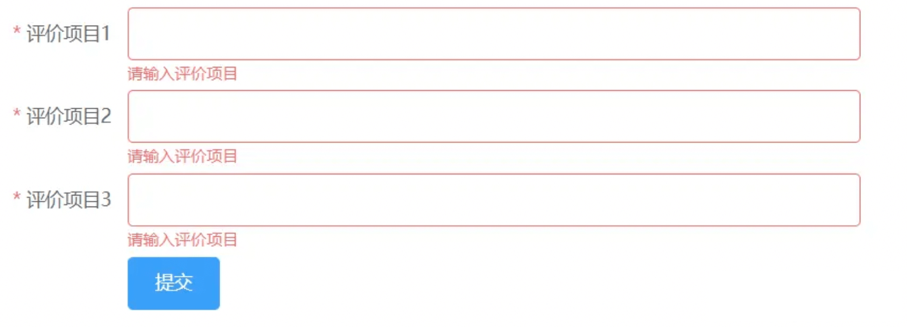
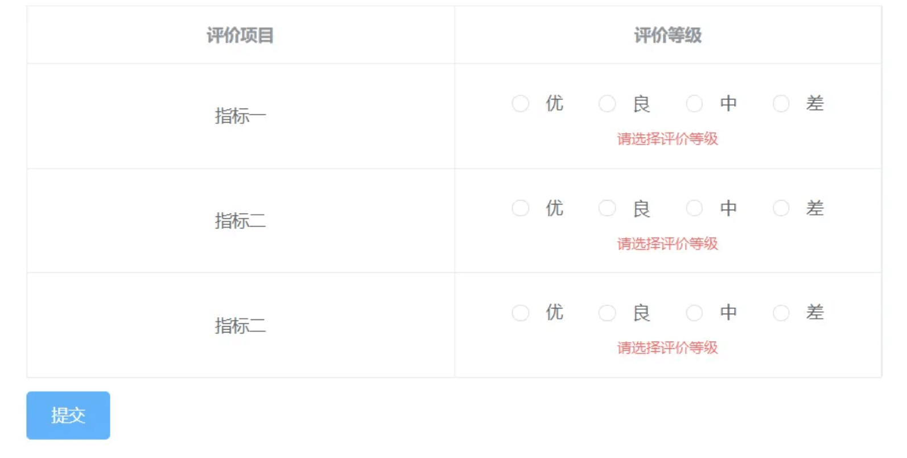
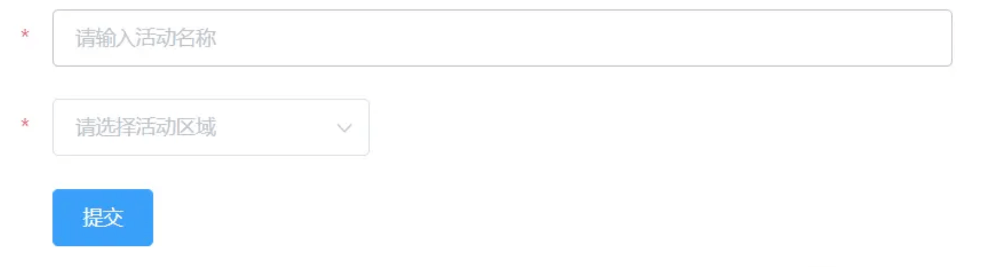

# 表单相关

## el-form-item 循环校验

> 有时候表单项是一个循环的列表，需要对每一项进行校验



```vue
<template>
  <div>
    <el-form :model="form" label-width="100px" ref="form">
      <el-form-item
        v-for="(item, index) in form.list"
        :key="index"
        :label="'评价项目' + (index + 1)"
        :prop="'list.' + index + '.evaluateName'"
        :rules="rules.evaluateName"
      >
        <el-input v-model="item.evaluateName" />
      </el-form-item>
      <el-form-item>
        <el-button type="primary" @click="submitForm">提交</el-button>
      </el-form-item>
    </el-form>
  </div>
</template>

<script>
export default {
  data() {
    return {
      form: {
        list: [
          {
            evaluateName: ''
          },
          {
            evaluateName: ''
          },
          {
            evaluateName: ''
          }
        ]
      },
      rules: {
        evaluateName: [
          {
            required: true,
            message: '请输入评价项目',
            trigger: 'blur'
          }
        ]
      }
    }
  },
  methods: {
    submitForm() {
      this.$refs.form.validate(valid => {
        if (valid) {
          alert('submit!')
        } else {
          console.log('error submit!!')
          return false
        }
      })
    }
  }
}
</script>
```

## el-form-item 表单嵌套表格校验

> 如果在表单里嵌套表格，那么如何对表格里面的控件进行校验呢？



```vue
<template>
  <el-form :model="form" ref="form">
    <el-table border :data="form.list" style="margin-bottom: 10px;">
      <el-table-column
        label="评价项目"
        prop="evaluateName"
        align="center"
      ></el-table-column>
      <el-table-column label="评价等级" align="center">
        <template slot-scope="scope">
          <el-form-item
            :prop="'list.' + scope.$index + '.evaluateLevel'"
            :rules="rules.evaluateLevel"
            class="evaluate-level"
          >
            <el-radio-group class="radio-group" v-model="scope.row.evaluateLevel">
              <el-radio
                v-for="evaluationItem in evaluateOptions"
                :key="evaluationItem.value"
                :label="evaluationItem.value"
              >
                {{ evaluationItem.label }}
              </el-radio>
            </el-radio-group>
          </el-form-item>
        </template>
      </el-table-column>
    </el-table>
    <el-form-item>
      <el-button type="primary" class="submit-btn" @click="submitOpinionCheck">
        提交
      </el-button>
    </el-form-item>
  </el-form>
</template>

<script>
export default {
  data() {
    return {
      form: {
        list: [
          {
            id: '01',
            evaluateName: '指标一',
            evaluateLevel: ''
          },
          {
            id: '02',
            evaluateName: '指标二',
            evaluateLevel: ''
          },
          {
            id: '03',
            evaluateName: '指标二',
            evaluateLevel: ''
          }
        ]
      },
      evaluateOptions: [
        {
          value: '1',
          label: '优'
        },
        {
          value: '2',
          label: '良'
        },
        {
          value: '3',
          label: '中'
        },
        {
          value: '4',
          label: '差'
        }
      ],
      rules: {
        evaluateLevel: [{ required: true, message: '请选择评价等级', trigger: 'change' }]
      }
    }
  },
  methods: {
    submitOpinionCheck() {
      this.$refs.form.validate(valid => {
        if (valid) {
          alert('submit!')
        } else {
          console.log('error submit!!')
          return false
        }
      })
    }
  }
}
</script>

<style lang="scss" scoped>
.evaluate-level {
  ::v-deep .el-form-item__error {
    width: 100px;
    /* 使校验信息居中 */
    left: calc(50% - 50px);
  }
}
</style>
```

## el-form-item 表单校验 label只保留 *



```vue
<template>
  <el-form :model="ruleForm" :rules="rules" ref="ruleForm" label-width="30px">
    <el-form-item label=" " prop="name">
      <el-input v-model="ruleForm.name" placeholder="请输入活动名称"></el-input>
    </el-form-item>
    <el-form-item label=" " prop="region">
      <el-select v-model="ruleForm.region" placeholder="请选择活动区域">
        <el-option label="区域一" value="shanghai"></el-option>
        <el-option label="区域二" value="beijing"></el-option>
      </el-select>
    </el-form-item>
    <el-form-item>
      <el-button type="primary" @click="submitForm('ruleForm')">提交</el-button>
    </el-form-item>
  </el-form>
</template>
```

## el-select 下拉框样式修改

> 使用样式穿透修改下拉框样式，你会发现打死都不生效，那是因为下拉框是默认挂载在 body 下面。解决办法：设置 `:popper-append-to-body="false"`


```vue
<template>
  <el-form>
    <el-form-item label="活动区域">
      <el-select
        class="form-select"
        :popper-append-to-body="false"
        v-model="form.region"
        placeholder="请选择活动区域"
      >
        <el-option label="区域一" value="shanghai"></el-option>
        <el-option label="区域二" value="beijing"></el-option>
      </el-select>
    </el-form-item>
  </el-form>
</template>
<script>
export default {
  data() {
    return {
      form: {
        region: ''
      }
    }
  }
}
</script>

<style lang="scss" scoped>
.form-select {
  ::v-deep .el-select-dropdown__item.selected {
    background: pink;
  }
}
</style>
```

> 想要自定义 el-select 下拉框的样式设置` :popper-append-to-body="false"` 并不适用所有场景，因为有时候就是需要将下拉框加入到 body 里。更好的方法是 el-select 有一个 popper-class 属性，可以自定义弹出框的 className，然后使用类名来自定义样式

