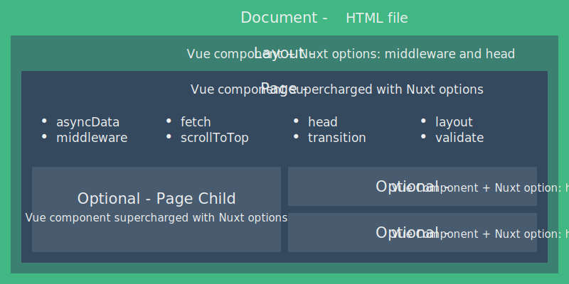

## 为什么使用Nuxt? 

> 主要就是为了 SEO 和首屏加载速度

## Nuxt执行流程



 Nuxt.js 应用一个完整的**服务器请求到渲染**（或用户通过 `<nuxt-link>` 切换路由渲染页面）的流程：


## 预加载(Prefetching)

预加载(Prefetching)与Universal模式结合使用，可提供更好的用户体验。有了此功能（默认情况下处于启用状态），`<nuxt-link>`当这些链接在视口中可见时，Nuxt.js会自动预取与之链接的代码分割页面

### 预加载规则

> Nuxt.js仅在浏览器不忙时加载资源，如果连接处于脱机状态或只有2g连接，则跳过预取。

### 手动控制

- 禁用特定链接的预加载

  

  ```html
  <NuxtLink to="/about" no-prefetch>About page not pre-fetched</NuxtLink>
  <NuxtLink to="/about" :prefetch="false">About page not pre-fetched</NuxtLink>
  ```

- 全局禁用预加载

  

  ```js
  export default {
    router: {
      prefetchLinks: false
    }
  }
  ```

指定某个预加载添加`prefetch`即可

```html
<NuxtLink to="/about" prefetch>About page pre-fetched</NuxtLink>
```

