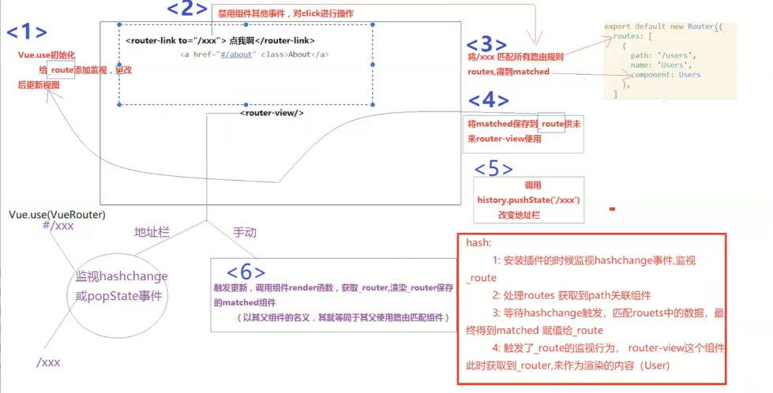

# module

```vue
<script>
	const moduleA = {
        state: ()=>({...})
        mutations:{....},
        actions:{...},
        getters:{...}
    }
	const moduleB = {
        state: ()=>({...})
        mutations:{....},
        actions:{...},
    }
    const store = new Vuex.Store({
        modules:{
            a: moduleA,
            b: moduleB
        }
    })
    store.state.a //moduleA 的状态
    store.state.b //moduleB 的状态
</script>
```



* **对于模块内部的 mutation 和 getter，接收的第一个参数是模块的局部状态对象state。**

* **对于<u>模块内部的 getter</u>，根节点状态会作为第三个参数暴露出来**：

  ```vue
  <script>
   	const moduleA = {
          getters:{
              sumWithRootCount(state, getters, rootState){
                  return state.count + rootSate.count
              }
          }
      }
  </script>
  ```

* **对于模块内部的 action，局部状态通过 context.state 暴露出来，根节点状态则为context.rootState：**

  ```vue
  <script>
   	const moduleA = {
          actions:{
              sumWithRootCount({state, commit, rootState}){
                  return state.count + rootSate.count
              }
          }
      }
  </script>
  ```

#### 命名空间

* **默认情况下，模块内部的 action、mutation 和 getter 是注册在全局命名空间的**

* **添加 <u>namespaced: true</u> 的方式使其成为带命名空间的模块，具有更高的封装度和复用性**

```javascript
const store = new Vuex.Store({
    modules:{
        account:{
            namespaced:true,
            // 模块内容module assets
            state:() =>({...}), //模块的状态已经是嵌套的了，使用'namespaced'属性不会对其产生影响
            getters:{
               isAdmin(){...} // getters['account/isAdmin']
    		},
    		actions:{
                login(){...} // dispatch('account/login')
            },
            mutations:{
                login(){...} // commit('account/login')
            },
            
            // 嵌套模块
            modules:{
               // 继承父模块的命名空间
                myPage:{
                    state:() => ({...}),
                    getters:{
                    	profile(){...} // getters['account/profile']              
                    }
                },
                // 进一步嵌套命名空间
                posts:{
                    namespaced:true,
                    state:()=>({...}),
                    getters:{
                     popular(){...} //getters['account/posts/popular']           
                    }
                }
            }
		}
    }
})
```

#### 在带命名空间的模块内访问全局内容（Global Assets）

1. **使用全局 state 和 getter，<u>rootState</u>和 <u>rootGetters</u> 会作为 "第三 "和 "第四" 参数传入 getter，也会通过 context 对象的属性传入 action。**
2. **在全局命名空间内分发 action 或提交 mutation，将 <u>{ root: true }</u>作为第三参数传给 dispatch 或 commit 即可。**

```vue
<script>
	modules:{
        foo:{
            namespaced:true,
            getters:{
                //在这个模块的 getter 中，getters 被局部化了
                //可以使用 getter 的第四个参数来调用 rootGetters
                someGetter(state, getters, rootState, rootGetters){
                    getters.someOtherGetter // 'foo/someOtherGetter'
                    rootGetters.someOtherGetter // 'someOtherGetter'
                },
                someOtherGetter: state => {...}
            },
            actions:{
                //在这个模块的中，dispatch和commit被局部化了
                //接受 “root” 属性访问 根dispatch 或 commit
                someAction({ dispatch, commit, getters, rootGetters}){
                    getters.someOtherGetter // 'foo/someOtherGetter'
                    rootGetters.someOtherGetter // 'someOtherGetter'
                    
                    dispatch('someOtherAction') // 'foo/someOtherAction'
                 dispatch('someOtherAction', null, { root: true}) //'someOtherAction'
                }
            }
        }
    }
</script>
```

#### 在带命名空间的模块注册全局 action

添加 **root: true**，并将这个 action 的定义放在函数 **handler** 中。例如：

```vue
<script>
	actions:{
        someOtherAction({dispatch}){
            dispatch('someAction')
        }
    },
    modules:{
        foo:{
            namespaced:true,
            actions:{
                someAction:{
                    root:true,
                    handler(namespacedContext, payload) {..} //'someAction'
                }
            }
        }
    }
</script>
```

#### 带命名空间的绑定函数

* **使用 mapState, mapGetters, mapActions 和 mapMutations 这些函数来绑定带命名空间的模块**

  ```vue
  <script>
  	computed:{
          ...mapState('some/nested/module', {
              a: state => state.a,
              b: state => state.b
          })
      },
      methods:{
          ...mapActions('some/nested/module',[
              'foo', // this.foo()
          ])
      }
  </script>
  ```

* **也可以通过使用 createNamespacedHelpers 创建基于某个命名空间辅助函数。它返回一个对象，对象里有新的绑定在给定命名空间值上的组件绑定辅助函数**

  ```VUE
  <script>
  	import { createNamespacedHelpers } from 'vuex'
      const { mapState, mapActions } = createNamespacedHelpers('some/nested/module')
  	export default {
          computed:{
              // 在’some/nested/module'中查找
              ...mapState({
                  a: state => state.a
              })
          },
          methods:{
              // 在’some/nested/module'中查找
              ...mapActions([
                  'foo',
                  'bar'
              ])
          }
      }
  </script>
  ```

#### 模块动态注册

* 在 store 创建之后，你可以使用 **store.registerModule** 方法注册模块，之后就可以通过 **store.state.myModule** 和 **store.state.nested.myModule** 访问模块的状态：

  ```js
  const store = new Vuex.Store({..});
  // 注册模块 ‘myModule'
  store.registerModule('myModule',{
      //..
  })
  
  //注册嵌套模块 'nested/myModle'
  store.registerModule(['nested','myModule'],{
      //...
  })
  ```

  使用 **store.unregisterModule(moduleName) **来动态卸载模块

  通过 **store.hasModule(moduleName)** 方法检查该模块是否已经被注册到 store

* 保留state

  在注册一个新 module 时，你很有可能想保留过去的 state，例如从一个服务端渲染的应用保留 state。你可以通过 **preserveState** 选项将其归档：**store.registerModule('a', module, { preserveState: true })**。该模块会被注册，action、mutation 和 getter 会被添加到 store 中，但是 state 不会。这里假设 store 的 state 已经包含了这个 module 的 state 并且你不希望将其覆写。

#### 模块重用

[创建一个模块的多个实例](https://vuex.vuejs.org/zh/guide/modules.html#模块重用)