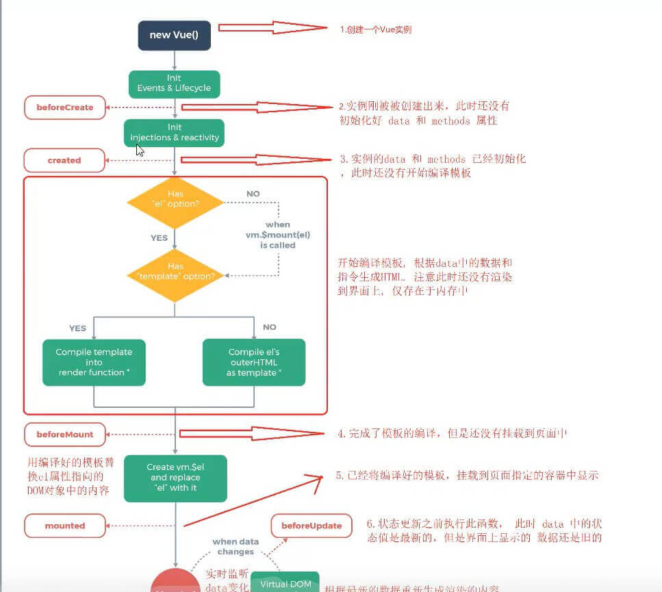

## Vue组件的生命周期

> 10个钩子函数、4个阶段

### 一、创建渲染阶段

#### 1. beforeCreate 组件创建之前

vue实例中的data、methods属性中的数据尚未被初始化

**作用:** 在组件创建之前加载页面

#### 2. created组件创建之后

vue实例中的data、methods属性中的数据已经初始化完毕，可以使用。

**作用：** 发起AJAX请求

#### 3. beforeMount DOM渲染之前

编译好的模板字符串渲染为内存中的DOM，此时template模板已经在内存中渲染完毕，但尚未把模板挂载到页面中，此时还是旧页面。

#### 4. mounted DOM渲染之后

内存中的模板已经渲染到浏览器页面中，可以拿到页面中的DOM及数据。

**作用：** 操作DOM

### 二、运行阶段

#### 1. beforeUpdate 数据更新之前

该生命钩子在数据改变时触发，此时页面中显示的还是旧数据，但此时vue实例中的data属性中的数据是最新的，还没同步到页面中。

**作用：** 可以获取原始的DOM

#### 2. updated 数据更新之后

此时页面中的数据是最新的，已经和Vue实例中的data属性中的数据保持同步。

**作用：** 可以获取最新的DOM

### 三、停用、激活阶段（使用了keep-alive组件）

#### 1. activated 组件激活

#### 2. deactivated 组件停用

### 四、销毁阶段

#### 1. beforeDestroy 组件销毁之前

此时vue实例上的所有data、methods、过滤器、指令等都处于可用状态，还未被销毁。

#### 2. destroyed 销毁

组件已经被完全销毁，组件中的数据、方法、指令、过滤器等都不可用。

**作用：** 常用如计时器的销毁

### 五、捕获错误

#### errorCaptured

当捕获一个来自子孙组件的错误时被调用。此钩子会收到三个参数：**错误对象**、**发生错误的组件实例**以及一个**包含错误来源信息的字符串**。此钩子可以返回 `false` 以阻止该错误继续向上传播。

可以在此钩子中修改组件的状态。因此在捕获错误时，在模板或渲染函数中有一个条件判断来绕过其它内容就很重要；不然该组件可能会进入一个无限的渲染循环。

**类型**：`(err: Error, vm: Component, info: string) => ?boolean`

**错误传播规则**

- 默认情况下，如果全局的 `config.errorHandler` 被定义，所有的错误仍会发送它，因此这些错误仍然会向单一的分析服务的地方进行汇报。
- 如果一个组件的继承或父级从属链路中存在多个 `errorCaptured` 钩子，则它们将会被相同的错误逐个唤起。
- 如果此 `errorCaptured` 钩子自身抛出了一个错误，则这个新错误和原本被捕获的错误都会发送给全局的 `config.errorHandler`。
- 一个 `errorCaptured` 钩子能够返回 `false` 以阻止错误继续向上传播。本质上是说“这个错误已经被搞定了且应该被忽略”。它会阻止其它任何会被这个错误唤起的 `errorCaptured` 钩子和全局的 `config.errorHandler`。