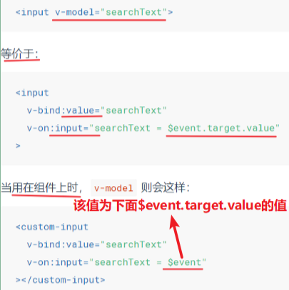
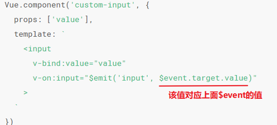
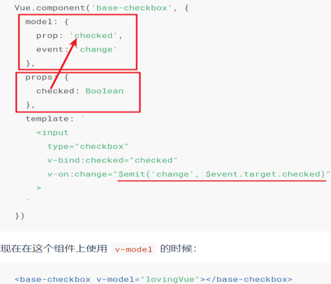

## vue自带指令

### 1. v-cloak 样式指令

**问题：** 当网络较慢，网页还在加载 Vue.js ，而导致 Vue 来不及渲染，这时页面就会显示出 Vue 源代码。

**解决： **使用 `v-cloak` 指令设置样式来解决屏幕闪动的问题，而这些样式会在 Vue 实例编译结束时，从绑定的 HTML 元素上被移除。

```html
<div id="app" v-cloak>
    {{context}}
</div>
```

```css
[v-cloak]{
    display: none;
}
```

**注意：** 在简单项目中，使用 v-cloak 指令是解决屏幕闪动的好方法。但在大型、工程化的项目中（webpack、vue-router）只有一个空的 div 元素，元素中的内容是通过路由挂载来实现的，这时我们就不需要用到 v-cloak 指令。

### 2. v-text和v-html

<u>绑定数据，引号中的变量必须是vue实例对象中的data属性中的变量名</u>

只对可信内容使用 HTML 插值，绝不要对用户提供的内容使用插值。

**v-text:** 更新元素的 **`textContent`**。如果要更新部分的 `textContent`，需要使用 `{{ Mustache }}` 插值。

**v-html: ** 更新元素的 **`innerHTML`**。**注意：内容按普通 HTML 插入 - 不会作为 Vue 模板进行编译**。如果试图使用 `v-html` 组合模板，可以重新考虑是否通过使用组件来替代。在[单文件组件](https://cn.vuejs.org/v2/guide/single-file-components.html)里，`scoped` 的样式不会应用在 `v-html` 内部，因为那部分 HTML 没有被 Vue 的模板编译器处理。如果你希望针对 `v-html` 的内容设置带作用域的 CSS，你可以替换为 [CSS Modules](https://vue-loader.vuejs.org/en/features/css-modules.html) 或用一个额外的全局 `<style>` 元素手动设置类似 BEM 的作用域策略。

### 3. v-bind

属性绑定机制，绑定数据，引号中的变量必须是vue实例对象中的data属性中的变量名

**修饰符**：

- **`.prop`** - 作为一个 DOM property 绑定而不是作为 attribute 绑定。([差别在哪里？](https://stackoverflow.com/questions/6003819/properties-and-attributes-in-html#answer-6004028))
- **`.camel`** - (2.1.0+) 将 kebab-case attribute 名转换为 camelCase。(从 2.1.0 开始支持)
- **`.sync`** (2.3.0+) 语法糖，会扩展成一个更新父组件绑定值的 `v-on` 侦听器。

```html
<!-- 缩写 -->


<!-- 动态 attribute 名缩写 (2.6.0+) -->
<button :[key]="value"></button>

<!-- 内联字符串拼接 -->


<!-- class 绑定 -->
<div :class="{ red: isRed }"></div>
<div :class="[classA, classB]"></div>
<div :class="[classA, { classB: isB, classC: isC }]">

<!-- style 绑定 -->
<div :style="{ fontSize: size + 'px' }"></div>
<div :style="[styleObjectA, styleObjectB]"></div>

<!-- 绑定一个全是 attribute 的对象 -->
<div v-bind="{ id: someProp, 'other-attr': otherProp }"></div>

<!-- 通过 prop 修饰符绑定 DOM attribute -->
<div v-bind:text-content.prop="text"></div>

<!-- prop 绑定。“prop”必须在 my-component 中声明。-->
<my-component :prop="someThing"></my-component>

<!-- 通过 $props 将父组件的 props 一起传给子组件 -->
<child-component v-bind="$props"></child-component>

<!-- XLink -->
<svg><a :xlink:special="foo"></a></svg>
```

`.camel` 修饰符允许在使用 DOM 模板时将 `v-bind` property 名称**驼峰化**，例如 SVG 的 `viewBox` property：

```html
<svg :view-box.camel="viewBox"></svg>
```

* **属性变量+合法的JS表达式**

```javascript
<input type="date"  :title="mytitle + '日期'" />
```

* **使用class样式**

  1. 一个对象
  2. 一个数组
  3. 与普通的class属性共存
  4. 绑定一个返回对象的计算属性

  ```javascript
  # 使用对象
  <h1 :class="{red:true,italic:true,active:true}"></h1>
  # 使用数组
  <h1 :class="['red','thin']"></h1>
  # 数组中使用三元表达式
  <h1 :class="['red','thin', isactive?'active':'']"></h1>
  # 数组中嵌套对象
  <h1 :class="['red','thin', {'active':isactive}]"></h1>
  ```

* **使用style内联样式**

  1. 一个对象
  2. 一个数组
  3. 多重值：为 style 绑定中的 property 提供一个包含多个值的数组，常用于提供多个带前缀的值，只会渲染数组中最后一个被浏览器支持的值。

  ```javascript
  <div :style=" { display : [ ' -webkit-box', '-ms-flexbox', 'flex' ] } "></div>
  ```

  **注意：** CSS属性中有横杠''-''的属性要单引号引起来。

  当 v-bind:style 使用需要添加[浏览器引擎前缀](https://developer.mozilla.org/zh-CN/docs/Glossary/Vendor_Prefix)的 CSS property 时，如 transform、transition，Vue.js 会自动侦测并添加相应的前缀。

  - -webkit-     (谷歌, Safari, 新版Opera浏览器,     以及几乎所有iOS系统中的浏览器(包括iOS 系统中的火狐浏览

  器); 简单的说，所有基于WebKit 内核的浏览器)

  - -moz- (火狐浏览器)
  - -o- (旧版Opera浏览器)
  - -ms- (IE浏览器 和 Edge浏览器)

  ```javascript
  # 1．直接在元素上通过:style的形式，书写样式对象
  <h1 :style="{color: 'red', 'font-size ' : '40px'}">这是一个善良的H1</h1>
  # 2. 将样式对象，定义到data中，并直接引用到:style中
  # 3. 在:style中通过数组，引用多个data上的样式对象
  ```

* **动态参数** 使用[ ]

  动态参数预期会求出一个字符串，异常情况下值为 `null`。这个特殊的` null` 值可以被显性地用于移除绑定。

  **参数中不要包含大写字母**

  ```javascript
  <a v-bind:[attributeName]="url"></a>
  ```

### 4. v-on

 * 绑定事件，引号中的变量是vue实例对象中的methods属性中的方法名

   ```vue
   <template>
     <div id=" example-2">
       <!-- 'greet`是在下面定义的方法名-->
       <button v-on:click="greet">Greet</button>
     </div>
   </template>
   <script>
     //在‘methods`对象中定义方法
     methods: {
       greet: function (event) {
         // `this`在方法里指向当前vue实例
         alert( 'Hello ' + this.name);
         //`event`是原生DOM事件
         if (event) {
           alert(event.target.tagName);
         }
       },
     },
   </script>
   ```

* 访问原生DOM事件，传入特殊变量**$event**

  ```vue
  <template>
      <button @click="warn('aaa',$event)"></button>
  </template>
  <script>
  new Vue({
    data() {
      return {};
    },
    methods: {
        warn:function(message, event){
            //访问原生事件对象
            if (event) {
                event.preventDefault();
            }
        }
    },
  });
  </script>
  ```

* **动态事件名：使用[ ]**

  动态参数预期会求出一个字符串，异常情况下值为 **null**。这个特殊的 **null** 值可以被显性地用于移除绑定。

  参数中不要包含大写字母

  ```html
  <a @[eventName]="doSomething " > ... </a>
  ```

* **该指令的事件修饰符(可串联使用)**

  `.stop` **阻止向外冒泡(阻止所有人的)**，调用 `event.stopPropagation()`

  `.self` **只当事件在该元素本身触发时触发回调(只阻止自己的冒泡，他人的冒泡不管)**

  `.prevent` **阻止默认事件**，调用 `event.preventDefault()`。

  * v-on:click.prevent.self 会**阻止所有的点击**
  *  v-on:click.self.prevent 只会**阻止对元素自身的点击**

  ```html
    <!--提交事件不再重载页面-->
    <form v-on:submit.prevent="onSubmit"></form>
  ```

  `.capture或!` 添加事件侦听器时使用事件捕获模式(从外往里执行事件，即内部元素触发的事件先在此处理，然后才交由内部元素进行处理)

  `.{keyCode | keyAlias}` - 只当事件是从特定键触发时才触发回调。

  `.once或~` 事件只触发一次。还能被用到自定义的[组件事件](https://cn.vuejs.org/v2/guide/components-custom-events.html)上

  `.passive或&` 对应 addEventListener 中的 passive 选项。**不要把 .passive 和 .prevent 一起使用**，.passive 会告诉浏览器你*不*想阻止事件的默认行为。

  ```html
  <!--滚动事件的默认行为（即滚动行为)将会立即触发-->
  <!--而不会等待`onscroll’完成-->
  <!--这其中包含‘event.preventDefault()的情况-->
  <div v-on:scroll.passive= "onscroll"> ...</div>
  ```

  `.capture.once、.once.capture或~!`

  `.native` - 监听组件根元素的原生事件。

* **按键修饰符***

  - .enter

  - .tab

  - .delete (捕获“删除”和“退格”键)

  - .esc

  - .space

  - .up

  - .down

  - .left

  - .right

  - 将 [KeyboardEvent.key](https://developer.mozilla.org/en-US/docs/Web/API/KeyboardEvent/key/Key_Values) 暴露的任意有效按键名转换为 kebab-case 来作为修饰符

    ```html
    //处理函数只会在 $event.key 等于 PageDown 时被调用
    <input v-on:keyup.page-down="onPageDown">
    ```

  * 通过全局 config.keyCodes 对象[自定义按键修饰符别名](https://cn.vuejs.org/v2/api/#keyCodes)

    ```javascript
    //可以使用'v-on:keyup.f1'
    vue.config.keyCodes.f1 = 112
    ```

  **组合键**

  * .ctrl

  * .alt

  * .shift

  * .meta

  * .exact 允许你控制由精确的系统修饰符组合触发的事件

    单单按住Ctrl键不会触发事件，为 ctrl 换用 keyCode：keyup.17可以有这样的行为

    ```html
    <!-- Alt + C-->
    <input v-on:keyup.alt.67="clear"/>
    <!-- 即使Alt或Shift被一同按下时也会触发 -->
    <button v-on:click.ctrl="onClick">A</button>
    <!-- 有且只有_Ctrl_被按下的时候才触发 -->
    <button v-on:click.ctrl.exact="onCtr1Click">A</button>
    <!-- 没有任何系统修饰符被按下的时候才触发 -->
    <button v-on:click.exact="onClick">A</button>
    ```

  **鼠标按钮修饰符**

  * .left
  * .right
  * .middle
  
  ```html
  <!-- 缩写 -->
  <button @click="doThis"></button>
  
  <!-- 动态事件缩写 (2.6.0+) -->
  <button @[event]="doThis"></button>
  
  <!-- 停止冒泡 -->
  <button @click.stop="doThis"></button>
  
  <!-- 阻止默认行为 -->
  <button @click.prevent="doThis"></button>
  
  <!-- 阻止默认行为，没有表达式 -->
  <form @submit.prevent></form>
  
  <!--  串联修饰符 -->
  <button @click.stop.prevent="doThis"></button>
  
  <!-- 键修饰符，键别名 -->
  <input @keyup.enter="onEnter">
  
  <!-- 键修饰符，键代码 -->
  <input @keyup.13="onEnter">
  
  <!-- 点击回调只会触发一次 -->
  <button v-on:click.once="doThis"></button>
  ```
  
  `v-on` 同样支持不带参数绑定一个事件/监听器键值对的对象。注意当使用对象语法时，是不支持任何修饰器的。
  
  ```html
  <!-- 对象语法 (2.4.0+) -->
  <button v-on="{ mousedown: doThis, mouseup: doThat }"></button>
  ```
  
  在子组件上监听自定义事件 (当子组件触发“my-event”时将调用事件处理器)：
  
  ```html
  <my-component @my-event="handleThis"></my-component>
  
  <!-- 内联语句 -->
  <my-component @my-event="handleThis(123, $event)"></my-component>
  
  <!-- 组件中的原生事件 -->
  <my-component @click.native="onClick"></my-component>
  ```

### 5. v-model

v-bind 指令只能单向绑定数据，v-model 可以双向绑定

- v-model 指令在表单 `<input>`、`<textarea>` 及 `<select> `元素上创建双向数据绑定。

- v-model 会忽略所有表单元素的 **value、checked、selected  **属性的初始值而总是将 Vue 实例的数据作为数据来源。

- v-model 在内部为不同的输入元素使用不同的 property     并抛出不同的事件：

- - text 和 textarea 元素使用 value property      和 input 事件；
  - checkbox 和 radio 使用 checked property      和 change 事件；
  - select 字段将 value 作为 prop      并将 change 作为事件。

- **修饰符：**

- - **.lazy** ：转为在 change 事件_之后_进行同步
  - **.number** ：自动将用户的输入值转为数值类型
  - **.trim** ：自动过滤用户输入的首尾空白字符

- **自定义组件的 v-model**

- ​	组件上的 v-model 默认会利用名为 `value` 的属性和名为 `input` 的事件

  

  为了让它正常工作，这个组件内的 `<input>` 必须：

- 将其 value attribute 绑定到一个名叫 value 的 prop 上

- 在其 input 事件被触发时，将新的值通过自定义的 input 事件抛出

  

  * **model 选项可以用来避免这样的冲突**

    这里的 lovingVue 的值将会传入这个名为 checked 的 prop。同时当` <base-checkbox> `触发一个 change 事件并附带一个新的值的时候，这个 lovingVue 的 property 将会被更新

    

### 6. v-for

> v-for正在更新已渲染过的元素列表时，默认使用“就地复用”的策略。若数据项的顺序被改变，Vue将不是移动DOM元素来匹配数据项的顺序，而是简单复用此处的每个元素，并确保它在特定索引下显示已被渲染过的每个元素。

要强制其重新排序元素,使用**key属性** :用**字符串**或**数值**类型的值作为该属性的值。

* 迭代数组 ：(item, index)
* 迭代对象 : (value, name, index)
* 迭代对象数组
* 迭代数值
* 迭代方法中返回的数组或对象
* 迭代字符串
* 迭代任何包含iterable接口的对象

**注意：** 从 2.6 起，`v-for` 也可以在实现了[可迭代协议](https://developer.mozilla.org/zh-CN/docs/Web/JavaScript/Reference/Iteration_protocols#可迭代协议)的值上使用，包括原生的 `Map` 和 `Set`。不过应该注意的是 Vue 2.x 目前并不支持可响应的 `Map` 和 `Set` 值，所以无法自动探测变更。

### 7. v-if、v-show、v-else-if、v-else

 * `v-if` ：每次都会重新删除或创建元素，有较高的切换开销；切换过程中条件块内的事件监听器和子组件适当地被销毁和重建。当和 v-if 一起使用时，v-for 的优先级比 v-if 更高。

   也可以同时使用key属性，**管理可复用的元素，保证元素唯一性**：

* `v-show` ：每次只是切换了元素的**display:none** 样式，有较高的初始渲染开销。如果元素可能永远

  也不会显示出来被用户看到则应该使用v-if

### 8. v-once

> **只渲染元素和组件一次**。随后的重新渲染，元素/组件及其所有的子节点将被视为静态内容并跳过。这可以用于优化更新性能。

 * 执行一次性地插值，当数据改变时，插值处的内容不会更新，但请留心这会影响到该节点上的其它数据绑定：

   ```html
   <span v-once>这个将不会改变{{ msg }}</span>
   ```

* 通过 **v-once 创建低开销的静态组件**

  当一个组件包含了大量静态内容，在这种情况下，你可以在根元素上**添加 v-once属性以确保这些内容只计算一次然后缓存起来 **，就像这样:

  ```vue
  Vue.component('terms-of-service',{
  	template:`
  		<div v-once>
            ... a lot of static content...
  		</div>
  })
  ```

  **注意：** 不要过度使用这个模式，因为当一个开发者并不熟悉 v-once 或漏看了它在模板中，他们可能会花很多个小时去找出模板为什么无法正确更新

### 9. v-slot

> 插槽就是Vue实现的一套内容分发的API，将`<slot></slot>`元素作为承载分发内容的出口.

> 可放置在函数参数位置的 JavaScript 表达式 (在[支持的环境下](https://cn.vuejs.org/v2/guide/components-slots.html#解构插槽-Props)可使用解构)。可选，即只需要在为插槽传入 prop 的时候使用。

**参数**：插槽名 (可选，默认值是 `default`)

**限用于**

- `<template>`
- [组件](https://cn.vuejs.org/v2/guide/components-slots.html#独占默认插槽的缩写语法) (对于一个单独的带 prop 的默认插槽)

* **默认内容值**

  ```vue
  <template>
  	<button type="submit">
          <slot>submit</slot>
      </button>
  </template>
  ```

* **具名插槽：** `用属性name`

  不带 name 的 `<slot>` 出口会带有隐含的名字 `default`

  ```vue
  <template>
  	<header>
      	<slot name="header"></slot>
      </header>
  	<main>
      	<slot></slot>
      </main>
  </template>
  ```

  在一个 `<template>` 元素上使用 v-slot 指令，并以 v-slot 的**参数的形式提供其名称**:

  **注意:** <u> **v-slot 只能添加在 `<template> `上**</u>

  ```vue
  <template>
  	<base-layout>
      	<template v-slot:header>
  			<h1></h1>
  		</template>
      	<template v-slot:default> <!--default可省略 -->
  			<h1></h1>
  		</template>
      </base-layout>	
  
  </template>
  ```

* **作用域插槽**

  > **在父级组件中，让插槽内容能够访问子组件中的数据**。**说白了就是我在子组件`<slot>`上绑定的属性，可以在父组件内使用**！

  1. 第一步：将 user 作为 `<slot>` 元素的一个 attribute 绑定，该 attribute 被称为**插槽 prop**

     ```vue
     <template>
     	<slot v-bind:user="user">
         	{{user.lastname}}
         </slot>
     </template>
     ```

  2. 第二步：在父级作用域中，我们可以使用带值的 v-slot 来定义我们提供的插槽 prop 的名字

     ```vue
     <!-- 如果提供的内容只有默认插槽时，组件的标签才可以被当作插槽的模板来使用: -->
     
     <template>
     	<current-user>
             <!-- 起一个任意名称作为包含插槽prop的对象的名字,default可省略 -->
         	<template v-slot:default="slotProps">
     			{{ slotProps.user.firstName }}
     		</template>
         </current-user>
     </template>
     
     <!-- 2.解构 -->
     <template>
     	<current-user v-slot="{ user }">
         	{{ user.firstName }}
         </current-user>
     </template>
     
     <!-- 重命名 -->
     <template>
     	<current-user v-slot="{ user: person }">
         	{{ person.firstName }}
         </current-user>
     </template>
     
     <!-- 默认值 -->
     <template>
     	<current-user v-slot="{ user = { firstName:'Guest' }">
         	{{ user.firstName }}
         </current-user>
     </template>
     ```

     ```vue
     <template>
         <div id="app">
             <child>
                 <template slot-scope="a">
               <!--打印结果为： {"say":"你好"} -->
     
                     {{a}}
                 </template>
             </child>
         </div>
     </template>
     <script>
         Vue.component('child',{
             template:`
                 <div>
                     <slot say="你好"></slot>
                 </div>
             `
         })
         let vm = new Vue({
             el:'#app',
             data:{
     
             }
         })
     </script> 
     ```

* **动态插槽名**

  ```vue
  <template>
  	<base-layout>
      	<template v-slot=[dynamicSlotName]>
  			....
  		</template>
      </base-layout>
  </template>
  ```

* **具名插槽的缩写**

  如 v-slot:header 可以被重写为 #header，但该缩写只在其有参数的时候才可用

### 10. v-pre

> 跳过这个元素和它的子元素的编译过程。可以用来显示原始 Mustache 标签。跳过大量没有指令的节点会加快编译。

```html
<span v-pre>{{ this will not be compiled }}</span>
```


## 2. 自定义指令

### 1. 全局指令

```vue
<script>
    Vue.directive('指令名称',{ … });
	// 参数1：指令的名称。在定义的时候，指令的名称前面，不需要加 v- 前缀，调用则需要
    // 参数2：一个对象，在这个对象上，有一些指令相关的函数，这些函数在特定的阶段执行相应的操作
    Vue.directive('focus',{
        bind: function(el){
            //每当指令绑定到元素上的时候，会立即执行这个bind 函数，只执行一次
            //在元素刚绑定指令的时候，还没有插入到DOM中，这时调用focus方法没有作用
            //只有在插入到DOM后，才能获取焦点
        },
        inserted(el){
           // inserted表示元素插入到DOM中的时候，会执行inserted函数，只执行一次
            el.focus();
        },
        updated(el) {
            // 当VNode更新的时候，会执行 updated，可触发多次
            },
    })
</script>
```

### 2. 私有指令

```vue
<script>
    directives:{
        'fontweight':{
            bind: function(el, binding){
                el.style.fontWeight = binding.value
            }
        },
            //这种 function 等同于把代码写到了 bind 和 update
            'fontsize':function(el,binding){
                el.style.fontSize = parseInt(binding.value) + 'px';
            }
    }
</script>
```

 * **钩子函数**
   
   - **`bind`**：只调用一次，指令第一次绑定到元素时调用。在这里可以进行一次性的初始化设置(如样式设置)。
   - **`inserted`**：被绑定元素插入父节点时调用     (仅保证父节点存在，但不一定已被插入文档中)，可进行事件行为设置。
   - **`update`**：**所在组件的 VNode 更新时调用**，但是可能发生在其子 VNode  更新之前。指令的值可能发生了改变，也可能没有。但是你可以通过比较更新前后的值来忽略不必要的模板更新 
   - **`componentUpdated`**：**指令所在组件的 VNode 及其子 VNode 全部更新后调用**。
   - **`unbind`**：只调用一次，**指令与元素解绑时调用**。做清理操作，比如移除bind时绑定的事件监听器
* **钩子函数参数**

  - **el**：指令所绑定的元素，可以用来直接操作 DOM。

  - **binding**：一个对象，包含以下 property：

  - - name：指令名，不包括 v- 前缀。
    - **value**：指令的绑定值，例如：v-my-directive="1      + 1" 中，绑定值为 2。
    - **oldValue**：指令绑定的前一个值，仅在 update 和 componentUpdated 钩子中可用。无论值是否改变都可用。
    - expression：字符串形式的指令表达式。例如 v-my-directive="1 + 1" 中，表达式为 "1 + 1"。
    - **arg**：传给指令的参数，可选。例如 v-my-directive**:**foo 中，参数为 "foo"。
    - modifiers：一个包含修饰符的对象。例如：v-my-directive**.**foo**.**bar 中，修饰符对象为 { foo: true, bar: true }。

  - **vnode**：Vue 编译生成的虚拟节点。

  - **oldVnode**：上一个虚拟节点，仅在 update 和 componentUpdated 钩子中可用。

  ***注意：*** 如果需要在钩子之间共享数据，建议通过元素的 [dataset](https://developer.mozilla.org/zh-CN/docs/Web/API/HTMLElement/dataset) 来进行。

  指令函数能够接受所有合法的 JavaScript 表达式，比如指令需要多个值，可以传入一个 JavaScript 对象字面量。

  ```vue
  <template>
  	<div v-demo="{color: 'white',text:'hello'}"> </div>
  </template>
  <script>
      //函数简写，想在 bind 和 update 时触发相同行为，而不关心其它的钩子，可这样写
      Vue.directive('demp',function(el, binding){
          console.log(binding.value.color); // => "white"
      })
  </script>
  ```

* **指令的参数可以是动态的**

  在 v-mydirective:[argument]="value" 中，argument 参数可以根据组件实例数据进行更新！这使得自定义指令可以在应用中被灵活使用


#### 私有指令中调用 method 中的方法

```vue
bind(el, binding, vnode, oldVnode){
	vnode.context.method中的方法名
}
```

