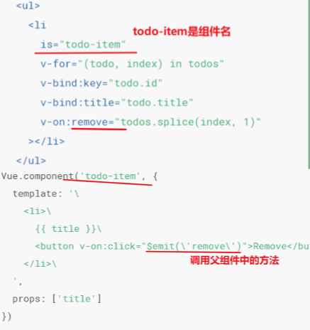
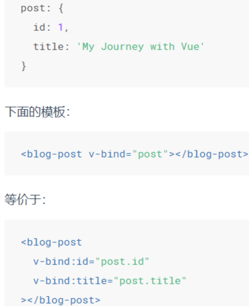

# 组件 component

1. 因为**组件是可复用的 Vue 实例**，所以它们与 new Vue 接收相同的选项，例如 data、computed、watch、methods 以及生命周期钩子等
2. 一个组件的 data 选项必须是一个函数，因此每个实例可以维护一份被返回对象的独立的拷贝，如果 Vue 没有这条规则，一个组件实例会影响到其它所有实例
3. 每个组件必须只有一个根元素

#### 一. 组件切换

 1. **组件使用`is`属性**

    ***动态组件配合使用keep-alive，保持这些组件的状态***

    ```vue
    <template>
        <a href="" @click.prevent="conName='login'">登录</a>
        <a href="" @click.prevent="conName='register'">注册</a>
    
        // component 是一个占位符，:is属性可用来指定要展示的组件的名称
        <component :is="comName"></component>
    </template>
    ```

    `comName`可以是：

     * 已注册组件的名字

     * 一个组件的选项对象

       ```js
       template:"<div>hello</div>"
       ```

    ***注意：*** 常规HTML元素使用is属性 ：这些元素将被视为组件

    

    - 注意这里的 is="todo-item" attribute。这种做法在使用 DOM 模板时是十分必要的，因为在 `<ul> `元素内只有 `<li> `元素会被看作有效内容，若在`<ul>`元素内部使用`<todo-item></todo-item>`会被作为无效的内容提升到外部，并导致最终渲染结果出错。

      这样做实现的效果与 `<todo-item> `相同，**可以避开一些潜在的浏览器解析错误**。

    * 但如果我们从以下来源使用模板的话，这条限制是*不存在*的：
      - 字符串 (例如：template: '...')
      - [单文件组件 (.vue)](https://cn.vuejs.org/v2/guide/single-file-components.html)
      - [`<script type="text/x-template">`](https://cn.vuejs.org/v2/guide/components-edge-cases.html#X-Templates)

 2. **组件切换动画，使用`mode`属性**

    ```vue
    <template>
    	//通过 mode 属性，设置组件切换时候的 模式
    	<transition mode="out-in">
        	<component :is="comName"></component>
        </transition>
    </template>
    <script>
        new Vue({
            el: 'xx',
            data: {
                comName: 'v-a'
            },
            components: {
                'v-a': {
                    template: '<div>Component A</div>'
                },
                'v-b': {
                    template: '<div>Component B</div>'
                }
            }
        })
    </script>
    ```

#### 二、组件注册

全局注册这些非常通用的基础组件,在应用入口文件 (比如 src/main.js) 中全局导入基础组件的示例代码：


#### 三、组件的属性和prop

 * **class属性**

   **在一个自定义组件上使用class属性时，这些 class 将被添加到该组件的根元素上面，该元素上已经存在的 class 不会被覆盖**

   ```vue
   <my-component class="baz boo"></my-component>
   <my-component :class="{ active: isActive}"></my-component>
   ```

   * **禁用attribute继承**

     不希望组件的根元素继承 attribute，你可以在组件的选项中设置 **`inheritAttrs: false`**，但不会影响 `style` 和 `class` 的绑定。

     ```vue
     <script>
         Vue.component('my',{
             inheritAttrs: false
         })
     </script>
     ```

     有了**` inheritAttrs: false `**和**` $attrs`**，你就可以手动决定这些 attribute 会被赋予哪个元素

     ```vue
     <script>
     vue.component('base-input' , {
         inheritAttrs: false,
         props: ['label' , 'value'],
         template:`
             <label>
                 {{ label }}
                 <input
                     v-bind="$attrs"
                     v-bind:value="value"
                     v-on:input="$emit('input', $event.target.value)
                 >
             </label>
         `
     })
     </script>
     ```

     

* **ref属性**

  ***注意：*** **$refs 只会在组件渲染完成之后生效，并且它们不是响应式的**。这仅作为一个用于直接操作子组件的“逃生舱”，应该避免在 **模板** 或 **计算属性 ** 中访问 **$refs**

  1. 若给标签绑定ref='xxx'属性，使用this.$refs.xxx获取原生的jsDOM对象，ref属性值不能重名

  2. 若是给组件绑定ref属性，那么this.$refs.xxx获取的是当前的组件对象，可使用该组件的data和methods等中的数据、方法

  3. **特殊情况**：**`$nextTick()`**是在DOM更新循环结束之后执行回调函数，在修改数据之后使用此方法，在回调中获取到更新之后的DOM

     ```vue
     <script>
     	mounted(){
             this.$nextTick(function(){
                 this.$refs.input.focus();
             })
         }
     </script>
     ```

* **组件的Prop**

  1. 以字符串数组形式列出的 prop：

     ```
     props: ['title', 'likes', 'isPublished', 'commentIds', 'author']
     ```
  
  
    2. 以对象形式列出 prop:
  
       ```
       props: { 
           title: String, 
           likes: Number, 
           isPublished: Boolean, 
           commentIds: Array, 
           author: Object, 
           callback: Function, 
           contactsPromise: Promise // or any other constructor 
       }
       ```
  
  
  3. 传入一个对象的所有 property:
  
     **使用不带参数的 v-bind (取代 v-bind:prop-name)**
  
  

* **Prop 验证**

  这些 prop 会在一个组件实例创建之前进行验证，所以实例的 property (如 data、computed 等) 在 `default` 或` validator` 函数中是不可用的

  ```vue
  <script>
  vue.component("my-component", {
    props: {
      //基础的类型检查( 'null`和undefined`会通过任何类型验证)
      propA: Number,
      //多个可能的类型
      propB: [String, Number], //必填的字符串
      propC: {
        type: String,
        required: true,
      },
      //带有默认值的数字
      propD: {
        type: Number,
        default: 100,
      },
      //带有默认值的对象
      propE: {
        type: Object,
        //对象或数组里默认值必须从一个工厂函数获取
        default: function () {
          return { message: "hello" };
        },
        //自定义验证函数
        propF: {
          validator: function (value) {
            //这个值必须匹配下列字符串中的一个
            return ["success ", "warning", "danger "].indexOf(value) !== -1;
          },
        },
      },
    },
  });
  </script>
  ```

  type 可以是下列原生构造函数中的一个：

  1. String
  2. Number
  3. Boolean
  4. Array
  5. Object
  6. Date
  7. Function
  8. Symbol

  **type 还可以是一个自定义的构造函数 **，并且通过` instanceof` 来进行检查确认

  ```vue
  <script>
  function Persion(firstName, lastName){
  	this.firstName = firstName;
  	this.lastName = lastName;
  }
      //可以使用Persion老验证 author prop的值是否通过 new Persion 创建的
      Vue.component('blog-post',{
          props:{
              author:Persion
          }
      })
  </script>
  ```

#### 四、render函数、组件修饰符

​	1.  **render函数**

​		vue实例的`components`可用`render`函数代替,但是 render 会把 el 指定的容器中，所有的内容都清空覆盖，所以不要把路由的router-view 和 router-link 直接写到 el 所控制的元素中

​		

* **.native修饰符**

  在一个组件的根元素上监听一个原生事件 [.native 将原生事件绑定到组件](https://cn.vuejs.org/v2/guide/components-custom-events.html#将原生事件绑定到组件)

* **.sync 修饰符**

  对一个 prop 进行“双向绑定”[.sync 修饰符](https://cn.vuejs.org/v2/guide/components-custom-events.html#sync-修饰符)

#### 五、异步组件

> 以一个工厂函数的方式定义组件

* 一个推荐的做法是将异步组件和 [webpack 的 code-splitting 功能](https://webpack.js.org/guides/code-splitting/)一起配合使用：

  ```vue
  <script>
      Vue.component('async-webpack-example', function(resolve){
        //这个特殊的 "require" 语法将告诉 webpack
        // 自动将你的构建代码切割成多个包，这些包会通过AJAX 请求加载
        require(['./my-async-component'], resolve);
      })
  </script>
  ```

* 也可以在工厂函数中返回一个 Promise，所以把 webpack 2 和 ES2015 语法加在一起，我们可以这样使用动态导入:

  ```vue
  <script>
      Vue.component(
        'async-webpack-example',
        // 这个动态导入会返回一个 “promise”对象
        ()=> import('./my-async-component')
      )
  </script>
  ```

* [局部注册](https://cn.vuejs.org/v2/guide/components-registration.html#局部注册)的时候，你也可以直接提供一个返回 Promise 的函数：

  ```vue
  <script>
      new Vue({
        components：{
          'my-component':()=> import('./my-async-component')
        }
      })
  </script>
  ```

* 异步组件工厂函数也可以返回一个如下格式的对象来处理加载状态：

  ```javascript
  const AsyncComponent = ()=>({
    // 需要加载的组件（应该是一个 Promise 对象）
    component: import('./MyComponent.vue'),
    // 异步组件加载时使用的组件
    loading: LoadingComponent,
    // 加载失败时使用的组件
    error: ErrorComponent,
    // 展示加载时组件的延时时间。默认200ms
    delay:200,
    //如果提供了超时时间且加载也超时了
    // 则使用加载失败时使用的组件。默认值:Infinity
    timeout: 3000
  })
  ```

##### 组件之间的循环引用

>  A 依赖 B，但是 B 又依赖 A，但是 A 又依赖 B，如此往复。这变成了一个循环，不知道如何不经过其中一个组件而完全解析出另一个组件。为了解决这个问题，我们需要给模块系统一个点，在那里“A *反正*是需要 B 的，但是我们不需要先解析 B

* 把 `<tree-folder>` 组件设为了那个点。我们知道那个产生悖论的子组件是 `<tree-folder-contents> `组件，所以我们会**等到生命周期钩子 beforeCreate 时去注册它 **：

  ```vue
  <script>
      new Vue({
     	 beforeCreate: function () { 
          this.$options.components.TreeFolderContents = require('./tree-folder-contents.vue').default 
      	}
      })
  </script>
  ```
  
* 或者，在本地注册组件的时候，你可以使用 webpack 的异步 import：

  ```vue
  <script>
  new VUe({
      components: { 
  		TreeFolderContents: () => import('./tree-folder-contents.vue') 
  	}
  })
  </script>
  ```

