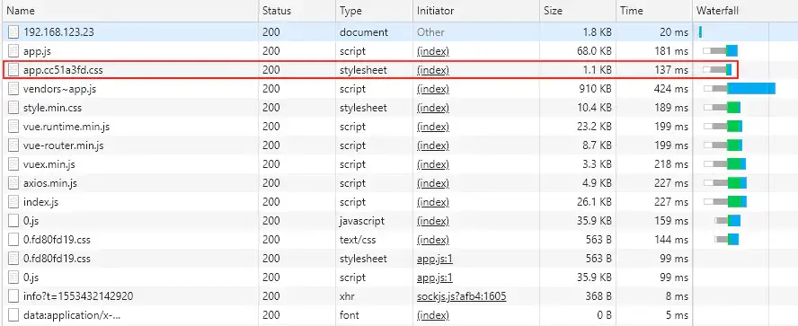

## 总体配置

```js
// vue.config.js

const CompressionWebpackPlugin = require('compression-webpack-plugin')
const UglifyJsPlugin = require('uglifyjs-webpack-plugin');

module.exports = {
    assetsDir: 'assets',   // 静态文件目录
    publicPath: './',      // 编译后的地址，可以根据环境进行设置
    lintOnSave: true,      // 是否开启编译时是否不符合eslint提示
    css: {
        extract: true, // 提取css代码

        loaderOptions: {
            // 全局公共样式引用 (自动导入)
            // pass options to sass-loader
            sass: {
                data: `
                     @import "@/assets/css/variable.scss"; 
                     @import "@/assets/css/common.scss";
                     @import "@/assets/css/mixin.scss";
                    `
            }
        }
    },
    chainWebpack: config => {
        // 代码压缩
        config.optimization.minimize(true)

        // 代码分割
        config.optimization.splitChunks({
            chunks: 'all'
        })

        // 外部库使用CDN加载, 然后在html文件中导入CDN链接
        config.externals({
            'vue': 'Vue',
            'vuex': 'Vuex',
            'vue-router': 'VueRouter',
            'axios': 'axios'
        })

        // 项目目录别名 ( src目录配置为@ )
        config.resolve.alias
            .set('@', resolve('src'))
            .set('assets', resolve('src/assets'))
    },
    devServer: {
        before(app, server) {
            // 配合 CompressionWebpackPlugin 使用gzip压缩
            app.get(/.*.(js)$/, (req, res, next) => {
                req.url = req.url + '.gz'
                res.set('Content-Encoding', 'gzip')
                next()
            })
        },

        // 跨域(代理proxy) 配置
        proxy: {
            '/api': {
                target: 'http://127.0.0.1:8080',
                changeOrigin: true
            }
        }
    },
    configureWebpack: {
        plugins: [
            // gzip压缩
            new CompressionWebpackPlugin(
                {
                    filename: info => {
                        return `${info.path}.gz${info.query}`
                    },
                    algorithm: 'gzip',
                    threshold: 10240,
                    test: new RegExp(
                        '\\.(' +
                        ['js'].join('|') +
                        ')$'
                    ),
                    minRatio: 0.8,
                    deleteOriginalAssets: false
                }
            ),

            new UglifyJsPlugin({
                uglifyOptions: {
                    compress: {
                        warnings: false,
                        drop_console: true,
                        drop_debugger: false,
                        pure_funcs: ['console.log'] // 移除console.log
                    }
                },
                sourceMap: false,
                parallel: true
            })
        ]
    }
}
```


### 配置`development`、`production`环境变量

通过在 `package.json` 里的 `scripts` 配置项中添加`--mode xxx` 来选择不同环境

* 只有以 `VUE_APP` 开头的变量会被 `webpack.DefinePlugin` 静态嵌入到客户端侧的包中，代码中可以通过 `process.env.VUE_APP_XXXX` 访问
* `NODE_ENV` 和 `BASE_URL` 是两个特殊变量，在代码中始终可用`process.env.NODE_ENV`、`process.env.BASE_URL`

```json
{
  "scripts": {
    "serve": "vue-cli-service serve",
    "build": "vue-cli-service build",
    "analyz": "vue-cli-service build --mode analyz",
    "lint": "vue-cli-service lint"
  }
}
```

1. `.env` 文件

   `serve` 默认的本地开发环境配置

   ```sh
   NODE_ENV = 'development'
   BASE_URL = './'
   VUE_APP_PUBLIC_PATH = './'
   VUE_APP_API = 'https://test.staven630.com/api'
   ```

2. `.env.production` 文件

   `build` 默认的环境配置

   ```sh
   NODE_ENV = 'production'
   BASE_URL = 'https://prod.staven630.com/'
   VUE_APP_PUBLIC_PATH = 'https://prod.oss.com/staven-blog'
   VUE_APP_API = 'https://prod.staven630.com/api'
   
   ACCESS_KEY_ID = 'xxxxxxxxxxxxx'
   ACCESS_KEY_SECRET = 'xxxxxxxxxxxxx'
   REGION = 'oss-cn-hangzhou'
   BUCKET = 'staven-prod'
   PREFIX = 'staven-blog'
   ```

3. `.env.analyz` 文件

   自定义 build 环境配置

   ```shell
   NODE_ENV = 'production'
   BASE_URL = 'https://prod.staven630.com/'
   VUE_APP_PUBLIC_PATH = 'https://prod.oss.com/staven-blog'
   VUE_APP_API = 'https://prod.staven630.com/api'
   
   ACCESS_KEY_ID = 'xxxxxxxxxxxxx'
   ACCESS_KEY_SECRET = 'xxxxxxxxxxxxx'
   REGION = 'oss-cn-hangzhou'
   BUCKET = 'staven-prod'
   PREFIX = 'staven-blog'
   
   IS_ANALYZE = true
   ```

### 代码压缩、分割

```js
module.exports = {
  chainWebpack: config => {
    config.optimization.minimize(true); // 代码压缩
    config.optimization.splitChunks({   // 代码分割
      chunks: 'all'
    })
  }
}
```

### gzip的压缩

`npm install --save-dev compression-webpack-plugin`

```js
const CompressionWebpackPlugin = require('compression-webpack-plugin')

const compress = new CompressionWebpackPlugin(
 {
   filename: info => {
     return `${info.path}.gz${info.query}`
   },
   algorithm: 'gzip', 
   threshold: 10240,
   test: new RegExp(
     '\\.(' +
     ['js'].join('|') +
     ')$'
   ),
   minRatio: 0.8,
   deleteOriginalAssets: false
 }
)

module.exports = {
  devServer: {
    before(app, server) { 
      app.get(/.*.(js)$/, (req, res, next) => { 
        req.url = req.url + '.gz';
        res.set('Content-Encoding', 'gzip');
        next();
      })
    }
  }
  configureWebpack: {
  	plugins: [
  		compress
  	]
	}
}
```


### 外部库使用CDN加载

```js
module.exports = {
    chainWebpack: config => {
      // 用cdn方式引入
      config.externals({
        'vue': 'Vue',
        'vuex': 'Vuex',
        'vue-router': 'VueRouter',
        'mint-ui': 'MINT',  // 需用MINT
        'axios': 'axios'
      })
    }
}
```

```html
<script src="https://cdn.bootcss.com/vue/2.6.10/vue.runtime.min.js"></script>
<script src="https://cdn.bootcss.com/vue-router/3.0.2/vue-router.min.js"></script>
<script src="https://cdn.bootcss.com/vuex/3.1.0/vuex.min.js"></script>
<script src="https://cdn.bootcss.com/axios/0.18.0/axios.min.js"></script>
<script src="https://cdn.bootcss.com/mint-ui/2.2.13/index.js"></script>
```

### 提取css代码

因为js会动态的加载出css，所以js文件包会比较大，那么需要提取css代码到文件. 这里我们只需要将css配置一下:

```js
module.exports = {
  css: {
      extract: true
  }
}
```

如图，`css`从`app.js`文件中单独分离出来



### 全局公共样式引用 (自动导入)

```text
assets
 ├─ css
    ├─ common.scss    存放公共的样式
    ├─ mixin.scss     存放混入样式
    ├─ reset.scss     存放重置样式
    └─ variable.scss  存放变量
```

```js
module.exports = {
  css: {
    loaderOptions: {
      // pass options to sass-loader
      sass: {
        data: `
               @import "@/assets/css/variable.scss"; 
               @import "@/assets/css/common.scss";
               @import "@/assets/css/mixin.scss";
              `
      }
    }
  },
}
```

在app.vue中引入`reset.scss`文件，完成后，样式即可进行全局调用了。

```scss
<style lang="scss">
  @import "assets/css/reset";
</style>
```

### 项目目录别名 ( src目录配置为@ )

```js
module.exports = {
	chainWebpack: (config) => {
    // 配置别名
    config.resolve.alias
        .set('@', resolve('src'))
        .set('assets',resolve('src/assets'))
        .set('components',resolve('src/components'))
        .set('router',resolve('src/router'))
        .set('utils',resolve('src/utils'))
        .set('static',resolve('src/static'))
        .set('store',resolve('src/store'))
        .set('views',resolve('src/views'))
	}
}
```

### 跨域(代理proxy) 配置

在前端请求过程中，如果后台没有设置跨域请求的，可以在webpack进行配置。

```js
module.exports = {
  devServer: {
    proxy: {
      '/api': {
        target: 'http://127.0.0.1:8080',
        changeOrigin: true
      }
     }
  }
}
```

### 去除 `console.log`

正常情况下我们会在开发环境进行`console`调试，但是如果不删除，过多会出现内存泄漏的情况

**方法一：**

`npm install -D uglifyjs-webpack-plugin`

```js
const UglifyJsPlugin = require('uglifyjs-webpack-plugin');
module.exports = {
    configureWebpack: config => {
        if (IS_PROD) {
            const plugins = [];
            plugins.push(
                new UglifyJsPlugin({
                    uglifyOptions: {
                        compress: {
                            warnings: false,
                            drop_console: true,
                            drop_debugger: false,
                            pure_funcs: ['console.log']//移除console
                        }
                    },
                    sourceMap: false,
                    parallel: true
                })
            );
            config.plugins = [
                ...config.plugins,
                ...plugins
            ];
        }
    }
}
```

**方法二：**
 `npm i --save-dev babel-plugin-transform-remove-console`

```js
// babel.config.js

const plugins = [];
if(['production', 'prod'].includes(process.env.NODE_ENV)) {  
  plugins.push("transform-remove-console")
}

module.exports = {
  presets: [["@vue/app",{"useBuiltIns": "entry"}]],
  plugins: plugins
};
```

### 其他配置

```js
module.exports = {
  assetsDir: 'assets',   // 静态文件目录
  publicPath: './',      // 编译后的地址，可以根据环境进行设置
  lintOnSave: true,      // 是否开启编译时是否不符合eslint提示
}
```

