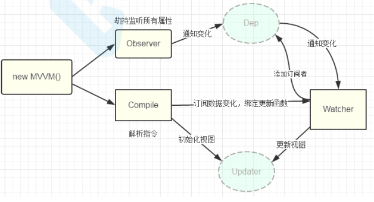
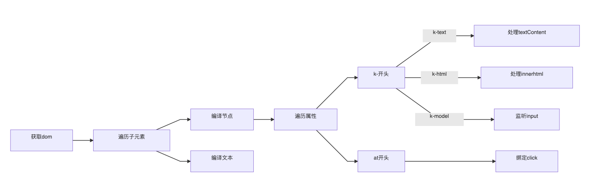
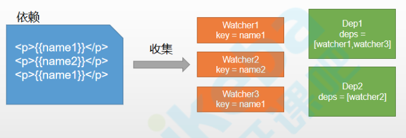

# vue 响应式原理

## 原理分析

1. `new Vue()`首先执行初始化，对**`data`**执行响应化处理，这个过程发生在`Observer`中

2. 同时对模板执行编译，找到其中动态绑定的数据，从`data`中获取并初始化视图，这个过程发生在

   `Compile`中

3. 同时定义一个更新函数和`Watcher`，将来对应数据变化时`Watcher`会调用更新函数

4. 由于data的某个`key`在一个视图中可能出现多次，所以每个`key`都需要一个管家`Dep`来管理多个

   `Watcher`

5. 将来`data`中数据一旦发生变化，会首先找到对应的`Dep`，通知所有`Watcher`执行更新函数



## 涉及类型介绍

- `Vue`:框架构造函数 
- `Observer`:执行数据响应化(分辨数据是对象还是数组) 
- `Compile`:编译模板，初始化视图，收集依赖(更新函数、`watcher`创建) 
- `Watcher`:执行更新函数(更新`dom`) 
- `Dep`:管理多个`Watcher`，批量更新

## Vue

> 框架构造函数:执行初始化

执行初始化，对`data`执行响应化处理

`vue.js`

```js
function observe(obj) {
    if (typeof obj !== 'object' || obj == null) {
        return
    }
    new Observer(obj)
}

function defineReactive(obj, key, val) { }

class Vue {
    constructor(options) {
        this.$options = options;
        this.$data = options.data;
        observe(this.$data);
      	proxy(this); // 为$data做代理
    }
}

class Observer {
    constructor(value) {
        this.value = value
        this.walk(value);
    }
    walk(obj) {
        Object.keys(obj).forEach(key => {
            defineReactive(obj, key, obj[key])
        })
    }
}

function proxy(vm) {
    Object.keys(vm.$data).forEach(key => {
        Object.defineProperty(vm, key, {
            get() {
                return vm.$data[key];
            },
            set(newVal) {
                vm.$data[key] = newVal;
            }
        });
    })
}
```

## 编译 **- Compile**

> 编译模板中vue模板特殊语法，初始化视图、更新视图



### **初始化视图**

> 根据节点类型编译

`compile.js`

```js
class Compile {
    constructor(el, vm) {
        this.$vm = vm;
        this.$el = document.querySelector(el);

        if (this.$el) {
            this.compile(this.$el);
        }
    }
    compile(el) {
        const childNodes = el.childNodes;
        Array.from(childNodes).forEach(node => {
            if (this.isElement(node)) {
                // "编译元素"   node.nodeName
                this.compileElement(node);
            } else if (this.isInterpolation(node)) {
                // 编译插值文本 node.textContent
                this.compileText(node);
            }
            if (node.childNodes && node.childNodes.length > 0) {
                this.compile(node);
            }
        });
    }
    /**
     * 节点是否为 元素
     * @param node 
     * @returns 
     */
    isElement(node) {
        return node.nodeType == 1;
    }
    /**
     * 节点是否为 文本
     * @param node 
     * @returns 
     */
    isInterpolation(node) {
        return node.nodeType == 3 && /\{\{(.*)\}\}/.test(node.textContent);
    }

    /**
     * 编译插值文本
     * @param node 
     */
    compileText(node) {
        node.textContent = this.$vm[RegExp.$1];
    }

    /**
     * 编译元素
     * @param node 
     */
    compileElement(node) {
        let nodeAttrs = node.attributes;
        Array.from(nodeAttrs).forEach(attr => {
            let attrName = attr.name;
            let exp = attr.value;
            if (this.isDirective(attrName)) {
                let dir = attrName.substring(2);
                this[dir] && this[dir](node, exp);
            }
        });
    }

    /**
     * 判断是否为 指令
     * @param attr 
     * @returns 
     */
    isDirective(attr) {
        return attr.indexOf("v-") == 0;
    }

    /**
     * v-text 指令
     * @param node 
     * @param exp 
     */
    text(node, exp) {
        node.textContent = this.$vm[exp];
    }

    /**
     * v-html 指令
     * @param node 
     * @param exp 
     */
    html(node, exp) {
        node.innerHTML = this.$vm[exp]
    }
}
```

### 依赖收集

> 视图中会用到data中某key，这称为依赖。同一个key可能出现多次，每次都需要收集出来用一个
>
> Watcher来维护它们，此过程称为依赖收集。 多个Watcher需要一个Dep来管理，需要更新时由Dep统一通知。

```js
new Vue({
    template:
        `<div>
            <p>{{name1}}</p>
            <p>{{name2}}</p>
            <p>{{name1}}</p>
         <div>`,
    data: {
        name1: 'name1',
        name2: 'name2'
    }
});
```

  

#### 实现思路

1. `defineReactive`时为每一个`key`创建一个`Dep`实例
2. 初始化视图时读取某个`key`，例如`name1`，创建一个`watcher1`
3. 由于触发`name1`的`getter`方法，便将`watcher1`添加到`name1`对应的`Dep`中
4. 当`name1`更新，`setter`触发时，便可通过对应`Dep`通知其管理所有`Watcher`更新

```js
// 监听器:负责更新视图 
class Watcher {
    constructor(vm, key, updateFn) { // kvue实例
        this.vm = vm;
        // 依赖key
        this.key = key;
        // 更新函数
        this.updateFn = updateFn;

        Dep.target = this;
        this.vm[this.key];
        Dep.target = null;
    }
    // 更新 
    update() {
        this.updateFn.call(this.vm, this.vm[this.key]);
    }
}

// 调用update函数执插值文本赋值 
compileText(node) {
    // console.log(RegExp.$1);
    // node.textContent = this.$vm[RegExp.$1];
    this.update(node, RegExp.$1, 'text')
}
text(node, exp) {
    this.update(node, exp, 'text')
}
html(node, exp) {
    this.update(node, exp, 'html')
}
update(node, exp, dir) {
    const fn = this[dir + 'Updater']
    fn && fn(node, this.$vm[exp])
    new Watcher(this.$vm, exp, function (val) {
        fn && fn(node, val)
    })
}
textUpdater(node, val) {
    node.textContent = val;
}
htmlUpdater(node, val) {
    node.innerHTML = val
}

class Dep {
    constructor() {
        this.deps = []
    }
    addDep(dep) {
        this.deps.push(dep)
    }
    notify() {
        this.deps.forEach(dep => dep.update());
    }
}


defineReactive(obj, key, val) {
    this.observe(val);
    const dep = new Dep()
    Object.defineProperty(obj, key, {
        get() {
            Dep.target && dep.addDep(Dep.target);
            return val
        },
        set(newVal) {
            if (newVal === val) return
            dep.notify()
        }
    })
}
```


## 整体代码

```vue
<div id="app">
  <p>{{counter}}</p>
  <p v-text="counter" @click="onclick"></p>
  <p v-html="desc"></p>
  <input type="text" v-model="counter">
</div>
<script src="vue.js"></script>
<script>
  const app = new KVue({
    el: '#app',
    data: {
      counter: 1,
      desc: '<span style="color: red">村长真棒</span>'
    },
    methods: {
      onclick() {
        this.counter++
      }
    },
  })
  setInterval(() => {
    app.counter++
  }, 1000);
</script>
```

`vue.js`

```js
function defineReactive(obj, key, val) {
  // 递归
  observe(val);

  // Dep在这创建
  const dep = new Dep();
  
  Object.defineProperty(obj, key, {
    get() {
      // 依赖收集
      Dep.target && dep.addDep(Dep.target)
      return val;
    },
    set(v) {
      if (val !== v) {
        // 传入新值v可能还是对象
        observe(v);
        val = v;

        dep.notify()
      }
    },
  });
}

// 递归遍历obj，动态拦截obj的所有key
function observe(obj) {
  if (typeof obj !== "object" || obj == null) {
    return obj;
  }

  // 每出现一个对象，创建一个Ob实例
  new Observer(obj);
}

// Observer: 判断传入obj类型，做对应的响应式处理
class Observer {
  constructor(obj) {
    this.value = obj;

    // 判断对象类型
    if (Array.isArray(obj)) {
      // todo
    } else {
      this.walk(obj);
    }
  }

  // 对象响应式
  walk(obj) {
    Object.keys(obj).forEach((key) => {
      defineReactive(obj, key, obj[key]);
    });
  }
}

function proxy(vm) {
  Object.keys(vm.$data).forEach((key) => {
    Object.defineProperty(vm, key, {
      get() {
        return vm.$data[key];
      },
      set(v) {
        vm.$data[key] = v;
      },
    });
  });
}

class Vue {
  constructor(options) {
    // 1.保存选项
    this.$options = options;
    this.$data = options.data;

    // 2.响应式处理
    observe(this.$data);

    // 3.代理data到Vue实例上
    proxy(this);

    // 4.编译
    new Compile(options.el, this);
  }
}

class Compile {
  // el-宿主，vm-Vue实例
  constructor(el, vm) {
    this.$vm = vm;
    this.$el = document.querySelector(el);

    this.compile(this.$el);
  }

  compile(el) {
    // 遍历el dom树
    el.childNodes.forEach((node) => {
      if (this.isElement(node)) {
        // element
        // 需要处理属性和子节点
        // console.log("编译元素", node.nodeName);
        this.compileElement(node);

        // 递归子节点
        if (node.childNodes && node.childNodes.length > 0) {
          this.compile(node);
        }
      } else if (this.isInter(node)) {
        // console.log("编译插值表达式", node.textContent);
        // 获取表达式的值并赋值给node
        this.compileText(node);
      }
    });
  }

  isElement(node) {
    return node.nodeType === 1;
  }

  // {{xxx}}
  isInter(node) {
    return node.nodeType === 3 && /\{\{(.*)\}\}/.test(node.textContent);
  }

  isDir(attr) {
    return attr.startsWith("v-");
  }
  
  // 编译文本，将{{ooxx}}
  compileText(node) {
    this.update(node, RegExp.$1, 'text')
  }

  // 处理元素所有动态属性
  compileElement(node) {
    Array.from(node.attributes).forEach((attr) => {
      const attrName = attr.name;
      const exp = attr.value;

      // 判断是否是一个指令
      if (this.isDir(attrName)) {
        // 执行指令处理函数
        // v-text, 关心text
        const dir = attrName.substring(2);
        this[dir] && this[dir](node, exp)
      }
    });
  }

  // 更新函数，
  update(node, exp, dir) {
    // init
    const fn = this[dir + 'Updater']
    fn && fn(node, this.$vm[exp])

    // update: 创建Watcher
    new Watcher(this.$vm, exp, function (val) {
      fn && fn(node, val)
    })
  }

  // v-text处理函数
  text(node, exp) {
    this.update(node, exp, 'text')
  }

  textUpdater(node, val) {
    node.textContent = val
  }

  // v-html
  html(node, exp) {
    this.update(node, exp, 'html')    
  }

  htmlUpdater(node, val) {
    node.innerHTML = val
  }
}

// 小秘书：做dom更新
class Watcher {
  constructor(vm, key, updateFn) {
    this.vm = vm
    this.key = key
    this.updateFn = updateFn

    // 读取一下key的值，触发其get，从而收集依赖
    Dep.target = this
    this.vm[this.key]
    Dep.target = null
  }

  update() {
    this.updateFn.call(this.vm, this.vm[this.key])
  }
}

// 依赖：和响应式对象的每个key一一对应
class Dep {
  constructor() {
    this.deps = []
  }

  addDep(watcher) {
    this.deps.push(watcher)
  }

  notify() {
    this.deps.forEach(watcher => watcher.update())
  }
}
```

