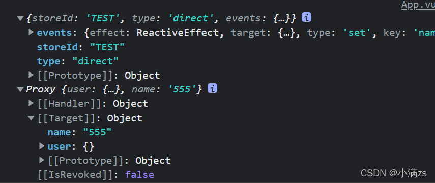
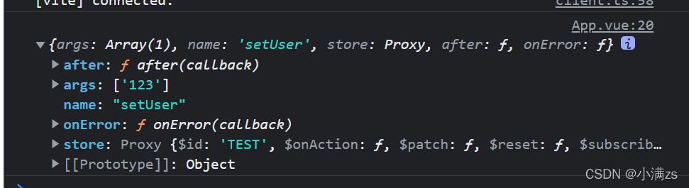

## `$reset`

重置`store`到他的初始状态

```
state: () => ({
     user: <Result>{},
     name: "default",
     current:1
}),
```

调用`$reset()`,将会把state所有值重置回原始状态

## `$subscribe` 订阅state的改变

类似于Vuex 的abscribe 只要有state 的变化就会走这个函数

```ts
Test.$subscribe((args,state)=>{
   console.log(args,state);
})
```

返回值



第二个参数

如果你的组件卸载之后还想继续调用请设置第二个参数

```ts
Test.$subscribe((args,state)=>{
   console.log(args,state);
   
},{
  detached:true
})
```

## `$onAction` 订阅Actions的调用

只要有actions被调用就会走这个函数

```
Test.$onAction((args)=>{
   console.log(args);
   
})
```

